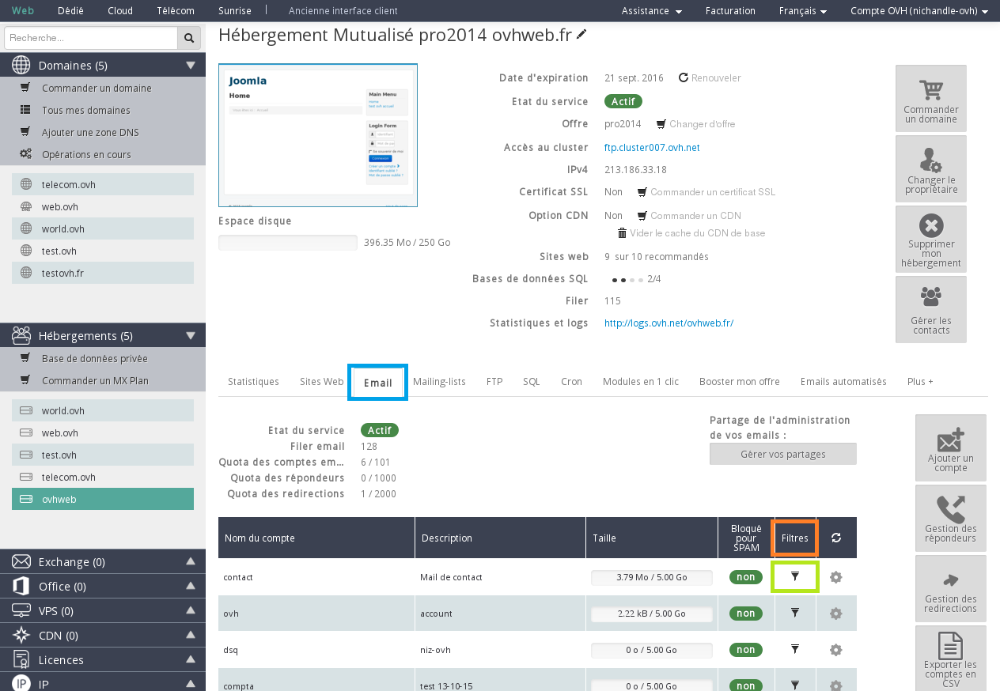
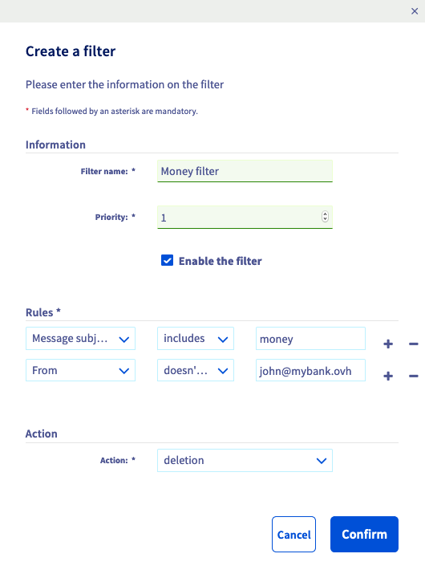

## Czym jest filtr e-mail?
Filtr pozwala na skonfigurowanie warunków i operacji do wykonania.

Przykładowo możesz wybrać taką konfigurację:
Jeśli

- Warunek=[e-mail zawiera SPAM]

to

- Operacja=[usunięcie e-maila].

## Wymagania

- Posiadanie oferty e-mail [MX Plan](https://www.ovh.pl/produkty/mxplan.xml) lub [hostingu www](https://www.ovh.pl/hosting/).

- Dostęp do [panelu klienta OVH](https://www.ovh.com/manager/web/login/).

Jeśli nie masz dostępu do panelu klienta, możesz skorzystać z tego [przewodnika](https://www.ovh.pl/g1909.uslugi_www_zarzadzanie_haslami_i_dostep_do_nich).

## Gdzie można skonfigurować filtr e-mail?
Zaloguj się do [panelu klienta](https://www.ovh.com/manager/web/login/).

Po zalogowaniu wybierz nazwę domeny w zakładce E-maile w menu z lewej strony. 

W tabeli z listą adresów e-mail odnajdziesz kolumnę "Filtry".

Kliknij na ikonkę w kształcie trójkąta w tej kolumnie. Uzyskasz dostęp do listy filtrów skonfigurowanych dla tego konta e-mail.

{.thumbnail}
Jeśli chcesz dodać filtr, kliknij na przycisk Dodaj filtr.

{.thumbnail}

## Informacje

- Nazwa filtra: Dzięki nazwie będziesz mógł rozróżnić poszczególne filtry w tabeli z podsumowaniem. 

- Priorytet: Ten parametr określa kolejność wykonywania filtrów dla tej samej skrzynki e-mail. Filtr z priorytetem 1 będzie wykonywany przed filtrem z priorytetem 5. 

- Włącz filtr: Ten parametr określa, czy filtr będzie działał czy nie. Możesz utworzyć filtr odznaczając tę opcję, jeśli chcesz włączyć filtr później.

## Reguły
Na tym etapie możesz zdefiniować warunki i reguły działania filtrów.

Pierwszy wybór (Nagłówek):

- Od: Dotyczy nadawcy, na przykład: "Jeśli nadawca"...
- Do: Dotyczy adresata, na przykład: "Jeśli adresat"...
- Temat wiadomości: Dotyczy tematu wiadomości, na przykład: "Jeśli temat wiadomości"...
- Inne: Inne parametry

Drugi wybór (Reguła):

- spf: Parametr, który zależy od pola SPF, na przykład: Jeśli nadawca nie posiada pola SPF ...
- zawiera: przykład: Jeśli temat wiadomości "zawiera"...
- nie zawiera: przykład: Jeśli temat wiadomości "nie zawiera"...

Trzeci wybór (Wartość):

- Przykład: Jeśli temat wiadomości zawiera [SPAM]...

Czwarty wybór (+):

- Ta opcja pozwala na zdefiniowanie wielu warunków dla tego samego filtra (sprawdź część [wiele reguł](#MULTI)).

{.thumbnail}

## Operacje
W tej części możesz skonfigurować operacje, czyli to co zostanie wykonane przez filtr, jeśli powyższe warunki zostaną spełnione. Masz do wyboru takie opcje:

- Akceptuj: E-mail jest akceptowany i normalnie dostarczany na Twoją skrzynkę.
- Przekierowanie na adres lokalny: E-mail jest przekierowywany na jedną ze skrzynek e-mail przypisanych do tej samej domeny. 
- Usuwanie: E-mail zostanie usunięty.
- Przekierowanie na zdalny adres: E-mail jest przekierowywany na wybrany przez Ciebie adres e-mail.

## Usuwanie spamu
||Nagłówek|Reguła|Wartość|Operacja|
|---|---|---|---|
||Nagłówek|Reguła|Wartość|Operacja|
|Parametry filtra|Temat wiadomości|zawiera|[SPAM]|usuwanie|
|Czynność wykonana przez filtr|Jeśli temat wiadomości|zawiera|oznaczenie "[SPAM]",|usuń wiadomość|

## Przekierowanie e-maili od danego nadawcy
||Nagłówek|Reguła|Wartość|Operacja|
|---|---|---|---|
||Nagłówek|Reguła|Wartość|Operacja|
|Parametry filtra|Od|zawiera|contact@test.com|przekierowanie na zdalny adres: compta@finance.com|
|Czynność wykonana przez filtr|Jeśli nadawca wiadomości|to|contact@test.com,|przekieruj e-mail na compta@finance.com|

## Przekierowanie e-maili wysyłanych na listę mailingową
||Nagłówek|Reguła|Wartość|Operacja|
|---|---|---|---|
||Nagłówek|Reguła|Wartość|Operacja|
|Parametry filtra|Do|zawiera|ML@mailing.com|Przekierowanie na adres lokalny:  lui@mypersonaldomain.ovh|
|Czynność wykonywana przez filtr|Jeśli wiadomość została wysłana na listę mailingową |o nazwie|ML@mailing.com|przekieruj wiadomość na inny adres:lui@mypersonaldomain.ovh|

## Usuwanie e-maili zawierających słowo "sex" oprócz wiadomości od przyjaciela
||Nagłówek|Reguła|Wartość|Operacja|
|---|---|---|---|
||Nagłówek|Reguła|Wartość|Operacja|
|Parametry filtra 1|Temat wiadomości|zawiera|"sex"|usuwanie|
|Parametry filtra 2|Od|nie zawiera|ami@domaine.com|usuwanie|
|Czynność wykonywana przez filtr 1|Jeśli temat wiadomości|zawiera|słowo "sex",|i|
|Czynność wykonywana przez filtr 2|nadawca wiadomości|to nie|ami@domaine.com|usuń wiadomość|

W tym przypadku należy skonfigurować dwie reguły:

{.thumbnail}

