**Last updated 5th May 2020**

## Objective

Mailing lists are used to contact subscribers en masse, i.e. to send an email or information to several recipients at once. This may be of interest to you if you want to share information on a new product release (for an e-commerce website), for example — or to let people know about a future event (for a community website). 

**Find out how to manage your mailing lists.**

### Moderation

A mailing list can be moderated, to control who is able to send emails to your list of subscribers. A moderated mailing list is useful for sending newsletters, for example — while a non-moderated mailing list can make it easier for several subscribers to contact one other via email.

**Non-moderated mailing list**

{.thumbnail}

The sender sends an email to the mailing list, and the subscribers receive the email directly.

**Moderated mailing list**

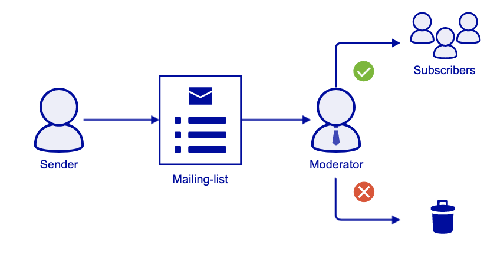{.thumbnail}

The sender sends an email to the mailing list. The moderator receives an email with a request to validate or refuse the email. If the moderator chooses to validate the email, the subscribers will receive the email sent to the mailing list. If the moderator chooses to refuse the email, it is erased, and the subscribers will not receive anything.

> [!warning]
>
> - A mailing list is not a solution designed for sending spam (advertising emails) en masse. This type of usage is tolerated to a certain degree, provided that it is not used in an abusive manner.
> - A subscriber can unsubscribe from a mailing list at any time. They can also report any abusive behaviour.
>

## Requirements

- an MX Plan 100 minimum or [Web Hosting plan](https://www.ovh.com/asia/web-hosting/){.external} eligible for mailing lists
- access to the [OVHcloud Control Panel](https://www.ovh.com/auth/?action=gotomanager){.external}

## Instructions

### Create a mailing list.

To create a mailing list, go to the [OVHcloud Control Panel](https://www.ovh.com/auth/?action=gotomanager){.external} and click on the `Web`{.action} tab at the top.

Next, click in the left-hand column, click on `Emails`{.action} — then click on the domain name concerned. Go to the `Mailing lists`{.action} tab for your email service.

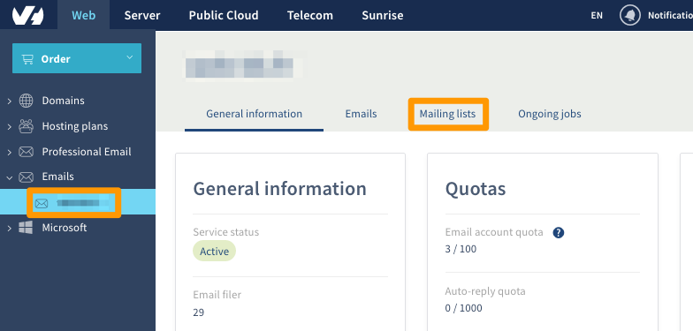{.thumbnail}

If you have already created mailing lists, they will be listed in the summary table. In the example below, a mailing list has already been created.

To create a new mailing list, click `Add a mailing list`{.action}.

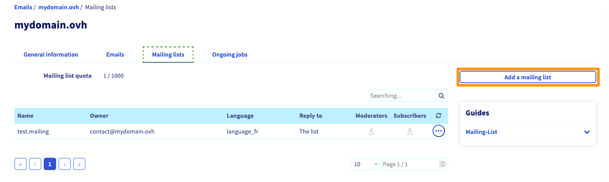{.thumbnail}

Fill in the form with the information listed in the table below:

| Information                      	| Description                                                                                                            	|
|----------------------------------	|------------------------------------------------------------------------------------------------------------------------	|
| Name                              	| The name of your mailing list.                                                                                          	|
| Owner                      	| Enter the email address of the mailing list owner (they will also be the moderator).                              	|
| Reply to                        	| Define the recipients when a subscriber replies to the mailing list.                                        	|
| Language                           	| Select the language for the automatic subscribe and unsubscribe messages for your mailing list.				|
| Moderate all emails          | The owner or moderator must approve any emails sent to the mailing list.                                     	|
| Only subscribers can post 	| Restricts the mailing list, so that only subscribers can send to it.              								|
| Everyone can post (non-moderated) | Emails sent to the mailing list are sent directly to subscribers, without validation.             		|
| Moderate recipients         	| The owner or moderator must approve subscriptions to the mailing list.                                    	|


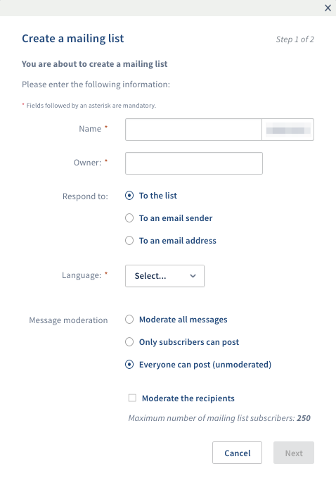{.thumbnail}


> [!primary]
>
> Maximum number of mailing list subscribers:
>
> - 5,000 if emails are moderated
> - 250 if emails are not moderated
>


### Manage mailing list options.

To modify the mailing list options, click the `...`{.action} to the right-hand side of it. You can then update the options, delete the mailing list, or share the list of subscribers via email. 

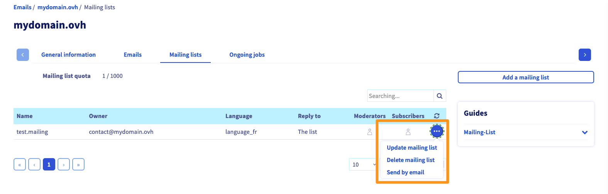{.thumbnail}


### Manage subscribers

To manage subscribers to your mailing list, click on the silhouette next to the “Subscribers” column.

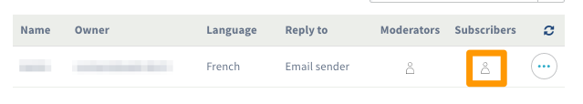{.thumbnail}

The following window will pop up:

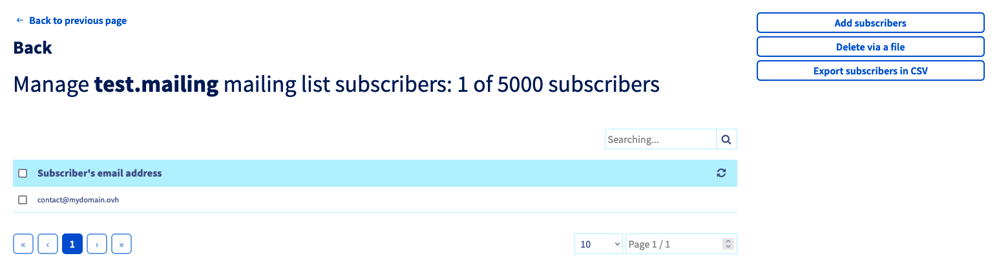{.thumbnail}

#### Add/Remove subscribers

|Add subscribers|Remove subscribers|
|---|---|
|Click `Add subscribers`{.action} on the right-hand side.|Click `Remove via a file`{.action} on the right-hand side.|
|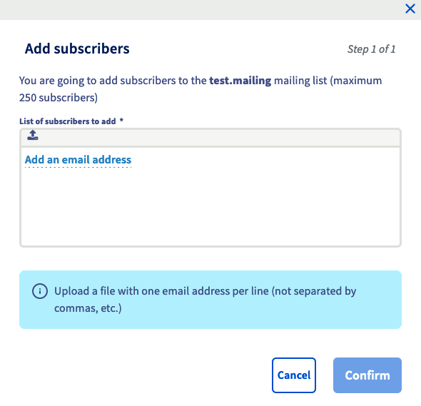{.thumbnail}|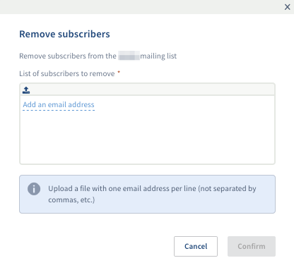{.thumbnail}|

There are two ways of adding and removing subscribers:

- entering the email address manually by clicking `Add an email address`{.action}
- importing a text file containing one email address per line, by clicking on the upload icon next to the manual entry button

#### Export your list of subscribers to a CSV file

Click `Export subscribers in CSV format`{.action} to generate a CSV file containing all of your subscribers. This option is not available in our example, because no subscribers have been added.
 
### Manage moderators.

To manage moderators on your mailing list, click on the silhouette in the “Moderators” column.

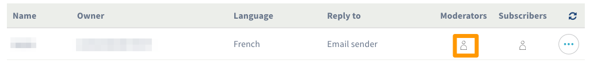{.thumbnail}

The following window will pop up:

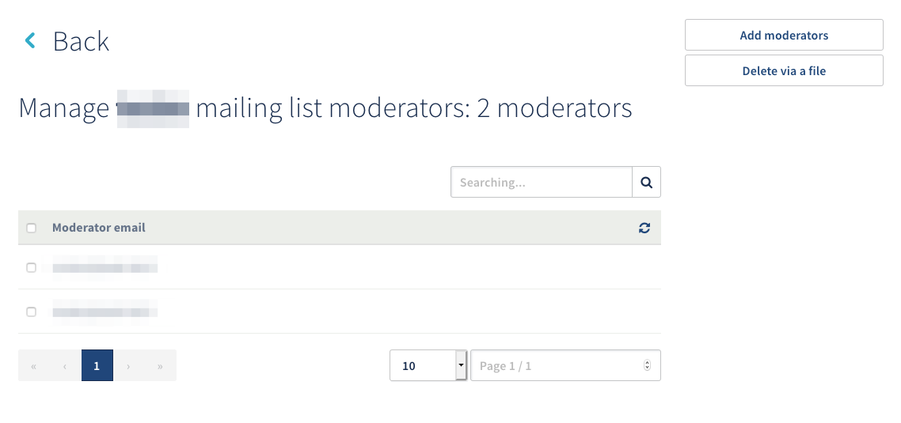{.thumbnail}

#### Add/Remove moderators

|Add moderators|Remove moderators|
|---|---|
|Click `Add moderators`{.action} on the right-hand side.|Click `Remove via a file`{.action} on the right-hand side.|
|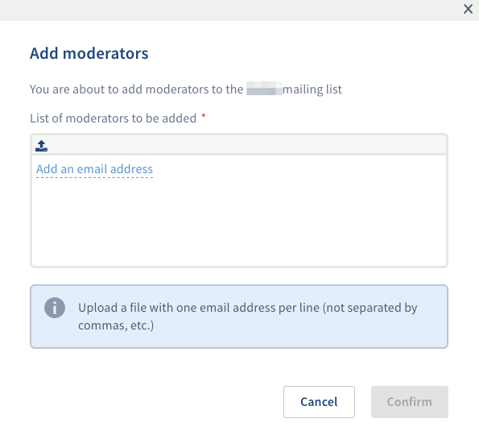{.thumbnail}|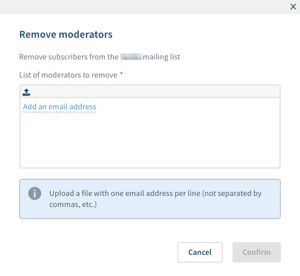{.thumbnail}|

There are two ways of adding and removing moderators:

- entering the email address manually by clicking `Add an email address`{.action}
- importing a text file containing one email address per line, by clicking on the upload icon next to the manual entry button

> [!primary]
> - When several moderators are defined on a mailing list, only one moderator needs to validate an email to send to subscribers.
> - When a moderator sends an email to the mailing list, only they receive the moderation email.
> 

Depending on the number of subscribers you need to add, this may take some time to do.


### Subscribe to a mailing list.

If someone wants to subscribe to your mailing list, they can simply send an email to:


```bash
your_mailing_list_name-subscribe@yourdomain.com
```


### Unsubscribe from a mailing list.

If someone wants to unsubscribe from your mailing list, they can simply send an email to:


```bash
your_mailing_list_name-unsubscribe@yourdomain.com
```


### Automatic removal of incorrect email addresses.

The mailing list system will not remove a subscriber from the list after just one error message (email not delivered, email address does not exist, etc.). It will wait around 12 days after the first failed sending attempt, then send a warning email to the subscriber.

The warning email will contain the references of the emails they have failed to receive. If this warning email also fails to send, our mailing list system will wait another 12 days and send a “test” email.  If this test email also fails to send, the subscriber is then removed from the subscription list.


### Recurring errors.

#### Sending an email without including a subject.

Emails sent to a mailing list must contain a subject. Without a subject, an error will automatically be generated, and the email will bounce back to the sender with an error message.

The user sending an email without a subject will receive an error email like the one listed below:


```bash
Hi. This is the qmail-send program at mx1.ovh.net.
I'm afraid I wasn't able to deliver your message to the following addresses.
This is a permanent error; I've given up. Sorry it didn't work out.

<newsletter@yourdomain.com>:

ezmlm-reject: fatal: Sorry, I don't accept message with empty Subject (#5.7.0)
```


#### Send emails entering an email address into the Carbon Copy (Cc) field.

To send an email to a mailing list, the address needs to be entered in either the “To” field, or the “Cc” field.

If the user enters the email address into the “Bcc” field, the email will bounce back with an error message.

The sender will receive an error message similar to the one below:


```bash
Hi. This is the qmail-send program at mx1.ovh.net.
I'm afraid I wasn't able to deliver your message to the following addresses.
This is a permanent error; I've given up. Sorry it didn't work out.

<newsletter@yourdomain.com>:

ezmlm-reject: fatal: List address must be in To: or Cc: (#5.7.0)
```


### Advanced customisation

You can customise most of the texts in your mailing list. As a moderator, you will need to send an empty email to  name_of_your_ML- [edit@yourdomain.com](mailto:edit@yourdomain.com){.external}.

- Example: Your mailing list is [newsletter@yourdomain.com](mailto:newsletter@yourdomain.com){.external}. From your moderator email address, you will need to send an email to [newsletter-edit@yourdomain.com](mailto:newsletter-edit@yourdomain.com){.external} .

You will then receive an email that will guide you on the changes you need to make.

Below is a list of files containing the reply texts, and a brief description of how to use their content. To edit a file, simply send an email to send-edit.file, replacing ‘file’ with the file name. The editing instructions will be sent with the text file.


|File|Use|
|---|---|
|bottom|Footer for all replies — general information.|
|digest|The ‘administrative’ section of periodical newsletters.|
|faq|Answers to frequently asked questions about this list.|
|get_bad|In the event of emails being absent from archives.|
|help|General help (between ‘top’ and ‘bottom’).|
|info|Information on the list. The first line is a summary of it.|
|mod_help|Specific support for the list moderators.|
|mod_reject|For users whose emails were refused by a moderator.|
|mod_request|For moderators when an email is sent.|
|mod_sub|For subscribers after their subscription has been confirmed by a moderator.|
|mod_sub_confirm|For moderators to confirm a subscription.|
|mod_timeout|For senders of an email that has not been valid for a period of time.|
|mod_unsub_confirm|For administrators to request to unsubscribe.|
|sub_bad|For the subscriber if the confirmation was an error.|
|sub_confirm|For the subscriber to confirm their request.|
|sub_nop|For the subscriber after a new subscription.|
|sub_ok|For the subscriber after their subscription has been successful.|
|top|The header of each reply.|
|trailer|Added at the end of each contribution to the mailing list.|
|unsub_bad|For the subscriber, if their unsubscribe confirmation is false.|
|unsub_confirm|For the subscriber to confirm that they want to unsubscribe.|
|unsub_nop|For someone who is not subscribed, after they have requested to unsubscribe.|
|unsub_ok|For someone who was previously subscribed, after they have successfully unsubscribed.|

> [!primary]
>
> Example: If you would like to edit the default footer for emails sent to your mailing list, you will need to send an email to the address “newsletter-edit.bottom@yourdomain.com”.  You will then receive a new email explaining how to customise the footer.
> 

## Go further

Join our community of users on [https://community.ovh.com/en/](https://community.ovh.com/en/)
