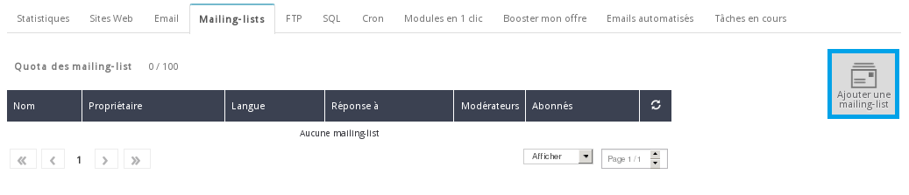
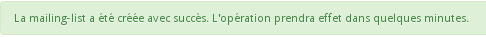
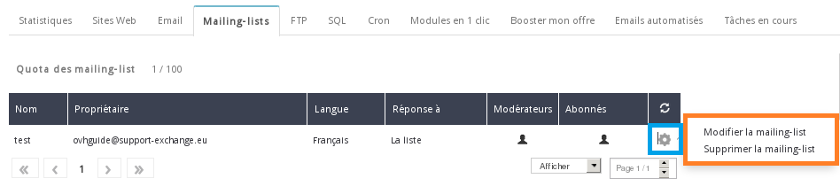
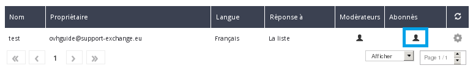
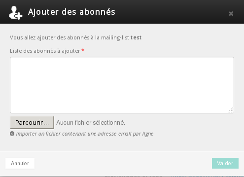

## Informacje ogólne
Lista mailingowa pozwala na kontaktowanie jednocześnie wielu abonentów, czyli na przesyłanie informacji do kilku odbiorców jednocześnie. Opcja ta może być interesująca w przypadku chęci wysłania mailingu informacyjnego na temat pojawienia się nowego produktu (sklepy internetowe) lub w przypadku chęci poinformowania o zbliżającym się spotkaniu (strona społecznościowa). 

Ezmlm to znany i wydajny program zarządzający listami mailingowymi. W przewodniku tym sprawdzimy, jak założyć i skonfigurować listę mailingową oraz jak nią zarządzać.

- Lista mailingowa nie służy do masowego wysyłania spamu (wiadomości z reklamami). 

- W każdej chwili użytkownik może podjąć decyzję o wypisaniu się z listy mailingowej i zgłoszeniu nadużycia.


## Zakładanie listy mailingowej
W naszym przykładzie chodzi o listę mailingową w ofercie hostingu Pro.
Jeśli chcesz założyć listę mailingową, zaloguj się do [panelu klienta](http://www.ovh.com/manager/web) OVH.

Po zalogowaniu wybierz hosting w sekcji "E-maile" i kliknij na zakładkę "Listy mailingowe".

{.thumbnail}
Jeśli posiadasz już listy mailingowe, będą one widoczne w tabeli z podsumowaniem. W naszym przykładzie lista mailingowa nie została jeszcze założona. 

Aby założyć nową listę mailingową, kliknij na Dodaj listę mailingową.

{.thumbnail}
Pojawi się formularz dotyczący utworzenia listy mailingowej. W formularzu należy wypełnić poszczególne pola:


- Nazwa: nazwa listy mailingowej
- Właściciel: wpisz adres e-mail właściciela listy mailingowej (będzie on również moderatorem)
- Odpowiedź na: zdefiniuj adres odpowiedzi
- Język: wybierz język listy mailingowej (tłumaczenie automatycznych e-maili rejestracji i wypisywania się)
- Moderowanie wiadomości: właściciel (moderator) musi zaakceptować odpowiedzi.
- Moderowanie abonentów: właściciel (moderator) musi zaakceptować zapisy.
- Tylko abonenci mogą wysyłać wiadomości: osoba nie zapisana na listę mailingową nie może przesłać na nią wiadomości.


{.thumbnail}
Po wypełnieniu i zatwierdzeniu formularza pojawi się komunikat z potwierdzeniem:

{.thumbnail}

## Każda lista mailingowa pozwala na dodanie maksymalnie:

- 250 abonentów w przypadku listy mailingowej typu Newsletter, listy limitowanej, otwartej, prywatnej i zamkniętej.
- 5000 abonentów w przypadku listy moderowanej.


## Zasada moderowania
Lista mailingowa może być moderowana. Moderowana lista mailingowa służy głównie do wysyłania newsletterów, w przeciwieństwie do listy nie moderowanej, która służy do komunikowania się abonentów ze sobą za pomocą e-maila.

{.thumbnail}
.

{.thumbnail}


## Zmiana opcji listy mailingowej i jej usunięcie
Jeśli chcesz zmienić zatwierdzone wcześniej opcje lub usunąć listę mailingową, kliknij na ikonkę koła zębatego z prawej strony listy mailingowej.

{.thumbnail}


## Importowanie abonentów
W naszym przykładzie nie zarejestrowaliśmy jeszcze abonenta. Aby to zrobić, należy kliknąć na czarny symbol w sekcji "Abonenci".

{.thumbnail}

- Kliknij na "Dodaj abonentów".


{.thumbnail}
Istnieją 2 sposoby dodawania abonentów do listy mailingowej:


- ręczne wpisanie adresu
- import pliku tekstowego z listą adresów (jeden adres w linii)


{.thumbnail}
Po zaakceptowaniu pojawi się komunikat z potwierdzeniem:

{.thumbnail}
Czas trwania operacji zależy od liczby abonentów do dodania.


## Eksportowanie listy abonentów do pliku CSV

- Kliknij na "Eksport abonentów w pliku CSV", aby wygenerować plik CSV zawierający listę wszystkich abonentów.


## Zapisywanie się na listę mailingową
Jeśli ktoś chce się zapisać na listę mailingową, wystarczy wysłać e-mail na adres:


```
nazwa_listy_mailingowej-subscribe@twoja_domena_z_rozszerzeniem
```


## Wypisywanie się z listy mailingowej
Jeśli ktoś chce się wypisać z listy mailingowej, wystarczy wysłać e-mail na adres:
```
nazwa_listy_mailingowej-unsubscribe@twoja_domena_z_rozszerzeniem
```


## Automatyczne usuwanie błędnych adresów
System list mailingowych nie usuwa abonenta w przypadku wiadomości zwrotnej z błędem (wiadomość nie dostarczona, nieistniejący adres, itp.). System czeka 12 dni i wysyła wiadomość z ostrzeżeniem do abonenta. 

Wiadomość z ostrzeżeniem wskazuje informacje na temat brakujących wiadomości. Jeśli dla wiadomości tej system otrzyma wiadomość zwrotną z błędem, czeka kolejne 12 dni i wysyła wiadomość testową. Jeśli w tym przypadku pojawi się błąd, abonent zostanie usunięty z listy abonentów.


## Wysyłka e-maila bez Tematu
Wysyłka na listę mailingową musi obowiązkowo zawierać temat. W przypadku braku tematu pojawi się błąd i e-mail z błędem zostanie przesłany do nadawcy wiadomości:


```
Hi. This is the qmail-send program at mx1.mail.ovh.net.
I'm afraid I wasn't able to deliver your message to the following addresses.
This is a permanent error; I've given up. Sorry it didn't work out.

<newsletter@testinterne.ovh>:

ezmlm-reject: fatal: Sorry, I don't accept message with empty Subject (#5.7.0)
```


## Wysyłka z wpisaniem adresu listy mailingowej w ukrytej kopii
Aby wiadomość została wysłana na listę mailingową, adres tej listy musi znajdować się w polu « To » lub w polu « Cc ».

Jeśli klient wpisze adres w polu « Kopia ukryta », otrzyma on poniższy błąd:


```
Hi. This is the qmail-send program at mx1.mail.ovh.net.
I'm afraid I wasn't able to deliver your message to the following addresses.
This is a permanent error; I've given up. Sorry it didn't work out.

<newsletter@testinterne.ovh>:

ezmlm-reject: fatal: List address must be in To: or Cc: (#5.7.0)
```


## Jak dostosować zawartość listy mailingowej?
Możesz dostosować większość tekstów swojej listy mailingowej. Jako moderator musisz wysłać pusty e-mail na adres nazwa_listy_mailingowej-edit@twoja_domena.com.


- Przykład: Twoja lista mailingowa to blue]newsletter@testinterne.ovh. Z adresu e-mail moderatora należy przesłać wiadomość na adres newsletter-edit@config-support.com.


Otrzymasz e-mail z informacjami na temat możliwości modyfikacji.

Poniżej znajduje się lista plików zawierających teksty odpowiedzi i krótki opis wykorzystania ich zawartości. Aby edytować plik, prześlij wiadomość na envoi-edit.plik,  zastępując 'plik' nazwą pliku. Instrukcje zostaną przesłane wraz z plikiem tekstowym.


|Plik|Zastosowanie|
|bottom|Stopka wszystkich odpowiedzi: informacje ogólne.|
|digest|Sekcja 'administrative' biuletynów.|
|faq|Odpowiedzi na najczęstsze pytania dotyczące tej listy.|
|get_bad|W przypadku wiadomości niedostępnych w archiwach.|
|help|Ogólna pomoc (między 'top' i 'bottom').|
|info|Informacje o liście. Pierwsza linia to podsumowanie.|
|mod_help|Specyficzna pomoc dla moderatorów listy.|
|mod_reject|Dla nadawcy odrzuconych wiadomości.|
|mod_request|Dla moderatorów.|
|mod_sub|Dla abonenta po potwierdzeniu rejestracji przez moderatora|
|mod_sub_confirm|Dla moderatorów do zaakceptowania rejestracji.|
|mod_timeout|Dla nadawcy wiadomości nieważnej od dłuższego czasu.|
|mod_unsub_confirm|Dla administratora, w celu zlecenie wypisu.|
|sub_bad|Dla abonenta, jeśli potwierdzenie było nieprawidłowe.|
|sub_confirm|Dla abonenta, w celu potwierdzenia zapytania.|
|sub_nop|Dla abonenta po nowej rejestracji.|
|sub_ok|Dla abonenta po udanej rejestracji.|
|trailer|Dodawany na końcu każdego zapisu na listę.|
|unsub_bad|Dla abonenta, jeśli potwierdzenie wypisania się jest nieprawidłowe.|
|unsub_confirm|Dla abonenta, w celu zlecenia potwierdzenia wypisania się.|
|unsub_nop|Dla nie abonenta po zleceniu wypisania się.|
|unsub_ok|Dla byłego abonenta po udanym wypisaniu się.|


Przykład: Jeśli chcesz zmienić domyślną stopkę e-maili wysyłanych na Twoją listę mailingową, należy przesłać wiadomość na adres « newsletter-edit.bottom@config-support.com ».

Otrzymasz nowy e-mail wyjaśniający, jak spersonalizować stopkę.

