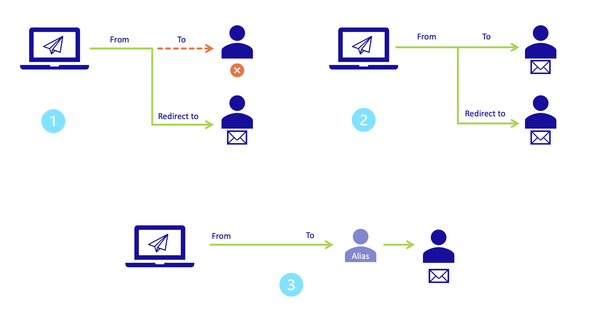
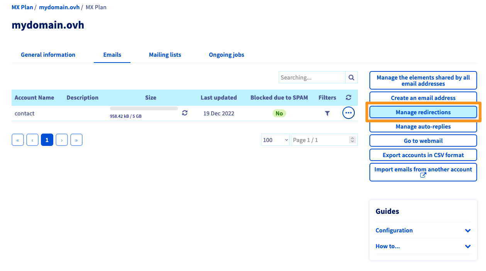
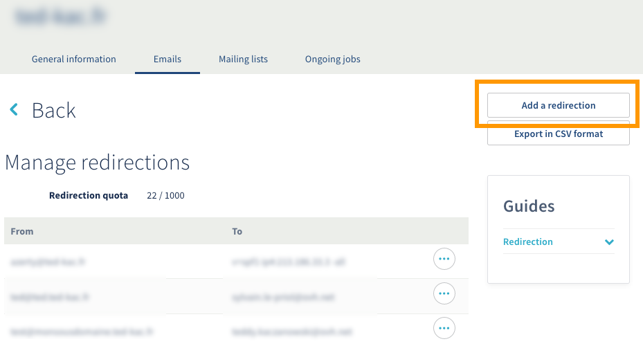
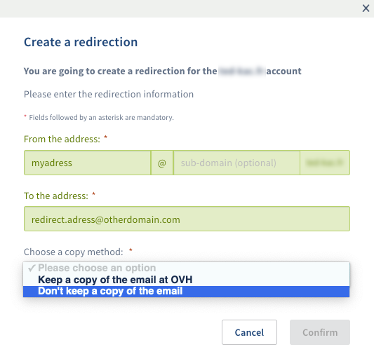
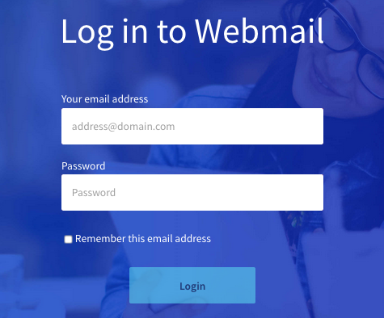
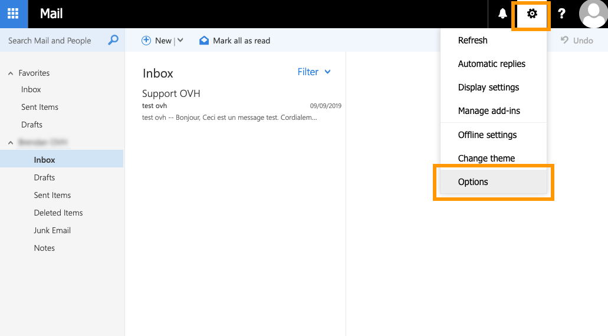

**Last updated 5th May 2020**

## Objective

In this guide, you will find information and support on how to configure email redirections, e.g. redirecting emails received from address A to address B.

## Overview 

### What is an email redirection?

You can use redirections to redirect an email received by a first email address, sending it to one or more other email addresses.

For example, you may want emails sent to **public@mydomain.com** to be redirected to **private@otherdomain.com**. This means you can provide the first address to the sender (**public@mydomain.com**), without having to give them your real address (**private@otherdomain.com**).

There are two types of redirection: 

- Simple redirection (diagram 1). The email is sent directly to the redirection email address, and the original recipient does not receive the email. 

- Redirection with a local copy (diagram 2). The email is sent to the recipient as well as the redirection email address.

{.thumbnail}

> [!primary]
>
> Please note that you can set a redirection to several email addresses.

## Requirements

- Access to the [OVHcloud Control Panel](https://www.ovh.com/auth/?action=gotomanager)
- An MX Plan solution, available as part of our [Web Hosting plans](https://www.ovh.com/asia/web-hosting/)

## Instructions

Depending on the date your MX Plan solution was activated and if [it was recently migrated](https://www.ovh.co.uk/mxplan-migration/){.external}, you will be using either the legacy version or the new version of the solution. Before you proceed, you will need to check which version you are using. 

To do this, log in to the [OVHcloud Control Panel](https://www.ovh.com/auth/?action=gotomanager){.external}, and open the `Web`{.action} section. Click `Emails`{.action} in the services bar on the left-hand side, then choose the name of the plan concerned. Continue with the next steps, depending on which version you own.

|MX Plan legacy version|MX Plan new version|
|---|---|
|{.thumbnail}  Find the solution in the "Subscription" box.|{.thumbnail} Locate the `Server model` in the "Summary" box.|
|Continue to [Legacy version of the MX Plan solution](./#legacy-version-of-the-mx-plan-solution)|Continue to [New version of the MX Plan solution](./#new-version-of-the-mx-plan-solution_1)|

### MX Plan legacy version

#### Step 1: Access the section for managing redirections.
By default, you will be on the `General information`{.action} tab for your MX Plan. Click on the `Emails`{.action} tab, then `Manage redirections`{.action} on the right-hand side.

{.thumbnail}

#### Step 2: Add a redirection.

The table showing active redirections will appear. Click on the `Add a redirection`{.action} button to the right.

{.thumbnail}

Fill in the fields depending on the following 3 settings:

|Information|Description| 
|---|---|  
|From the address |Enter the email address you would like to redirect.|  
|To the address|Enter the destination address for your redirection. This can be one of your OVHcloud email addresses, or an external email address.|
|Choose a copy method|Choose whether you would like to:   - **Keep a copy of the email with OVHcloud** (receive the email on your primary email address, as well as the redirection email address).   - **Not keep a copy of the email** (send the email directly to the email address — the primary email address will not receive the email).   *See the [diagram](./#overview){.external} at the beginning of the guide.*|

Then click `Confirm`{.action} to add this redirection.

{.thumbnail}

> [!primary]
> If you choose the **Keep a copy of the email with OVHcloud** option, a redirection of the email address to itself will be created automatically in the list of
> redirections, so that a local copy is always kept.
> 

### MX Plan new version

For the new version of MX Plan, redirections are not managed via the OVHcloud Control Panel. They are managed directly via the webmail platform for the email address concerned.

Go to the webmail platform [here](https://www.ovh.com/asia/mail){.external}. Enter the **email address** and **password** to log in.
{.thumbnail}

#### Step 1: Access the section for managing redirections.

Once you have logged in via the [webmail platform](https://www.ovh.com/asia/mail){.external}, click on the cogwheel icon in the top right-hand corner, then `Options`{.action}.

{.thumbnail}
From the **Options** window in the left-hand corner, go to the **Automatic processing** category in the **Mail** section, then click `Mailbox and storage rules`{.action}. 

{.thumbnail}

In this window, you can manage redirections and apply filters on all incoming emails.

#### Step 2: Add a redirection.

Once you have opened the window for managing **Mailbox rules**, click on the `+`{.action} icon on the top left-hand corner.
{.thumbnail}

In this window, you can define the rules necessary for creating a redirection:

|Information|Description| 
|---|---|  
|Name |Set a name for your redirection (box 1).|  
|When an email is received and meets all of these conditions| If you want your redirection to apply to all emails, click **\[Apply to all emails]** (box 2).|
|Perform the following operations|This is where you apply the redirection. Select **Transfer, redirect or send**, then **Redirect email to...** (box 3). Next, type in the email address you would like to redirect emails to in **Redirect email to...**, then click `Save`{.action} (box 4).|

{.thumbnail}

In our example, we are setting a **redirection with a local copy** (see [diagram 2](./#overview){.external} at the beginning of this guide). If this is what you need, click `OK`{.action} (floppy disk icon) in the top left-hand corner, and the rule will be applied. If you do not want to do this, skip to the next step.

To apply a **simple redirection** ([diagram 1](./#overview){.external} at the beginning of this guide), add an extra rule to your **redirection with a local copy** in this window. Click `Add an action`{.action} (box 1), then **Move, copy or delete** — then **delete email**. This rule directly moves the email into the trash folder, once the email has been redirected to the redirection email address.

{.thumbnail}

Once you have completed the fields in this window, click `OK`{.action}(floppy disk icon) in the top left-hand corner.

## Go further

Join our community of users on <https://community.ovh.com/en/>.
