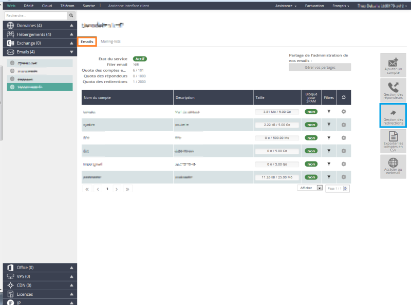
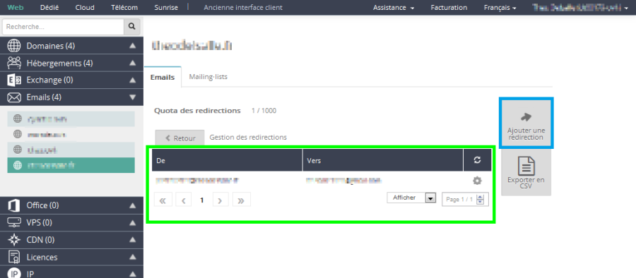
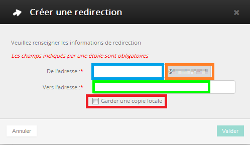
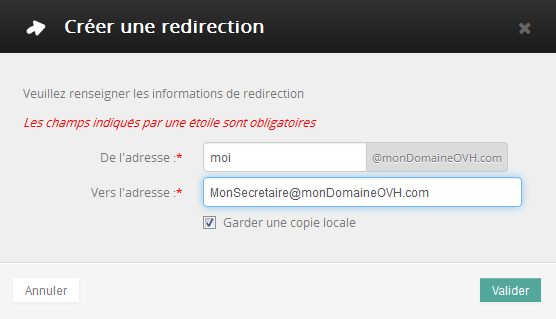
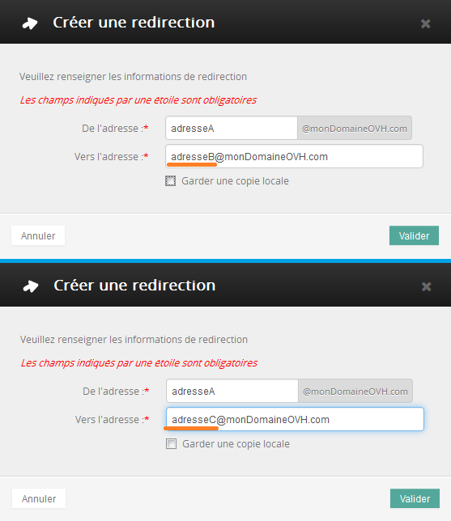

## Czym jest przekierowanie e-mail?
Przekierowanie pozwala na przekierowanie wiadomości e-mail otrzymanej na pierwszy adres na jedna lub kilka innych skrzynek e-mail. 

Przykładowo chcesz, żeby podczas wysyłania e-maila na adres moj_adres@moja-domena.com, e-mail ten został przesłany na moj_inny_adres@inna_domena.com.

Opcja ta pozwala na podanie pierwszego adresu e-mail (moj_adres@moja-domena.com) bez informowania o drugim adresie (moj_inny_adres@inna_domena.com).

Możesz utworzyć przekierowanie na kilka adresów oraz przekierować e-mail zachowując jego kopię na pierwszej skrzynce e-mail.

Każdy e-mail docierający na skrzynkę z przekierowaniem zostanie przekierowany na inną skrzynkę e-mail. Nadawcy nie będą o tym wiedzieć.

{.thumbnail}

## Wstępne wymagania

- Dostęp do [panelu klienta](https://www.ovh.com/manager/web/login/). 

- Jeśli posiadasz konta e-mail w OVH, przejdź do kolejnej części.

- Jeśli nie posiadasz oferty e-mail w OVH, zapoznaj się z tym przewodnikiem:
.

## Gdzie można skonfigurować przekierowania e-mail?
Najpierw należy zalogować się do [panelu klienta](https://www.ovh.com/manager/web/login/).

Po zalogowaniu kliknij na sekcję E-maile.

{.thumbnail}
Wybierz domenę, dla której chcesz dodać przekierowanie e-mail.

Jeśli domeny nie ma na liście, oznacza to, że nie dysponuje ona kontami e-mail. W takiej sytuacji zapoznaj się z [tym przewodnikiem](https://www.ovh.pl/g1864.zamow_mx_plan) lub kliknij na "Zamów MX Plan".

{.thumbnail}
Po kliknięciu na domenę pojawi się sekcja E-maile.

Pozostań w zakładce E-maile i kliknij na  przycisk "Zarządzanie przekierowaniami".

W tej części wyświetli się lista aktywnych przekierowań. Tutaj również będziesz mógł dodawać nowe przekierowania.

{.thumbnail}

## Dodawanie przekierowania
Wyświetli sie ta strona. 

W centralnej części znajduje się tabela z aktywnymi przekierowaniami.
Z prawej strony znajduje się przycisk "Dodaj przekierowanie". Kliknij na ten przycisk, aby dodać nowe przekierowanie.

{.thumbnail}
Zostaniesz poproszony o podanie 3 informacji:

- Z adresu: Wpisz tutaj adres e-mail, który chcesz przekierować. Bedzie to jeden z adresów e-mail przypisanych do Twojej domeny. 

- Na adres: Wpisz tutaj docelowy adres e-mail. Może to być adres e-mail w OVH lub adres zewnętrzny. 

- Zachowaj kopię lokalnie: Zaznacz tę opcję, jeśli chcesz, żeby przekierowane e-maile zostały również zachowane na Twoim koncie e-mail. E-maile będą dostarczane na obydwa adresy.

Kliknij na "Zatwierdź", aby potwierdzić dodanie nowego przekierowania.

{.thumbnail}

## Usuwanie przekierowania
Jeśli chcesz usunąć aktywne przekierowanie, przejdź do tabeli aktywnych przekierowań. 

- Kliknij na koło zębate z prawej strony wybranego przekierowania. 

- Kliknij na "Usuń przekierowanie".

{.thumbnail}
Wystarczy kliknąć na "Zatwierdź", aby definitywnie usunąć przekierowanie.

{.thumbnail}

## Kopiowanie e-maili otrzymanych na adres A na adres B
Jeśli chcesz, żeby wszystkie wysyłane do Ciebie e-maile otrzymywała również inna osoba, możesz wybrać taką konfigurację:

{.thumbnail}

## Przekieruj e-maile wysłane na adres A na dwa adresy e-mail: B i C.
Sytuacja:
Zmieniłeś adres e-mail, ale nie chcesz podawać swojego nowego adresu e-mail. 
Nie chcesz otrzymywać e-maili na adres A, ale chcesz je przekierować na dwa inne adresy e-mail: B i C.
W takiej sytuacji należy skonfigurować dwa oddzielne przekierowania:

{.thumbnail}

