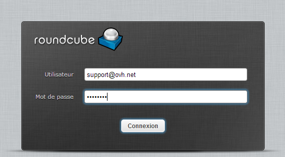

## Windows

- [Windows 8](https://www.ovh.pl/hosting/przewodniki/g1281.hosting_www_konfiguracja_windows_8)

- [Windows Phone](https://www.ovh.pl/g1346.konfiguracja-windows-phone)

- [Windows Mail](https://www.ovh.pl/g1300.konfiguracja-windows-mail)


## Apple

- [Mail Mac](https://www.ovh.pl/g1287.konfiguracja-mail-macos)

- [Mavericks & Yosemite](https://www.ovh.pl/g1599.konfiguracja-mail-macos-mavericks)

- [El Capitan](https://www.ovh.pl/g1965.hosting_www_przewodnik_dotyczacy_konfiguracji_programu_mail_w_systemie_mac_-_el_capitan)

- [Thunderbird w systemie Mac](https://www.ovh.pl/g1911.hosting_www_konfiguracja_konta_e-mail_w_programie_thunderbird_mac)

- [iPad iOS 7](https://www.ovh.pl/g1348.konfiguracja-ipad)

- [iPhone iOS 3](https://www.ovh.pl/g1296.konfiguracja-iphone)

- [iPhone iOS 9.1](https://www.ovh.pl/g2004.hosting_www_konfiguracja_na_iphone_ios_91)


## Outlook

- [Outlook 2007](https://www.ovh.pl/g1298.konfiguracja-outlook-2007)

- [Outlook 2010](https://www.ovh.pl/g1299.konfiguracja-outlook-2010)

- [Outlook 2013](https://www.ovh.pl/g1286.konfiguracja-outlook-2013)

- [Outlook 2011 w systemie Mac](https://www.ovh.pl/g1345.konfiguracja-outlook-2011-mac)


## Inne

- [Thunderbird w systemie Windows](https://www.ovh.pl/g1297.konfiguracja-thunderbird)

- [Tablet z systemem Android 4.1.2](https://www.ovh.pl/g1283.konfiguracja-tablet-android)

- [Telefon z systemem Android 4.4](https://www.ovh.pl/g1347.konfiguracja-nexus-5-android-44)

- [Telefon z systemem Android 5.1](https://www.ovh.pl/g1912.hosting_www_konfiguracja_konta_e-mail_na_telefonie_komorkowym_z_systemem_android_w_wersji_51)

- [Telefon BlackBerry](https://www.ovh.pl/g1381.konfiguracja-blackberry)

- [Gmail](https://www.ovh.pl/g1408.konfiguracja-interfejs-gmail)


## Dostęp
Można wysyłać i odbierać e-maile poprzez interfejs Webmail na stronie [http://webmail.ovh.net/](http://webmail.ovh.net/).

Aby skorzystać z przewodnika na temat tego interfejsu, [kliknij tutaj](https://www.ovh.pl/g1302.webmail-roundcube).

{.thumbnail}


## Konfiguracja IMAP (zalecana)
Oto informacje do konfiguracji konta e-mail w trybie IMAP.

Konfiguracja IMAP z zabezpieczeniem SSL włączonym/green] lub wyłączonym:

Adres Email : Cały adres e-mail
Hasło: Hasło zdefiniowane w [panelu klienta](https://www.ovh.com/manager/web/login/).
Nazwa użytkownika: Cały adres e-mail
Serwer poczty przychodzącej:ssl0.ovh.net
Port serwera poczty przychodzącej:993 lub 143
Serwer poczty wychodzącej:ssl0.ovh.net
Port serwera poczty wychodzącej:465 lub 587

Porty 143 i 587 są podawane, gdy zabezpieczenie SSL jest wyłączone.

Porty 993 i 465 są podawane, gdy zabezpieczenie SSL jest włączone.


- Należy obowiązkowo włączyć uwierzytelnianie serwera SMTP.


|Porty|SSLwłączony|SSLwyłaczony|
|Przychodzące|993|143|
|Wychodzące|465|587|


## Konfiguracja POP
Oto informacje do konfiguracji konta e-mail w trybie POP

Konfiguracja POP z zabezpieczeniem SSL włączonym/green] lub wyłączonym:

Adres Email : Cały adres e-mail
Hasło: Hasło zdefiniowane w [panelu klienta](https://www.ovh.com/manager/web/login/).
Nazwa użytkownika: Cały adres e-mail
Serwer poczty przychodzącej:ssl0.ovh.net
Port serwera poczty przychodzącej:995 lub 110
Serwer poczty wychodzącej:ssl0.ovh.net
Port serwera poczty wychodzącej:465 lub 587

Porty 110 i 587 są podawane, gdy zabezpieczenie SSL jest wyłączone.
Porty 995 i 465 są podawane, gdy zabezpieczenie SSL jest włączone.


- Należy obowiązkowo włączyć uwierzytelnianie serwera SMTP.


|Porty|SSLwłączony|SSLwyłaczony|
|Przychodzące|995|110|
|Wychodzące|465|587|


## Przypomnienie dotyczące uwierzytelniania
Musi być włączone uwierzytelnianie dla serwera poczty wychodzącej, aby e-maile były poprawnie wysyłane.

W przeciwnym razie może pojawić się błąd:


```
"553 sorry, that domain isn't allowed to be relayed thru this MTA (#5.7.1)"
```


- Sprawdź, czy w Twoim programie do obsługi poczty elektronicznej jest włączone uwierzytelnianie SMTP dla wiadomości wychodzących.


