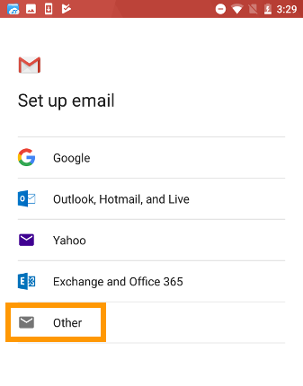
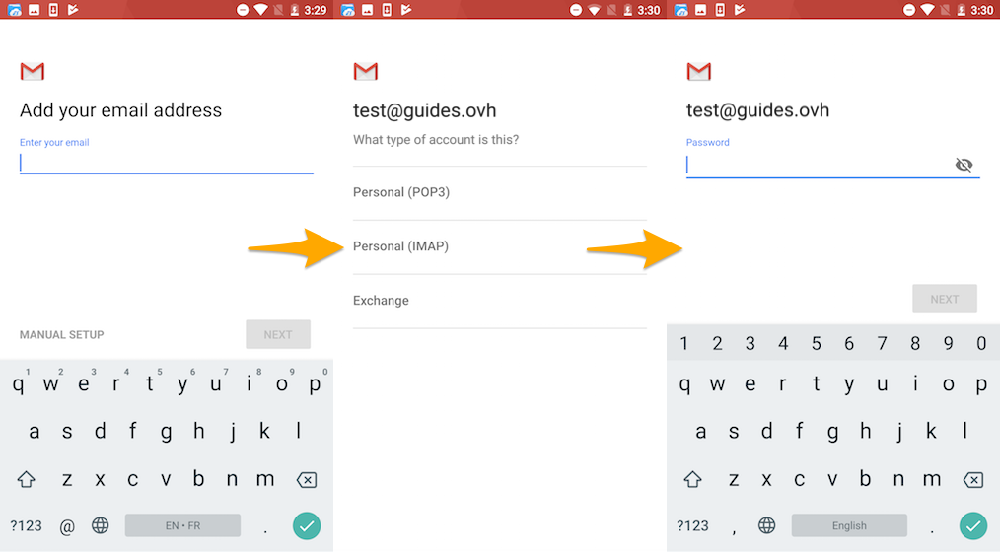

**Dernière mise à jour le 21/02/2018**

## Objectif

Les adresses e-mail de l'offre MX Plan peuvent être configurées sur différents logiciels de messagerie compatibles. Cela vous permet d'envoyer et de recevoir vos messages depuis l'appareil de votre choix.

**Apprenez à configurer une adresse e-mail MX Plan sur Android, via l'application Gmail.**

> [!warning]
>
> OVH met à votre disposition des services dont la configuration, la gestion et la responsabilité vous incombent. Il vous revient de ce fait d'en assurer le bon fonctionnement.
> 
> Nous mettons à votre disposition ce guide afin de vous accompagner au mieux sur des tâches courantes. Néanmoins, nous vous recommandons de faire appel à un prestataire spécialisé et/ou de contacter l'éditeur du service si vous éprouvez des difficultés. En effet, nous ne serons pas en mesure de vous fournir une assistance. Plus d'informations dans la section « Aller plus loin » de ce guide.
> 

## Prérequis

- Disposer d’une adresse e-mail MX Plan (comprise dans l’offre MX Plan ou dans une offre d’[hébergement web OVH](https://www.ovh.com/fr/hebergement-web/){.external}.
- Disposer de l'application Gmail sur votre appareil. Vous pouvez installer cette dernière depuis le Google Play Store.
- Disposer des identifiants relatifs à l'adresse e-mail que vous souhaitez paramétrer.

> [!primary]
>
> Cette documentation a été réalisée depuis un appareil Nexus 6 utilisant la version 7.1.1 d'Android. Pour une question d'uniformisation, nous utilisons l'application Gmail pouvant être installée depuis le Play Store. Si vous souhaitez utiliser une autre application, la marche à suivre pourrait alors être différente.
>

## En pratique

### Étape 1 : ajouter le compte

Sur l'écran d'accueil de votre appareil, rendez-vous dans l'application `Gmail`{.action}. L’ajout d’un compte peut s’initier de deux manières différentes :

- **si aucun compte n'est paramétré** : passez l'étape de bienvenue puis appuyez sur `Ajouter une adresse e-mail`{.action}. Choisissez enfin `Autre`{.action} ; 

- **si un compte a déjà été paramétré** : appuyez sur le pictogramme représentant trois traits en haut à gauche, puis sur le pictogramme en forme de flèche à droite du nom du compte déjà paramétré. Appuyez enfin sur  `Ajouter un compte`{.action} et choisissez `Autre`{.action}. 

{.thumbnail}

Renseignez à présent votre adresse e-mail, puis appuyez sur `Suivante`{.action}.

Lors du choix du type de compte, nous vous conseillons une utilisation en **IMAP**. Vous pouvez cependant sélectionner **POP** : ce choix implique un stockage des e-mails en local sur votre application Gmail et n'est donc pas recommandé si vous consultez votre adresse via plusieurs logiciels de messagerie.

Renseignez maintenant le mot de passe de votre adresse e-mail puis appuyez sur `Suivante`{.action}.

{.thumbnail}

Renseignez les paramètres du serveur entrant :

|Information|Description| 
|---|---| 
|Nom d'utilisateur|Renseignez l'adresse e-mail complète.|  
|Mot de passe|Renseignez le mot de passe de l'adresse e-mail.|
|Serveur|Renseignez le serveur « ssl0.ovh.net ».|

Appuyez sur `Suivante`{.action} puis renseignez les paramètres du serveur sortant :

|Information|Description| 
|---|---| 
|Exiger une connexion|Assurez-vous de bien laisser ce bouton enclenché.|
|Nom d'utilisateur|Renseignez l'adresse e-mail complète.|  
|Mot de passe|Renseignez le mot de passe de l'adresse e-mail.|
|Serveur SMTP|Renseignez le serveur « ssl0.ovh.net ».|

Appuyez maintenant sur `Suivante`{.action}. Si les informations renseignées sont correctes, la connexion au compte réussira.

{.thumbnail}

Définissez les options du compte puis appuyez sur `Suivante`{.action}. Enfin, vous pouvez donner un nom à ce compte vous permettant de le reconnaître parmi d'autres présents dans votre application, ainsi que le nom qui s'affichera lorsque vous enverrez des e-mails. Une fois ces actions effectuées, appuyez sur `Suivante`{.action}.

Vous pouvez effectuer un test d'envoi pour vérifier que le compte est correctement configuré.

Si vous devez renseigner manuellement des champs techniques dans les préférences du compte, vous trouverez ci-dessous les paramètres à utiliser avec notre offre MX Plan :

- **pour une configuration en IMAP**

|Type de serveur|Nom du serveur|Type de sécurité|Port|
|---|---|---|---|
|Entrant|ssl0.ovh.net|SSL/TLS|993|
|Sortant|ssl0.ovh.net|SSL/TLS|465|

- **pour une configuration en POP**

|Type de serveur|Nom du serveur|Type de sécurité|Port|
|---|---|---|---|
|Entrant|ssl0.ovh.net|SSL/TLS|995|
|Sortant|ssl0.ovh.net|SSL/TLS|465|

### Étape 2 : utiliser l'adresse e-mail

Une fois l'adresse e-mail configurée, il ne reste plus qu’à l'utiliser ! Vous pouvez dès à présent envoyer et recevoir des messages.

OVH propose une application web permettant d'accéder à votre adresse e-mail depuis un navigateur web, à l’adresse <https://www.ovh.com/fr/mail/>. Vous pouvez vous y connecter grâce aux identifiants de votre adresse e-mail.

## Aller plus loin

[Configurer son compte E-mail Pro sur Android via l'application Gmail](https://docs.ovh.com/fr/emails-pro/configuration-android/){.external}.

[Configurer son compte Exchange sur Android via l'application Gmail](https://docs.ovh.com/fr/microsoft-collaborative-solutions/exchange-configuration-sous-android/){.external}.

Échangez avec notre communauté d'utilisateurs sur [https://community.ovh.com](https://community.ovh.com){.external}.