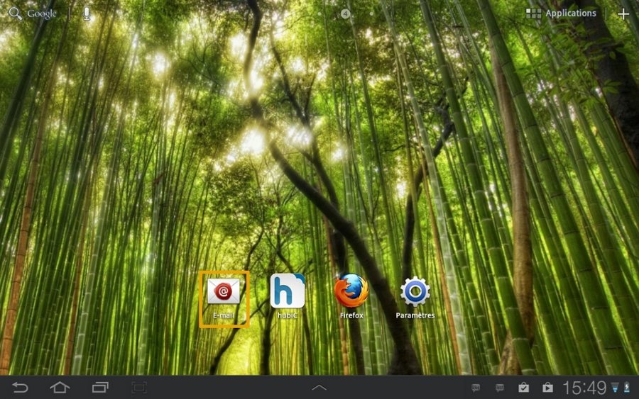
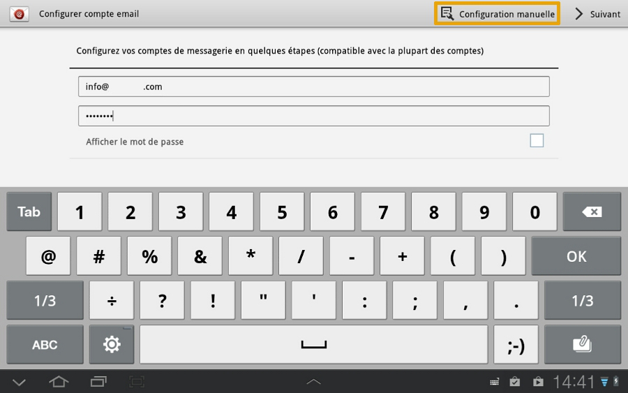
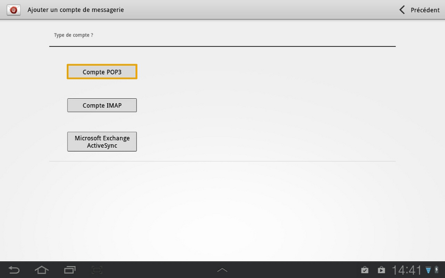
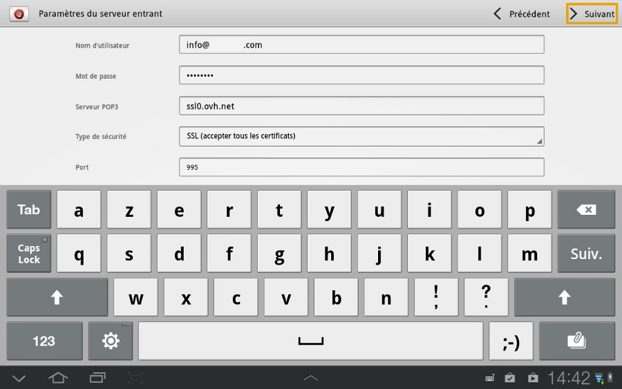
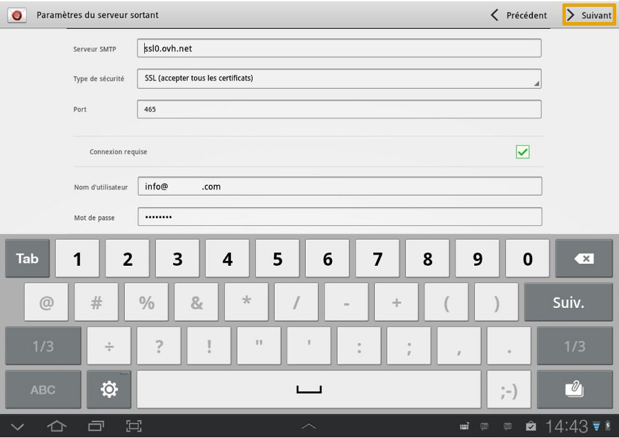
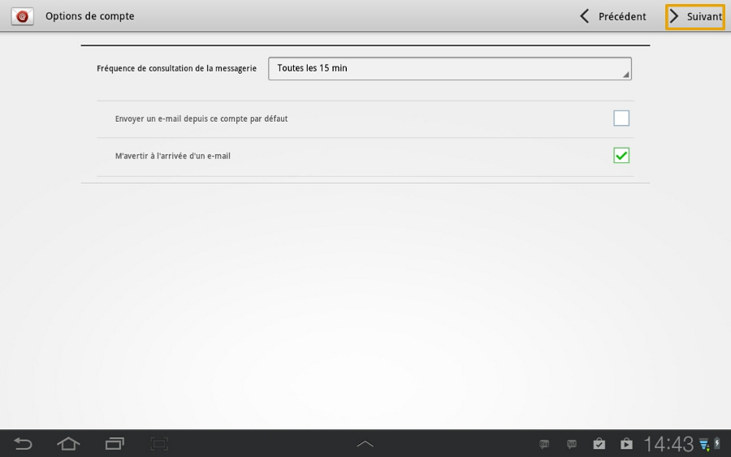
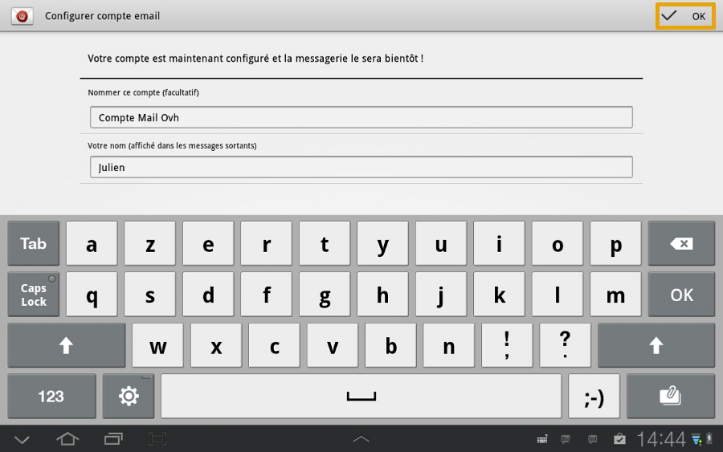
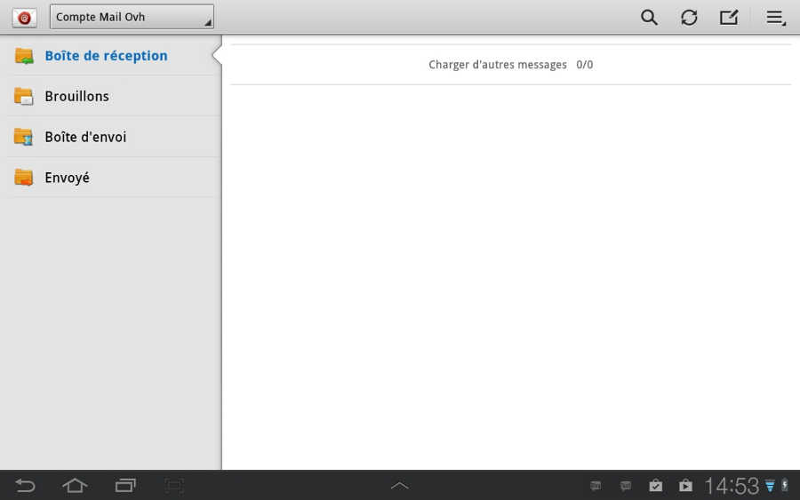

Cliquez [ici](http://www.ovh.com/fr/hebergement-web/faq){.external} pour retrouver nos différents guides de configuration e-mail.

Ce guide ne s'applique pas aux adresses emails Exchange.

> [!warning]
>
> OVH met à votre disposition des services dont la configuration, la gestion et la responsabilité vous incombent. Il vous revient de ce fait d'en assurer le bon fonctionnement.
> 
> Nous mettons à votre disposition ce guide afin de vous accompagner au mieux sur des tâches courantes. Néanmoins, nous vous recommandons de faire appel à un prestataire spécialisé et/ou de contacter l'éditeur du service si vous éprouvez des difficultés. En effet, nous ne serons pas en mesure de vous fournir une assistance. Plus d'informations dans la section « Aller plus loin » de ce guide.
> 

## Configuration Protocole POP

### E-mail
Dans un premier temps, trouvez et cliquez sur l'icône "E-mail".

Dans notre exemple le compte e-mail mutualisé est configuré en  **POP**  sur une Samsung Tab GT p7510 sous Android version 4.1.2

Lors de l'ajout du compte, vérifiez que votre connexion 3G ou Wifi est active.

{.thumbnail}

### Configuration du compte e-mail
Renseignez votre adresse e-mail mutualisé entière ainsi que le mot de passe défini dans votre [espace client](https://www.ovh.com/auth/?action=gotomanager&from=https://www.ovh.com/fr/&ovhSubsidiary=fr){.external} pour votre compte e-mail.

Cliquez ensuite sur "Configuration manuelle" pour continuer.

{.thumbnail}

### Type de compte e-mail
Sélectionnez ensuite "Compte POP3" pour poursuivre la configuration du compte e-mail mutualisé.

*Si vous souhaitez configurer en IMAP, vous devrez utiliser les paramètres renseignés à la fin de ce guide.*

{.thumbnail}

### Parametres du serveur entrant
Renseignez à présent les informations de votre compte e-mail mutualisé pour le serveur entrant.

"Nom d'utilisateur" : votre adresse e-mail entière.

"Mot de passe" : Le mot de passe défini dans votre [espace client](https://www.ovh.com/auth/?action=gotomanager&from=https://www.ovh.com/fr/&ovhSubsidiary=fr){.external}.

"Serveur POP3" :  **SSL0.OVH.NET**

"Type de sécurité" : sélectionnez  **"SSL (accepter tous les certificats)"** .

"Port" : le port à renseigner est  **995** .

Cliquez sur "Suivant" pour continuer.

{.thumbnail}

### Parametres du serveur sortant
Renseignez maintenant les informations de votre compte e-mail mutualisé pour le serveur sortant.

"Serveur SMTP" :  **SSL0.OVH.NET**

"Type de sécurité" : sélectionnez  **"SSL (accepter tous les certificats)"** .

"Port" : le port à renseigner est  **465** .

"Connexion requise" : doit être coché.

"Nom d'utilisateur" : votre adresse e-mail entière.

"Mot de passe" : Le mot de passe défini dans votre [espace client](https://www.ovh.com/auth/?action=gotomanager&from=https://www.ovh.com/fr/&ovhSubsidiary=fr){.external}.

Cliquez sur "Suivant" pour continuer.

{.thumbnail}

> [!success]
>
> - 
> Une connexion pour le serveur sortant est un paramétrage
> indispensable afin que l'émission d'email puisse fonctionner sur nos
> serveurs SMTP.
> - 
> Si la connexion n'est pas activée, un ticket incident Open SMTP peut
> être ouvert vous informant que l'authentification "POP before SMTP"
> n'est pas supportée. Vous devrez impérativement activer une connexion
> pour le serveur sortant afin de pouvoir émettre des emails.
> 
> 

### Options de compte
Dans cette interface il vous est possible de définir certaine options de configuration pour l'adresse e-mail mutualisé.

Continuez en cliquant sur "Suivant" une fois vos paramètres définis.

{.thumbnail}

### Finalisation
Vous pouvez à présent nommer votre compte de messagerie et choisir le nom à afficher dans les messages sortants.

Pour finaliser l'installation de votre compte e-mail cliquez sur "OK".

{.thumbnail}

### Interface e-mail
Voici l'interface e-mail que vous pouvez à présent utiliser.

Un clic sur l'icône en haut à droite vous permet d'accéder aux paramètres du compte e-mail mutualisé.

{.thumbnail}

## Configuration Protocole IMAP

### Information configuration IMAP
Voici les informations de configuration en IMAP pour le serveur entrant.

"Nom d'utilisateur" : votre adresse e-mail entière.

"Mot de passe" : Le mot de passe défini dans votre [espace client](https://www.ovh.com/auth/?action=gotomanager&from=https://www.ovh.com/fr/&ovhSubsidiary=fr){.external}.

"Serveur IMAP" :  **SSL0.OVH.NET**

"Type de sécurité" : sélectionnez  **"SSL (accepter tous les certificats)"** .

"Port" : le port à renseigner est  **993** .

Voici les informations de configuration en IMAP pour le serveur sortant.

"Serveur SMTP" :  **SSL0.OVH.NET**

"Type de sécurité" : sélectionnez  **"SSL (accepter tous les certificats)"** .

"Port" : le port à renseigner est  **465** .

"Connexion requise" : doit être coché.

"Nom d'utilisateur" : votre adresse e-mail entière.

"Mot de passe" : Le mot de passe défini dans votre [espace client](https://www.ovh.com/auth/?action=gotomanager&from=https://www.ovh.com/fr/&ovhSubsidiary=fr){.external}.

## Rappel des parametres POP - IMAP

### Configuration POP
Voici les informations à retenir pour la configuration d'un compte e-mail **POP** .

Configuration  **POP**  avec sécurisation SSL activée ou désactivée :

Adresse Email : Votre adresse e-mail mutualisée entière. Mot de passe : Le mot de passe que vous avez défini dans [l'espace client](https://www.ovh.com/auth/?action=gotomanager&from=https://www.ovh.com/fr/&ovhSubsidiary=fr){.external}. Nom d'utilisateur : Votre adresse e-mail mutualisée entière. Serveur entrant : Le serveur de réception des e-mails :  **SSL0.OVH.NET** Port serveur entrant : Le port du serveur entrant :  **995**  ou  **110** Serveur sortant : Le serveur d'envoi des e-mails :  **SSL0.OVH.NET** Port serveur sortant : Le port du serveur sortant :  **465**  ou  **587**

Les ports  **110**  et  **587**  correspondent à la sécurisation SSL désactivée. Les ports  **995**  et  **465**  correspondent à la sécurisation SSL activée.

- Vous devez obligatoirement activer [l'authentification](#configuration_protocole_pop_partie_5_parametres_du_serveur_sortant){.external} du serveur sortant SMTP.

|Ports|SSL activé|SSL désactivé|
|---|---|---|
|Entrant|995|110|
|Sortant|465|587|

### Configuration IMAP
Voici les informations à retenir pour la configuration d'un compte e-mail **IMAP** .

Configuration  **IMAP**  avec sécurisation SSL activée ou désactivée :

Adresse Email : Votre adresse e-mail mutualisée entière. Mot de passe : Le mot de passe que vous avez défini dans [l'espace client](https://www.ovh.com/auth/?action=gotomanager&from=https://www.ovh.com/fr/&ovhSubsidiary=fr){.external}. Nom d'utilisateur : Votre adresse e-mail mutualisée entière. Serveur entrant : Le serveur de réception des e-mails :  **SSL0.OVH.NET** Port serveur entrant : Le port du serveur entrant :  **993**  ou  **143** Serveur sortant : Le serveur d'envoi des e-mails :  **SSL0.OVH.NET** Port serveur sortant : Le port du serveur sortant :  **465**  ou  **587**

Les ports  **143**  et  **587**  correspondent à la sécurisation SSL désactivée. Les ports  **993**  et  **465**  correspondent à la sécurisation SSL activée.

- Vous devez obligatoirement activer [l'authentification](#configuration_protocole_pop_partie_5_parametres_du_serveur_sortant){.external} du serveur sortant SMTP.

|Ports|SSL activé|SSL désactivé|
|---|---|---|
|Entrant|993|143|
|Sortant|465|587|

## Aller plus loin

Échangez avec notre communauté d'utilisateurs sur <https://community.ovh.com>.