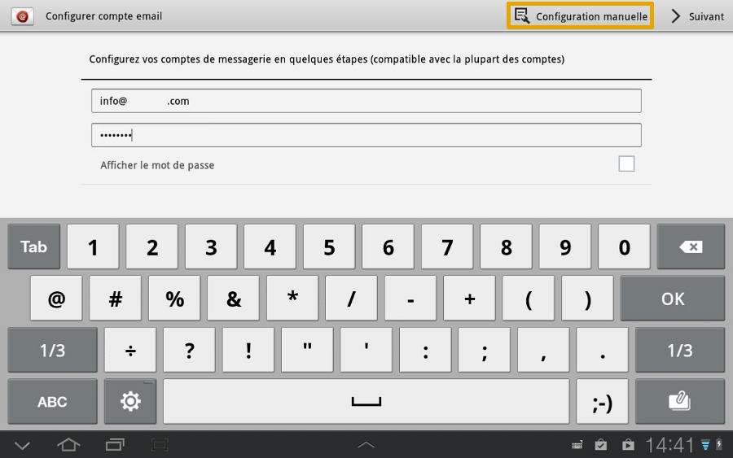
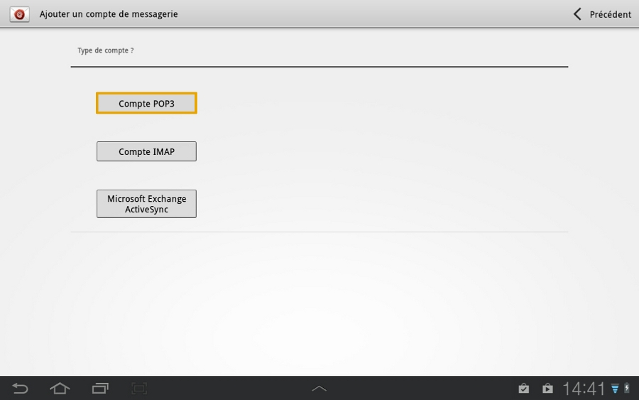
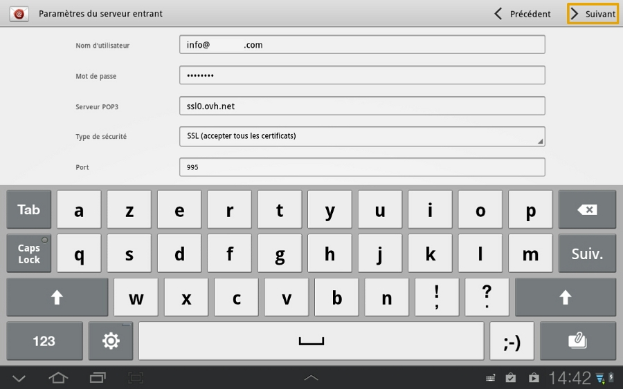
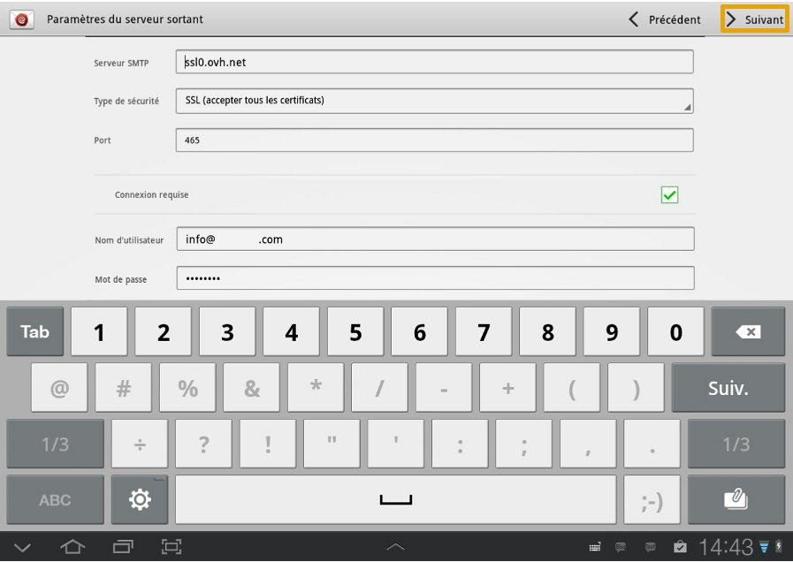
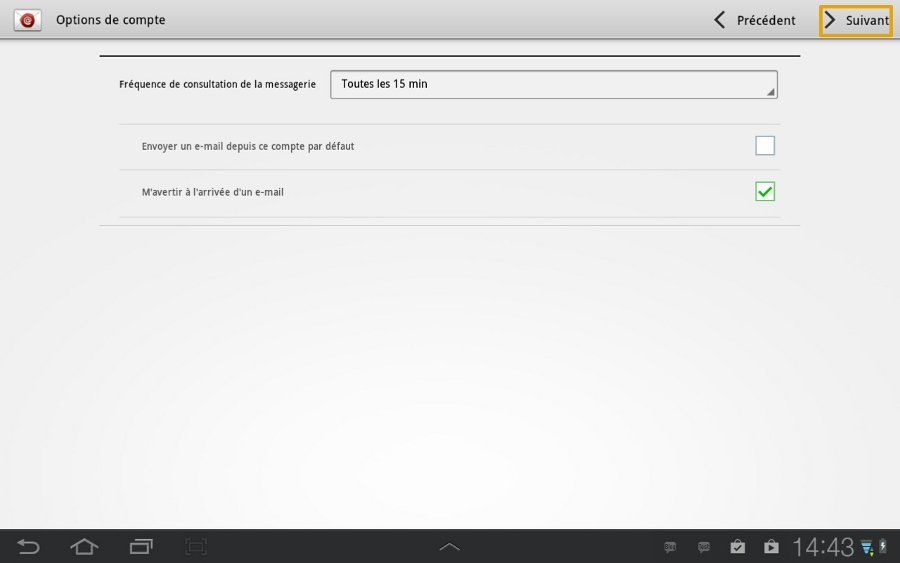
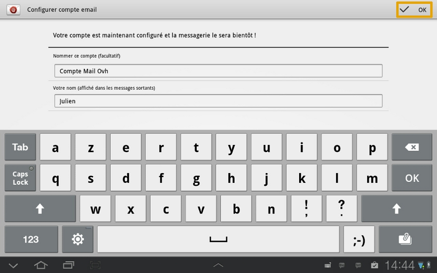
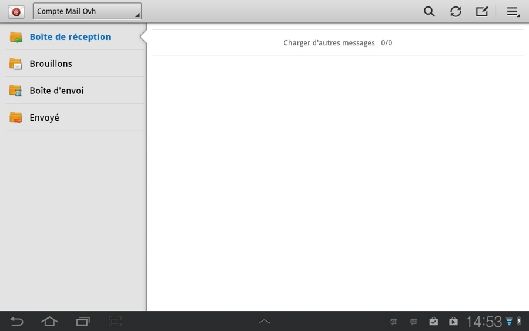

## Część 1: E-mail
W pierwszej kolejności kliknij na ikonkę "E-mail".

W naszym przykładzie e-mail jest konfigurowany w trybie POP na tablecie Samsung Tab GT p7510 z systemem Android wersja 4.1.2

Podczas dodawania konta sprawdź, czy jest włączone połączenie 3G lub Wifi.

{.thumbnail}

## Część 2: Konfiguracja konta e-mail
Wpisz adres e-mail oraz przypisane do niego hasło (zdefiniowane w [panelu klienta manager](https://www.ovh.pl/managerv3/)).

Następnie kliknij na "Konfiguracja ręczna".

{.thumbnail}

## Część 3: Typ konta e-mail
Wybierz "Konto POP3", aby kontynuować konfigurację.

i]Jeśli chcesz skonfigurować konto w protokole IMAP, skorzystaj z parametrów podanych pod koniec tego przewodnika.

{.thumbnail}

## Część 4: Parametry serwera poczty przychodzącej
Wpisz informacje dotyczące konta e-mail dla serwera poczty przychodzącej.

"Nazwa użytkownika": cały adres e-mail

"Hasło": Hasło zdefiniowane w [panelu klienta](https://www.ovh.pl/managerv3/).

"Serwer POP3": SSL0.OVH.NET

"Typ ochrony": wybierz "SSL (akceptuj wszystkie certyfikaty)".

"Port": należy wpisać 995.

Kliknij na "Dalej", aby kontynuować.

{.thumbnail}

## Część 5: Parametry serwera poczty wychodzącej
Wpisz informacje dotyczące konta e-mail dla serwera poczty wychodzącej.

"Serwer SMTP": SSL0.OVH.NET

"Typ ochrony": wybierz "SSL (akceptuj wszystkie certyfikaty)".

"Port": należy wpisać 465.

"Wymagane połączenie": musi być zaznaczone.

"Nazwa użytkownika": cały adres e-mail

"Hasło": Hasło zdefiniowane w [panelu klienta](https://www.ovh.pl/managerv3/).

Kliknij na "Dalej", aby kontynuować.

{.thumbnail}

- Połączenie dla serwera poczty wychodzącej jest parametrem niezbędnym, aby wysyłka e-maili mogła działać na naszych serwerach SMTP. 

- Jeśli połączenie nie jest włączone, może zostać otwarte zgłoszenie Open SMTP informujące, że uwierzytelnianie "POP before SMTP" nie jest obsługiwane. Należy obowiązkowo włączyć uwierzytelnienie serwera poczty wychodzącej, aby móc wysyłać e-maile.

## Część 6: Opcje konta
W tym interfejsie można zdefiniować niektóre opcje dotyczące konfiguracji adresu e-mail. 

Po zdefiniowaniu ustawień kliknij na "Dalej".

{.thumbnail}

## Część 7: Zakończenie
Możesz teraz nazwać swoje konto i wybrać nazwę, która ma się wyświetlać w wysyłanych wiadomościach. 

Aby zakończyć instalację konta e-mail, kliknij na "OK".

{.thumbnail}

## Interfejs e-mail
Oto interfejs do obsługi kont e-mail. 

Kliknięcie na ikonkę w górnym prawym rogu pozwala na dostęp do ustawień konta e-mail.

{.thumbnail}

## Informacje o konfiguracji IMAP
Informacje dotyczące konfiguracji IMAP dla serwera poczty przychodzącej.

"Nazwa użytkownika": cały adres e-mail

"Hasło": Hasło zdefiniowane w [panelu klienta](https://www.ovh.pl/managerv3/).

"Serwer IMAP": wpisz ssl0.ovh.net

"Typ ochrony": wybierz "SSL (akceptuj wszystkie certyfikaty)".

"Port": należy wpisać 993.

Informacje dotyczące konfiguracji IMAP dla serwera poczty wychodzącej.

"Serwer SMTP": SSL0.OVH.NET

"Typ ochrony": wybierz "SSL (akceptuj wszystkie certyfikaty)".

"Port": należy wpisać 465.

"Wymagane połączenie: musi być zaznaczone.

"Nazwa użytkownika": cały adres e-mail

"Hasło": Hasło zdefiniowane w [panelu klienta](https://www.ovh.pl/managerv3/).

## Konfiguracja POP
Oto informacje do konfiguracji konta e-mail POP.

Konfiguracja POP z zabezpieczeniem SSL włączonym/green] lub wyłączonym:

Adres Email : Cały adres e-mail
Hasło: Hasło zdefiniowane w [panelu klienta](https://www.ovh.pl/managerv3/).
Nazwa użytkownika: Cały adres e-mail
Serwer poczty przychodzącej:ssl0.ovh.net
Port serwera poczty przychodzącej:995 lub 110
Serwer poczty wychodzącej:ssl0.ovh.net
Port serwera poczty wychodzącej:465 lub 587

Porty 110 i 587 są podawane, gdy zabezpieczenie SSL jest wyłączone.

Porty 995 i 465 są podawane, gdy zabezpieczenie SSL jest włączone.

- Należy obowiązkowo włączyć [uwierzytelnianie](#configuration_protocole_pop_partie_5_parametres_du_serveur_sortant) serwera SMTP.

|Porty|SSLwłączony|SSLwyłączony|
|Wchodzący|995|110|
|Wychodzący|465|587|

## Konfiguracja IMAP
Oto informacje do konfiguracji konta e-mail IMAP.

Konfiguracja IMAP z zabezpieczeniem SSL włączonym/green] lub wyłączonym:

Adres Email : Cały adres e-mail
Hasło: Hasło zdefiniowane w [panelu klienta](https://www.ovh.pl/managerv3/).
Nazwa użytkownika: Cały adres e-mail
Serwer poczty przychodzącej:ssl0.ovh.net
Port serwera poczty przychodzącej:993 lub 143
Serwer poczty wychodzącej:ssl0.ovh.net
Port serwera poczty wychodzącej:465 lub 587

Porty 143 i 587 są podawane, gdy zabezpieczenie SSL jest wyłączone.

Porty 993 i 465 są podawane, gdy zabezpieczenie SSL jest włączone.

- Należy obowiązkowo włączyć [uwierzytelnianie](#configuration_protocole_pop_partie_5_parametres_du_serveur_sortant) serwera SMTP.

|Porty|SSLwłączony|SSLwyłączony|
|Wchodzący|993|143|
|Wychodzący|465|587|

