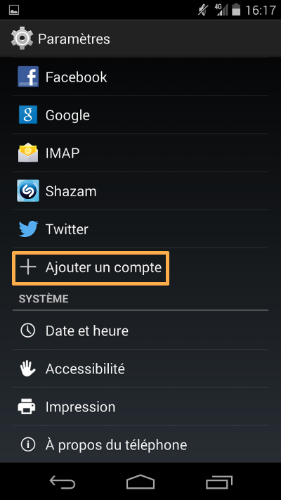
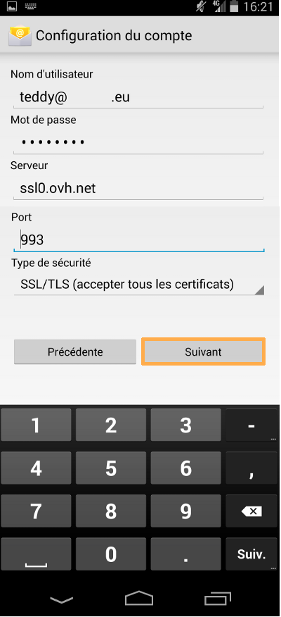
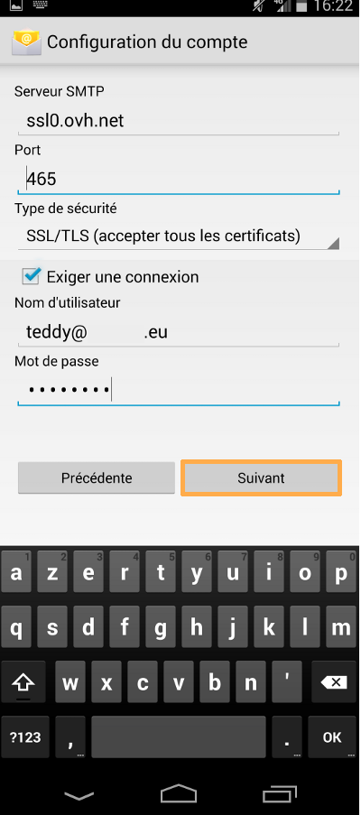

Cliquez [ici](http://www.ovh.com/fr/hebergement-web/faq){.external} pour retrouver nos différents guides de configuration e-mail.

> [!warning]
>
> OVH met à votre disposition des services dont la configuration, la gestion et la responsabilité vous incombent. Il vous revient de ce fait d'en assurer le bon fonctionnement.
> 
> Nous mettons à votre disposition ce guide afin de vous accompagner au mieux sur des tâches courantes. Néanmoins, nous vous recommandons de faire appel à un prestataire spécialisé et/ou de contacter l'éditeur du service si vous éprouvez des difficultés. En effet, nous ne serons pas en mesure de vous fournir une assistance. Plus d'informations dans la section « Aller plus loin » de ce guide.
> 

## Configuration d'un telephone mobile sous Android

### Ajout d'un compte
Dans un premier temps, rendez-vous dans "Paramètres" sur votre téléphone.

Dans notre exemple c'est un compte e-mail mutualisé qui est configuré en **IMAP**  sur un Nexus 5 sous Android version 4.4.

Lors de l'ajout du compte, vérifiez que votre connexion 3G ou Wi-Fi est active.

Sélectionnez "Ajouter un compte" pour continuer le paramétrage.

{.thumbnail}

### Type de compte
On vous demande de choisir le type de compte : sélectionnez "IMAP" pour continuer le paramétrage.

*Notez qu'il vous est possible de sélectionner "POP". Dans ce cas, utilisez les informations de configuration données en fin de ce guide.*

{.thumbnail}

### Configuration manuelle
Renseignez votre adresse e-mail en entier et le mot de passe que vous avez défini dans le [Manager](https://www.ovh.com/auth/?action=gotomanager){.external}.

Il vous sera alors possible de sélectionner "Config. manuelle" pour continuer le paramétrage du téléphone mobile.

{.thumbnail}

### Protocole e-mail
Sélectionnez le protocole "IMAP" pour continuer.

*Notez qu'il vous est possible de sélectionner "POP". Dans ce cas, utilisez les informations de configuration données en fin de ce guide.*

{.thumbnail}

### Configuration du compte (1)
Renseignez les paramètres demandés :

Nom d'utilisateur : votre adresse e-mail en entier.

Mot de passe : le mot de passe que vous avez défini dans le [Manager](https://www.ovh.com/auth/?action=gotomanager){.external}.

Serveur :  **SSL0.OVH.NET**

Port :  **993**

Type de sécurité :  **SSL/TLS (accepter tous les certificats)**

*Pour utiliser une autre configuration, rendez-vous à la fin de ce guide pour trouver les différents paramètres possibles.*

Cliquez sur "Suivant" pour continuer la configuration.

{.thumbnail}

### Configuration du compte (2)
Renseignez les paramètres demandés :

Serveur SMTP :  **SSL0.OVH.NET**

Port :  **465**

Type de sécurité :  **SSL/TLS (accepter tous les certificats)**

"Exiger une connexion" doit être  **coché** .

Nom d'utilisateur : votre adresse e-mail en entier.

Mot de passe : le mot de passe que vous avez défini dans le [Manager](https://www.ovh.com/auth/?action=gotomanager){.external}.

*Pour utiliser une autre configuration, rendez-vous à la fin de ce guide pour trouver les différents paramètres possibles.*

Cliquez sur "Suivant" pour continuer la configuration.

{.thumbnail}

> [!success]
>
> - 
> Une connexion pour le serveur SMTP est un paramétrage indispensable
> afin que l'émission d'email puisse fonctionner sur nos serveurs SMTP.
> - 
> Si la connexion n'est pas activée, un ticket incident Open SMTP peut
> être ouvert vous informant que l'authentification "POP before SMTP"
> n'est pas supportée. Vous devrez impérativement activer une connexion
> pour le serveur SMTP afin de pouvoir émettre des emails.
> 
> 

### Parametres du compte
Différents paramètres sont sélectionnables ou paramétrables.

Choisissez les paramètres que vous souhaitez activer.

Cliquez sur "Suivant" pour continuer la configuration.

{.thumbnail}

### Finalisation
Pour finaliser l'ajout du compte e-mail il vous est demandé de définir le nom d'affichage du compte e-mail sur le téléphone ainsi que le nom d'affichage désiré pour les e-mails sortants.

Cliquez sur "Suivant" pour terminer.

{.thumbnail}

### Affichage du compte e-mail
Afin de visualiser le compte ajouté, de modifier les paramètres du compte e-mail, rendez-vous dans "Paramètres" puis dans "Comptes" sélectionnez "IMAP".

À ce niveau il sera possible de modifier les paramètres du compte.

{.thumbnail}

## Rappel des parametres POP - IMAP

### Configuration POP
Voici les informations à retenir pour la configuration d'un compte e-mail **POP** .

Configuration  **POP**  avec sécurisation SSL activée ou désactivée :

Adresse Email : Votre adresse e-mail mutualisée entière. Mot de passe : Le mot de passe que vous avez défini dans [l'espace client](https://www.ovh.com/auth/?action=gotomanager){.external}. Nom d'utilisateur : Votre adresse e-mail mutualisée entière. Serveur entrant : Le serveur de réception des e-mails :  **SSL0.OVH.NET** Port serveur entrant : Le port du serveur entrant :  **995**  ou  **110** Serveur sortant : Le serveur d'envoi des e-mails :  **SSL0.OVH.NET** Port serveur sortant : Le port du serveur sortant :  **465**  ou  **587**

Les ports  **110**  et  **587**  correspondent à la sécurisation SSL désactivée. Les ports  **995**  et  **465**  correspondent à la sécurisation SSL activée.

- Vous devez obligatoirement activer [l'authentification](#configuration_dun_telephone_mobile_sous_android_partie_6_configuration_du_compte_2){.external} du serveur sortant SMTP.

|Ports|SSL activé|SSL désactivé|
|---|---|---|
|Entrant|995|110|
|Sortant|465|587|

### Configuration IMAP
Voici les informations à retenir pour la configuration d'un compte e-mail **IMAP** .

Configuration  **IMAP**  avec sécurisation SSL activée ou désactivée :

Adresse Email : Votre adresse e-mail mutualisée entière. Mot de passe : Le mot de passe que vous avez défini dans [l'espace client](https://www.ovh.com/auth/?action=gotomanager){.external}. Nom d'utilisateur : Votre adresse e-mail mutualisée entière. Serveur entrant : Le serveur de réception des e-mails :  **SSL0.OVH.NET** Port serveur entrant : Le port du serveur entrant :  **993**  ou  **143** Serveur sortant : Le serveur d'envoi des e-mails :  **SSL0.OVH.NET** Port serveur sortant : Le port du serveur sortant :  **465**  ou  **587**

Les ports  **143**  et  **587**  correspondent à la sécurisation SSL désactivée. Les ports  **993**  et  **465**  correspondent à la sécurisation SSL activée.

- Vous devez obligatoirement activer [l'authentification](#configuration_dun_telephone_mobile_sous_android_partie_6_configuration_du_compte_2){.external} du serveur sortant SMTP.

|Ports|SSL activé|SSL désactivé|
|---|---|---|
|Entrant|993|143|
|Sortant|465|587|

## Astuce

### Samsung Galaxy Note 3
Si vous rencontrez l'erreur :

- Erreur : Echec d'authentification

Vous pouvez essayer de modifier le nom d'utilisateur en renseignant  **adresse_e-mail%domaine.tld**  (au lieu du  **@** ).

## Aller plus loin

Échangez avec notre communauté d'utilisateurs sur <https://community.ovh.com>.