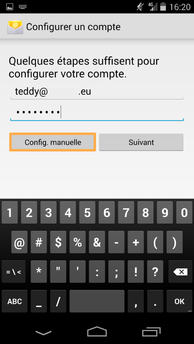
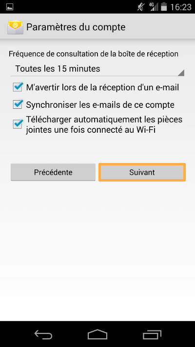
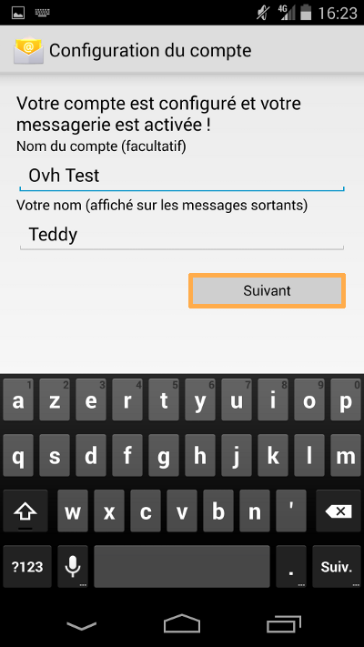
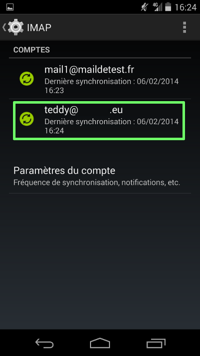

## Parte 1: Adição de uma conta
Num primeiro tempo aceda a "Parâmetros" no seu telefone.

No nosso exemplo trata-se de uma conta de e-mail que está configurada em IMAP num smarpthone Nexus 5 com Android versão 4.4.

Quando efetuar a adição da conta verifique que a sua ligação 3G ou Wi-Fi está ativa.

Selecione "Adicionar uma conta" para continuar a parametrização.

{.thumbnail}

## Parte 2: Tipo de conta
É-lhe pedido que escolha o tipo de conta: selecione "IMAP" para continuar a parametrização.

Tenha em atenção que pode selecionar "POP". Nesse caso deve utilizar as informações de configuração fornecidas no final deste guia.

{.thumbnail}

## Parte 3: Configuração manual
Introduza o endereço de e-mail na íntegra e a password que definiu no [Manager](https://www.ovh.com/auth/?action=gotomanager&from=https://www.ovh.pt/&ovhSubsidiary=pt).

É possível selecionar "Config. manual" para continuar a parametrização do smartphone.

{.thumbnail}

## Parte 4: Protocolo e-mail
Selecione o protocolo "IMAP" pour continuer.

Tenha em atenção que pode selecionar "POP". Nesse caso deve utilizar as informações de configuração fornecidas no final deste guia.

{.thumbnail}

## Parte 5: Configuração da conta (1)
Introduza os parâmetros pedidos:

Nome de utilizador: o seu endereço de e-mail na íntegra.

Password: a password definida no seu [Manager](https://www.ovh.com/auth/?action=gotomanager&from=https://www.ovh.pt/&ovhSubsidiary=pt)

Servidor: SSL0.OVH.NET

Porta: 993

Tipo de segurança: SSL/TLS (aceitar todos os certificados)

Para utilizar uma outra configuração consulte as informações no final deste guia onde encontrará as diferentes parametrizações possíveis.

Clique em "Seguinte" para continuar a configuração.

{.thumbnail}

## Parte 5: Configuração da conta (2)
Introduza os parâmetros pedidos:

Servidor SMTP: SSL0.OVH.NET

Porta: 465

Tipo de segurança: SSL/TLS (aceitar todos os certificados)

"Exigir uma ligação" deve estar selecionar.

Nome de utilizador: o seu endereço de e-mail na íntegra.

Password: a password definida no seu [Manager](https://www.ovh.com/auth/?action=gotomanager&from=https://www.ovh.pt/&ovhSubsidiary=pt)

Para utilizar uma outra configuração consulte as informações no final deste guia onde encontrará as diferentes parametrizações possíveis.

Clique em "Seguinte" para continuar a configuração.

{.thumbnail}

- A autenticação para o email de saída é uma configuração indispensável para que a emissão de um email possa funcionar corretamente nos nossos servidores SMTP.

- Se a autenticação não estiver ativada, um ticket de incidente com o assunto Open SMTP poderá ser encetado pelos nossos serviços para o informar que a autenticação "POP before SMTP" não é suportada. Deverá, imperativamente, ativar a autenticação para o servidor de envio a fim de poder enviar emails.

## Parte 7: Parâmetros da conta
Podem ser selecionados ou parametrizados diferentes configurações.

Escolha os parâmetros que desejna ativar.

Clique em "Seguinte" para continuar a configuração.

{.thumbnail}

## Finalização
Para finalizar a adição da conta de e-mail é-lhe pedido que defina um nome que será apresentado na conta de telefone bem com o nome que será apresentado nos e-mails enviados.

Clique em "Seguinte" para terminar.

{.thumbnail}

## Apresentação da conta de e-mail
Para visualizar a conta adicionada ou modificar os parâmetros da conta de e-mail deverá aceder aos "Parâmetros" e depois em "Contas" selecione "IMAP".

É então possível que modifique os parâmetros da conta.

{.thumbnail}

## Configuração POP
Eis as informações a ter em conta para a configuração de uma conta de email POP.

Configuração POP com encriptação SSL activada ou SSL desativada : 

Endereço de Email : O seu endereço de email completo.
Palavra-passe : A palavra-passe que definiu no seu espaço [Espaço Cliente](https://www.ovh.com/auth/?action=gotomanager&from=https://www.ovh.pt/&ovhSubsidiary=pt).
Nome de utilizador : O seu endereço de email completo.
Servidor de receção : Servidor de receção de emails : SSL0.OVH.NET
Porta do servidor de receção : A porta : 995 ou 110
Servidor de envio : O servidor deve ser : SSL0.OVH.NET
Porta do servidor de envio: Use a porta: 465 ou 587

As portas 110 e 587 correspondem à encriptação SSL desativada.
As portas 995 e 465 correspondem à encriptação SSL ativada.

- Deve obrigatoriamente ativar a  autenticação[/url] para o servidor SMTP.

|Portas|SSLactivado|SSLdesativado|
|Receção|995|110|
|Envio|465|587|

## Configuração IMAP
Eis as informações a ter em conta para a configuração de uma conta de email IMAP.

Configuração IMAP com encriptação SSL activada ou SSL desativada : 

Endereço de Email : O seu endereço de email completo.
Palavra-passe : A palavra-passe que definiu no seu espaço [Espaço Cliente](https://www.ovh.com/auth/?action=gotomanager&from=https://www.ovh.pt/&ovhSubsidiary=pt).
Nome de utilizador : O seu endereço de email completo.
Servidor de receção : Servidor de receção de emails : SSL0.OVH.NET
Porta do servidor de receção : A porta : 993 ou 143
Servidor de envio : O servidor deve ser : SSL0.OVH.NET
Porta do servidor de envio: Use a porta: 465 ou 587

As portas 143 e 587 correspondem à encriptação SSL desativada.
As portas 993 e 465 correspondem à encriptação SSL ativada.

- Deve obrigatoriamente ativar a  autenticação[/url] para o servidor SMTP.

|Portas|SSLactivado|SSLdesativado|
|Receção|993|143|
|Envio|465|587|

## Samsung Galaxy Note 3
Se encontrar o erro:

- Erro: Falha na autenticação

pode tentar modificar o nome de utilizador utilizando endereco_e-mail%dominio.tld ('%' em vez de '@').

