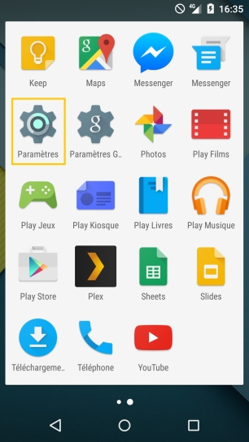
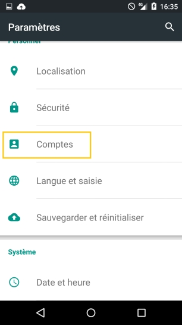
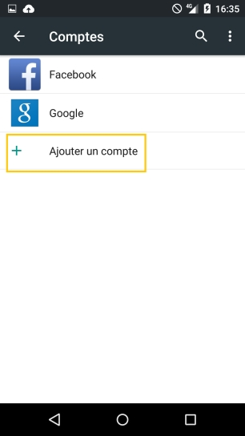
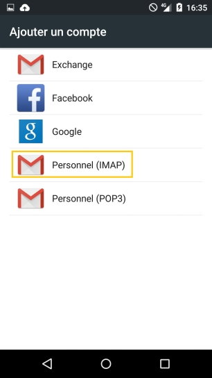
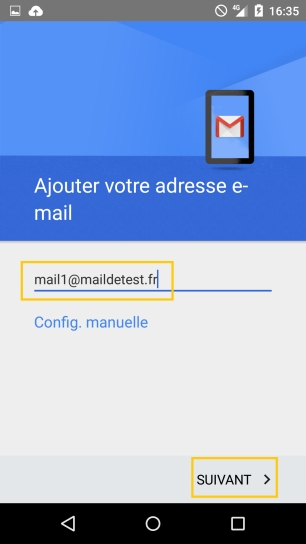
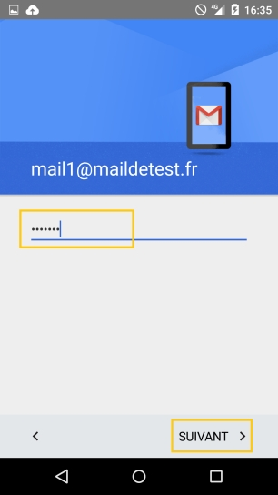
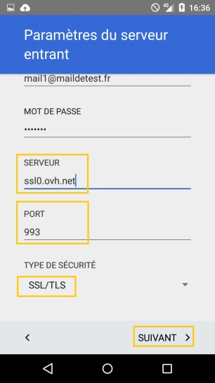
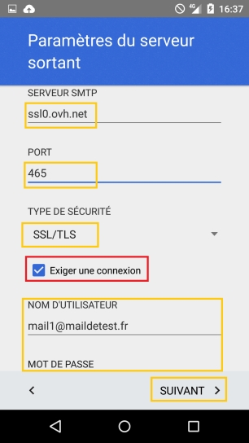
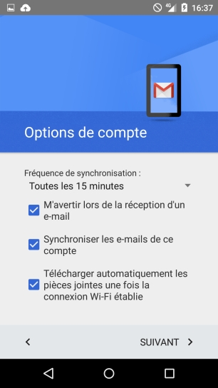
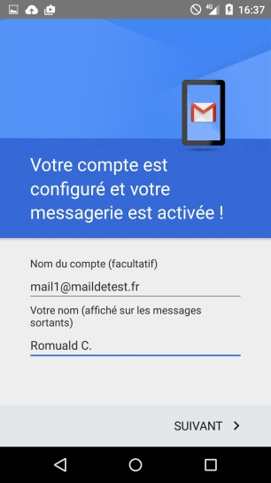

## 1. Parámetros del teléfono
Acceda al menú de «Ajustes» de su smartphone.

{.thumbnail}

## 2. Gestión de cuentas
Acceda al submenú «Cuentas».

{.thumbnail}

## 3. Añadir una cuenta
Haga clic en «Añadir cuenta».

{.thumbnail}

## 4. Protocolo
Seleccione el protocolo «IMAP» para continuar. 

También puede seleccionar el protocolo «POP3». En ese caso, utilice la información de configuración que se incluye al final de la guía.

{.thumbnail}

## 5. Dirección de correo electrónico
Introduzca su dirección de correo electrónico y haga clic en el botón «Siguiente».

{.thumbnail}

## 6. Contraseña
Introduzca la información que se le solicita. 

A continuación, debe introducir su contraseña y hacer clic en «Siguiente».

{.thumbnail}

## 7. Configuración de la cuenta
Introduzca la información que se le solicita:

- Nombre de usuario: Su dirección de correo electrónico completa. 
- Contraseña: La contraseña que definió en el área de cliente. 
- Servidor:SSL0.OVH.NET
- Puerto:993
- Tipo de seguridad:SSL/TLS (aceptar todos los certificados). 

Para utilizar una configuración distinta, consulte la información que se incluye al final de esta guía sobre los distintos parámetros. 

Haga clic en «Siguiente» para continuar con la configuración.

{.thumbnail}

## 8. Configuración de la cuenta (2)
Introduzca la información que se le solicita:

- Servidor SMTP:SSL0.OVH.NET
- Puerto:465
- Tipo de seguridad:SSL/TLS (aceptar todos los certificados). 
- Solicitar inicio de sesión: Debe marcar esta opción. 
- Nombre de usuario: Su dirección de correo electrónico completa. 
- Contraseña: La contraseña que definió en el área de cliente. 

Para utilizar una configuración distinta, consulte la información que se incluye al final de esta guía sobre los distintos parámetros. 

Haga clic en «Siguiente» para continuar con la configuración.

La autenticación para el servidor saliente es un parámetro indispensable para que el envío de correos pueda funcionar en nuestros servidores SMTP.
Si la autenticación no está activa, puede abrirse un tíquet de incidencia Open SMTP, en el que se le informa de que la autenticación «POP before SMTP» no es compatible. En ese caso, deberá activar obligatoriamente la autenticación del servidor saliente para poder enviar mensajes de correo electrónico.

{.thumbnail}

## 9. Opción de cuenta
Podrá seleccionar la frecuencia con la que se sincronizará el correo electrónico o solicitar que se le notifique la llegada de un nuevo correo.

{.thumbnail}

## 10. Finalización
En esta última etapa se le solicitará el nombre de la cuenta que desea utilizar y el nombre que se mostrará en sus mensajes enviados.

{.thumbnail}

## Configuración POP
Para configurar una cuenta de correo POP, necesitará la información que se indica a continuación.

Configuración POP con la protección SSL activada o desactivada:

- Dirección de correo electrónico: Dirección de correo electrónico completa.
- Contraseña: La contraseña introducida en el [área de cliente](https://www.ovh.com/manager/) para la cuenta de correo.
- Nombre de usuario: Dirección de correo electrónico completa.
- Servidor de correo entrante: El servidor de recepción SSL0.OVH.NET.
- Puerto del servidor de correo entrante:995 o 110.
- Servidor de correo saliente: El servidor de envío SSL0.OVH.NET.
- Puerto del servidor de correo saliente:465 o 587.

Los puertos 110 y 587 corresponden a la protección SSL desactivada.
Los puertos 995 y 465 corresponden a la protección SSL activada.

|Puerto|SSLactivado|SSLdesactivado|
|Entrante|995|110|
|Saliente|465|587|

## Configuración IMAP
Para configurar una cuenta de correo IMAP, necesitará la información que se indica a continuación.

Configuración IMAP con la protección SSL activada o desactivada:

- Dirección de correo electrónico: Dirección de correo electrónico completa.
- Contraseña: La contraseña introducida en el [área de cliente](https://www.ovh.com/manager/) para la cuenta de correo.
- Nombre de usuario: Dirección de correo electrónico completa.
- Servidor de correo entrante: El servidor de recepción SSL0.OVH.NET.
- Puerto del servidor de correo entrante:993 o 143.
- Servidor de correo saliente: El servidor de envío SSL0.OVH.NET.
- Puerto del servidor de correo saliente:465 o 587.

Los puertos 143 y 587 corresponden a la protección SSL desactivada.
Los puertos 993 y 465 corresponden a la protección SSL activada.

|Puerto|SSLactivado|SSLdesactivado|
|Entrante|993|143|
|Saliente|465|587|

