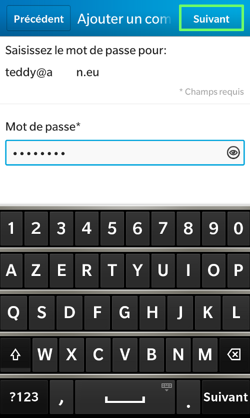
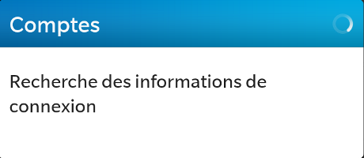
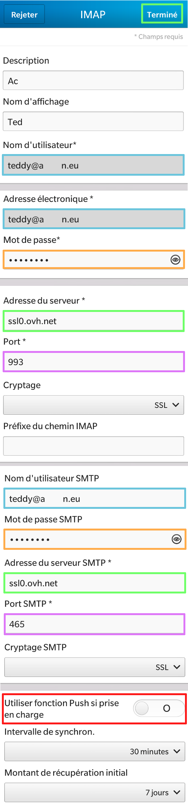
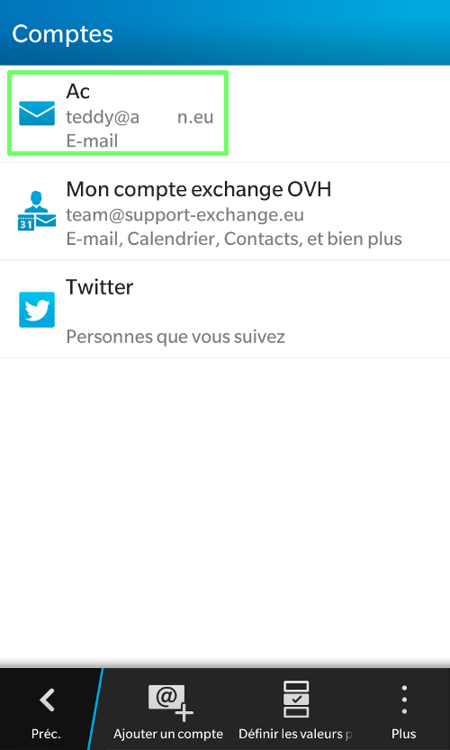
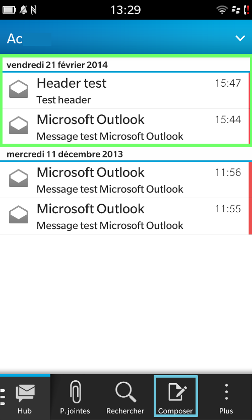

**Dernière mise à jour le 05/05/2020**

> [!warning]
>
> OVHcloud met à votre disposition des services dont la configuration, la gestion et la responsabilité vous incombent. Il vous revient de ce fait d'en assurer le bon fonctionnement.
> 
> Nous mettons à votre disposition ce guide afin de vous accompagner au mieux sur des tâches courantes. Néanmoins, nous vous recommandons de faire appel à un prestataire spécialisé et/ou de contacter l'éditeur du service si vous éprouvez des difficultés. En effet, nous ne serons pas en mesure de vous fournir une assistance. Plus d'informations dans la section « Aller plus loin » de ce guide.
> 

## Configuration du compte e-mail mutualise sous BlackBerry

### Parametres
Dans un premier temps, cliquez sur l'icône "Paramètres".

Dans notre exemple, un compte e-mail mutualisé est configuré en  **IMAP**  sur un BlackBerry Z10 avec l'OS en version 10.20.429.

Lors de l'ajout du compte, vérifiez que votre connexion 3G ou Wi-Fi est active.

{.thumbnail}

### Parametres systeme
Afin de continuer l'ajout du compte e-mail mutualisé, sélectionnez "Comptes".

{.thumbnail}

### Ajouter un compte
Sélectionnez maintenant "Ajouter un compte" afin d'ajouter un compte e-mail OVH mutualisé.

Remarquez que l'on trouve à ce niveau d'autres types de comptes préconfigurés.

{.thumbnail}

### Saisie du compte e-mail et du mot de passe
Renseignez votre adresse e-mail entière sans erreur.

Pour continuer le paramétrage cliquez sur "Suivant".

{.thumbnail}

Renseignez le mot de passe défini dans votre [Manager](https://www.ovh.com/auth/?action=gotomanager){.external} pour le compte mutualisé OVHcloud.

Cliquez sur "Suivant" pour valider le mot de passe.

{.thumbnail}

L'application va rechercher les informations de connexion. Il suffit de patienter pour accéder à l'étape suivante.

{.thumbnail}

### Parametres du compte e-mail
Renseignez les informations demandées :

Description : *correspond au nom d'affichage du compte dans le téléphone.*

Nom d'affichage : *le nom d'affichage utilisé pour envoyer les messages.*

Nom d'utilisateur : *votre adresse e-mail entière.*

Adresse électronique : *votre adresse e-mail entière.*

Mot de passe : *le mot de passe défini dans votre* [Manager](https://www.ovh.com/auth/?action=gotomanager){.external} *pour le compte mutualisé OVHcloud.*

Adresse du serveur : **SSL0.OVH.NET**

Port :  **993**

Cryptage : *SSL*

Préfixe du chemin IMAP : *laissez le champ vide*

Nom d'utilisateur SMTP : *votre adresse e-mail entière.*

Mot de passe SMTP : *le mot de passe défini dans votre* [Manager](https://www.ovh.com/auth/?action=gotomanager){.external} *pour le compte mutualisé OVHcloud.*

Adresse du serveur SMTP : **SSL0.OVH.NET**

Port SMTP :  **465**

Cryptage SMTP : *SSL*

Utiliser fonction Push si prise en charge : *à désactiver, le push n'étant pas disponible sur les offres mails mutualisés.*

Intervalle de synchronisation : *vous permet de définir le temps entre deux synchronisations d'e-mail par le téléphone.*

Montant de récupération initial : *il s'agit du nombre de messages initialement synchronisés avec votre téléphone.*

Pour valider les informations cliquez sur "Terminé".

{.thumbnail}

L'application va enregistrer et vérifier vos paramètres. Il suffit de patienter pour accéder à l'étape suivante.

{.thumbnail}

> [!success]
>
> - 
> L'Authentification avec votre nom d'utilisateur et votre mot de passe
> pour le serveur SMTP est un paramétrage indispensable afin que
> l'émission d'email puisse fonctionner sur nos serveurs SMTP.
> - 
> Si l'authentification n'est pas activée, un ticket incident Open SMTP
> peut être ouvert vous informant que l'authentification "POP before
> SMTP" n'est pas supportée. Vous devrez impérativement activer
> l'authentification du serveur SMTP afin de pouvoir émettre des
> emails.
> 
> 

### Finalisation
Votre compte est à présent correctement configuré dans votre téléphone !

Vous pouvez l'éditer en le sélectionnant depuis ce menu (cf capture ci- contre).

{.thumbnail}

Vous devez accéder à "Hub" pour visualiser vos e-mails.

{.thumbnail}

## Rappel des parametres POP - IMAP

### Configuration POP
Voici les informations à retenir pour la configuration d'un compte e-mail **POP** .

Configuration  **POP**  avec sécurisation SSL activée ou désactivée :

Adresse Email : Votre adresse e-mail mutualisée entière. Mot de passe : Le mot de passe que vous avez défini dans [l'espace client](https://www.ovh.com/auth/?action=gotomanager){.external}. Nom d'utilisateur : Votre adresse e-mail mutualisée entière. Serveur entrant : Le serveur de réception des e-mails :  **SSL0.OVH.NET** Port serveur entrant : Le port du serveur entrant :  **995**  ou  **110** Serveur sortant : Le serveur d'envoi des e-mails :  **SSL0.OVH.NET** Port serveur sortant : Le port du serveur sortant :  **465**  ou  **587**

Les ports  **110**  et  **587**  correspondent à la sécurisation SSL désactivée. Les ports  **995**  et  **465**  correspondent à la sécurisation SSL activée.

- Vous devez obligatoirement activer [l'authentification](#configuration_du_compte_e-mail_mutualise_sous_blackberry_partie_5_parametres_du_compte_e-mail){.external} du serveur sortant SMTP.

|Ports|SSL activé|SSL désactivé|
|---|---|---|
|Entrant|995|110|
|Sortant|465|587|

### Configuration IMAP
Voici les informations à retenir pour la configuration d'un compte e-mail **IMAP** .

Configuration  **IMAP**  avec sécurisation SSL activée ou désactivée :

Adresse Email : Votre adresse e-mail mutualisée entière. Mot de passe : Le mot de passe que vous avez défini dans [l'espace client](https://www.ovh.com/auth/?action=gotomanager){.external}. Nom d'utilisateur : Votre adresse e-mail mutualisée entière. Serveur entrant : Le serveur de réception des e-mails :  **SSL0.OVH.NET** Port serveur entrant : Le port du serveur entrant :  **993**  ou  **143** Serveur sortant : Le serveur d'envoi des e-mails :  **SSL0.OVH.NET** Port serveur sortant : Le port du serveur sortant :  **465**  ou  **587**

Les ports  **143**  et  **587**  correspondent à la sécurisation SSL désactivée. Les ports  **993**  et  **465**  correspondent à la sécurisation SSL activée.

- Vous devez obligatoirement activer [l'authentification](#configuration_du_compte_e-mail_mutualise_sous_blackberry_partie_5_parametres_du_compte_e-mail){.external} du serveur sortant SMTP.

|Ports|SSL activé|SSL désactivé|
|---|---|---|
|Entrant|993|143|
|Sortant|465|587|

## Aller plus loin

Échangez avec notre communauté d'utilisateurs sur <https://community.ovh.com>.
