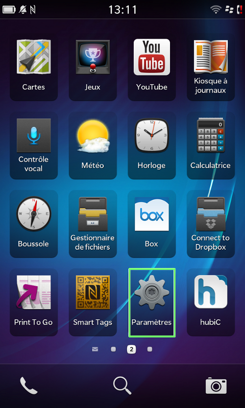
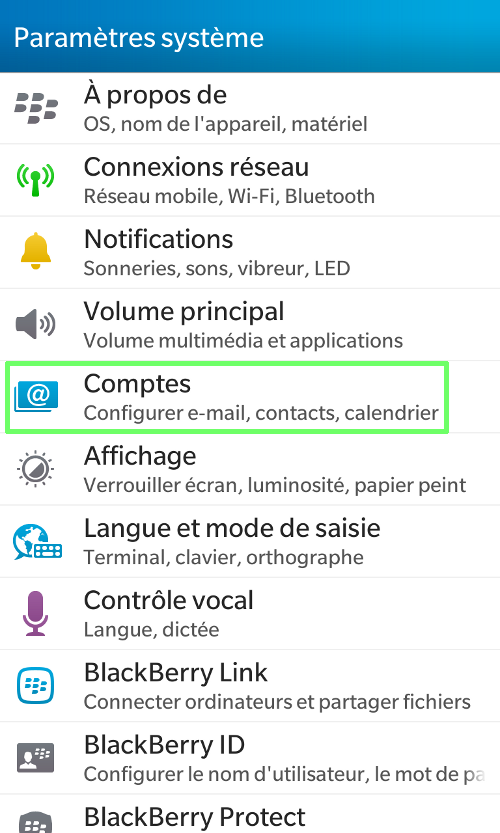
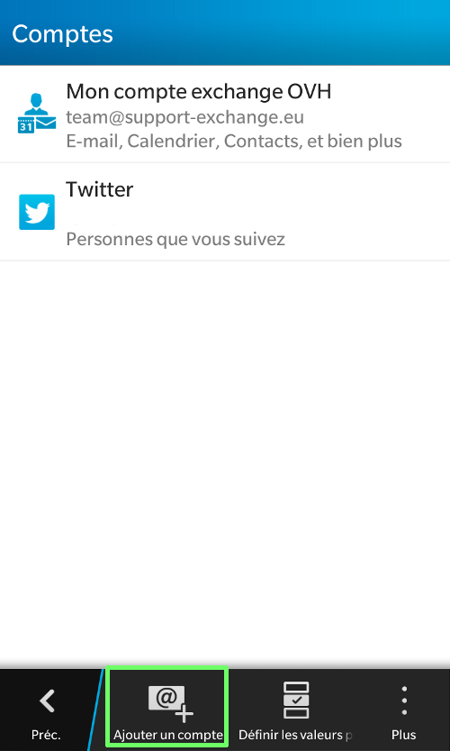
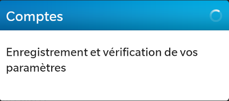

## Część 1: Ustawienia
Najpierw kliknij na ikonę "Ustawienia".

W naszym przykładzie konto e-mail jest konfigurowane w trybie IMAP na telefonie BlackBerry Z10 z systemem operacyjnym w wersji 10.20.429.

Sprawdź, czy łącze 3G lub Wi-Fi jest aktywne.

{.thumbnail}

## Część 2: Ustawienia systemu
Wybierz "Konta".

{.thumbnail}

## Część 3: Dodanie konta
Wybierz "Dodaj konto".

Na tym etapie widać inne rodzaje kont.

{.thumbnail}

## Część 4: Wpisywania konta e-mail i hasła
Wpisz pełny adres e-mail.

Następnie kliknij na "Dalej".

{.thumbnail}
Wpisz hasło zdefiniowane dla konta e-mail w panelu [Manager](https://www.ovh.pl/managerv3/).

Kliknij na "Dalej", aby zatwierdzić hasło.

{.thumbnail}
Aplikacja sprawdzi informacje dotyczące logowania. Następnie pojawi się kolejny etap.

{.thumbnail}

## Część 5: Parametry konta e-mail
Wpisz wymagane informacje:

Opis: odnosi się do wyświetlanej w telefonie nazwy konta.

Wyświetlana nazwa: nazwa wyświetlana podczas wysyłania wiadomości

Nazwa użytkownika: pełny adres e-mail

Adres pocztowy: pełny adres e-mail

Hasło: hasło zdefiniowane w panelu klienta OVH

Adres serwera: SSL0.OVH.NET

Port: 993

Szyfrowanie: SSL

Prefiks ścieżki IMAP: pozostaw to pole puste

Nazwa użytkownika SMTP: pełny adres e-mail

Hasło SMTP: hasło zdefiniowane w panelu klienta OVH

Adres serwera SMTP: SSL0.OVH.NET

Port SMTP: 465

Szyfrowanie SMTP: SSL

Używaj funkcji Push: należy wyłączyć; funkcja push nie jest dostępna w ofercie hostingu e-maili OVH.

Odstęp między synchronizacjami: pozwala na zdefiniowanie czasu między dwiema synchronizacjami e-mail na telefonie.

Kliknij na "Zakończone".

{.thumbnail}
Aplikacja zarejestruje i sprawdzi parametry. Następnie przejdzie do kolejnego etapu.

{.thumbnail}

- Uwierzytelnianie za pomocą nazwy użytkownika i hasła dla serwera poczty wychodzącej jest parametrem niezbędnym, aby wysyłka e-maili mogła działać na naszych serwerach SMTP. 

- Jeśli uwierzytelnianie nie jest włączone, może zostać otwarte zgłoszenie Open SMTP informujące, że uwierzytelnianie "POP before SMTP" nie jest obsługiwane. Należy obowiązkowo włączyć uwierzytelnienie serwera poczty wychodzącej, aby móc wysyłać e-maile.

## Zakończenie
Twoje konto zostało poprawnie skonfigurowane na telefonie!

Możesz je wybrać w menu.

{.thumbnail}

## Wyświetlanie e-maili
Należy wejść do sekcji "Hub", aby sprawdzić e-maile.

{.thumbnail}

## Konfiguracja POP
Poniżej znajdują się informacje dotyczące konfiguracji konta e-mail POP

Konfiguracja POP z włączonym lub wyłączonym szyfrowaniem SSL:

Adres e-mail: pełny adres e-mail
Hasło: hasło zdefiniowane w panelu [ Manager](https://www.ovh.pl/managerv3/).
Nazwa użytkownika: pełny adres e-mail
Serwer poczty przychodzącej:SSL0.OVH.NET
Port serwera poczty przychodzącej:995 lub 110
Serwer poczty wychodzącej: Serwer wysyłający e-maile: SSL0.OVH.NET
Port serwer poczty wychodzącej:465 lub 587

Porty 110 i 587 w przypadku wyłączonego szyfrowania SSL.
Porty 995 i 465w przypadku włączonego szyfrowania SSL.

- Należy obowiązkowo włączyć [uwierzytelnianie](#configuration_du_compte_e-mail_mutualise_sous_blackberry_partie_5_parametres_du_compte_e-mail) serwera SMTP.

|Porty|SSLwłączony|SSLwyłączony|
|Wchodzący|995|110|
|Wychodzący|465|587|

## Konfiguracja IMAP
Poniżej znajdują się informacje dotyczące konfiguracji konta e-mail IMAP

Konfiguracja IMAP z włączonym lub wyłączonym szyfrowaniem SSL:

Adres e-mail: pełny adres e-mail
Hasło: hasło zdefiniowane w panelu [ Manager](https://www.ovh.pl/managerv3/).
Nazwa użytkownika: pełny adres e-mail
Serwer poczty przychodzącej:SSL0.OVH.NET
Port serwera poczty przychodzącej:993 lub 143
Serwer poczty wychodzącej: Serwer wysyłający e-maile: SSL0.OVH.NET
Port serwera poczty wychodzącej:465 lub 587

Porty 143 i 587 w przypadku wyłączonego szyfrowania SSL.
Porty 993 i 465w przypadku włączonego szyfrowania SSL.

- Należy obowiązkowo włączyć [uwierzytelnianie](#configuration_du_compte_e-mail_mutualise_sous_blackberry_partie_5_parametres_du_compte_e-mail) serwera SMTP.

|Porty|SSLwłączony|SSLwyłączony|
|Wchodzący|993|143|
|Wychodzący|465|587|

