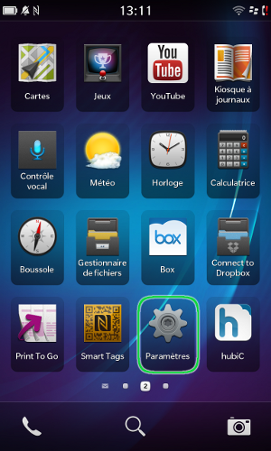
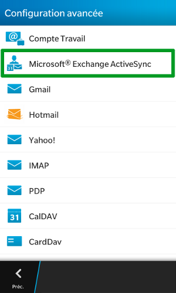
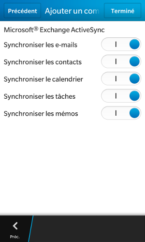

## Parte 1: parametri
Clicca su Parametri .

Nel nostro esempio l'account Exchange è un account di tipo Hosted, configurato su un Blackberry Z10 con OS 10.

Quando aggiungi un account, verifica che la tua connessione 3G o Wi-Fi sia attiva.

{.thumbnail}

## Parte 2: parametri di sistema
Nelle impostazioni di sistema, seleziona Account (Configura email, contatti, calendario).

{.thumbnail}

## Parte 3: aggiungi un account
A questo livello è possibile aggiungere vari tipi di account, seleziona "Aggiungi un account".

{.thumbnail}

## Parte 4: aggiunta avanzata
Seleziona Avanzata/green].

{.thumbnail}

## Parte 5: configurazione avanzata
Seleziona il tipo di account Microsoft Exchange ActiveSync.

{.thumbnail}

## Parte 6: parametri dell'account
Per gli ordini effettuati dal 26/04/2016, per il server Exchange per un'offerta Hosted è: ex2.mail.ovh.net.
Compila i campi che seguono 

Descrizione: inserisci una descrizione a tua scelta

Dominio: lascia vuoto questo campo

Nome utente: il tuo indirizzo Exchange completo, nel nostro esempio team@support-exchange.eu

Indirizzo di posta elettronica: il tuo indirizzo Exchange completo, nel nostro esempio team@support-exchange.eu

Password: "la password che hai scelto quando hai creato il tuo indirizzo Exchange"

Indirizzo del server: ex.mail.ovh.net

Attezione: per un server privato, inserisci il nome del tuo host.

Porta: "443"

Utilizza SSL: deve essere attivato

Utilizza una VPN: deve essere disattivato di default 

Scarica messaggi quando sei in viaggio: permette di scaricare i messaggio grazie a una connessione mobile quando ti trovi all'estero. Questa operazione può comportare costi aggiuntivi in base alla tariffa del tuo operatore.

Push: deve essere attivato

Clicca su "Avanti".

{.thumbnail}

## Parte 7: "Opzioni di sincronizzazione"
Scegli gli elementi che vuoi sincronizzare sul tuo BlackBerry. Di default viene sincronizzato tutto.

{.thumbnail}

## Parte 8: account configurato
Il tuo account è configurato, utilizza Blackberry Hub per accedere.

{.thumbnail}

