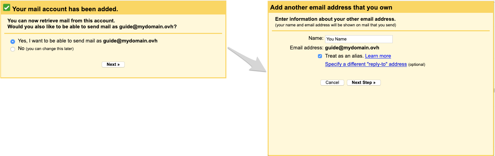
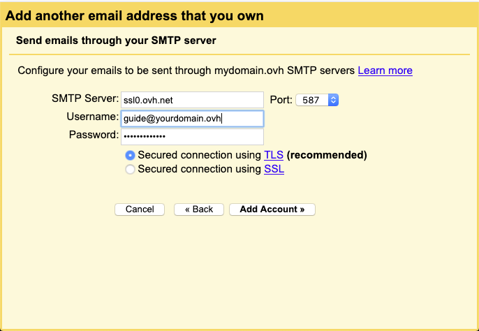
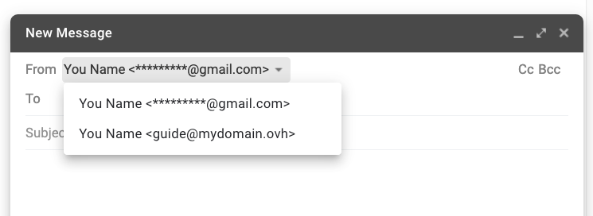

**Last updated 3rd September 2018**

## Objective

You can configure MX Plan email addresses on email clients and online interfaces, if they are compatible. This allows you to use your email address through your preferred device or online interface.

**Find out how to configure an MX Plan email address on the Gmail online interface.**

> [!warning]
>
> You are responsible for managing and configuring your OVH services and solutions, to ensure they work correctly. 
> 
> This guide is designed to assist you with common tasks. However, we recommend contacting a specialist provider and/or the service's software publisher for further assistance. We will not be able to provide direct assistance ourselves. You can find more information in the “Go further” section of this guide.
> 

## Requirements

- an MX Plan email address (included in the MX Plan solution and [OVH Web Hosting plans](https://www.ovh.co.uk/web-hosting/){.external})
- credentials for the OVH email address you want to configure
- credentials for the Gmail account you want to configure the OVH email address on

> [!primary]
>
> This guide has been written based on the new Gmail interface. Even if there are slight differences in the layout of your interface version, the instructions in this guide can still be followed.
>

## Instructions

### Step 1: Add the email account to the Gmail interface.

First of all, go to the Gmail online interface via your web browser. Then log in to your account using your Gmail credentials.

Once you have logged in to the interface, click on the cogwheel icon, then `Settings`{.action}. On the page that pops up, click on `Accounts and Import`{.action}.

{.thumbnail}

Next to `Check mail from other accounts`, click `Add a mail account`{.action}. In the window that pops up, enter your OVH email address, then click `Next`{.action}. Select `Import emails from my other account (POP3)`{.action}, then click again on `Next`{.action}.

{.thumbnail}

Now enter the settings for the POP server (incoming server) of your OVH email address:

|Information|Description| 
|---|---| 
|Username|Enter your **full** email address.|  
|Password|Enter the password for your email address.|
|POP server|Enter the server “ssl0.ovh.net”.|
|Port|Select port 995.|

Regarding the options you can select:

- **Leave a copy of retrieved message on the server.** We recommend ticking this box if you want to keep a copy of the messages received via your OVH email address on our servers.

- **Always use a secure connection (SSL) when retrieving mail.** Please ensure that you tick this box so that the connection to your OVH email address can be established.

- **Label incoming messages.** By ticking this box, you can add a label to the emails that will be imported from your OVH email address to your Gmail account.

- **Archive incoming messages (Skip the Inbox).** By ticking this box, you can ensure that emails imported from your OVH email address will not appear in the inbox for your Gmail account.

Once you have entered this information, click `Add Account`{.action}. If all the information is correct, the connection to the email address will be successful. 

{.thumbnail}

Next, if you would also like to send emails from your OVH email address using the Gmail online interface, tick the `Yes, I want to be able to send mail as [...]`{.action}, then click `Next`{.action}. 

Then enter the sender name that will display when you send emails from this email address, tick the `Treat as an alias`{.action} box, then click `Next Step`{.action}.

{.thumbnail}

Now enter the settings for the SMTP server (outgoing server) of your OVH email address:

|Information|Description| 
|---|---| 
|SMTP server|Enter the server “ssl0.ovh.net”.|
|Port|Select port 587.|
|Username|Enter your **full** email address.|  
|Password|Enter the password for your email address.|

Once you have filled in the information requested, tick the box next to `Secured connection using TLS`{.action}, then click `Add Account`{.action}. If all the information is correct, the connection to the email address will be successful. 

{.thumbnail}

At this stage, you simply need to confirm this addition by entering the confirmation code sent to your OVH email address. To receive it, log on to our online interface as usual, via: <https://www.ovh.co.uk/mail/>. 

Once you have pressed confirm, the OVH email address will then appear in the `Accounts and Import`{.action} tab, which you accessed to start with.

### Step 2: Use the email address from the Gmail interface.

Once you have configured your email address, you can start using it! You can now send and receive messages from this email address through the Gmail interface.

To send an email from your OVH email address via the Gmail online interface, you will need to select the email address to send from when you create a new email. You can do this in the `From`{.action} field of the email editing window.

{.thumbnail}

Please also note that you can still use our online interface, accessible via <https://www.ovh.co.uk/mail/>, to access your OVH email address. You just need to use your usual credentials to log in.

## Go further

Join our community of users on <https://community.ovh.com/en/>.