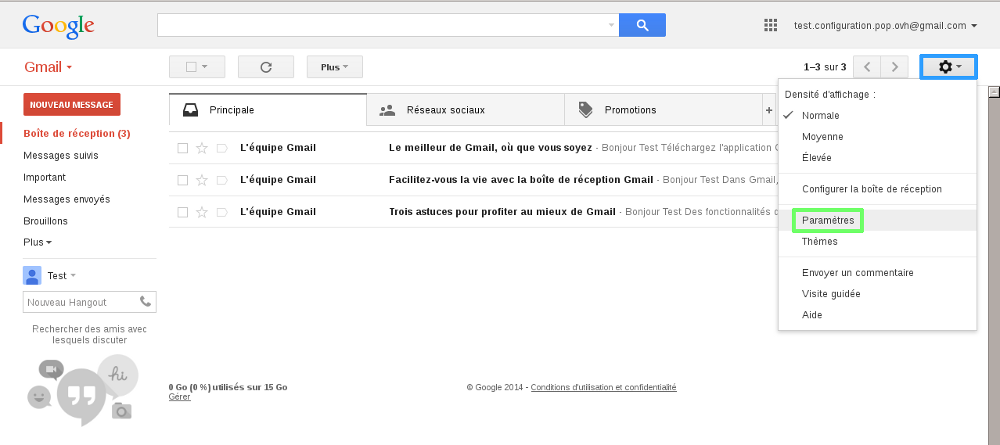
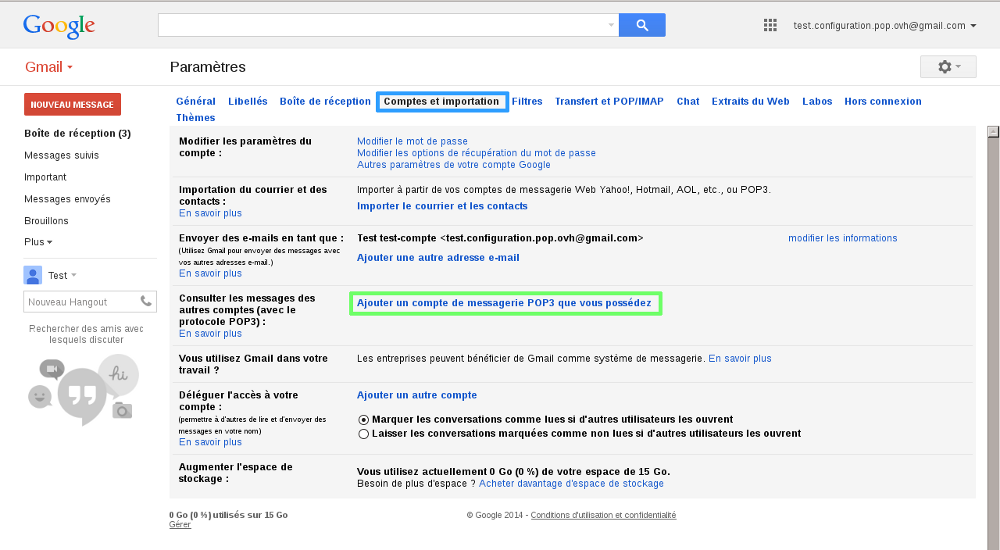
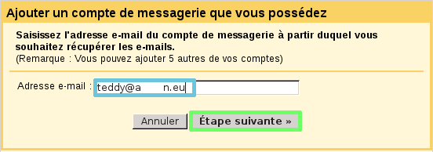
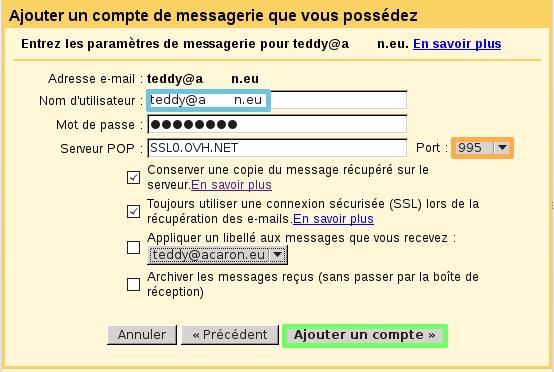
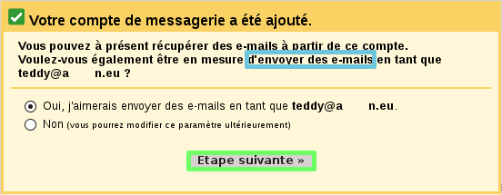
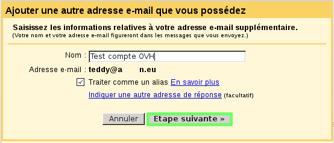
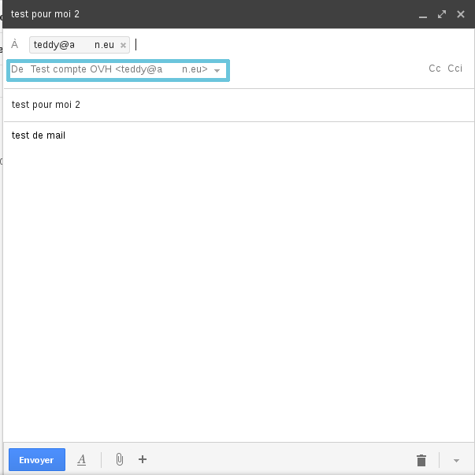

## OVH pašto pridėjimas

## Prieiga prie nustatymų
Prisijunkite prie Gmail.

Spragtelėkite nustatymų (krumpliaračio) piktogramą (žr. iliustraciją).

Po to spragtelėkite Nustatymai.

{.thumbnail}

## Paskyros ir importavimas
Matysite Paskyrų ir importavimo langą.

Spragtelėkite Pridėti turimą POP3 pašto paskyrą.

{.thumbnail}

## El. pašto adresas
Įveskite OVH el. pašto adresą, kurį norite įtraukti į Gmail paskyrą.

Po to spragtelėkite Toliau.

{.thumbnail}

## El. pašto paskyros nustatymai
Įveskite šią informaciją:

Naudotojo vardas: Visas el. pašto adresas.

Slaptažodis: Slaptažodis, kurį nurodėte kliento valdymo sąsajoje.

POP serveris: SSL0.OVH.NET

Prievadas: 995

Matysite ir kitus el. pašto paskyros pasirinkimus.

Pasirinkite norimas parinktis ir spragtelėkite Pridėti paskyrą.

{.thumbnail}

## El. pašto siuntimas
Rekomenduojame naudoti siuntimą per OVH paskyrą.

Šiame pavyzdyje rinksimės siuntimą per OVH paskyrą.

Spragtelėkite Toliau, kad pereitumėte prie kito žingsnio.

{.thumbnail}

## Paskyros pavadinimas
OVH el. pašto paskyrai galite suteikti norimą pavadinimą.

Įveskite norimą pavadinimą, po to spragtelėkite Toliau.

{.thumbnail}

## SMTP serverio konfigūravimas
Pridėtam el. paštui galite keisti SMTP nustatymus.

Tai padarysite pasirinkę Siųsti per SMTP serverius.

Reikės nurodyti šią informaciją.

SMTP serveris: SSL0.OVH.NET
Prievadas: 465
Vartotojo vardas: Visas el. pašto adresas
Slaptažodis: Slaptažodis, kurį nurodėte kliento sąsajoje.

Taip pat pažymėkite Naudoti saugų SSL ryšį.

Spragtelėkite Pridėti paskyrą, kad užbaigtumėte operaciją.

{.thumbnail}

## Baigimas
Šiame paskutiniame Étape reikės patvirtinti, kad adresas priklauso jums ir turite teisę jį įtraukti į Gmail sąsają.

Tai atliksite:

- Arba spragtelėję nuorodą, kurią rasite informaciniame el. laiške apie OVH el. pašto paskyros pridėjimą;

- Arba Gmail formoje įveskite kodą, kurį rasite informaciniame el. laiške apie OVH el. pašto paskyros pridėjimą.

Paskyros pridėjimą užbaigsite spragtelėję Patvirtinti.

Paskyros konfigūravimas Gmail sąsajoje baigtas!

{.thumbnail}

## Siuntėjo keitimas Gmail sąsajoje
Gmail sąsajoje galite keisti siuntėjo informaciją.

Jeigu paskyrą pridėjote pagal šį gidą, vadinasi, naudojate OVH SMTP serverius.

Todėl siuntimo metu galite keisti laukelio Nuo informaciją ir taip siųsti el. laiškus naudojant OVH el. pašto paskyros adresą.

{.thumbnail}

## POP konfigūravimas
Čia pateikiama informacija, kuria reikėtų vadovautis konfigūruojant POP paskyrą.

POP konfigūravimas su įjungta ar išjungta SSL apsauga:

Email Address: Jūsų el. pašto adresas
Password: Slaptažodis, kurį nurodėte [valdymo sąsajoje](https://www.ovh.com/manager/web/login/) kurdami paskyrą.
Username: Visas el. pašto adresas
Incoming server: Gaunamų el. laiškų serveris: SSL0.OVH.NET
Incoming Server Port:995 arba 110
Outgoing server: Siunčiamų el. laiškų serveris: SSL0.OVH.NET
Outgoing Server Port:465 arba 587

Prievadai 110 ir 587 atitinka išjungtą SSL apsaugą.
Prievadai 995 ir 465 atitinka įjungtą SSL apsaugą.- 

- Privaloma įjungti [išeinančio serverio (SMTP) ](#configuration_protocole_imap_partie_6_parametres_avances).

|Prievadai|SSLįjungta|SSLišjungta|
|Įeinantis|995|110|
|Išeinantis|465|587|

## IMAP konfigūravimas
Čia pateikiama informacija, kuria reikėtų vadovautis konfigūruojant IMAP paskyrą.

POP konfigūravimas su įjungta ar išjungta SSL apsauga:

Email Address: Jūsų el. pašto adresas
Password: Slaptažodis, kurį nurodėte [valdymo sąsajoje](https://www.ovh.com/manager/web/login/) kurdami paskyrą.
Username: Visas el. pašto adresas
Incoming server: Gaunamų el. laiškų serveris: SSL0.OVH.NET
Incoming Server Port:993 arba 143
Outgoing server: Siunčiamų el. laiškų serveris: SSL0.OVH.NET
Outgoing Server Port:465 arba 587

Prievadai 143 ir 587 atitinka išjungtą SSL apsaugą.
Prievadai 993 ir 465 atitinka įjungtą SSL apsaugą.

- Privaloma įjungti [išeinančio serverio (SMTP) ](#configuration_protocole_imap_partie_6_parametres_avances).

|Prievadai|SSLįjungta|SSLišjungta|
|Įeinantis|995|110|
|Išeinantis|465|587|

