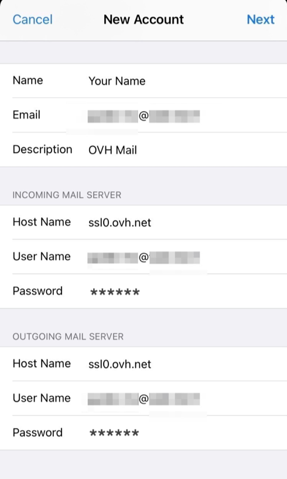

**Dernière mise à jour le 21/05/2021**

## Objectif

Les adresses e-mail de l'offre MX Plan peuvent être configurées sur un logiciel ou une application de messagerie compatibles. Cela vous permet d'envoyer et de recevoir vos messages depuis l'appareil de votre choix.

**Découvrez comment configurer une adresse e-mail MX Plan sur un iPhone ou un iPad, via l'application Mail.**

> [!warning]
>
> OVHcloud met à votre disposition des services dont la configuration, la gestion et la responsabilité vous incombent. Il vous revient de ce fait d'en assurer le bon fonctionnement.
>
> Nous mettons ce guide à votre disposition afin de vous accompagner au mieux sur des tâches courantes. Néanmoins, nous vous recommandons de faire appel à un [prestataire spécialisé](https://partner.ovhcloud.com/fr/) et/ou de contacter l'éditeur du service si vous éprouvez des difficultés. En effet, nous ne serons pas en mesure de vous fournir une assistance. Plus d'informations dans la section « Aller plus loin » de ce guide.
>

## Prérequis

- Disposer d’une adresse e-mail MX Plan (comprise dans l’offre MX Plan ou dans une offre d’[hébergement web OVHcloud](https://www.ovhcloud.com/fr/web-hosting/){.external}.
- Disposer de l'application Mail installée sur votre appareil iOS.
- Disposer des identifiants relatifs à l'adresse e-mail que vous souhaitez paramétrer.

## En pratique

### Ajouter le compte

Sur l'écran d'accueil de votre appareil, rendez-vous sur `Réglages`{.action} (icône de roue crantée). L'ajout d'un compte s'effectue de différentes manières selon votre version d'iOS :

- **Pour iOS 7, 8, 9 et 10** : appuyez sur `Mail, Contacts, Calendrier`{.action}, puis sur `Ajouter un compte`{.action}. Choisissez finalement `Autre`{.action}, puis `Ajouter un compte Mail`{.action}. Passez ensuite à l'étape 5 du tableau suivant.

- **Pour iOS 11** : appuyez sur `Comptes et mots de passe`{.action}, puis sur `Ajouter un compte`{.action}. Choisissez finalement `Autre`{.action}, puis `Ajouter un compte Mail`{.action}. Passez ensuite à l'étape 5 du tableau suivant.

- **Pour les versions actuelles** : suivez les instructions du tableau suivant.

| | |
|---|---|
|{.thumbnail}|1. Dans  `Réglages`, allez sur `Mail`.    2. Appuyez sur `Comptes`.   3. Appuyez sur `Ajouter un compte`.   4. Choisissez `Autre` tout en bas.|
|5. Appuyez sur `Ajouter un compte Mail`.  6. Saisissez votre **nom**, votre adresse **e-mail**, votre **mot de passe** et une **description** de votre compte.  7. Appuyez sur `Suivant`.|{.thumbnail}|
|{.thumbnail}|8. Sélectionnez le type de serveur de réception `IMAP`(recommandé) ou `POP`.  Dans les sections `SERVEUR DE RECEPTION`et `SERVEUR DE D'ENVOI`, malgré la mention « facultatif », saisissez:  - le nom d'hôte **ssl0.ovh.net**  - votre **adresse e-mail complète** dans nom d'utilisateur  - le mot de passe de votre adresse e-mail|

En fin de configuration, assurez-vous de bien laisser `Mail`{.action} coché afin que l'application puisse utiliser ce compte, puis cliquez sur `Sauvegarder`{.action}.

Vous pouvez effectuer un test d’envoi depuis l’application Mail de votre appareil pour vérifier que le compte est correctement paramétré.

Si vous êtes amené à renseigner manuellement des champs techniques dans les préférences du compte, vous trouverez ci-dessous les paramètres à utiliser avec notre offre MX Plan :

- **pour une configuration en IMAP**

|Type de serveur|Nom du serveur|SSL|Port|
|---|---|---|---|
|Entrant|ssl0.ovh.net|Oui|993|
|Sortant|ssl0.ovh.net|Oui|465|

- **pour une configuration en POP**

|Type de serveur|Nom du serveur|SSL|Port|
|---|---|---|---|
|Entrant|ssl0.ovh.net|Oui|995|
|Sortant|ssl0.ovh.net|Oui|465|

### Utiliser l'adresse e-mail

Une fois l'adresse e-mail configurée, il ne reste plus qu’à l'utiliser ! Vous pouvez dès à présent envoyer et recevoir des messages.

OVHcloud propose une application web permettant d'accéder à votre adresse e-mail depuis votre navigateur internet à l’adresse <https://www.ovh.com/fr/mail/>. Vous pouvez vous y connecter grâce aux identifiants relatifs à votre adresse e-mail.

> [!primary]
>
> En cas de difficulté de réception ou d'envoi d'e-mails, consultez notre [FAQ sur les services e-mail OVHcloud](https://docs.ovh.com/fr/emails/faq-emails/).
>

## Aller plus loin

[Configurer son compte Exchange sur un iPhone ou un iPad](https://docs.ovh.com/fr/microsoft-collaborative-solutions/exchange-configuration-automatique-sous-ios-iphone-ipad/){.external}.

[Configurer son compte E-mail Pro sur un iPhone ou un iPad](https://docs.ovh.com/fr/emails-pro/configuration-iphone/){.external}.

[FAQ e-mails](https://docs.ovh.com/fr/emails/faq-emails/)

Échangez avec notre communauté d'utilisateurs sur <https://community.ovh.com>.
