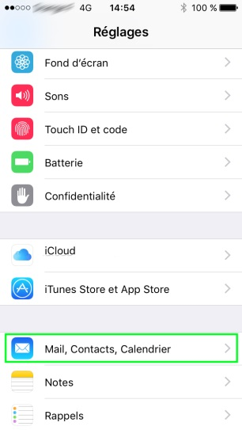
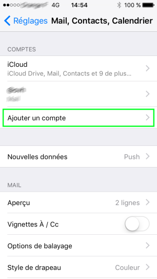
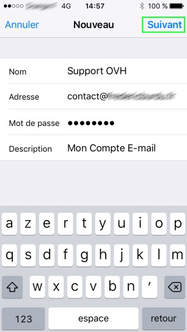

## Pré-requisitos

- Dispor de um endereço e-mail partilhado OVH funcional
- Dispor de um iPhone com o ISO 3

## A sua conta de e-mail OVH no seu iPhone com 1 clique
É muito simples.

A partir do seu iPhone aceda ao seguinte link: [https://ssl0.ovh.net/roundcube/auto/](https://ssl0.ovh.net/roundcube/auto/).
Introduza o seu endereço de e-mail OVH, clique em "Gerar", e siga as etapas.

Estas etapas irão gerar um perfil no seu iPhone para que possa utilizar a sua conta de e-mail normalmente.

## vídeo de configurar iPhone ISO 6 em Imap

## Parte 1: Definições
Abras as definições do iPhone

{.thumbnail}

## Parte 2: Mail, Contactos, Calendário
Aceda a "Mail, Contactos, Calendário".

{.thumbnail}

## Parte 3: Adicionar uma conta de e-mail
Selecione "Adicionar uma conta"

{.thumbnail}

## Parte 4: Tipo de conta de e-mail
Escolha de seguida "Outro" e depois em "Adicionar um conta Mail".

{.thumbnail}

## Parte 5: Parâmetros da conta de e-mail
Ser-lhe-á solicitado o seu nome, endereço de e-mail e password.

A descrição completa-se automaticamente.

Clique em "Seguinte" após terminar.

{.thumbnail}

## Parte 7: Parâmetros dos servidores de receção e envio

- Tipo de conta:
IMAP / POP: escolha do tipo de conta desejada

{.thumbnail}

- Em "Servidor de receção":

Nome do host: SSL0.OVH.NET
Nome do utilizador: o seu endereço de e-mail
Password: o seu endereço de e-mail

Desça para os parâmetros do iPhone.

- No "Servidor de envio":

Nome do host: SSL0.OVH.NET
Nome do utilizador: o seu endereço de e-mail
Password: o seu endereço de e-mail

Clique em "Seguinte"" após terminar.

{.thumbnail}

- A autenticação com o seu nome de utilizador e a sua password para o servidor de envio é um parâmetro indispensável para que o envio de e-mails possa funcionar com os nossos servidores SMTP.

## Parte 9: Configuração da conta de e-mail
Termine a configuração da conta de e-mail ao selecionar as sincronizações desejadas.

Clique em "Registar" para terminar a adição da conta.

{.thumbnail}

## Configuração POP
Deixamos a informação a reter para a configuração de uma conta e-mail POP.

Configuração POP com a segurança SSL ativada ou desativada :

Endereço de e-mail: O seu endereço de e-mail na íntegra.
Password: A password definida no seu [Espace Cliente](https://www.ovh.com/manager/web/login/).
Nome do utilizador: O seu endereço de e-mail na íntegra.
Servidor de receção: O servidor de receção dos e-mails: SSL0.OVH.NET
Porta do servidor de receção: A porta do servidor de receção: 995 ou 110
Servidor de envio: O servidor de envio dos e-mails: SSL0.OVH.NET
Porta do servidor de envio: A porta do servidor de envio: 465 ou 587

As portas 110 e 587 correspondem à segurança SSL desativada.
As portas 995 e 465 correspondem à segurança SSL ativada.

|Portas|SSLativado|SSLdesativado|
|Receção|995|110|
|Envio|465|587|

## Configuração IMAP
Deixamos a informação a reter para a configuração de uma conta e-mail IMAP.

Configuração POP com a segurança SSL ativada ou desativada :

Endereço de e-mail: O seu endereço de e-mail na íntegra.
Password: A password definida no seu [Espace Cliente](https://www.ovh.com/manager/web/login/).
Nome do utilizador: O seu endereço de e-mail na íntegra.
Servidor de receção: O servidor de receção dos e-mails: SSL0.OVH.NET
Porta do servidor de receção: A porta do servidor de receção: 993 ou 143
Servidor de envio: O servidor de envio dos e-mails: SSL0.OVH.NET
Porta do servidor de envio: A porta do servidor de envio: 465 ou 587

As portas 110 e 587 correspondem à segurança SSL desativada.
As portas 995 e 465 correspondem à segurança SSL ativada.

|Portas|SSLativado|SSLdesativado|
|Receção|993|143|
|Envio|465|587|

