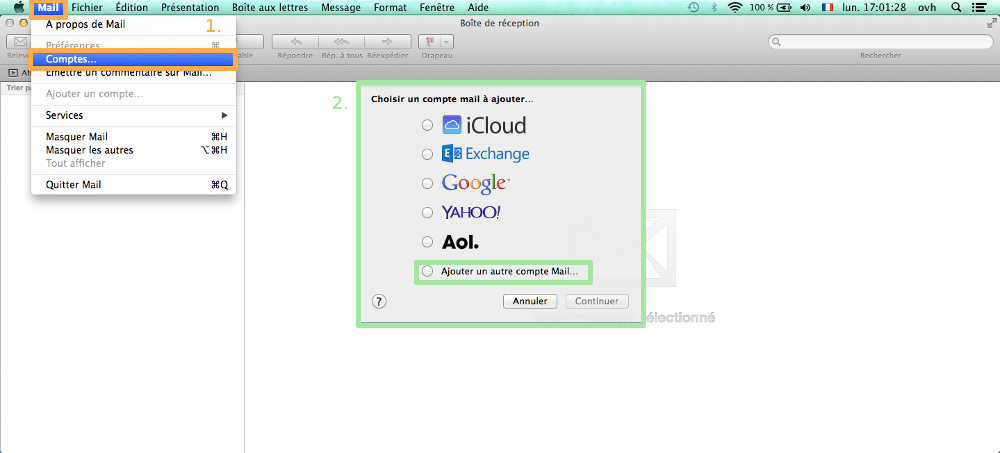
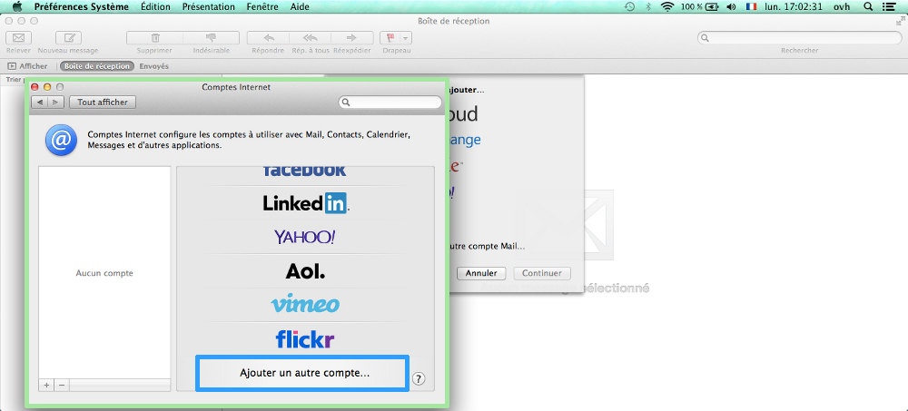
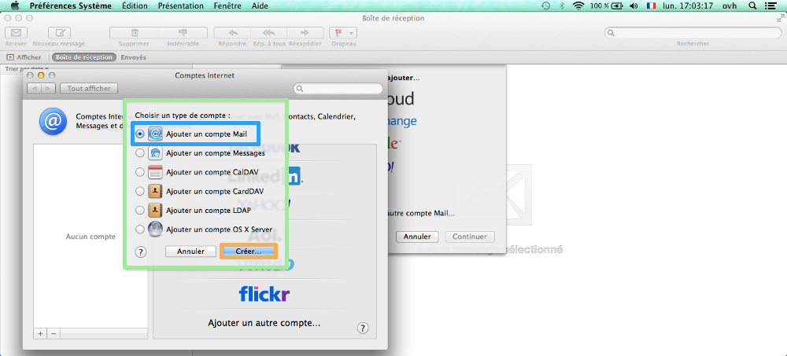
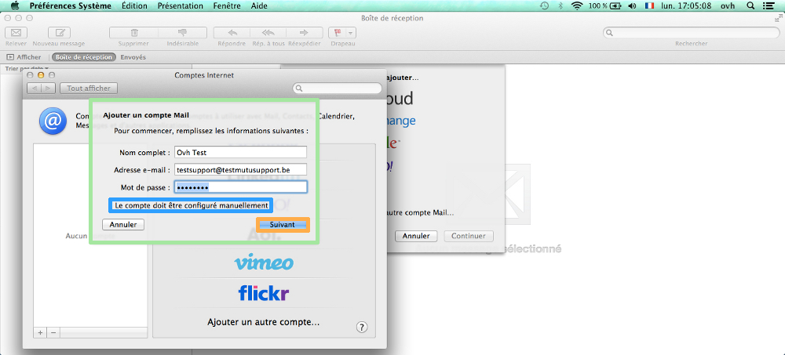
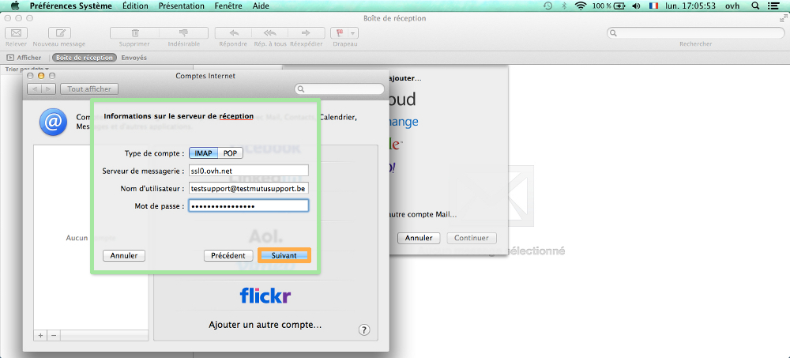
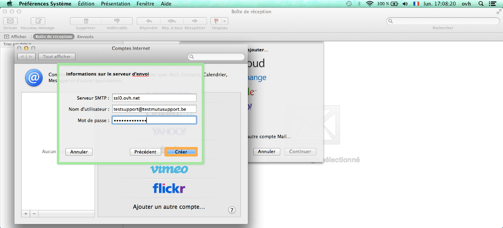
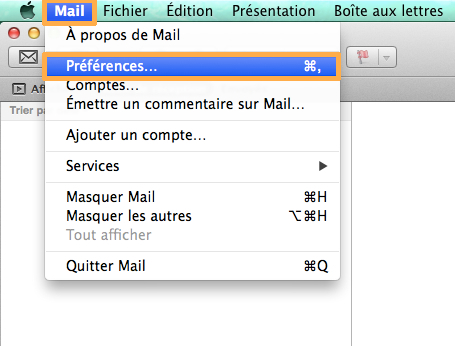
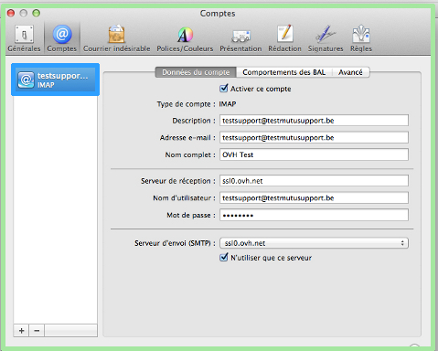
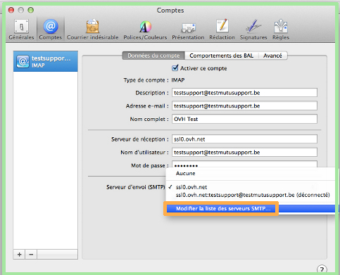
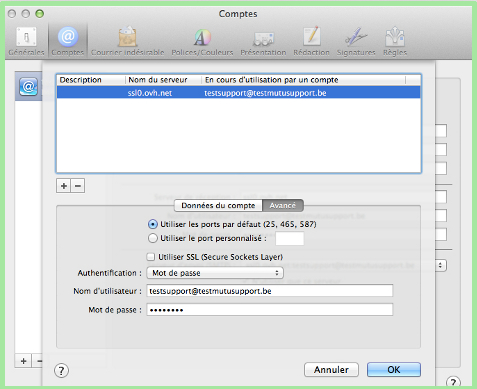

## Su cuenta de correo OVH en Mac en 1 clic
Es la opción más sencilla para utilizar una cuenta de correo OVH en Mac. 

Acceda desde Mac al siguiente enlace: 
[https://ssl0.ovh.net/roundcube/auto/](https://ssl0.ovh.net/roundcube/auto/).

Introduzca su dirección de correo OVH, haga clic en «Generer» y siga los pasos que se le indican. 

Se añadirá el perfil a su Mac y podrá empezar a utilizarlo.

## 1. Inicio
Abra la aplicación Mail en su Mac.

A continuación, existen dos posibilidades:

- Si ya tiene direcciones de correo configuradas en Mail, haga clic en «Mail» > «Cuentas» (recuadro naranja de la imagen).

- Si todavía no ha configurado ninguna dirección de correo en Mail, seleccione «Añadir otra cuenta de correo...» (recuadro verde de la imagen) y haga clic en «Continuar».

{.thumbnail}

## 2. Añadir cuenta
A continuación, se mostrarán distintos clientes de correo. Seleccione «Añadir otra cuenta» al final de la lista.

{.thumbnail}

## 3. Seleccionar tipo de cuenta
A continuación podrá elegir el tipo de cuenta que desea. Seleccione «Añadir una cuenta de Mail» y haga clic en «Crear».

{.thumbnail}

## 4. Información de la cuenta
Para configurar la cuenta de correo, deberá introducir algunos datos: 

- Nombre: El nombre asociado a la dirección de correo.

- Dirección de correo: Dirección de correo electrónico completa.

- Contraseña: Contraseña de la cuenta de correo.

Haga clic en «Crear» para continuar.

Es posible que aparezca un mensaje indicándole que debe configurar manualmente la cuenta de correo.

Haga clic en «Continuar».

{.thumbnail}

## 5. Información del servidor de correo entrante
Introduzca los datos de su servidor de correo entrante:

- Tipo de cuenta: Seleccione la configuración de su cliente de correo: POP o IMAP.

- Servidor de correo: SSL0.OVH.NET.

- Nombre de usuario: Su dirección de correo electrónico completa.

- Contraseña: La contraseña de su cuenta de correo.

Haga clic en «Siguiente» para continuar.

{.thumbnail}

## 6. Información del servidor de correo saliente
Ahora introduzca los datos del servidor de correo saliente:

- Servidor SMTP: SSL0.OVH.NET.

- Nombre de usuario: Su dirección de correo electrónico completa.

- Contraseña: La contraseña de su cuenta de correo.

Haga clic en «Crear».

Su cuenta de correo ya estará operativa.

{.thumbnail}

## Cambiar la configuración SMTP
Para ver la configuración del servidor SMTP, haga clic en «Mail» y seleccione «Preferencias».

{.thumbnail}
Seleccione la cuenta de correo en la columna izquierda. 

Se mostrarán los siguientes datos:

- Tipo de cuenta: La opción asociada a la configuración de la cuenta de correo IMAP.

- Descripción: Nombre con el que se muestra en Mail la cuenta de correo.

- Dirección de correo: Dirección de correo electrónico completa.

- Nombre completo: El nombre asociado a la dirección de correo.

- Servidor de correo entrante: SSL0.OVH.NET.

- Nombre de usuario: Su dirección de correo electrónico completa.

- Contraseña: La contraseña de su cuenta de correo que haya indicado en el [área de cliente](https://www.ovh.com/auth/?action=gotomanager&from=https://www.ovh.es/&ovhSubsidiary=es)).

- Servidor de correo saliente (SMTP): El servidor de correo saliente que haya configurado en la cuenta.

{.thumbnail}
Para cambiar la configuración del servidor SMTP, haga clic en la flecha del desplegable, junto al nombre del servidor SMTP.

Se abrirá la lista de servidores (si hay otros servidores SMTP). 

Haga clic en «Editar lista de servidores SMTP».

{.thumbnail}

## Configuración SMTP

## Mavericks
Seleccione el servidor SMTP que quiera editar.

En «Información de cuenta» podrá ver la información relativa al servidor:

- Descripción: El nombre con el que quiere que aparezca el servidor SMTP.

- Nombre del servidor: SSL0.OVH.NET.

En «Avanzado»: 

- Usar puertos por omisión (25, 465, 587): Puede seleccionar esta opción para utilizar los puertos genéricos.

- Usar SSL (Secure Sockets Layer): Al configurarlo, introdujo SSL0.OVH.NET. Puede marcar o desmarcar esta opción para activar o desactivar respectivamente la seguridad SSL.

- Autenticación: Seleccione «Contraseña».

- Nombre de usuario: Su dirección de correo electrónico completa.

- Contraseña: La contraseña de su cuenta de correo que haya indicado en el [área de cliente](https://www.ovh.com/auth/?action=gotomanager&from=https://www.ovh.es/&ovhSubsidiary=es)).

{.thumbnail}

- La autenticación por contraseña es imprescindible para que el envío de correo funcione en nuestros servidores SMTP.

- Si no se realiza la autenticación por contraseña, puede abrirse un tíquet de incidencia Open SMTP para informarle de que la autenticación «POP before SMTP» no es compatible. Es necesario activar la autenticación por contraseña para poder enviar correo.

## Truco para Mail de Mac Yosemite
En un Mac con OS X Yosemite la interfaz puede ser algo distinta, aunque deberá introducir los mismos parámetros. 

Atención: Desmarque la opción «Permitir autenticación no segura».

{.thumbnail}

## Configuración POP
Para configurar una cuenta de correo POP, necesitará la información que se indica a continuación.

Configuración POP con la protección SSL activada o desactivada:

Dirección de correo: Dirección de correo electrónico completa.
Contraseña: La contraseña introducida en el [área de cliente](https://www.ovh.com/auth/?action=gotomanager&from=https://www.ovh.es/&ovhSubsidiary=es) para la cuenta de correo.
Nombre de usuario: Dirección de correo electrónico completa.
Servidor de correo entrante: El servidor de recepción SSL0.OVH.NET.
Puerto del servidor entrante:995 o 110.
Servidor de correo saliente: El servidor de envío SSL0.OVH.NET.
Puerto del servidor saliente:465 o 587.

Los puertos 110 y 587 corresponden a la protección SSL desactivada.
Los puertos 995 y 465 corresponden a la protección SSL activada.

Es imprescindible activar la [autenticación del servidor saliente SMTP](#configuracion_etapa_7_ajustes_avanzados_del_servidor_de_correo_saliente).

|Puerto|SSL activado|SSL desactivado|
|Entrante|995|110|
|Saliente|465|587|

## Configuración IMAP
Para configurar una cuenta de correo IMAP, necesitará la información que se indica a continuación.

Configuración IMAP con la protección SSL activada o desactivada:

Dirección de correo: Dirección de correo electrónico completa.
Contraseña: La contraseña introducida en el [área de cliente](https://www.ovh.com/auth/?action=gotomanager&from=https://www.ovh.es/&ovhSubsidiary=es) para la cuenta de correo.
Nombre de usuario: Dirección de correo electrónico completa.
Servidor de correo entrante: El servidor de recepción SSL0.OVH.NET.
Puerto del servidor entrante:993 o 143.
Servidor de correo saliente: El servidor de envío SSL0.OVH.NET.
Puerto del servidor saliente:465 o 587.

Los puertos 143 y 587 corresponden a la protección SSL desactivada.
Los puertos 993 y 465 corresponden a la protección SSL activada.

Es imprescindible activar la [autenticación del servidor saliente SMTP](#configuracion_etapa_7_ajustes_avanzados_del_servidor_de_correo_saliente).

|Puerto|SSL activado|SSL desactivado|
|Entrante|993|143|
|Saliente|465|587|

