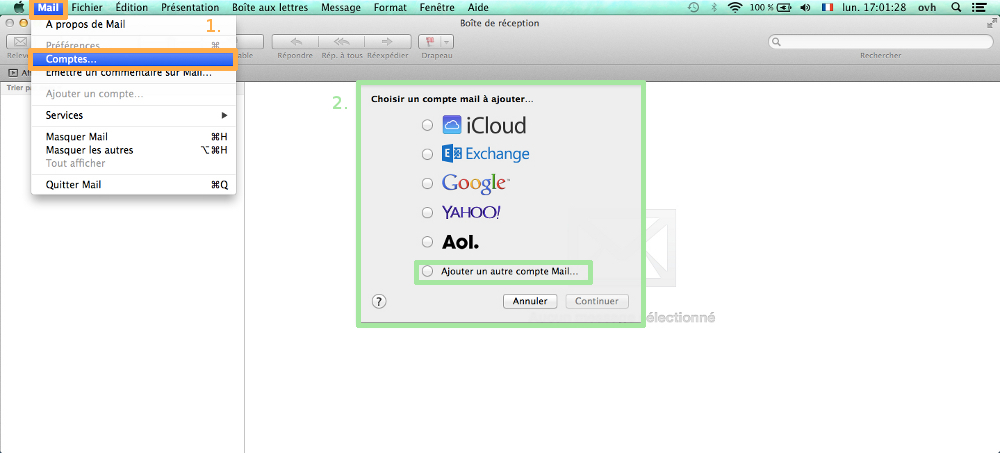
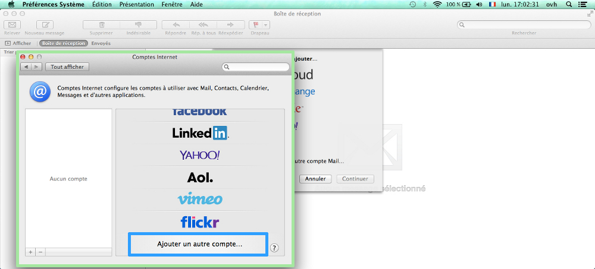
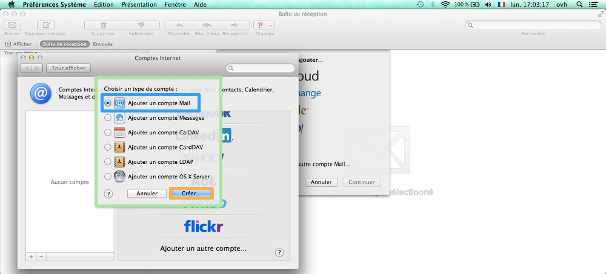
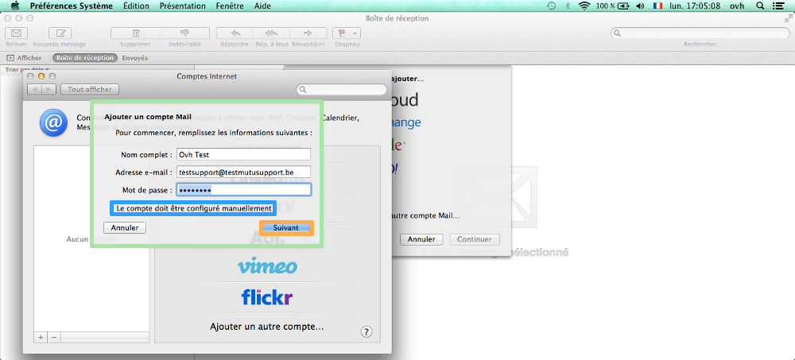
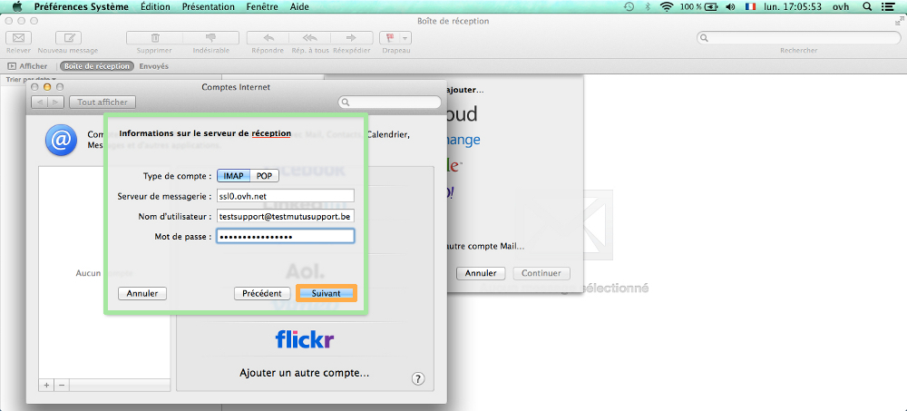
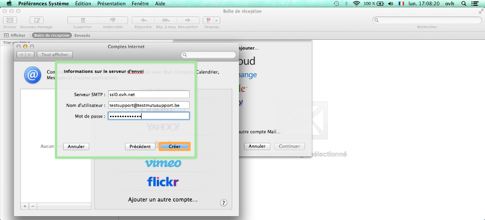
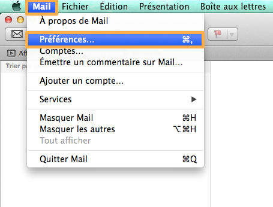
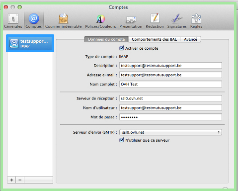
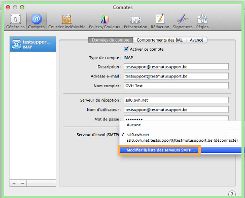
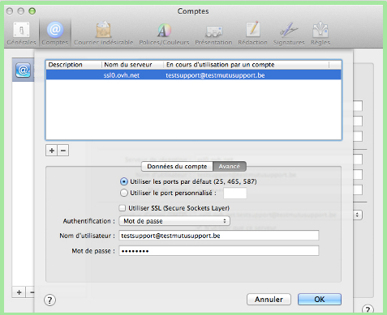

Configurer sa boîte e-mail sur son Mac est très simple, cependant, voici un tutoriel pour vous aider à le faire de plusieurs manières. [Cliquez ici](../) pour retrouver nos différents guides de configuration e-mail.

- Vous pouvez aussi vous référer à notre [guide iPhone sur iOS3]({legacy}1296){.ref}.
- Vous pouvez aussi vous référer à notre [guide dédié à l'iPad iOS 7]({legacy}1348){.ref}.

> [!warning]
>
> OVH met à votre disposition des services dont la configuration, la gestion et la responsabilité vous incombent. Il vous revient de ce fait d'en assurer le bon fonctionnement.
> 
> Nous mettons à votre disposition ce guide afin de vous accompagner au mieux sur des tâches courantes. Néanmoins, nous vous recommandons de faire appel à un prestataire spécialisé et/ou de contacter l'éditeur du service si vous éprouvez des difficultés. En effet, nous ne serons pas en mesure de vous fournir une assistance. Plus d'informations dans la section « Aller plus loin » de ce guide.
> 

## Configuration automatique

### Votre compte email OVH sur votre Mac en 1 clic
Rien de plus simple pour utiliser un compte email OVH sur Mac.

Depuis votre Mac, rendez-vous sur ce lien : [https://autodiscover.mail.ovh.net/AppleDevices/](https://autodiscover.mail.ovh.net/AppleDevices/){.external}. Entrez votre adresse email OVH, cliquez sur "Generer", puis suivez les quelques étapes.

Cela ajoute le profil sur votre Mac et vous pouvez commencer à en profiter.

## Configuration manuelle

### Demarrage
Ouvrez votre logiciel Mail de Mac. Deux possibilités s'offrent à vous :

- 1. Des e-mails sont déjà configurés sur Mail de Mac (encadré orange de l'image) :
- 2. Aucun e-mails n'est configurés sur Mail de Mac (encadré vert de l'image) :

{.thumbnail}

### Ajouter un compte
Différents choix de messagerie ou d'application font leur apparition.

- Sélectionnez " Ajouter un autre compte " en bas de la fenêtre de sélection.

{.thumbnail}

### Ajouter un compte
On vous demande ensuite de choisir le type de compte.

- Sélectionnez " Ajouter un compte Mail ".

{.thumbnail}

### Informations du compte
Afin de configurer votre compte e-mail, il vous est demandé de remplir certaines informations :

- Nom complet : Le nom d'affichage souhaitée de l'e-mail dans Mail de Mac.
- Adresse e-mail : Votre adresse e-mail entière.
- Mot de passe : Le mot de passe de votre compte e-mail.

**Suivant**" pour continuer.

{.thumbnail}

### Configuration serveur de reception
On vous demande de configurer votre serveur de réception.

Renseignez les éléments demandés :

- Type de compte : Choisissez la configuration de votre logicielle de messagerie, POP ou IMAP.
- Serveur de messagerie : Renseignez le serveur SSL0.OVH.NET
- Nom d'utilisateur : Votre adresse e-mail entière.
- Mot de passe : Le mot de passe de votre compte e-mail.

Cliquez sur " **Suivant**" pour continuer.

{.thumbnail}

### Configuration serveur d'envoi
On vous demande à présent de renseigner les paramètres du serveur d'envoi.

Renseignez les informations demandés :

- Serveur SMTP : Renseignez le serveur SSL0.OVH.NET
- Nom d'utilisateur : Votre adresse e-mail entière.
- Mot de passe : Le mot de passe de votre compte e-mail.

Cliquez sur " **Créer**" pour continuer.

*Votre compte e-mail sera correctement ajouté et fonctionnel.*

{.thumbnail}

## Information sur la configuration du serveur SMTP

### Modification SMTP
Afin d'accéder au paramètres SMTP de votre compte e-mail, lancez le logiciel Mail de Mac, cliquez sur "Mail" puis sur "Préférences".

{.thumbnail}

Sélectionnez le compte e-mail, les informations de ce compte vont apparaître.

- Type de compte : Le choix lié à la configuration de l'adresse mail IMAP
- Description : Le nom du compte Mail à afficher dans le logiciel.
- Adresse e-mail : Votre adresse e-mail complète.
- Nom complet : Le nom du compte Mail à afficher.
- Serveur de réception : Le serveur e-mail SSL0.OVH.NET
- Nom d'utilisateur : Votre adresse e-mail complète.
- Mot de passe : Le mot de passe que vous avez défini dans [l'espace
client](https://www.ovh.com/auth/?action=gotomanager&from=https://www.ovh.com/fr/&ovhSubsidiary=fr)){.external} .
- Serveur d'envoi (SMTP) : Le serveur mail d'envoi configuré pour le compte.

{.thumbnail}

Pour modifier la configuration du serveur  **SMTP** , cliquez sur la flèche à côté du nom de votre serveur  **SMTP** .

Une liste des serveurs va s'afficher. (*Seulement si d'autres serveurs SMTP sont présents*)

- Il vous est possible de cliquer sur " Modifier la liste des serveurs SMTP ".

{.thumbnail}

### Parametres SMTP
On retrouve les différents serveurs SMTP. Il vous est possible de modifier l'un d'entre eux.

On trouve dans la partie "Données du compte" :

- Description : Nom à afficher pour le serveur SMTP.
- Nom du serveur : Le serveur e-mail SSL0.OVH.NET

On trouve dans la partie "Avancé" :

- Utiliser les ports par défaut (25, 465, 587) : On peut cocher cette case afin d'utiliser les ports génériques.
- Utiliser SSL (Secure Sockets Layer) :

Vous avez renseigné SSL0.OVH.NET, vous pouvez cocher ou décocher "Utiliser SSL (Secure Sockets Layer)" afin d'activer ou désactiver la sécurisation SSL.

- Authentification : Renseigner "Mot de passe"
- Nom d'utilisateur : Votre adresse mail complète.
- Mot de passe : Le mot de passe que vous avez défini dans [l'espace
client](https://www.ovh.com/auth/?action=gotomanager&from=https://www.ovh.com/fr/&ovhSubsidiary=fr){.external} .

{.thumbnail}

> [!success]
>
> - 
> L'Authentification par Mot de passe est un paramétrage indispensable
> afin que l'émission d'email puisse fonctionner sur nos serveurs SMTP.
> - 
> Si l'authentification n'est pas effectuée par mot de passe, un ticket
> incident Open SMTP peut être ouvert vous informant que
> l'authentification "POP before SMTP" n'est pas supportée. Vous devrez
> impérativement activer l'authentification par Mot de passe afin de
> pouvoir émettre des emails.
> 
> 

Pour un Mac utilisant OS X Yosemite.

L'interface est légèrement différent, cependant les paramètres à renseigner sont les mêmes.

Veillez à bien décocher l'option : Autoriser l'authentification non sécurisée

{.thumbnail}

## Rappel des parametres POP - IMAP

### Configuration POP
Voici les informations à retenir pour la configuration d'un compte e-mail **POP** .

Configuration  **POP**  avec sécurisation SSL activée ou désactivée :

Adresse Email : Votre adresse e-mail mutualisée entière. Mot de passe : Le mot de passe que vous avez défini dans [l'espace client](https://www.ovh.com/auth/?action=gotomanager&from=https://www.ovh.com/fr/&ovhSubsidiary=fr){.external}. Nom d'utilisateur : Votre adresse e-mail mutualisée entière. Serveur entrant : Le serveur de réception des e-mails :  **SSL0.OVH.NET** Port serveur entrant : Le port du serveur entrant :  **995**  ou  **110** Serveur sortant : Le serveur d'envoi des e-mails :  **SSL0.OVH.NET** Port serveur sortant : Le port du serveur sortant :  **465**  ou  **587**

Les ports  **110**  et  **587**  correspondent à la sécurisation SSL désactivée. Les ports  **995**  et  **465**  correspondent à la sécurisation SSL activée.

- Vous devez obligatoirement activer [l'authentification](#information_sur_la_configuration_du_serveur_smtp_parametres_smtp){.external} du serveur sortant SMTP.

|Ports|SSL activé|SSL désactivé|
|---|---|---|
|Entrant|995|110|
|Sortant|465|587|

### Configuration IMAP
Voici les informations à retenir pour la configuration d'un compte e-mail **IMAP** .

Configuration  **IMAP**  avec sécurisation SSL activée ou désactivée :

Adresse Email : Votre adresse e-mail mutualisée entière. Mot de passe : Le mot de passe que vous avez défini dans [l'espace client](https://www.ovh.com/auth/?action=gotomanager&from=https://www.ovh.com/fr/&ovhSubsidiary=fr){.external}. Nom d'utilisateur : Votre adresse e-mail mutualisée entière. Serveur entrant : Le serveur de réception des e-mails :  **SSL0.OVH.NET** Port serveur entrant : Le port du serveur entrant :  **993**  ou  **143** Serveur sortant : Le serveur d'envoi des e-mails :  **SSL0.OVH.NET** Port serveur sortant : Le port du serveur sortant :  **465**  ou  **587**

Les ports  **143**  et  **587**  correspondent à la sécurisation SSL désactivée. Les ports  **993**  et  **465**  correspondent à la sécurisation SSL activée.

- Vous devez obligatoirement activer [l'authentification](#information_sur_la_configuration_du_serveur_smtp_parametres_smtp){.external} du serveur sortant SMTP.

|Ports|SSL activé|SSL désactivé|
|---|---|---|
|Entrant|993|143|
|Sortant|465|587|

## Aller plus loin

Échangez avec notre communauté d'utilisateurs sur <https://community.ovh.com>.