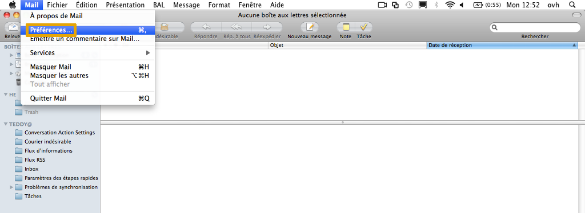
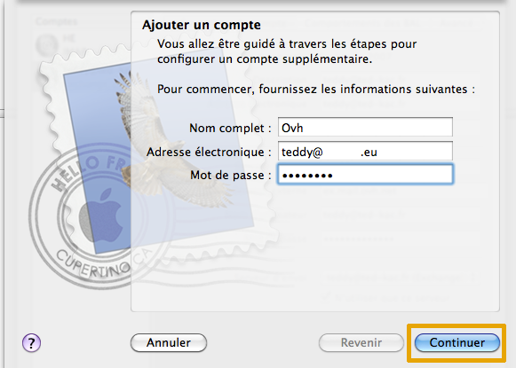
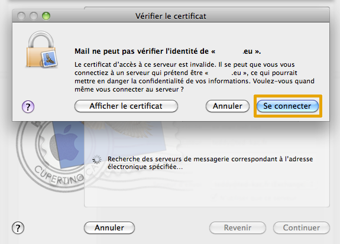
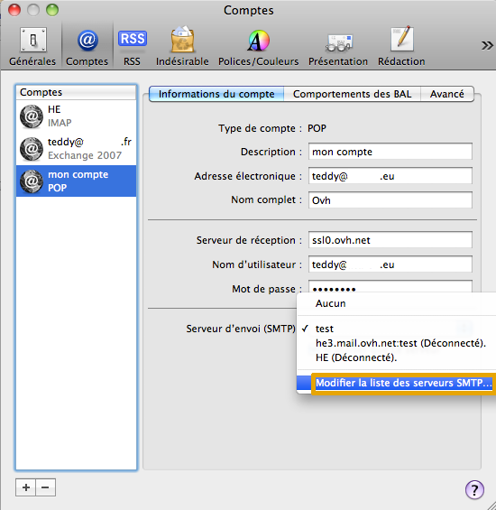
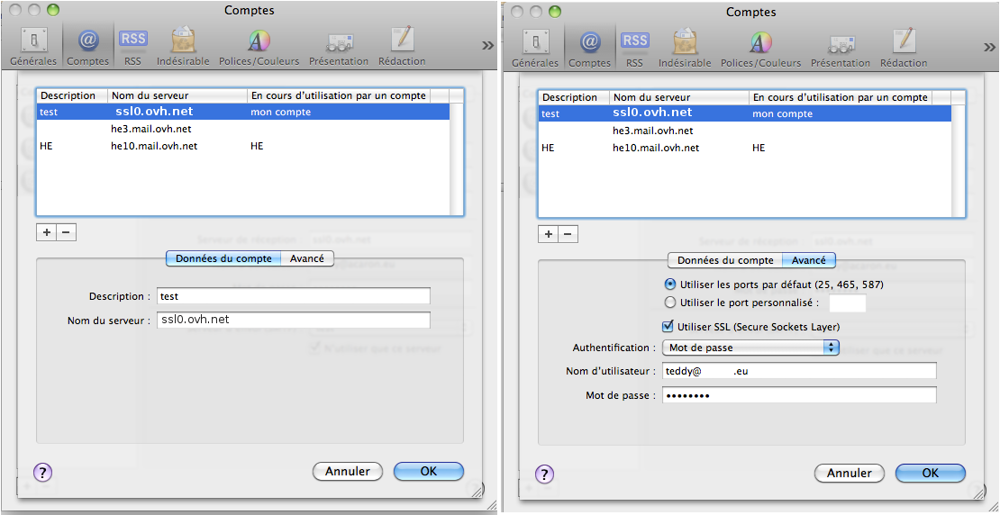

## Konto e-mail OVH w systemie Mac
Nie ma nic prostszego niż korzystanie z konta e-mail OVH w systemie Mac.

Z poziomi systemu Mac wejdź na stronę [https://ssl0.ovh.net/roundcube/auto/](https://ssl0.ovh.net/roundcube/auto/).

Wpisz adres e-mail, który posiadasz w OVH, kliknij na "Generer" i przejdź przez kolejne etapy.

## Część 1: Uruchomienie aplikacji
Uruchom program Mail w systemie Mac, kliknij na "Mail" i na "Ustawienia.

Konfigurujemy konto w trybie POP, z włączonym certyfikatem SSL.

Będziesz mógł wykonać konfigurację w trybie IMAP na podstawie informacji podanych pod koniec tego przewodnika.

{.thumbnail}

## Część 2: Konta
W zakładce "Konta znajdują się opcje możliwych zmian dla kont skonfigurowanych w programie.

Na czerwono zaznaczone są konta już skonfigurowane w programie. W naszym przykładzie jest to konto IMAP "HE" i konto Exchange.

Na niebiesko zaznaczony jest serwer poczty wychodzącej używany przez nasze konto. Można zmienić wpisy na tej liście. 

Korzystając z "+" można dodać nowe konto e-mail.

Wybieramy "+", aby dodać nowe konto do programu.

{.thumbnail}

## Część 3: Dodawanie konta
Pojawi się nowy interfejs.

Wypełnij pola:

Pełna nazwa: Nazwa konta, która ma się wyświetlać.
Adres elektroniczny: Cały adres e-mail
Hasło: Hasło zdefiniowane w [panelu klienta](https://www.ovh.pl/managerv3/).

Kliknij na "Kontynuuj".

{.thumbnail}

## Część 4: Weryfikacja certyfikatu
Jeśli okno dialogowe wskazuje, że tożsamość serwera jest nieprawidłowa, kliknij na  "Zaloguj się".

{.thumbnail}

## Część 5: Konfiguracja serwera poczty przychodzącej
Interfejs proponuje nam ręczną konfigurację serwera poczty przychodzącej.

W naszym przykładzie wybieramy konfigurację POP.

Wypełnij pola:

Rodzaj konta: Wybierz "POP".
Opis: Nazwa konta, która ma się wyświetlać w programie.
Serwer poczty przychodzącej:ssl0.ovh.net
Nazwa użytkownika: Cały adres e-mail
Hasło: Hasło zdefiniowane [w panelu klienta](https://www.ovh.pl/managerv3/).

Kliknij na "Kontynuuj".

{.thumbnail}

## Część 6: Konfiguracja serwera poczty wychodzącej
Interfejs proponuje nam ręczną konfigurację serwera poczty wychodzącej.

Wypełnij pola:

Opis Nazwa serwera SMTP, która ma się wyświetlać w programie.
Serwer poczty wychodzącej: Serwer mail SSL0.OVH.NET

Zaznacz "Włącz uwierzytelnianie" i wpisz:

Nazwa użytkownika: Cały adres e-mail
Hasło: Hasło zdefiniowane w [w panelu klienta](https://www.ovh.pl/managerv3/).

Kliknij na "Kontynuuj".

{.thumbnail}

## Część 7: Konfiguracja SSL
Interfejs pyta, czy wysyłane e-maile mają używać zabezpieczenia SSL 

Wcześniej podałeś SSL0.OVH.NET, musisz zaznaczyć lub odznaczyć "Używaj SSL (Secure Sockets Layer)", jeśli chcesz włączyć lub wyłączyć zabezpieczenie SSL dla emaili.

W przypadku "Uwierzytelniania" możesz podać "Hasło".

Kliknij na "Kontynuuj".

{.thumbnail}

## Zakończenie
Twoje nowe konto zostało dodane do programu Mail.

Rodzaj konta: Wybór związany z konfiguracją naszego adresu POP
Opis: Nazwa konta email wyświetlana w programie
Adres elektroniczny: Cały adres e-mail
Pełna nazwa: Nazwa konta, która ma się wyświetlać.

Serwer poczty przychodzącej: Serwer e-mail ssl0.ovh.net
Nazwa użytkownika: Cały adres e-mail
Hasło: Hasło zdefiniowane w [panelu klienta](https://www.ovh.pl/managerv3/).

Serwer poczty wychodzącej(SMTP) : Serwer do wysyłania emaili skonfigurowany dla konta.

{.thumbnail}

## Zmiany SMTP
Aby zmienić konfigurację serweraSMTP, kliknij na strzałkę obok serwera SMTP.
Pojawi się lista serwerów. (Tylko jeśli inne serwery SMTP są dostępne)
Możesz kliknąć na "Zmień listę serwerów SMTP...".

{.thumbnail}

## Ustawienia SMTP
Widzimy różne serwery SMTP.
Można zmienić jeden z nich. 
Wybieramy dla przykładu "test".

W części "Dane konta" mamy:

Opis: Nazwa serwera SMTP, która ma się wyświetlać. W naszym przykładzie: "test"
Nazwa serwera: Serwer e-mail ssl0.ovh.net

W części "Zaawansowane" mamy:

Używaj domyślnych portów (25, 465, 587) : Można zaznaczyć te pola, aby korzystać z domyślnych portów.
Używaj SSL (Secure Sockets Layer) :
Wpisałeś ssl0.ovh.net, możesz zaznaczyć lub odznaczyć "Używaj SSL (Secure Sockets Layer)" aby włączyć lub wyłączyć SSL.

Uwierzytelnianie: Wpisz "Hasło"
Nazwa użytkownika: Cały adres e-mail
Hasło: Hasło zdefiniowane w [panelu klienta](https://www.ovh.com/managerv3/).

{.thumbnail}

- Uwierzytelnianie za pomocą hasła jest parametrem niezbędnym, aby wysyłka e-maili mogła działać na naszych serwerach SMTP. 

- Jeśli uwierzytelnianie nie jest wykonywane za pomocą hasła, może zostać otwarte zgłoszenie Open SMTP informujące, że uwierzytelnianie "POP before SMTP" nie jest obsługiwane. Należy obowiązkowo włączyć uwierzytelnienie za pomocą hasła, aby móc wysyłać e-maile.

## Konfiguracja POP
Oto informacje do konfiguracji konta e-mail POP.

Konfiguracja POP z zabezpieczeniem SSL włączonym/green] lub wyłączonym:

Adres Email : Cały adres e-mail
Hasło: Hasło zdefiniowane w [panelu klienta](https://www.ovh.pl/managerv3/).
Nazwa użytkownika: Cały adres e-mail
Serwer poczty przychodzącej:ssl0.ovh.net
Port serwera poczty przychodzącej:995 lub 110
Serwer poczty wychodzącej:ssl0.ovh.net
Port serwera poczty wychodzącej:465 lub 587

Porty 110 i 587 są podawane, gdy zabezpieczenie SSL jest wyłączone.

Porty 995 i 465 są podawane, gdy zabezpieczenie SSL jest włączone.

- Należy obowiązkowo włączyć [uwierzytelnianie](#information_sur_la_configuration_du_serveur_smtp_parametres_smtp) serwera SMTP.

|Porty|SSLwłączony|SSLwyłączony|
|Wchodzący|995|110|
|Wychodzący|465|587|

## Konfiguracja IMAP
Oto informacje do konfiguracji konta e-mail IMAP.

Konfiguracja IMAP z zabezpieczeniem SSL włączonym/green] lub wyłączonym:

Adres Email : Cały adres e-mail
Hasło: Hasło zdefiniowane w [panelu klienta](https://www.ovh.pl/managerv3/).
Nazwa użytkownika: Cały adres e-mail
Serwer poczty przychodzącej:ssl0.ovh.net
Port serwera poczty przychodzącej:993 lub 143
Serwer poczty wychodzącej:ssl0.ovh.net
Port serwera poczty wychodzącej:465 lub 587

Porty 143 i 587 są podawane, gdy zabezpieczenie SSL jest wyłączone.

Porty 993 i 465 są podawane, gdy zabezpieczenie SSL jest włączone.

- Należy obowiązkowo włączyć [uwierzytelnianie](#information_sur_la_configuration_du_serveur_smtp_parametres_smtp) serwera SMTP.

|Porty|SSLwłączony|SSLwyłączony|
|Wchodzący|993|143|
|Wychodzący|465|587|

