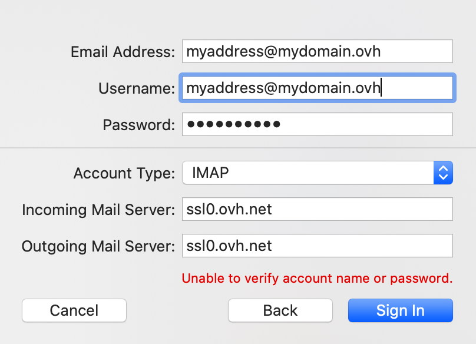

**Last updated 13th June 2022**

## Objective

You can configure MX Plan accounts on email clients, if they are compatible. By doing so, you can use your email address through your preferred email application. The Mail app on macOS is available for free on all Macs.

**Find out how to configure your MX Plan email address on the macOS Mail app.**

> [!warning]
>
> OVHcloud provides services which you are responsible for with regard to their configuration and management. You are therefore responsible for ensuring they function correctly.
> 
> We have provided you with this guide in order to help you with common tasks. Nevertheless, we recommend contacting a specialist provider and/or the service’s software publisher if you encounter any difficulties. We will not be able to assist you ourselves. You can find more information in the "Go further" section of this guide.
> 

## Requirements

- an MX Plan email address (included in the MX Plan solution and in [OVHcloud web hosting plans](https://www.ovhcloud.com/en/web-hosting/)).
- **Mail** installed on your Mac.
- the required credentials for the email address you would like to configure.
 
## Instructions

### Add account

- **When the application is first started**: a setup wizard will appear, prompting you to choose your account type.

- **If an account has already been set up**: click `Mail`{.action} in the menu bar at the top of your screen, then `Accounts`{.action}.

|||
|---|---|
|{.thumbnail}|Select `Add Other Account`{.action}, then click on `Mail account`{.action}.|
|Enter the following information in the "**Add Mail Account**" window:  - your email account **name**  - Your **Email address**  - Your email **password**|{.thumbnail}|
|{.thumbnail}|In the next window, enter the information:  - Leave your **Email address** already entered  - Enter your full email address in **Username**  - Leave your **Password** already entered  - Select `POP` or `IMAP`(recommended) in **Account type** - Type `pop.mail.ovh.ca` for `POP` or type `imap.mail.ovh.ca` for `IMAP` in **Incoming Mail Server** - Also enter `smtp.mail.ovh.ca` in **Outgoing Mail Server**  To complete the configuration, click on `Sign in`{.action}|

### Use email address

Once you have configured your email address, you can start using it! You can now send and receive emails.

OVHcloud also has a web application you can use to access your email address from your browser. You can access this application at <https://www.ovh.com/world/mail/>. You can log in using your email credentials. If you have any question about how to use it, you can refer to our guide on [Using an account in the OWA](https://docs.ovh.com/us/en/microsoft-collaborative-solutions/exchange_2016_outlook_web_app_user_guide/) interface or use your email address via the RoundCube webmail.

### Retrieve a backup of your email address

If you need to make any changes that could lead to the loss of your email account data, we advise backing up the email account concerned beforehand. To do this, please read the "**Export**" section in the "**Mail on macOS**" chapter of our guide on [Manually migrate your email address](https://docs.ovh.com/us/en/emails/migrate-email-addresses-manually/#exporting).

### Modify existing settings

If your email account has already been set up and you need to access the account settings to change them:

- Click `Mail`{.action} in the menu bar at the top of your screen, then click `Preferences`{.action}.
- Select the account concerned in the left-hand column, then click `Server`{.action} settings.

{.thumbnail}

### Additional information

For an **IMAP** configuration, the values are:

|Server type|Server name|Encryption method|Port|
|---|---|---|---|
|Incoming(IMAP)|imap.mail.ovh.ca|SSL/TLS|993|
|Outgoing(SMTP)|smtp.mail.ovh.ca|SSL/TLS|465|

For **POP** configuration, the values are:

|Server type|Server name|Encryption method|Port|
|---|---|---|---|
|Incoming(POP)|pop.mail.ovh.ca|SSL/TLS|995|
|Outgoing(SMTP)|smtp.mail.ovh.ca|SSL/TLS|465|

> [!primary]
>
> **Change configuration**
>
> When you configure your email address in **IMAP** and you want to change the configuration to **POP**, it is necessary to delete the account from Mac Mail and then recreate it in **POP** to change the configuration.

## Go further
  
Join our community of users on <https://community.ovh.com/en/>.
