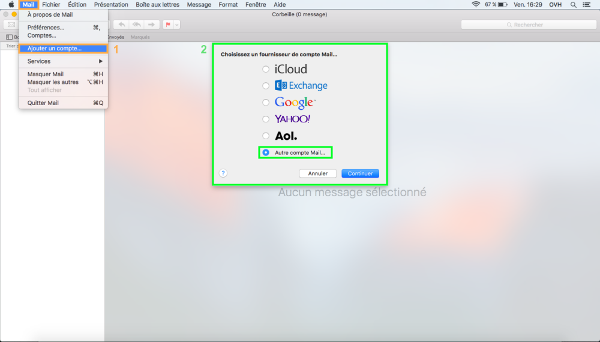
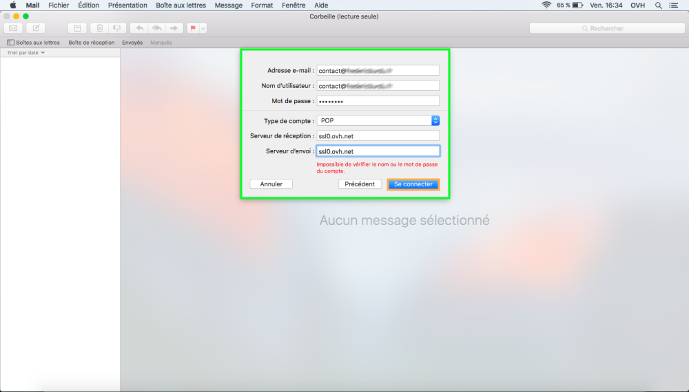
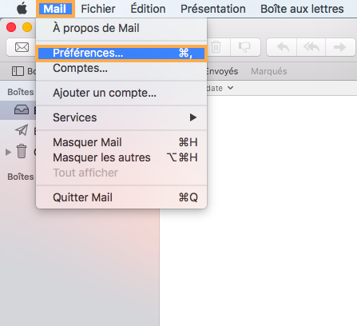
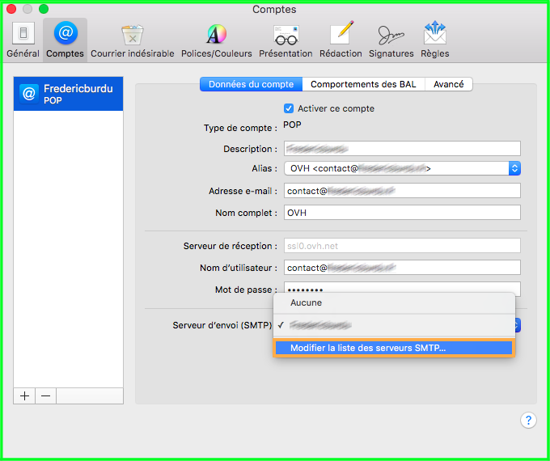

## A sua conta de e-mail OVH no seu Mac com 1 clique
A partir do seu Mac aceda ao seguinte link: [https://ssl0.ovh.net/roundcube/auto/](https://ssl0.ovh.net/roundcube/auto/).
Introduza o seu endereço de e-mail OVH, clique em "Gerar", e siga as etapas.

Estas etapas irão gerar um perfil no seu Mac para que possa utilizar a sua conta de e-mail normalmente.

## Parte 1: Início
Aceda ao software Mail do Mac. Tem duas possibilidades à sua disposição:

- 1. Já existem e-mails configurados no Mail do Mac (quadrado laranja da imagem):

Aceda a "Mail" e depois clique em "Contas".

- 2. Nenhum e-mail está configurado no Mail do Mac (quadrado verde da imagem) :

Selecione "Adicionar uma outra conta de e-mail" a fim de adicionar a sua conta de e-mail.

{.thumbnail}

## Parte 2: Informações da conta
Para configurar a sua conta de e-mail é-lhe pedido que introduza as seguintes informações:

- Nome: O seu endereço de e-mail na íntegra.

- Endereço e-mail: O seu endereço de e-mail na íntegra.

- Password: A password da sua conta de e-mail.

Clique em "Seguinte" para continuar.

{.thumbnail}

## Parte 3: Configuração do servidor de receção e envio
É-lhe então pedido que configure o seu servidor de receção e de envio.

Introduza os elementos pedidos:

- Endereço e-mail: O seu endereço de e-mail na íntegra.

- Nome do utilizador: O seu endereço de e-mail na íntegra.

- Password: A password da sua conta de e-mail.

- Tipo de conta: Escolha a configuração do seu software de e-mails, POP ou IMAP.

- Servidor de envio: Introduza o servidor SSL0.OVH.NET

- Servidor de receção: Defina também o servidor SSL0.OVH.NET

Clique em "Ligação" para continuar.

{.thumbnail}

## Modificação SMTP
Para aceder aos parâmetros SMTP da sua conta de e-mail aceda ao software Mail do Mac, clique em "Mail" e depois "Preferências".

{.thumbnail}
Selecione a conta de e-mail e as informações dessa conta aparecerão.

- Tipo de conta: A escolha associada à configuração do endereço de e-mail IMAP

- Descrição: O nome da conta de E-mail aparecer no software.

- Alias : O nome do remetente que será apresentado no destinatário.

- Endereço e-mail: O seu endereço de e-mail na íntegra.

- Nome completo: O nome da conta de E-mail a ser apresentada.

- Servidor de receção: O servidor de e-mail SSL0.OVH.NET

- Nome do utilizador: O seu endereço de e-mail completo.

- Password: A password definida no seu [Espaço de Cliente](https://www.ovh.com/manager/web/login.html).

- Servidor de envio (SMTP): O servidor de e-mail configurado para a conta.

{.thumbnail}
Para modificar a configuração do servidor SMTP, clique na seta ao lado do nome do servidor SMTP.

Vai ser apresentada uma lista dos servidores. (Somente se outros servidores SMTP estiverem presentes)

- É então possível que clique em "Modificar a lista dos servidores SMTP".

{.thumbnail}

## Parâmetros SMTP
Encontraremos então diferentes servidores SMTP.
Tem a possibilidade de os modificar.

Encontramos na parte "Dados da conta" :

- Descrição: Nome apresentar no servidor SMTP.

- Nome do servidor: O servidor de e-mail SSL0.OVH.NET

Encontramos na parte "Avançados" :

- Detetar automaticamente e manter as definições da conta: Não selecione esta opção.

- Porta : Introduza a porta 465.

- Utilizar SSL (Secure Sockets Layer):

Introduziu SSL0.OVH.NET e poderá selecionar, ou não, a opção "Utilizar SSL (Secure Sockets Layer)" para ativar ou desativar a segurança SSL.

- Autenticação: Introduza a "Password".

- Autorizar uma ligação não segura: Não selecione esta opção.

- Nome de utilizador: O seu endereço de e-mail completo.

- Password: A password definida no seu [espaço de cliente](https://www.ovh.com/manager/web/login.html).

{.thumbnail}

- A autenticação através da Password é uma parametrização indispensável para que o envio de e-mails possa enviar nos nossos servidores SMTP.

- Se a autenticação não for efetuada através de password, será aberto um ticket de incidente Open SMTP que o informará que a utilização da autenticação "POP before SMTP" não é suportada pelos nossos serviços. Como tal, deve imperativamente ativar a autenticação através de Password para que possa enviar e-mails.

## Configuração POP
Eis as informações a reter para a configuração de uma conta de e-mail POP.

Configuração POP com segurança SSL ativada ou desativada :

Endereço de Email:: O seu endereço de e-mail partilhado na íntegra.
Password: A password que definiu no [espaço cliente](https://www.ovh.com/managerv3/).
Nome do utilizador: O seu endereço de e-mail partilhado na íntegra.
Servidor de receção: O servidor de receção de e-mails SSL0.OVH.NET
Porta do servidor de receção: A porta do servidor de receção: 995 ou 110
Servidor de envio: O servidor de envio dos e-mails: SSL0.OVH.NET
Porta do servidor de envio: A porta do servidor de envio: 465 ou 587

As portas 110 e 587 correspondem à segurança SSL desativada.
As portas 995 e 465 correspondem à segurança SSL ativada.

- Deve ativar obrigatoriamente [a autenticação](#information_sur_la_configuration_du_serveur_smtp_parametres_smtp) do servidor de envio SMTP.

|Portas|SSLativada|SSLdesativada|
|Receção|995|110|
|Envio|465|587|

## Configuração IMAP
Eis as informações a reter para a configuração de uma conta de e-mail IMAP.

Configuração POP com segurança SSL ativada ou desativada :

Endereço de Email:: O seu endereço de e-mail partilhado na íntegra.
Password: A password que definiu no [espaço cliente](https://www.ovh.com/managerv3/).
Nome do utilizador: O seu endereço de e-mail partilhado na íntegra.
Servidor de receção: O servidor de receção de e-mails SSL0.OVH.NET
Porta do servidor de receção: A porta do servidor de receção: 993 ou 143
Servidor de envio: O servidor de envio dos e-mails: SSL0.OVH.NET
Porta do servidor de envio: A porta do servidor de envio: 465 ou 587

As portas 143 e 587 correspondem à segurança SSL desativada.
As portas 993 e 465 correspondem à segurança SSL ativada.

- Deve ativar obrigatoriamente [a autenticação](#information_sur_la_configuration_du_serveur_smtp_parametres_smtp) do servidor de envio SMTP.

|Portas|SSLativada|SSLdesativada|
|Receção|995|143|
|Envio|465|587|

