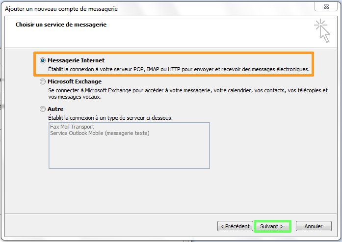
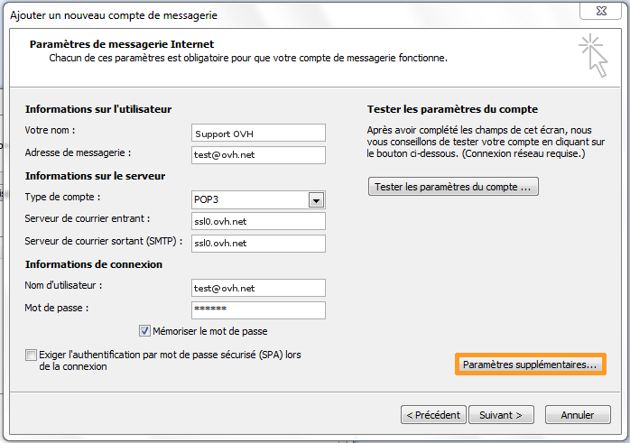
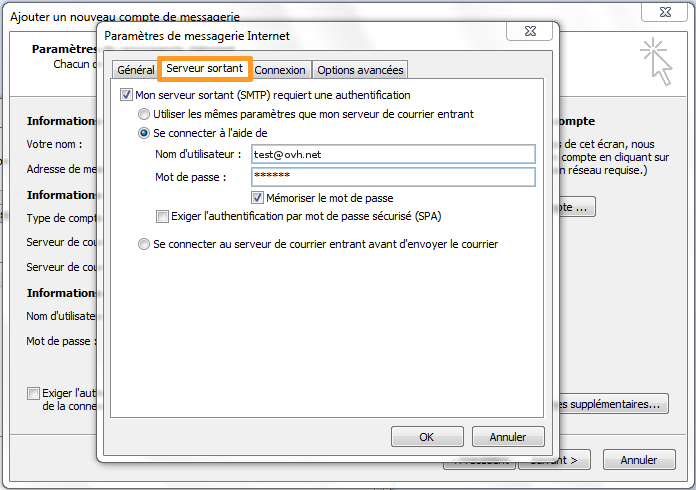

## Część 1: Uruchomienie programu
Otwórz program Outlook 2007.

Kliknij na menu "Narzędzia" i na "Parametry konta...".

W nowym interfejsie kliknij na przycisk "Nowe", aby zarejestrować nową skrzynkę e-mail.

{.thumbnail}

## Część 2: Dodawanie konta
Zaznacz pole na dole po lewej strony: "Skonfiguruj ręcznie ustawienia serwera lub rodzaje serwerów dodatkowych".

Kliknij na przycisk "Dalej".

{.thumbnail}

## Część 3: Rodzaj usługi
Wybierz "Poczta internetowa" i kliknij na "Dalej".

{.thumbnail}

## Część 4: Ustawienia poczty
Na tej stronie należy podać następujące informacje:

Nazwa: nazwa, która ma się wyświetlać.
Adres poczty elektronicznej: cały adres email

Typ konta:POP3
Serwer poczty przychodzącej:ssl0.ovh.net
Serwer poczty wychodzącej:ssl0.ovh.net

Nazwa użytkownika: cały adres e-mail (na przykład: test@ovh.net)
Hasło: hasło do tego konta e-mail.

Kliknij na przycisk "Dodatkowe parametry", aby kontynuować.

{.thumbnail}

## Część 5: Serwer poczty wychodzącej
W zakładce "Serwer poczty wychodzącej" zaznacz pole "Serwer poczty wychodzącej wymaga uwierzytelniania" i "Zaloguj się za pomocą:"

Nazwa użytkownika: cały adres e-mail (na przykład: test@ovh.net)
Hasło: hasło do tego konta e-mail

Należy używać portu 587 dla SMTP i zaznaczyć opcję uwierzytelniania, aby połączyć się z serwerem poczty wychodzącej.

{.thumbnail}

- Uwierzytelnianie dla serwera poczty wychodzącej jest parametrem niezbędnym, aby wysyłka e-maili mogła działać na naszych serwerach SMTP. 

- Jeśli uwierzytelnianie nie jest włączone, może zostać otwarte zgłoszenie Open SMTP informujące, że uwierzytelnianie "POP before SMTP" nie jest obsługiwane. Należy obowiązkowo włączyć uwierzytelnienie serwera poczty wychodzącej, aby móc wysyłać e-maile.

## Część 6: Opcje zaawansowane
W zakładce "Zaawansowane opcje" podaj te parametry:

Serwer poczty przychodzącej (POP3)110.

Ten serwer wymaga szyfrowanego połączenia (SSL) musi być odznaczone.

Serwer poczty wychodzącej (SMTP)587.

Używaj następującego typu połączenia szyfrowanego: musi wskazywać na Brak

Kliknij na "OK", aby kontynuować.

Na tym etapie możesz również określić, czy e-maile maja być usuwane z serwera.

{.thumbnail}

## Część 7: Zakończenie
Konto zostało poprawnie skonfigurowane.

{.thumbnail}

## Konfiguracja POP
Oto informacje do konfiguracji konta e-mail POP.

Konfiguracja POP z zabezpieczeniem SSL włączonym/green] lub wyłączonym:

Adres Email : Cały adres e-mail
Hasło: Hasło zdefiniowane w [panelu klienta](https://www.ovh.com/auth/?action=gotomanager&from=https://www.ovh.pl/&ovhSubsidiary=pl).
Nazwa użytkownika: Cały adres e-mail
Serwer poczty przychodzącej:ssl0.ovh.net
Port serwera poczty przychodzącej:995 lub 110
Serwer poczty wychodzącej:ssl0.ovh.net
Port serwera poczty wychodzącej:465 lub 587

Porty 110 i 587 są podawane, gdy zabezpieczenie SSL jest wyłączone.

Porty 995 i 465 są podawane, gdy zabezpieczenie SSL jest włączone.

- Należy obowiązkowo włączyć [uwierzytelnianie](#configuration_manuelle_partie_5_serveur_sortant) serwera SMTP.

|Porty|SSLwłączony|SSLwyłączony|
|Wchodzący|995|110|
|Wychodzący|465|587|

## Konfiguracja IMAP
Oto informacje do konfiguracji konta e-mail IMAP.

Konfiguracja IMAP z zabezpieczeniem SSL włączonym/green] lub wyłączonym:

Adres Email : Cały adres e-mail
Hasło: Hasło zdefiniowane w [panelu klienta](https://www.ovh.com/auth/?action=gotomanager&from=https://www.ovh.pl/&ovhSubsidiary=pl).
Nazwa użytkownika: Cały adres e-mail
Serwer poczty przychodzącej:ssl0.ovh.net
Port serwera poczty przychodzącej:993 lub 143
Serwer poczty wychodzącej:ssl0.ovh.net
Port serwera poczty wychodzącej:465 lub 587

Porty 143 i 587 są podawane, gdy zabezpieczenie SSL jest wyłączone.

Porty 993 i 465 są podawane, gdy zabezpieczenie SSL jest włączone.

- Należy obowiązkowo włączyć[uwierzytelnianie](#configuration_manuelle_partie_5_serveur_sortant) serwera SMTP.

|Porty|SSLwłączony|SSLwyłączony|
|Wchodzący|993|143|
|Wychodzący|465|587|

