**Dernière mise à jour le 05/05/2020**

Cliquez [ici](http://www.ovh.com/ca/fr/hebergement-web/faq){.external} pour retrouver nos différents guides de configuration e-mail.

Ce guide vous permettra de paramétrer vos comptes e-mails avec Outlook 2010. Vous n'avez qu'à suivre les étapes pas à pas.

*Dans notre exemple on configure le compte e-mail en POP (avec et sans SSL). Cependant il est tout à fait possible de le configurer autrement en utilisant les paramètres renseignés à la fin de ce guide.*

> [!warning]
>
> OVHcloud met à votre disposition des services dont la configuration, la gestion et la responsabilité vous incombent. Il vous revient de ce fait d'en assurer le bon fonctionnement.
> 
> Nous mettons à votre disposition ce guide afin de vous accompagner au mieux sur des tâches courantes. Néanmoins, nous vous recommandons de faire appel à un prestataire spécialisé et/ou de contacter l'éditeur du service si vous éprouvez des difficultés. En effet, nous ne serons pas en mesure de vous fournir une assistance. Plus d'informations dans la section « Aller plus loin » de ce guide.
> 

## Ajouter un compte

### Ajout du compte (partie 1)
Pour ajouter un compte e-mail sous Outlook 2010, rendez-vous dans l'interface de "Paramètres du compte...", comme montré sur la capture ci-contre.


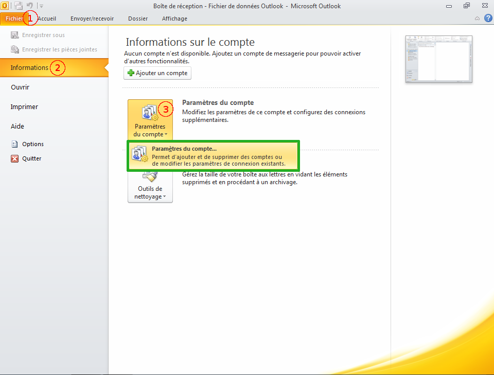{.thumbnail}


### Ajout du compte (partie 2)
Puis cliquez sur Nouveau....

Vous avez à présent le choix entre la configuration [manuelle](#MANU){.external} ou [automatique](#AUTO){.external}.


{.thumbnail}

<a name="MANU"></a>

## Configuration manuelle

### Choix de la configuration
Cochez Configurer manuellement les paramètres du serveur ou les types de serveurs supplémentaires puis sur Suivant >.


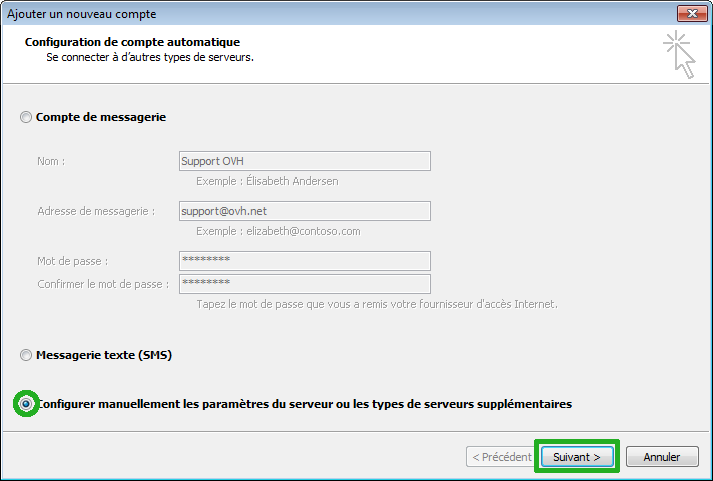{.thumbnail}


### Choix du service
Cochez Messagerie Internet puis cliquez sur Suivant >.


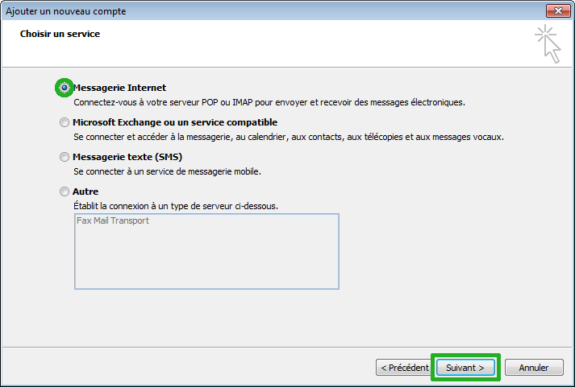{.thumbnail}


### Parametres de messagerie
Sur cette page il vous faut entrer les informations suivantes :

1. Nom : saisissez ici le nom que vous souhaitez voir apparaître chez vos correspondants ;
1. Adresse de messagerie : votre adresse e-mail en entier ;
1. Type de compte : **POP3**  (pour IMAP cf. [Rappel des paramètres POP - IMAP](#RAPPEL){.external} ) ;
1. Serveur de courrier entrant : **SSL0.OVH.NET**
1. Serveur de courrier sortant (SMTP) : **SSL0.OVH.NET**
1. Nom d'utilisateur : votre adresse e-mail entière ;
1. Mot de passe : utilisez le mot de passe correspondant à ce compte e-mail.

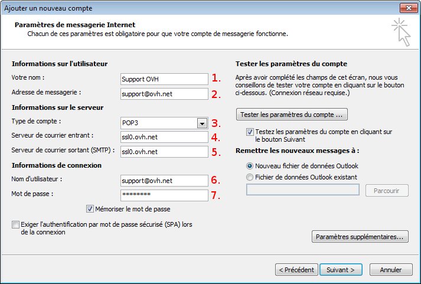{.thumbnail}


### General
1. Cliquez sur Paramètres supplémentaires.... Vous pouvez saisir la référence du compte que vous souhaitez. Par défaut, il s'agit de l'adresse e-mail. Ici, nous l'avons remplacée par  **Support OVHcloud** . Cette référence sera affichée dans la gestion de comptes e-mail dans Outlook.

1. Cliquez ensuite sur l'onglet Serveur sortant.

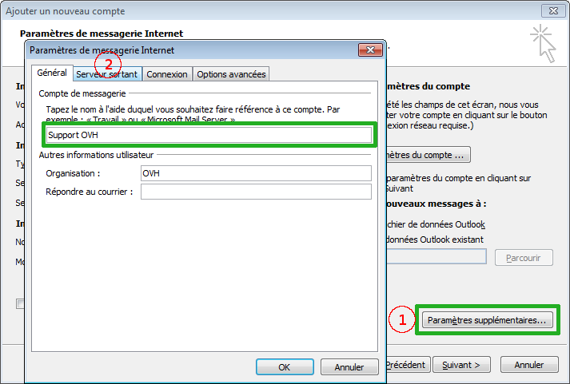{.thumbnail}


### Serveur sortant &amp; options avancees
Dans l'onglet  **Serveur sortant** , cochez la case "Mon serveur sortant (SMTP) requiert une authentification" puis cochez Utiliser les mêmes paramètres que mon serveur de courrier entrant.

*Il vous faut impérativement utiliser le port 587 en SMTP et cocher la case d'authentification pour la connexion du serveur sortant.* *Il s'agit du port sortant authentifié pour tous les FAI (Fournisseur d'Accès Internet).*


> [!success]
>
> - L'Authentification pour le serveur sortant est un paramétrage
> indispensable afin que l'émission d'email puisse fonctionner sur nos
> serveurs SMTP.
> - Si l'authentification n'est pas activée, un ticket incident Open SMTP
> peut être ouvert vous informant que l'authentification "POP before
> SMTP" n'est pas supportée. Vous devrez impérativement activer l'
> authentification du serveur sortant afin de pouvoir émettre des
> emails.
>
Dans l'onglet  **Options avancées** , renseignez ces paramètres :

**Serveur entrant (POP3)**  **:**  doit être le  **110** .

Ce serveur nécessite une connexion chiffrée (SSL) doit être  **décoché** .

**Serveur sortant (SMTP)**  : doit être le  **587** .

Utiliser le type de connexion chiffrée suivant  doit être renseigné sur **Aucun**

Cliquez sur  **OK**  pour continuer.

*À ce niveau il vous est aussi possible de définir si les mails doivent être supprimés du serveur de messagerie, ainsi que le délai avant suppression.*


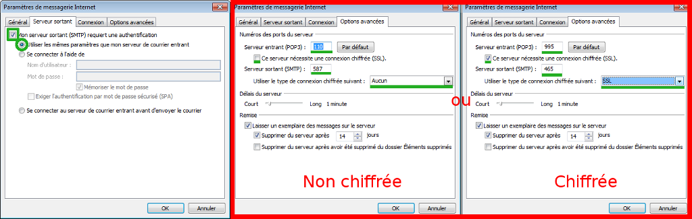{.thumbnail}


### Tester le parametrage
À ce stade, il vous est possible de tester votre paramétrage en cliquant sur "Tester les paramètres du compte ...".


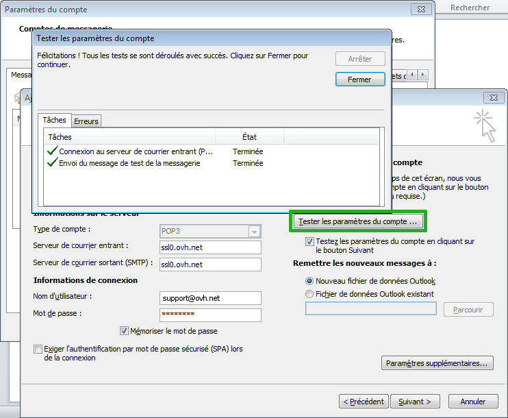{.thumbnail}


### Terminer la configuration
1. Une fois que vous vous êtes assuré que le paramétrage était le bon, cliquez sur Suivant >.
1. Un nouveau test des paramètres du compte sera effectué avant l'étape finale. Cliquez alors simplement sur Fermer.

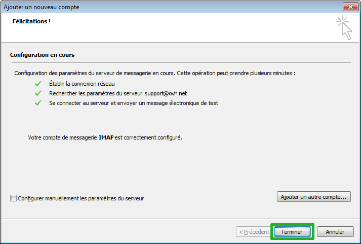{.thumbnail}


### Felicitations !
Vous avez correctement configuré votre compte sur Outlook 2010. Cliquez sur Terminer.


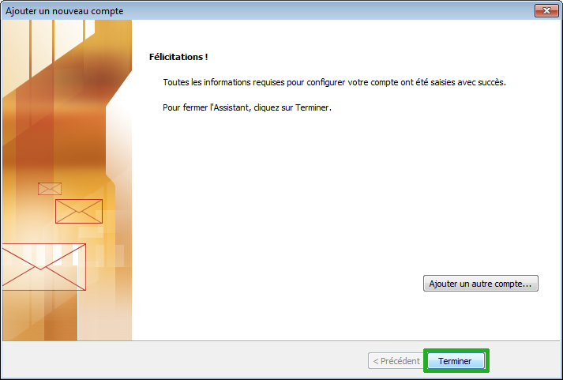{.thumbnail}

<a name="AUTO"></a>

## Configuration automatique en 3 clics !

### 1. Saisie des informations
1. Nom : Saisissez ici le nom que vous souhaitez voir apparaître chez vos correspondants ;
1. Adresse de messagerie : votre adresse e-mail entière ;
1. Mot de passe : votre mot de passe associé au compte e-mail concerné et confirmez-le sur la ligne du dessous.
Cliquez ensuite sur Suivant >.


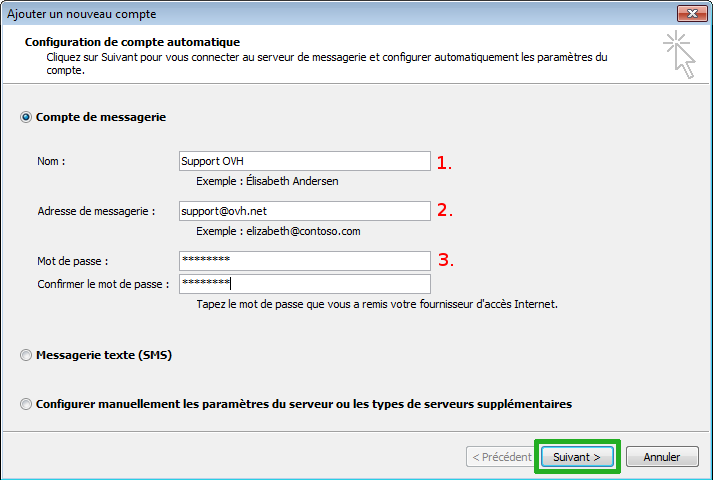{.thumbnail}


### 2. Autorisation
L'application Outlook cherche alors les éléments de votre domaine dont elle a besoin afin de finaliser la configuration automatique. Si tout se passe bien, le message ci-contre doit apparaître.

Vous comptez ajouter plusieurs adresses e-mail liées au domaine concerné ? Cochez alors Ne plus me poser la question à propos de ce site Web. Cela vous évitera de cocher cette boîte à chaque ajout de compte e-mail.

Cliquez ensuite sur Autoriser.

Si vous n'avez pas le message ci-contre, pensez à vérifier que votre mot de passe est le bon grâce au [Webmail](http://webmail.ovh.net){.external}. Si votre mot de passe est bel et bien le bon, vérifiez que votre zone DNS possède bien les 3 lignes suivantes :


```bash
_submission._tcp.votredomaine       SRV     0 0 465 SSL0.OVH.NET
_imaps._tcp.votredomaine            SRV     0 0 993 SSL0.OVH.NET
_autodiscover._tcp.votredomaine     SRV     0 0 443 mailconfig.ovh.net.
```

Pour cela, connectez-vous à votre [Espace Client](https://www.ovh.com/manager/web){.external}, sélectionnez votre domaine dans la colonne de gauche puis cliquez sur l'onglet Zone DNS à droite de Résumé. Assurez-vous d'être en  **Mode Expert**  (en haut à droite).


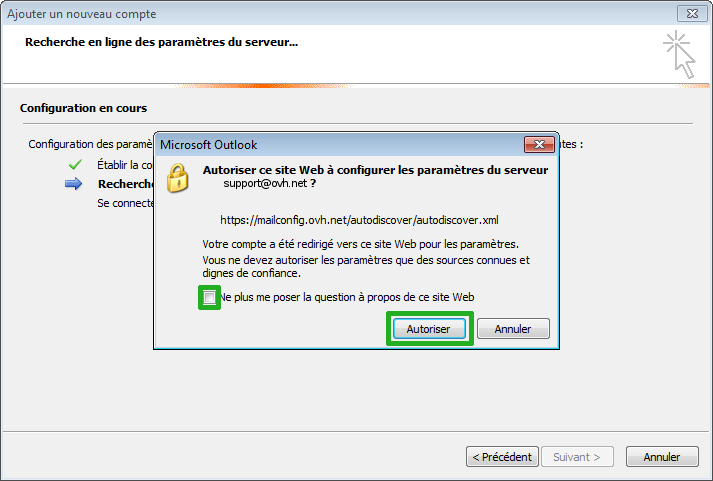{.thumbnail}


### 3. Configuration terminee
L'application Outlook a achevé la configuration avec succès. Cliquez sur Terminer.


{.thumbnail}

<a name="RAPPEL"></a>

## Rappel des parametres POP - IMAP

### Configuration POP
Voici les informations à retenir pour la configuration d'un compte e-mail **POP** .

Configuration  **POP**  avec sécurisation SSL activée ou désactivée :

Adresse Email : Votre adresse e-mail mutualisée entière. Mot de passe : Le mot de passe que vous avez défini dans [l'espace client](https://www.ovh.com/managerv3/){.external}. Nom d'utilisateur : Votre adresse e-mail mutualisée entière. Serveur entrant : Le serveur de réception des e-mails :  **SSL0.OVH.NET** Port serveur entrant : Le port du serveur entrant :  **995**  ou  **110** Serveur sortant : Le serveur d'envoi des e-mails :  **SSL0.OVH.NET** Port serveur sortant : Le port du serveur sortant :  **465**  ou  **587**

Les ports  **110**  et  **587**  correspondent à la sécurisation SSL désactivée. Les ports  **995**  et  **465**  correspondent à la sécurisation SSL activée.

- Vous devez obligatoirement activer [l'authentification](#configuration_manuelle_partie_5_serveur_sortant_amp_options_avancees){.external} du serveur sortant SMTP.


|Ports|SSL activé|SSL désactivé|
|---|---|---|
|Entrant|995|110|
|Sortant|465|587|


### Configuration IMAP
Voici les informations à retenir pour la configuration d'un compte e-mail **IMAP** .

Configuration  **IMAP**  avec sécurisation SSL activée ou désactivée :

Adresse Email : Votre adresse e-mail mutualisée entière. Mot de passe : Le mot de passe que vous avez défini dans [l'espace client](https://www.ovh.com/managerv3/){.external}. Nom d'utilisateur : Votre adresse e-mail mutualisée entière. Serveur entrant : Le serveur de réception des e-mails :  **SSL0.OVH.NET** Port serveur entrant : Le port du serveur entrant :  **993**  ou  **143** Serveur sortant : Le serveur d'envoi des e-mails :  **SSL0.OVH.NET** Port serveur sortant : Le port du serveur sortant :  **465**  ou  **587**

Les ports  **143**  et  **587**  correspondent à la sécurisation SSL désactivée. Les ports  **993**  et  **465**  correspondent à la sécurisation SSL activée.

- Vous devez obligatoirement activer [l'authentification](#configuration_manuelle_partie_5_serveur_sortant_amp_options_avancees){.external} du serveur sortant SMTP.


|Ports|SSL activé|SSL désactivé|
|---|---|---|
|Entrant|993|143|
|Sortant|465|587|

## Aller plus loin

Échangez avec notre communauté d'utilisateurs sur <https://community.ovh.com>.
