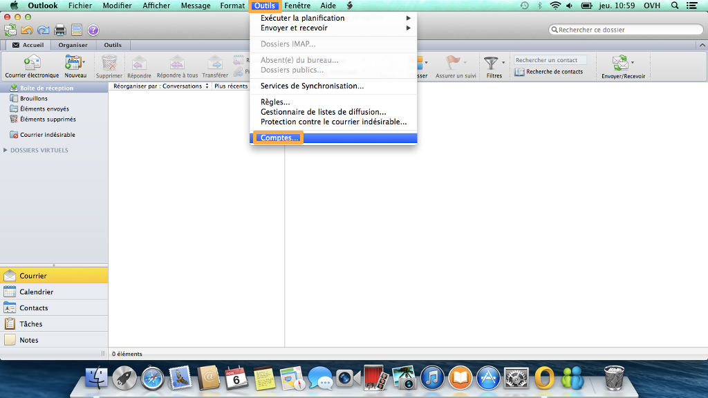
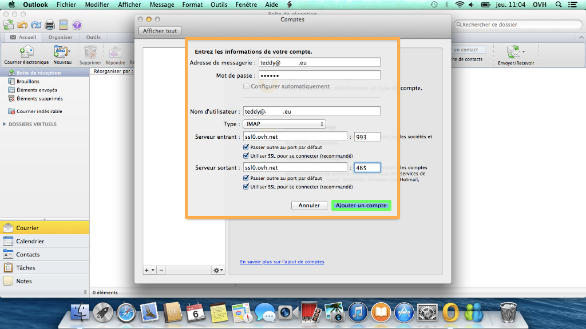
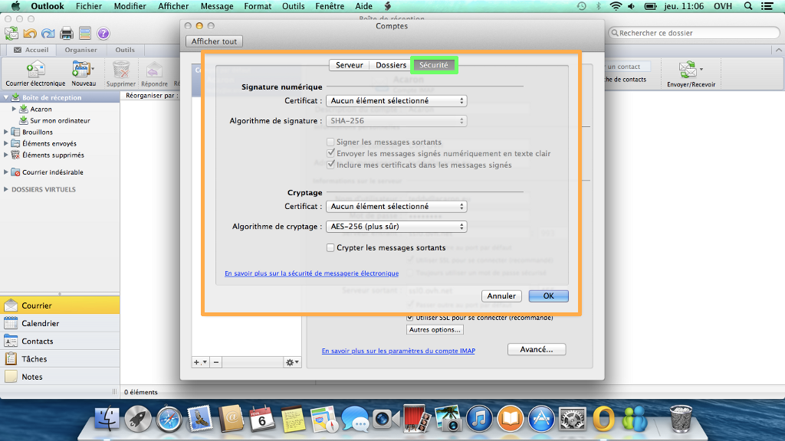

## Etapa 1: Inicio
Abra Microsoft Outlook 2011 en su Mac.

En este caso, vamos a configurar la aplicación en IMAP, con el SSL activado. Hemos utilizado la versión 10.9.1 de Mac y Outlook 2011 en versión 14.0.0.

Si desea configurar la aplicación en POP, puede hacerlo con los datos que se indican al final de esta guía.

{.thumbnail}

## Etapa 2: Herramientas - Cuentas
En la barra de menús, haga clic en «Herramientas» y seleccione «Cuentas».

En el ejemplo, aún no hay ninguna cuenta configurada en la aplicación.

{.thumbnail}

## Etapa 3: Añadir una cuenta
Aparecerá una nueva ventana.

Seleccione el icono «Cuenta de correo electrónico» para añadir una cuenta de correo electrónico en POP o IMAP.

{.thumbnail}

## Etapa 4: Datos de la cuenta
En la nueva pantalla, introduzca los siguientes datos:

Dirección de correo electrónico: Dirección de correo electrónico completa.

Contraseña: La contraseña elegida en el [manager](https://www.ovh.es/managerv3/).

Nombre de usuario: Dirección de correo electrónico completa. 

Tipo: Seleccione IMAP (puede seleccionar POP, en cuyo caso deberá utilizar la información que se indica al final de esta guía).

Servidor entrante: SSL0.OVH.NET  Puerto del servidor entrante: 993

Marque las casillas «Anular puerto predeterminado» y «Usar SSL para conectar (recomendado)».

Servidor saliente:SSL0.OVH.NET  Puerto del servidor saliente: 465

Marque las casillas «Anular puerto predeterminado» y «Usar SSL para conectar (recomendado)».

Si la aplicación le pregunta si quiere añadir la contraseña al llavero de Mac, puede guardarla para que no vuelva a preguntarle.

Haga clic en «Agregar cuenta» para guardar la cuenta.

{.thumbnail}

## Etapa 5: Finalizar
La cuenta de correo ya aparecerá en la interfaz de Outlook 2011, y podrá consultar, redactar o eliminar sus mensajes de correo electrónico.

{.thumbnail}

## Herramientas - Cuentas
En la barra de menús, haga clic en «Herramientas» y seleccione «Cuentas».

Seleccione la cuenta que quiera editar. Se abrirá la pantalla de la imagen.

Haga clic en «Más opciones...» y, en el menú desplegable «Autenticación» de la configuración de la cuenta, seleccione «Usar información del servidor entrante».

Aquí también puede cambiar la información de configuración de su cuenta de correo, exceptuando el tipo de cuenta (POP o IMAP).

A continuación se describen las opciones disponibles en «Avanzadas...».

{.thumbnail}

## Servidor
En la imagen puede ver las opciones configurables de la pestaña «Servidor», en las preferencias avanzadas de la cuenta.

{.thumbnail}

## Carpetas
En la imagen puede ver las opciones configurables de la pestaña «Carpetas», en las preferencias avanzadas de la cuenta.

{.thumbnail}

## Seguridad
En la imagen puede ver las opciones configurables de la pestaña «Seguridad», en las preferencias avanzadas de la cuenta.

{.thumbnail}

## Configuración POP
A continuación recordamos los valores de configuración de una cuenta de correo POP en Outlook 2011.

Configuración POP con la protección SSL activada o desactivada:

Dirección de correo electrónico: Dirección de correo electrónico completa.
Contraseña: La contraseña elegida en el [manager](https://www.ovh.es/managerv3/).
Nombre de usuario: Dirección de correo electrónico completa
Servidor entrante:SSL0.OVH.NET
Puerto del servidor entrante:995 o 110
Servidor saliente:SSL0.OVH.NET
Puerto del servidor saliente:465 o 587

Los puertos 110 y 587 corresponden a la protección SSL desactivada.
Los puertos 995 y 465 corresponden a la protección SSL activada.

## Configuración IMAP
A continuación recordamos los valores de configuración de una cuenta de correo IMAP en Outlook 2011.

Configuración IMAP con la protección SSL activada o desactivada:

Dirección de correo electrónico: Dirección de correo electrónico completa.
Contraseña: La contraseña elegida en el [manager](https://www.ovh.es/managerv3/).
Nombre de usuario: Dirección de correo electrónico completa
Servidor entrante:SSL0.OVH.NET
Puerto del servidor entrante:993 o 143
Servidor saliente:SSL0.OVH.NET
Puerto del servidor saliente:465 o 587

Los puertos 143 y 587 corresponden a la protección SSL desactivada.
Los puertos 993 y 465 corresponden a la protección SSL activada.

