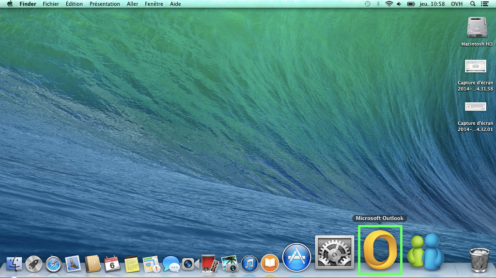
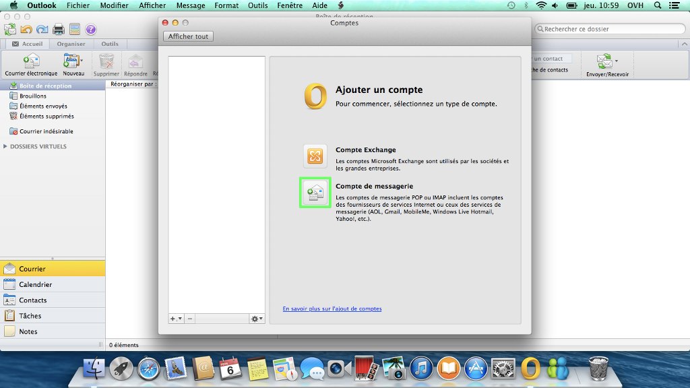
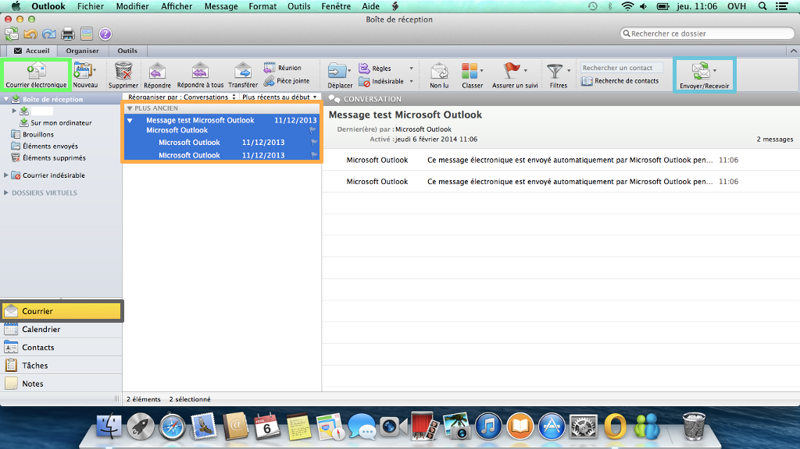
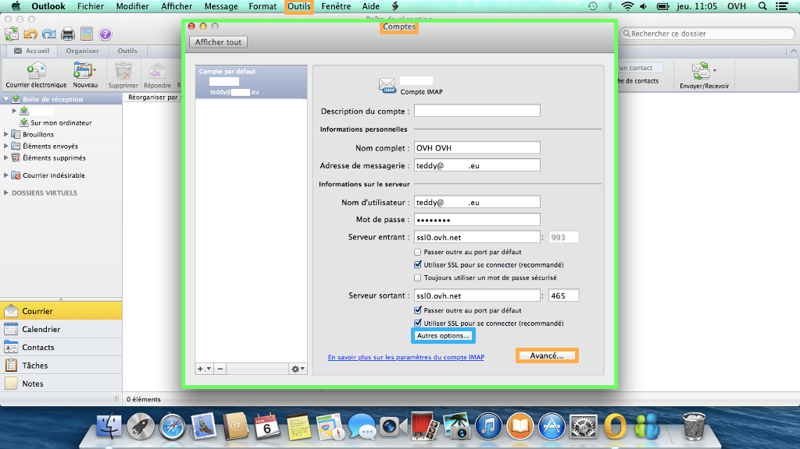
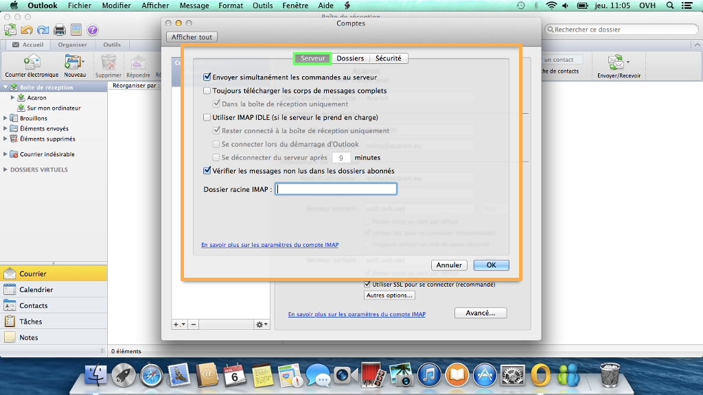
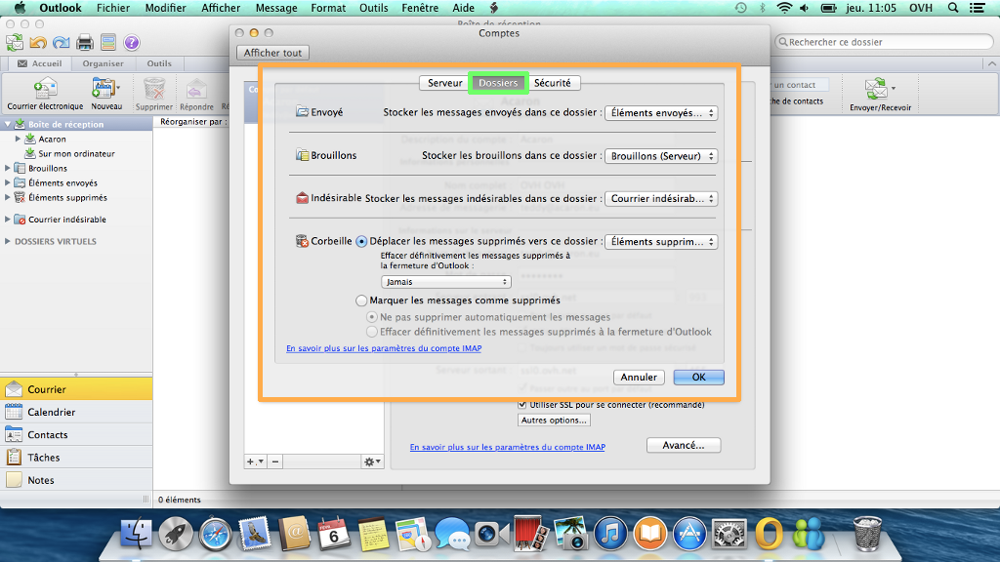

**Dernière mise à jour le 05/05/2020**

> [!warning]
>
> OVHcloud met à votre disposition des services dont la configuration, la gestion et la responsabilité vous incombent. Il vous revient de ce fait d'en assurer le bon fonctionnement.
> 
> Nous mettons à votre disposition ce guide afin de vous accompagner au mieux sur des tâches courantes. Néanmoins, nous vous recommandons de faire appel à un prestataire spécialisé et/ou de contacter l'éditeur du service si vous éprouvez des difficultés. En effet, nous ne serons pas en mesure de vous fournir une assistance. Plus d'informations dans la section « Aller plus loin » de ce guide.
> 

## Configuration Outlook 2011 (Mac)

### Demarrage
Lancez le logiciel Microsoft Outlook 2011 depuis votre Mac.

On choisit de configurer notre logiciel en  **IMAP** , avec le SSL activé.

Il vous sera possible de configurer le logiciel en POP avec les informations renseignées à la fin de ce guide.

*Pour notre configuration, la version 10.9.1 de Mac est utilisée, tandis qu'Outlook 2011 est en version 14.0.0.*

{.thumbnail}

### Outils - Comptes
Cliquez sur "Outils" puis sur "Comptes...".

*Aucun compte n'est actuellement configuré sur notre logiciel.*

{.thumbnail}

### Ajouter un compte
Une nouvelle interface apparaît.

Sélectionnez l'icône "Compte de messagerie" pour ajouter un compte e-mail en **POP**  ou en  **IMAP** .

{.thumbnail}

### Informations du compte
Voici la nouvelle interface qui apparaît.

Renseignez dans :

Adresse de messagerie : Votre adresse e-mail entière.

Mot de passe : Le mot de passe que vous avez défini dans [l'espace client](https://www.ovh.com/auth/?action=gotomanager){.external}.

Nom d'utilisateur : Votre adresse e-mail entière.

Type : Sélectionnez  **IMAP**  (vous pouvez sélectionner POP, dans ce cas utilisez les informations renseignées en fin de guide).

Serveur entrant : **SSL0.OVH.NET**  Port serveur entrant : **993**

*Cochez les options "Passer outre au port par défaut" ainsi que "Utiliser SSL pour se connecter (recommandé)".*

Serveur sortant : **SSL0.OVH.NET**  Port serveur sortant : **465**

*Cochez les options "Passer outre au port par défaut" ainsi que "Utiliser SSL pour se connecter (recommandé)".*

*S'il vous est demandé d'ajouter votre mot de passe au trousseau de Mac, vous avez la possibilité de l'enregistrer pour éviter de futures demandes.*

Cliquez sur "Ajouter un compte" pour enregistrer le compte.

{.thumbnail}

### Finalisation
Votre compte e-mail est à présent ajouté dans l'interface d'Outlook 2011.

Vous pouvez dès lors consulter, rédiger ou supprimer vos e-mails.

{.thumbnail}

## Modification du compte e-mail sur Outlook 2011 (Mac)

### Outils - Comptes
Cliquez sur "Outils" puis sur "Comptes...".

Sélectionnez le compte que vous désirez modifier.

Cette interface apparaît (cf capture ci-contre) :

Via un clic sur "Autres options..." dans le menu déroulant il vous est possible de sélectionner "Authentification" -> "Utiliser les informations du serveur entrant".

Il vous est aussi possible à ce niveau de modifier les informations de configuration de votre compte e-mail, hormis le type de compte ( **POP**  ou **IMAP** )

Voyons les options disponibles dans "Avancé...".

{.thumbnail}

> [!success]
>
> - 
> L'Authentification pour le serveur sortant est un paramétrage
> indispensable afin que l'émission d'email puisse fonctionner sur nos
> serveurs SMTP.
> - 
> Si l'authentification n'est pas activée, un ticket incident Open SMTP
> peut être ouvert vous informant que l'authentification "POP before
> SMTP" n'est pas supportée. Vous devrez impérativement activer l'
> authentification du serveur sortant afin de pouvoir émettre des
> emails.
> 
> 

### Serveur
Voici les paramètres modifiables dans l'onglet "Serveur" dans les options avancées du compte.

{.thumbnail}

> [!alert]
>
> Afin que le paramétrage puisse être pleinement fonctionnel, nous vous invitons
> à renseigner dans la case "Dossier racine IMAP" le dossier "INBOX".
> 

### Dossiers
Voici les paramètres modifiables dans l'onglet "Dossiers" dans les options avancées du compte.

{.thumbnail}

### Securite
Voici les paramètres modifiables dans l'onglet "Sécurité" dans les options avancées du compte.

{.thumbnail}

## Rappel des parametres POP - IMAP

### Configuration POP
Voici les informations à retenir pour la configuration d'un compte e-mail **POP** .

Configuration  **POP**  avec sécurisation SSL activée ou désactivée :

Adresse Email : Votre adresse e-mail mutualisée entière. Mot de passe : Le mot de passe que vous avez défini dans [l'espace client](https://www.ovh.com/auth/?action=gotomanager){.external}. Nom d'utilisateur : Votre adresse e-mail mutualisée entière. Serveur entrant : Le serveur de réception des e-mails :  **SSL0.OVH.NET** Port serveur entrant : Le port du serveur entrant :  **995**  ou  **110** Serveur sortant : Le serveur d'envoi des e-mails :  **SSL0.OVH.NET** Port serveur sortant : Le port du serveur sortant :  **465**  ou  **587**

Les ports  **110**  et  **587**  correspondent à la sécurisation SSL désactivée. Les ports  **995**  et  **465**  correspondent à la sécurisation SSL activée.

- Vous devez obligatoirement activer [l'authentification](#modification_du_compte_e-mail_sur_outlook_2011_mac_outils_-_comptes){.external} du serveur sortant SMTP.

|Ports|SSL activé|SSL désactivé|
|---|---|---|
|Entrant|995|110|
|Sortant|465|587|

### Configuration IMAP
Voici les informations à retenir pour la configuration d'un compte e-mail **IMAP** .

Configuration  **IMAP**  avec sécurisation SSL activée ou désactivée :

Adresse Email : Votre adresse e-mail mutualisée entière. Mot de passe : Le mot de passe que vous avez défini dans [l'espace client](https://www.ovh.com/auth/?action=gotomanager){.external}. Nom d'utilisateur : Votre adresse e-mail mutualisée entière. Serveur entrant : Le serveur de réception des e-mails :  **SSL0.OVH.NET** Port serveur entrant : Le port du serveur entrant :  **993**  ou  **143** Serveur sortant : Le serveur d'envoi des e-mails :  **SSL0.OVH.NET** Port serveur sortant : Le port du serveur sortant :  **465**  ou  **587**

Les ports  **143**  et  **587**  correspondent à la sécurisation SSL désactivée. Les ports  **993**  et  **465**  correspondent à la sécurisation SSL activée.

- Vous devez obligatoirement activer [l'authentification](#modification_du_compte_e-mail_sur_outlook_2011_mac_outils_-_comptes){.external} du serveur sortant SMTP.

|Ports|SSL activé|SSL désactivé|
|---|---|---|
|Entrant|993|143|
|Sortant|465|587|

## Aller plus loin

Échangez avec notre communauté d'utilisateurs sur <https://community.ovh.com>.
