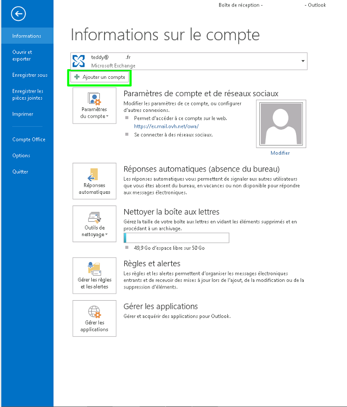

**Dernière mise à jour le 05/05/2020**

[Cliquez ici](../){.external} pour retrouver nos différents guides de configuration e-mail.

> [!warning]
>
> OVHcloud met à votre disposition des services dont la configuration, la gestion et la responsabilité vous incombent. Il vous revient de ce fait d'en assurer le bon fonctionnement.
> 
> Nous mettons à votre disposition ce guide afin de vous accompagner au mieux sur des tâches courantes. Néanmoins, nous vous recommandons de faire appel à un prestataire spécialisé et/ou de contacter l'éditeur du service si vous éprouvez des difficultés. En effet, nous ne serons pas en mesure de vous fournir une assistance. Plus d'informations dans la section « Aller plus loin » de ce guide.
> 

## Généralités
Ce guide ne s'applique pas aux adresses emails Exchange.

### Prérequis
- Disposez d'une adresse e-mail mutualisé OVHcloud fonctionnelle
- Disposer du logiciel Outlook 2013

## Guide video

### Configuration Outlook 2013 en Imap
<video preload="auto" poster="https://www.ovh.com/fr/images/videos/guides/1286/Outlook_2013_Imap_final_quality_60.jpg" style="width: 90%; margin: auto 5%;" controls="controls" id="" class="videoGuide video-js">     <source type="video/mp4" src="https://www.ovh.com/fr/images/videos/guides/1286/Outlook_2013_Imap_final_quality_60.mp4"></source>     <source type="video/webm" src="https://www.ovh.com/fr/images/videos/guides/1286/Outlook_2013_Imap_final_quality_60.webm"></source>     <source type="video/ogv" src="https://www.ovh.com/fr/images/videos/guides/1286/Outlook_2013_Imap_final_quality_60.ogv"></source>     <track default="default" src="https://www.ovh.com/fr/images/videos/guides/1286/Outlook_2013_Imap_final_quality_60.vtt" srclang="fr" kind="subtitles" label="French"></track> </video>

## Configuration Outlook 2013

### Demarrage
Voici comment réaliser votre configuration en  **POP**  avec  **SSL** activé.

Vous pourrez réaliser une configuration en IMAP avec les informations renseignées à la fin de ce guide.

Lancez le logiciel Outlook 2013, cliquez sur "Fichier" (en haut à gauche icône bleue)

Un autre compte e-mail est déjà présent sur le logiciel.

Une nouvelle fenêtre doit apparaître.

{.thumbnail}

### Informations sur le compte
Vous devez ici directement cliquer sur "Ajouter un compte" dans l'encadré vert.

{.thumbnail}

### Ajouter un compte
Vous pouvez soit  **configurer manuellement**  le compte e-mail, soit le faire de  **manière automatique** .

On choisit de le configurer manuellement.

Sélectionnez "Configuration manuelle ou types de serveurs supplémentaires" puis cliquez sur "Suivant" pour continuer.

{.thumbnail}

### Type de compte
Il vous est possible de choisir la manière de configurer votre compte e-mail. Choisissez "POP ou IMAP" puis cliquez sur "Suivant" pour continuer.

{.thumbnail}

### Parametres des comptes POP - IMAP.
Voici les informations à renseigner :

Votre nom : Le nom de votre compte e-mail. Adresse de messagerie : Votre adresse e-mail mutualisé entière. Type de compte : Sélectionnez  **POP3** . Serveur de messagerie entrant : Le serveur de réception  **SSL0.OVH.NET** Serveur de messagerie sortant (SMTP ): Le serveur d'envoi  **SSL0.OVH.NET** Nom d'utilisateur : Votre adresse e-mail mutualisé entière. Mot de passe : Le mot de passe que vous avez défini dans [le manager](https://ca.ovh.com/auth/?action=gotomanager){.external}.

Cochez "Mémoriser le mot de passe" Décochez "Exiger l'authentification par mot de passe sécurisé (SPA) lors de la connexion"

Cliquez ensuite sur "Paramètres supplémentaires ..." pour continuer.

{.thumbnail}

### Parametres serveur sortant
Dans la nouvelle fenêtre qui apparaît, sélectionnez l'onglet "Serveur sortant" en vert.

"Mon serveur (SMTP) requiert une authentification" doit être coché.

Sélectionnez en dessous "Utiliser les mêmes paramètres que mon serveur de messagerie entrant"

{.thumbnail}

> [!success]
>
> - 
> L'Authentification pour le serveur sortant est un paramétrage
> indispensable afin que l'émission d'email puisse fonctionner sur nos
> serveurs SMTP.
> - 
> Si l'authentification n'est pas activée, un ticket incident Open SMTP
> peut être ouvert vous informant que l'authentification "POP before
> SMTP" n'est pas supportée. Vous devrez impérativement activer l'
> authentification du serveur sortant afin de pouvoir émettre des
> emails.
> 
> 

### Parametres options avancees
Sélectionnez l'onglet "Options avancées" en vert.

Serveur entrant (POP3) : Le port du serveur entrant :  **995**  avec SSL Ce serveur nécessite une connexion chiffrée : Cochez pour activer le SSL Serveur sortant (SMTP) : Le port du serveur sortant :  **465**  avec SSL Utiliser le type de connexion chiffrée suivant :  **SSL**  pour l'activer

Pour finir cliquez sur "OK" puis sur "Suivant".

{.thumbnail}

### Finalisation
Outlook 2013 vérifie que les paramètres renseignés sont corrects.

{.thumbnail}

### Configuration reussie
Vous devriez à présent avoir la confirmation que le compte et correctement configuré.

{.thumbnail}

## Rappel des parametres POP - IMAP

### Configuration POP
Voici les informations à retenir pour la configuration d'un compte e-mail **POP** .

Configuration  **POP**  avec sécurisation SSL activée ou désactivée :

- Adresse Email : Votre adresse e-mail mutualisée entière.
- Mot de passe : Le mot de passe que vous avez défini dans [l'espace client](https://ca.ovh.com/auth/?action=gotomanager){.external}.
- Nom d'utilisateur : Votre adresse e-mail mutualisée entière.
- Serveur entrant : Le serveur de réception des e-mails :  **SSL0.OVH.NET**
- Port serveur entrant : Le port du serveur entrant :  **995**  ou  **110**
- Serveur sortant : Le serveur d'envoi des e-mails :  **SSL0.OVH.NET**
- Port serveur sortant : Le port du serveur sortant :  **465**  ou  **587**

Les ports  **110**  et  **587**  correspondent à la sécurisation SSL désactivée.

Les ports  **995**  et  **465**  correspondent à la sécurisation SSL activée.

- Vous devez obligatoirement activer [l'authentification](#configuration_outlook_2013_partie_6_parametres_serveur_sortant){.external} du serveur sortant SMTP.

|Ports|SSL activé|SSL désactivé|
|---|---|---|
|Entrant|995|110|
|Sortant|465|587|

### Configuration IMAP
Voici les informations à retenir pour la configuration d'un compte e-mail **IMAP** .

Configuration  **IMAP**  avec sécurisation SSL activée ou désactivée :

- Adresse Email : Votre adresse e-mail mutualisée entière.
- Mot de passe : Le mot de passe que vous avez défini dans [l'espace client](https://ca.ovh.com/auth/?action=gotomanager){.external}.
- Nom d'utilisateur : Votre adresse e-mail mutualisée entière.
- Serveur entrant : Le serveur de réception des e-mails :  **SSL0.OVH.NET**
- Port serveur entrant : Le port du serveur entrant :  **993**  ou  **143**
- Serveur sortant : Le serveur d'envoi des e-mails :  **SSL0.OVH.NET**
- Port serveur sortant : Le port du serveur sortant :  **465**  ou  **587**

Les ports  **143**  et  **587**  correspondent à la sécurisation SSL désactivée.

Les ports  **993**  et  **465**  correspondent à la sécurisation SSL activée.

- Vous devez obligatoirement activer [l'authentification](#configuration_outlook_2013_partie_6_parametres_serveur_sortant){.external} du serveur sortant SMTP.

|Ports|SSL activé|SSL désactivé|
|---|---|---|
|Entrant|993|143|
|Sortant|465|587|

## Aller plus loin

Échangez avec notre communauté d'utilisateurs sur <https://community.ovh.com>.
