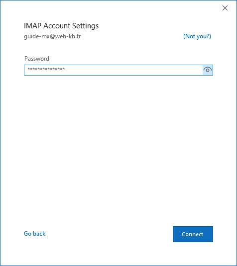
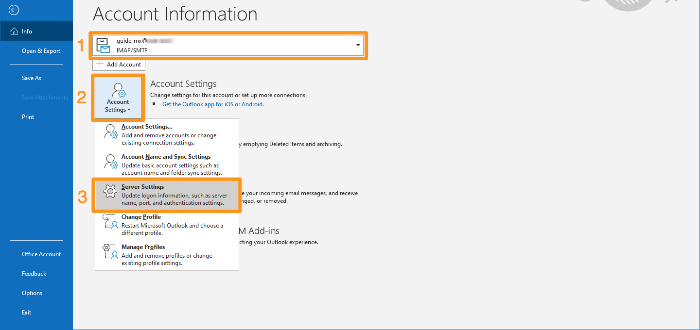

**Last updated 5th June 2021**

## Objective

You can configure MX Plan accounts on email clients, if they are compatible. By doing so, you can use your email address through your preferred email application.

**This guide explains how to configure your MX Plan email address in Outlook 2016 or later for Windows.**

> [!warning]
> This guide will show you how to use one or more OVHcloud solutions with external tools, and the changes you need to make in specific contexts. You may need to adapt the instructions according to your situation.
>
> If you experience any difficulties carrying out these operations, we recommend that you contact a [specialist service provider](https://partner.ovhcloud.com/en-sg/directory/) and/or discuss the issue with our community. OVHcloud cannot provide you with technical support in this regard. You can find more information in the [Go further](#gofurther) section of this guide.
>

## Requirements

- an MX Plan email address, available as part of our [Web Hosting plans](https://www.ovhcloud.com/en-sg/web-hosting/)
- Microsoft Outlook 2016 or later installed on your device
- login credentials for the email account to be configured
 
> [!primary]
>
> Are you using Outlook 2016 for Mac? Refer to our documentation: [Configuring an email address in Outlook 2016](../configuration-outlook-2016-mac/).
>

## Instructions

### Adding the account

- **When you start the application for the first time**: A setup wizard will appear and prompt you to enter your email address.

- **If you have already added an account**: Click `File`{.action} in the menu bar at the top of your screen, then `Add account`{.action}.

- Enter your email address, then click `Advanced options`{.action}. Tick the box next to `Let me set up my account manually`{.action}, then click `Connect`{.action}. 

{.thumbnail}

| | |
|---|---|
|{.thumbnail}|Choose between IMAP and POP from the list of account types.  We recommend using IMAP.|
|Enter your email password, then click `Next`{.action}. |{.thumbnail}|
|{.thumbnail}|If Outlook was unable to automatically configure your address, this window will appear.  Click `Change Account Settings`{.action} |
|Enter in **Incoming mail**:  - Server **ssl0.ovh.net**  - Port **993** - Encryption method **SSL/TLS**  Enter in **Outgoing mail**:  - Server **ssl0.ovh.net**  - Port **465** - Encryption method **SSL/TLS**  Click `Next`{.action} to confirm. |{.thumbnail}|

For **POP** configuration, the values are:

|Server type|Server name|Encryption method|Port|
|---|---|---|---|
|Incoming|ssl0.ovh.net|SSL/TLS|995|
|Outgoing|ssl0.ovh.net|SSL/TLS|465|

### Using your email address

Once you have configured your email address, you can start using it! You can now send and receive emails.

OVHcloud also has a web application you can use to access your email address from your browser. You can access this application at <https://www.ovh.com/sg/mail/>. You can log in using your email credentials. If you have any questions about how to use this interface, please refer to our guide on [Using the Outlook Web App](https://docs.ovh.com/gb/en/microsoft-collaborative-solutions/exchange_2016_outlook_web_app_user_guide/).

### Retrieving a backup of your email address

If you need to make a change that could lead to the loss of your email account data, we advise you to make a backup of the email account concerned beforehand. To do this, please read the "**Exporting from Windows**" section in our guide on [Migrating your email address manually](../migrate-email-addresses-manually/#exporting-from-windows).

### Modifying existing settings

If your email account has already been set up and you need to access the account settings to change them:

- Go to `File`{.action} **(1)** from the menu bar at the top of your screen, then select the account you want to modify in the drop-down menu.
- Click `Account Settings`{.action} **(2)** below.
- Click `Server Settings`{.action} **(3)** to access the settings window.

{.thumbnail}

The window is divided into two parts, **Incoming Mail** and **Outgoing Mail**. Click either to edit them.

{.thumbnail}

## Go further 

Join our community of users on <https://community.ovh.com/en/>.
