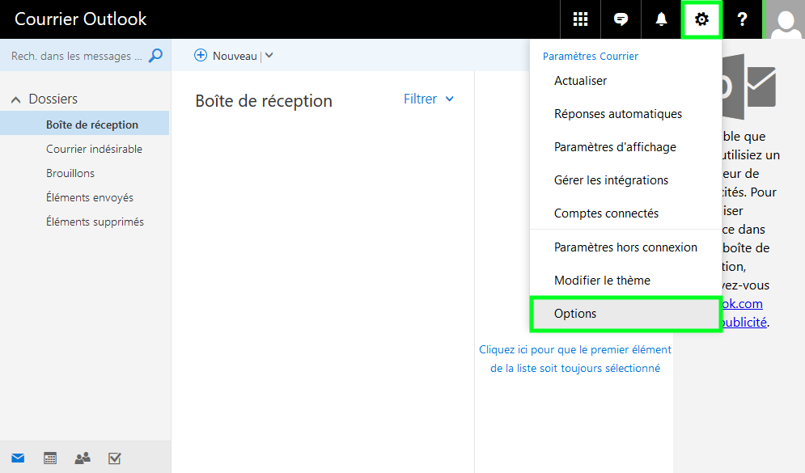
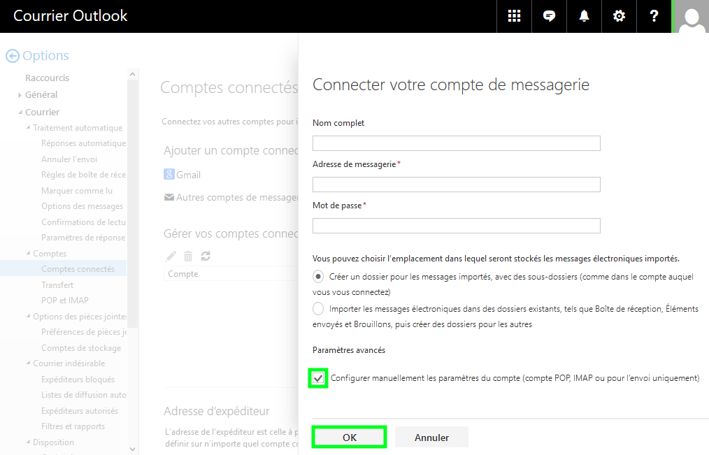
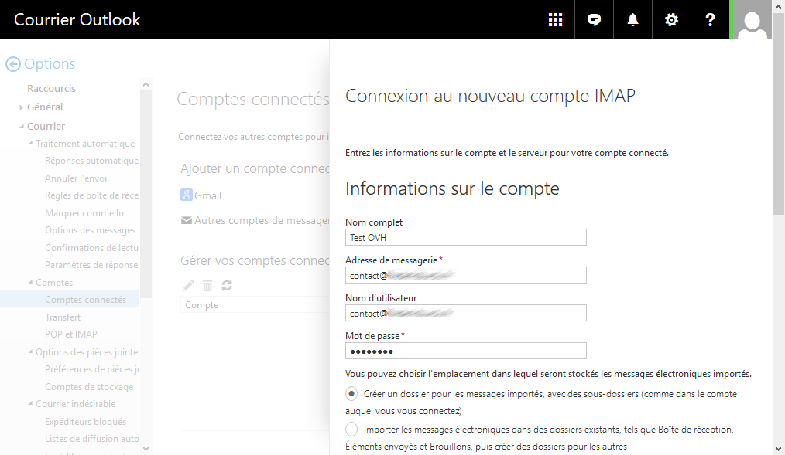
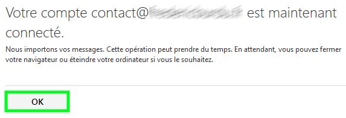
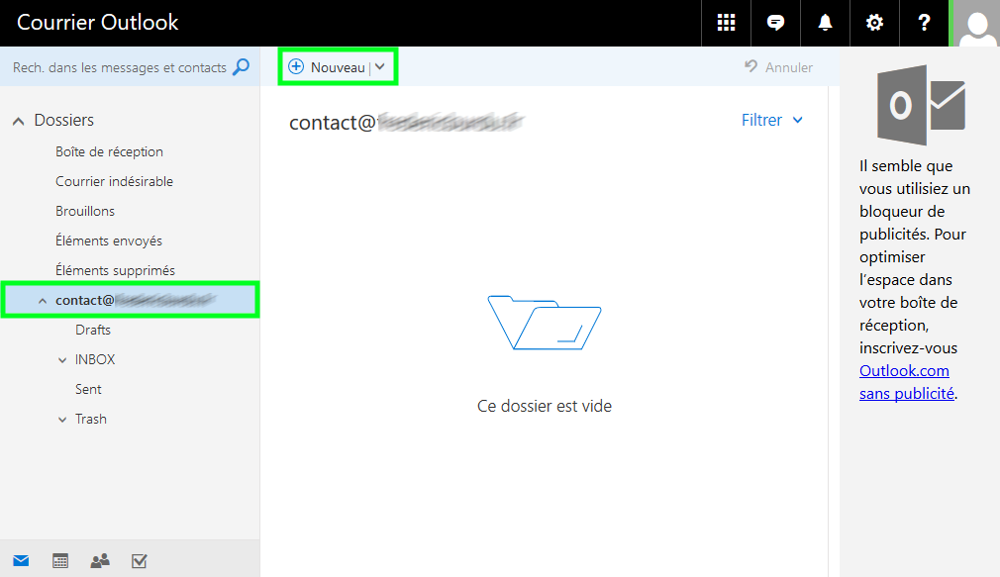

[Cliquez ici]({legacy}1474){.ref} pour retrouver nos différents guides de configuration e-mail.

> [!warning]
>
> OVH met à votre disposition des services dont la configuration, la gestion et la responsabilité vous incombent. Il vous revient de ce fait d'en assurer le bon fonctionnement.
> 
> Nous mettons à votre disposition ce guide afin de vous accompagner au mieux sur des tâches courantes. Néanmoins, nous vous recommandons de faire appel à un prestataire spécialisé et/ou de contacter l'éditeur du service si vous éprouvez des difficultés. En effet, nous ne serons pas en mesure de vous fournir une assistance. Plus d'informations dans la section « Aller plus loin » de ce guide.
> 

## Généralités

### Prérequis

> [!primary]
>
> - 
> Disposer d'une adresse e-mail OVH fonctionnelle
> - 
> Disposer d'une adresse e-mail outlook.com
> 
> 

## Configuration du webmail outlook.com

### Demarrage et configuration
Voici comment réaliser votre configuration en  **IMAP**  avec  **SSL** activé.

- Rendez-vous sur votre webmail outlook.com, cliquez sur `Paramètres`{.action}, puis `Options`{.action}.

{.thumbnail}

- Rendez-vous dans le menu "**Courrier**", puis "**Comptes**", et enfin "**Comptes connectés**" afin de cliquer sur `Autres comptes de messagerie`{.action}.

{.thumbnail}

- Cochez la case "**Configurer manuellement...**"", puis cliquez sur `Ok`{.action}.

{.thumbnail}

- Cochez "**Paramètres de connexion IMAP/SMTP**", puis cliquez sur `Ok`{.action}.

{.thumbnail}

- Remplissez les différents champs demandés puis cliquez sur `Ok`{.action}:

|---|---|
|Nom complet|Le nom qui s'affichera chez le destinataire|
|Adresse de messagerie|Votre adresse e-mail OVH|
|Nom d'utilisateur|Votre adresse e-mail OVH|
|Mot de passe|Le mot de passe de votre adresse e-mail OVH|
|Serveur entrant (IMAP)|SSL0.OVH.NET|
|Port de serveur entrant|993|
|Chiffrement|SSL|
|Serveur sortant (SMTP)|SSL0.OVH.NET|
|Port de serveur sortant|587|

{.thumbnail}

{.thumbnail}

- Un message vous indiquera que votre compte est en cours d'importation. Cliquez sur `Ok`{.action}.

{.thumbnail}

> [!primary]
>
> A cette étape, il est recommandé de fermer la page outlook.com, puis de la réouvrir quelques instants plus tard afin que l'importation se finalise.
> 

Il vous sera ensuite possible de visualiser votre adresse e-mail OVH.

- Cliquez sur `Nouveau`{.action}.

{.thumbnail}

- Cliquez sur le bouton "**...**" puis sur le bouton `Afficher le champ De`{.action}.

{.thumbnail}

- Il vous est maintenant possible en cliquant sur le bouton "**De**" de choisir l'adresse e-mail expéditrice.

{.thumbnail}

- Vous pouvez maintenant écrire votre message, et cliquer sur `Envoyer`{.action}.

{.thumbnail}

### POP ou IMAP ?
Lors de la configuration, vous pouvez choisir le protocole "**POP**" au lieu de "**IMAP**".

Nous vous invitons à vous renseigner sur l'utilisation de ces deux protocoles avant de faire votre choix. Dans le doute, choisissez la configuration "**IMAP**".

### Configuration POP
Si vous désirez configurer votre compte en POP, choisissez ce protocole lors de l'ajout de votre compte e-mail OVH, puis indiquez ces paramètres :

|---|---|
|Nom complet|Le nom qui s'affichera chez le destinataire|
|Adresse de messagerie|Votre adresse e-mail OVH|
|Nom d'utilisateur|Votre adresse e-mail OVH|
|Mot de passe|Le mot de passe de votre adresse e-mail OVH|
|Serveur entrant (IMAP)|SSL0.OVH.NET|
|Port de serveur entrant|995|
|Chiffrement|SSL|
|Serveur sortant (SMTP)|SSL0.OVH.NET|
|Port de serveur sortant|587|

## Aller plus loin

Échangez avec notre communauté d'utilisateurs sur <https://community.ovh.com>.