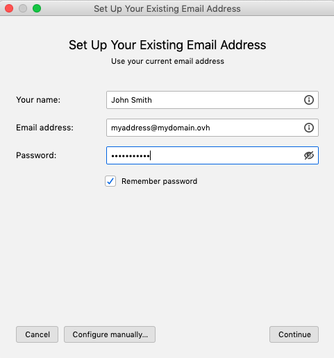
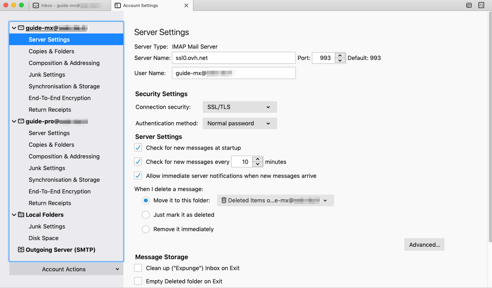
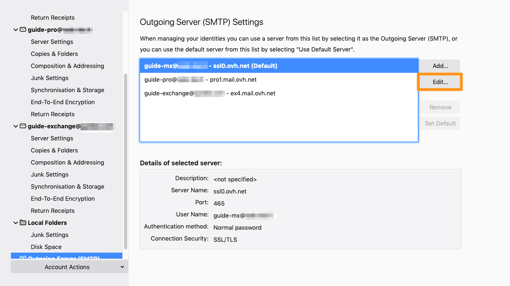

> [!primary]
> Diese Übersetzung wurde durch unseren Partner SYSTRAN automatisch erstellt. In manchen Fällen können ungenaue Formulierungen verwendet worden sein, z.B. bei der Beschriftung von Schaltflächen oder technischen Details. Bitte ziehen Sie beim geringsten Zweifel die englische oder französische Fassung der Anleitung zu Rate. Möchten Sie mithelfen, diese Übersetzung zu verbessern? Dann nutzen Sie dazu bitte den Button «Mitmachen» auf dieser Seite.
>

**Letzte Aktualisierung am 26.08.2021**

## Ziel

MX Plan Accounts können auf verschiedenen kompatiblen E-Mail-Clients eingerichtet werden. So können Sie Ihr bevorzugtes Gerät für Ihre E-Mail-Adressen verwenden. Thunderbird ist ein freier E-Mail-Client.

**Diese Anleitung erklärt, wie Sie Ihre MX Plan E-Mail-Adresse auf macOS einrichten.**

> [!warning]
> In dieser Anleitung erläutern wir die Verwendung einer oder mehrerer OVHcloud Lösungen mit externen Tools. Die durchgeführten Aktionen werden in einem bestimmten Kontext beschrieben. Denken Sie daran, diese an Ihre Situation anzupassen.
>
> Wir empfehlen Ihnen jedoch, sich bei Schwierigkeiten an einen [spezialisierten Dienstleister](https://partner.ovhcloud.com/de/directory/) zu wenden, und/oder Ihre Fragen in der OVHcloud Community zu stellen. Leider können wir Ihnen für externe Dienstleistungen keine weitergehende Unterstützung anbieten. Weitere Informationen finden Sie am [Ende dieser Anleitung](#gofurther).
>

## Voraussetzungen

- Sie verfügen über eine MX Plan E-Mail-Adresse (als MX Plan Dienst oder in einem [OVHcloud Webhosting](https://www.ovhcloud.com/de/web-hosting/) enthalten).
- Thunderbird ist auf Ihrem macOS-System installiert.
- Sie verfügen über Anmeldeinformationen für die E-Mail-Adresse, die Sie konfigurieren möchten.
 
## In der praktischen Anwendung

### Account hinzufügen

- **Wenn Sie die Anwendung zum ersten Mal starten**: Es öffnet sich ein Konfigurationsassistent und Sie werden dazu aufgefordert, Ihre E-Mail-Adresse einzugeben.

- **Falls Sie bereits einen Account eingerichtet haben**: Klicken Sie am oberen Rand Ihres Bildschirms auf `Datei`{.action}, dann `Neu`{.action} und anschließend auf `Konto`{.action}.

| | |
|---|---|
|{.thumbnail}|Geben Sie im angezeigten Fenster die folgenden Informationen ein:  \- Gewünschter Anzeigename \- E-Mail-Adresse  \- Passwort|
|Klicken Sie anschließend auf `Manuell konfigurieren...`{.action} um die Einstellungen für **Eingangserver** einzugeben:  \- Protokoll **IMAP**  \- Server **ssl0.ovh.net**  \- Port **993**  \- SSL **SSL/TLS**  \- Authentifizierung **Normales Passwort**  \- Benutzername **Vollständige E-Mail-Adresse**|{.thumbnail}|
|{.thumbnail}|Geben Sie die Einstellungen für **Ausgangserver** an:  \- Protokoll **SMTP**  \- Server **ssl0.ovh.net**  \- Port **465**  \- SSL **SSL/TLS**  \- Authentifizierung **Normales Passwort**  \- Benutzername **Vollständige E-Mail-Adresse**  Um die Konfiguration abzuschließen, klicken Sie auf `Fertig`{.action}.|

Für eine **POP** Konfiguration verwenden Sie die folgenden Werte:

|Server-Typ|Servername|Verschlüsselungsmethode|Port|
|---|---|---|---|
|Eingangsserver|ssl0.ovh.net|SSL/TLS|995|
|Ausgangsserver|ssl0.ovh.net|SSL/TLS|465|

### E-Mail-Adresse verwenden

Sobald Ihre E-Mail-Adresse eingerichtet ist, können Sie sie verwenden. Sie können ab sofort E-Mails versenden und empfangen.

OVHcloud bietet auch eine Webanwendung an, mit der Sie über Ihren Webbrowser auf Ihre E-Mail-Adresse zugreifen können: <https://www.ovh.de/mail/>. Sie können sich mit den Login-Daten Ihrer E-Mail-Adresse anmelden. Bei Fragen zu dessen Verwendung können Sie unsere Anleitung zur [Outlook Web App](../../microsoft-collaborative-solutions/exchange_2016_verwendung_der_outlook_web_app/) (oder [RoundCube Webmail](https://docs.ovh.com/de/emails/webmail_verwendung_von_roundcube/)) heranziehen.

### Backup Ihrer E-Mail-Adresse

Wenn Sie eine Änderung vornehmen, die den Verlust der Daten Ihres E-Mail-Accounts zur Folge haben könnte, empfehlen wir Ihnen eine vorherige Sicherung des betreffenden E-Mail-Accounts. Folgen Sie hierzu dem Abschnitt "**Exportieren**" im Bereich "**Thunderbird**" der Anleitung zur [manuellen Migration eines Accounts](https://docs.ovh.com/de/emails/email-adressen-manuell-migrieren/#exportieren_1).

### Bestehende Einstellungen ändern

Wenn Ihr E-Mail-Account bereits eingerichtet ist und Sie auf die Account-Einstellungen zugreifen müssen, um diese zu ändern:

- Öffnen Sie `Extras`{.action} über die Menüleiste oben.
- Klicken Sie auf `Konten-Einstellungen`{.action}.

{.thumbnail}

- Um die Einstellungen für den **Empfang** Ihrer E-Mails zu ändern, klicken Sie in der linken Spalte unter der E-Mail-Adresse auf `Server-Einstellungen`{.action}.

{.thumbnail}

- Um die Einstellungen für den **Versand** Ihrer E-Mails zu ändern, klicken Sie auf `Postausgang-Server (SMTP)`{.action} unten in der linken Spalte.
- Klicken Sie auf die entsprechende E-Mail-Adresse in der Liste und anschließend auf `Ändern`{.action}.

{.thumbnail}

## Weiterführende Informationen 

Für den Austausch mit unserer User Community gehen Sie auf <https://community.ovh.com/en/>.