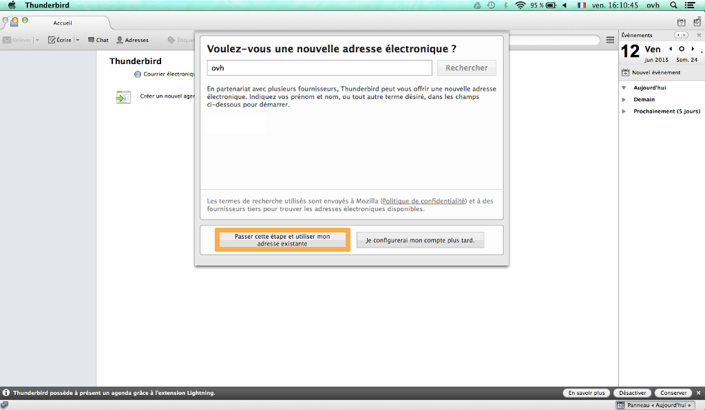
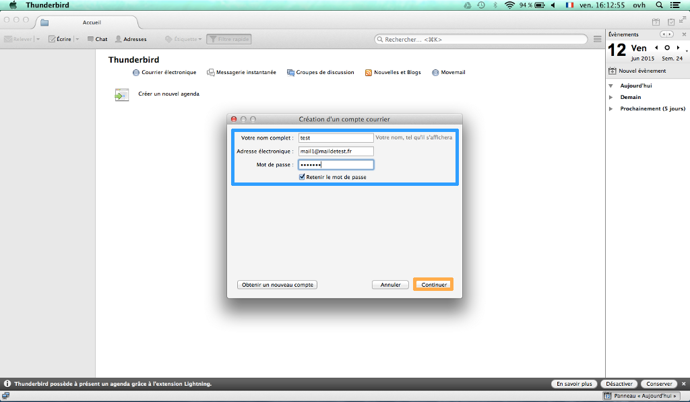
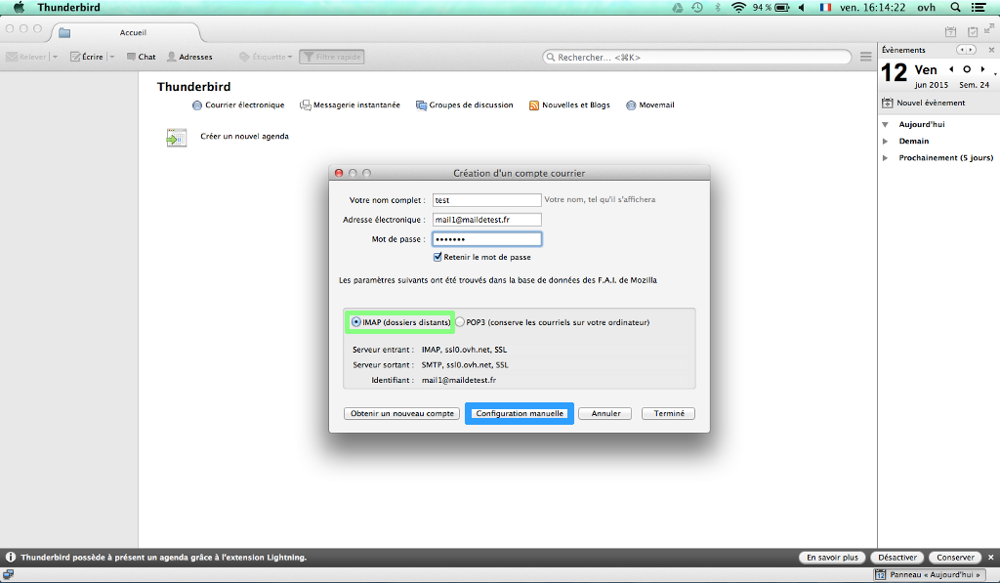
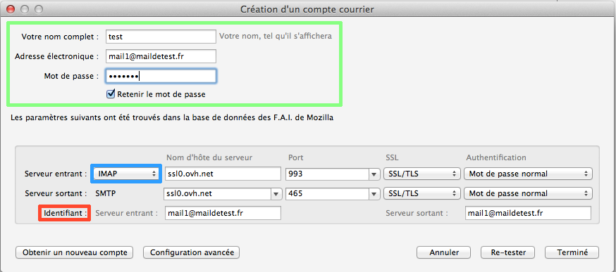
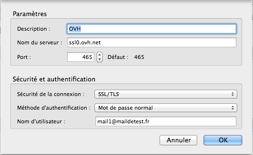

## Parte 1: Inicio
En primer lugar, acceda a la aplicación «Thunderbird» instalada en Mac. 

Esta es la interfaz que aparecerá por defecto si no tiene ninguna dirección de correo configurada. Si no, acceda al menú para agregar una nueva cuenta. 

Para instalar su cuenta de correo, seleccione la opción «Saltarse esto y usar mi cuenta de correo».

{.thumbnail}

## Parte 2: Creación de la cuenta
«Su nombre»: Su nombre, tal y como se muestra a los demás.

«Dirección de correo»: Su dirección completa de correo. 

«Contraseña»: La contraseña que haya definido en su área de cliente para esa cuenta de correo compartido.

«Recordar contraseña»: Debe marcar esta opción. 

Haga clic en «Continuar» para proseguir con la instalación.

{.thumbnail}

## Parte 3: Creación de la cuenta - Continuación
Thunderbird recupera los parámetros de la dirección de correo y le propone dos tipos de configuración: IMAP o POP3.

En nuestro ejemplo, vamos a configurar la cuenta con IMAP, aunque se puede configurar igualmente en POP. Al final de esta guía encontrará información relativa a la configuración de una cuenta de correo de tipo POP3. 

Thunderbird propone una configuración manual. 

Haga clic en «Config. manual» para proseguir con la instalación.

{.thumbnail}

## Parte 4: Configuración de los parámetros del servidor
Compruebe que los parámetros son correctos:
Para el servidor entrante:
Entrante: «IMAP»
Nombre del servidor: «SSL0.OVH.NET»
Puerto: «993»
SSL: «SSL/TLS»
Identificación: «Contraseña normal»

{.thumbnail}
Para el servidor saliente:
Saliente: «SMTP»
Nombre del servidor: «SSL0.OVH.NET»
Puerto: «465»
SSL: «SSL/TLS»
Identificación: «Contraseña normal»
Identificador entrante y saliente: «Dirección completa de correo»
Haga clic en «Hecho» para completar la instalación.

## Parte 5: Parámetros del servidor & servidor de salida (SMTP)
Una vez creada la cuenta, podrá acceder a los distintos parámetros del servidor. 

Haga clic en «Servidor de salida (SMTP)» para verificar la información introducida en el servidor saliente.

{.thumbnail}

## Parte 6: Parámetros del servidor & servidor de salida (SMTP) - Continuación
Estos son los parámetros SMTP que debe introducir:
Nombre del servidor: «SSL0.OVH.NET»
Puerto: «465»
Seguridad de la conexión: «SSL/TLS»
Método de identificación: «Contraseña normal»
Nombre de usuario: «Dirección completa de correo

Haga clic en «Aceptar» para validar la configuración del SMTP.

{.thumbnail}

## Configuración POP
A continuación, le indicamos cómo configurar una cuenta de correo POP.

Configuración POP con seguridad SSL activada o desactivada:

Dirección de correo: Su dirección completa de correo.

Contraseña: La contraseña que haya definido en su [área de cliente](https://www.ovh.com/managerv3/).

Nombre de usuario: Su dirección completa de correo.

Entrante: El servidor de recepción de correos: SSL0.OVH.NET

Puerto del servidor entrante: El puerto del servidor entrante: 995 o 110

Saliente: El servidor de envío de correos: SSL0.OVH.NET

Puerto del servidor saliente: El puerto del servidor saliente: 465 o 587

Los puertos 110 y 587 corresponden a la seguridad SSL desactivada.
Los puertos 995 y 465 corresponden a la seguridad SSL activada.

- Debe activar obligatoriamente la identificación[/url] del servidor saliente SMTP.

|Puertos|SSLactivado|SSLdesactivado|
|Entrante|995|110|
|Saliente|465|587|

## Configuración IMAP
A continuación, le indicamos cómo configurar una cuenta de correo IMAP.

Configuración IMAP con seguridad SSL activada o desactivada:

Dirección de correo: Su dirección completa de correo.

Contraseña: La contraseña que haya definido en su [área de cliente](https://www.ovh.com/managerv3/).

Nombre de usuario: Su dirección completa de correo.

Entrante: El servidor de recepción de correos: SSL0.OVH.NET

Puerto del servidor entrante: El puerto del servidor entrante: 993 o 143

Saliente: El servidor de envío de correos: SSL0.OVH.NET

Puerto del servidor saliente: El puerto del servidor saliente: 465 o 587

Los puertos 143 y 587 corresponden a la seguridad SSL desactivada.
Los puertos 993 y 465 corresponden a la seguridad SSL activada.

- Debe activar obligatoriamente la identificación[/url] del servidor saliente SMTP.

|Puertos|SSLactivado|SSLdesactivado|
|Entrante|993|143|
|Saliente|465|587|

