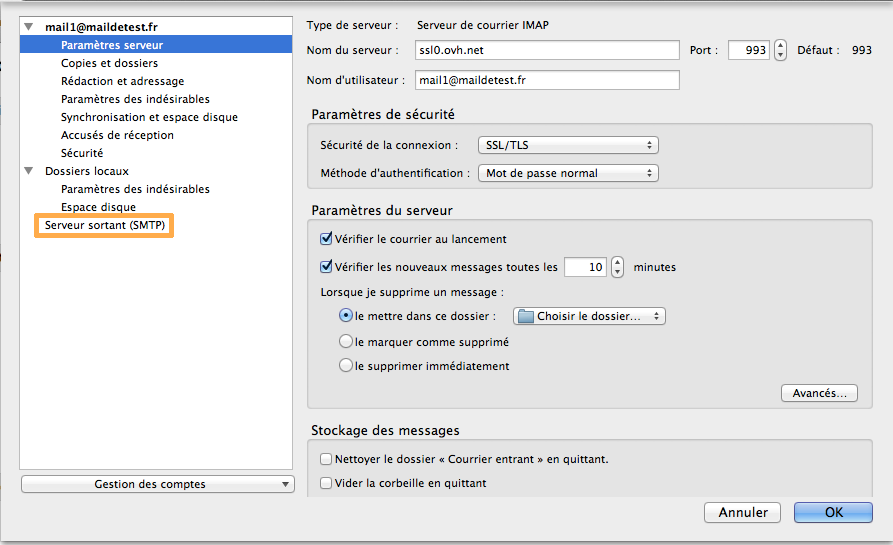

> [!warning]
>
> OVH met à votre disposition des services dont la configuration, la gestion et la responsabilité vous incombent. Il vous revient de ce fait d'en assurer le bon fonctionnement.
> 
> Nous mettons à votre disposition ce guide afin de vous accompagner au mieux sur des tâches courantes. Néanmoins, nous vous recommandons de faire appel à un prestataire spécialisé et/ou de contacter l'éditeur du service si vous éprouvez des difficultés. En effet, nous ne serons pas en mesure de vous fournir une assistance. Plus d'informations dans la section « Aller plus loin » de ce guide.
> 

## Configuration de Thunderbird sous Mac

### Demarrage
Dans un premier temps, rendez-vous dans l'application "Thunderbird" installée sur votre Mac.

Voici l'interface qui apparaîtra par défaut si vous n'avez pas d'adresse e-mail configurée. Sinon, allez dans le menu pour lancer l'ajout d'un nouveau compte.

Afin de poursuivre l'installation du compte e-mail, sélectionnez "Passer cette étape et utiliser mon adresse existante" pour continuer.

{.thumbnail}

### Création du compte
"Votre nom complet" : renseignez ici le nom d'affichage désiré.

"Adresse électronique" : votre adresse e-mail entière.

"Mot de passe" : le mot de passe défini dans votre espace client pour le compte e-mail mutualisé.

"Retenir le mot de passe" : vous devez cocher cette option.

Cliquez sur "Continuer" pour poursuivre les étapes d'installation.

{.thumbnail}

### Création du compte (suite)
Thunderbird récupère les paramètres de l'adresse e-mail et vous propose deux configurations possibles :  **IMAP**  ou POP3.

Dans notre exemple, on configure le compte en  **IMAP**  mais il vous est tout à fait possible de le configurer en POP. Vous retrouverez à la fin de ce guide les informations de configuration pour un compte mail de type POP3.

À noter que Thunderbird propose une configuration manuelle.

Cliquez sur "Configuration manuelle" pour poursuivre les étapes d'installation.

{.thumbnail}

### Configuration des parametres serveurs
Vérifiez que ces paramètres sont correctement renseignés :

Pour la première ligne Serveur entrant :

Serveur entrant : IMAP

Nom d'hôte du serveur : SSL0.OVH.NET

Port : 993

SSL : SSL/TLS

Authentification : Mot de passe normal

{.thumbnail}

Pour la seconde ligne Serveur sortant :

Serveur sortant : SMTP

Nom d'hôte du serveur : SSL0.OVH.NET

Port : 465

SSL : SSL/TLS

Authentification : Mot de passe normal

Identifiant serveur entrant & sortant : votre adresse e-mail entière

Cliquez sur "Terminé" pour finaliser l'installation.

### Parametres serveur &amp; Serveur Sortant (SMTP)
Le compte étant maintenant ajouté, vous trouverez les différents paramètres serveur.

Cliquez sur "Serveur sortant (SMTP)" pour vérifier les informations renseignées pour le serveur sortant.

{.thumbnail}

### Parametres serveur &amp; Serveur Sortant (SMTP) suite
Voici les paramètres SMTP à renseigner : Nom du serveur : SSL0.OVH.NET Port : 465 Sécurité de la connexion : SSL/TLS Méthode d'authentification : Mot de passe normal Nom d'utilisateur : votre adresse e-mail entière

Cliquez sur  **"Ok"**  pour valider les informations du SMTP.

{.thumbnail}

## Rappel des parametres POP - IMAP

### Configuration POP
Voici les informations à retenir pour la configuration d'un compte e-mail **POP** .

Configuration  **POP**  avec sécurisation SSL activée ou désactivée :

Adresse Email : Votre adresse e-mail mutualisée entière. Mot de passe : Le mot de passe que vous avez défini dans [l'espace client](https://www.ovh.com/managerv3/){.external}. Nom d'utilisateur : Votre adresse e-mail mutualisée entière. Serveur entrant : Le serveur de réception des e-mails :  **SSL0.OVH.NET** Port serveur entrant : Le port du serveur entrant :  **995**  ou  **110** Serveur sortant : Le serveur d'envoi des e-mails :  **SSL0.OVH.NET** Port serveur sortant : Le port du serveur sortant :  **465**  ou  **587**

Les ports  **110**  et  **587**  correspondent à la sécurisation SSL désactivée. Les ports  **995**  et  **465**  correspondent à la sécurisation SSL activée.

- Vous devez obligatoirement activer [l'authentification](#parametres_des_comptes_parametres_du_serveur_sortant_smtp){.external} du serveur sortant SMTP.

|Ports|SSL activé|SSL désactivé|
|---|---|---|
|Entrant|995|110|
|Sortant|465|587|

### Configuration IMAP
Voici les informations à retenir pour la configuration d'un compte e-mail **IMAP** .

Configuration  **IMAP**  avec sécurisation SSL activée ou désactivée :

Adresse Email : Votre adresse e-mail mutualisée entière. Mot de passe : Le mot de passe que vous avez défini dans [l'espace client](https://www.ovh.com/managerv3/){.external}. Nom d'utilisateur : Votre adresse e-mail mutualisée entière. Serveur entrant : Le serveur de réception des e-mails :  **SSL0.OVH.NET** Port serveur entrant : Le port du serveur entrant :  **993**  ou  **143** Serveur sortant : Le serveur d'envoi des e-mails :  **SSL0.OVH.NET** Port serveur sortant : Le port du serveur sortant :  **465**  ou  **587**

Les ports  **143**  et  **587**  correspondent à la sécurisation SSL désactivée. Les ports  **993**  et  **465**  correspondent à la sécurisation SSL activée.

- Vous devez obligatoirement activer [l'authentification](#parametres_des_comptes_parametres_du_serveur_sortant_smtp){.external} du serveur sortant SMTP.

|Ports|SSL activé|SSL désactivé|
|---|---|---|
|Entrant|993|143|
|Sortant|465|587|

## Aller plus loin

Échangez avec notre communauté d'utilisateurs sur <https://community.ovh.com>.