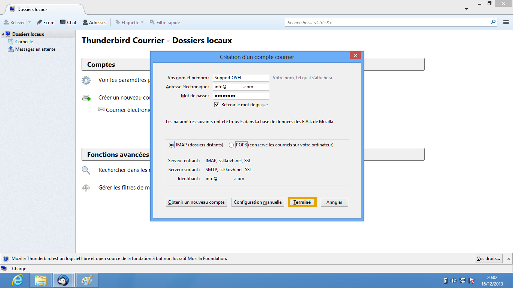
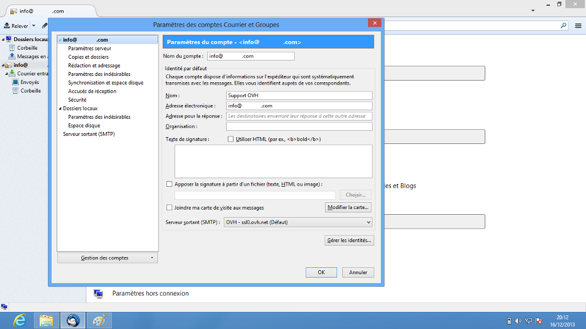
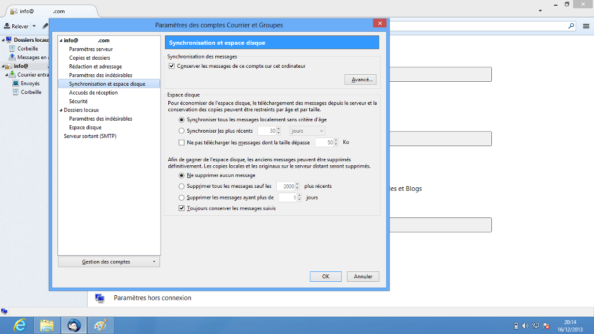
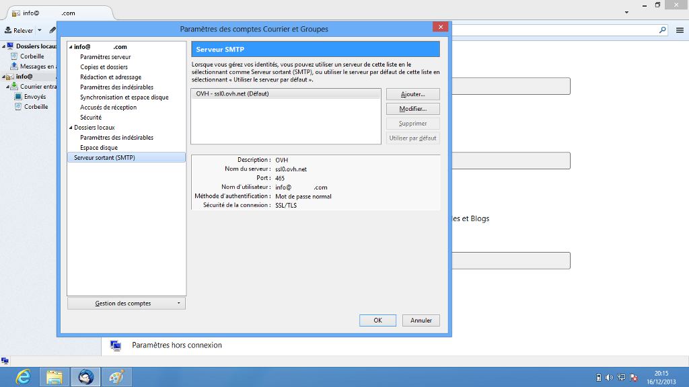
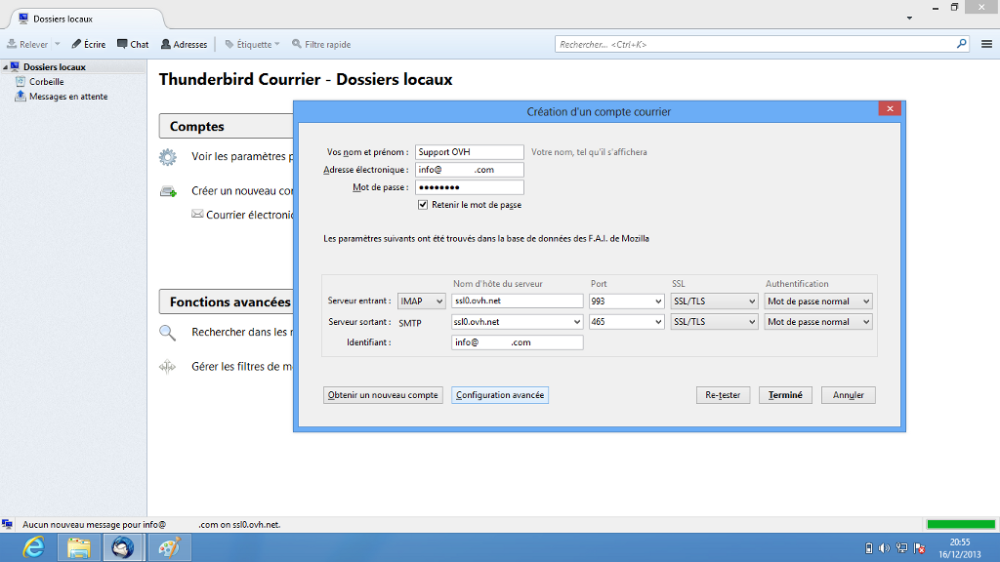

## Etapa 1: Inicio
Para comenzar, acceda a la aplicación Thunderbird instalada en su equipo.

Si no hay ninguna dirección de correo configurada, se abrirá la pantalla de la imagen por defecto. Si ya tiene alguna cuenta configurada, abra el menú para añadir una nueva cuenta.

Seleccione «Correo electrónico» para continuar.

{.thumbnail}

## Etapa 2: Inicio (continuación)
Para continuar la instalación de la dirección de correo electrónico, haga clic en «Saltarse esto y usar mi cuenta de correo existente».

{.thumbnail}

## Etapa 3: Crear la cuenta
Introduzca la información en los campos de texto:

Su nombre: Introduzca aquí el nombre que quiere que se muestre.
Dirección de correo: Dirección de correo electrónico completa.
Contraseña: La contraseña introducida en el [manager](https://www.ovh.com/auth/?action=gotomanager) para la cuenta de correo.
Recordar contraseña: Marque esta opción.

Thunderbird recuperará los ajustes de la dirección de correo y le ofrecerá dos configuraciones posibles: IMAP o POP3.

Haga clic en «Hecho» para finalizar la instalación.

En este ejemplo, hemos configurado la cuenta en IMAP. Para configurarla en POP3, [al final de esta guía](./#recordatorio_de_la_configuracion_pop_e_imap_configuracion_pop) encontrará los datos necesarios.

Thunderbird también permite la configuración manual, que se describe en el apartado de [«Configuración manual»](./#configuracion_manual) de esta guía.

{.thumbnail}

## Etapa 4: Finalizar
La cuenta de correo se habrá añadido automáticamente y podrá utilizarla.

Para consultar la configuración de la cuenta, haga clic en la dirección de correo para abrir el menú y seleccione «Ver configuración de esta cuenta».

{.thumbnail}

## Valores de configuración de la cuenta
Aquí encontrará la información general de la cuenta de correo.

Puede añadir una firma a sus mensajes de correo o indicar otra dirección de correo a la que responderán los destinatarios.

Asimismo, puede consultar y cambiar el servidor SMTP utilizado por la cuenta de correo.

{.thumbnail}

## Configuración del servidor
En este menú encontrará toda la información relativa al servidor de correo entrante.

También podrá configurar el intervalo de búsqueda de nuevos mensajes, la política de eliminación de los mensajes, etc.

{.thumbnail}

## Copias y carpetas
En este menú encontrará los distintos ajustes relativos a las carpetas, el envío de mensajes y el archivado.

{.thumbnail}

## Espacio en disco
Aquí puede elegir la forma en la que se sincroniza el correo y establecer las preferencias de eliminación de los mensajes.

{.thumbnail}

## Servidor de salida (SMTP)
Aquí puede añadir o editar los servidores SMTP configurados en la aplicación.

{.thumbnail}

## Servidor SMTP
Seleccionando el servidor SMTP y haciendo clic en «Editar», se abren los ajustes de configuración, que podrá modificar.

Es imprescindible activar la autenticación del servidor saliente SMTP seleccionando el método «Contraseña normal».

{.thumbnail}

- La autenticación por contraseña es imprescindible para que el envío de correo funcione en nuestros servidores SMTP.

- Si no se activa la autenticación por contraseña, puede abrirse un tíquet de incidencia Open SMTP para informarle de que la autenticación «POP before SMTP» no es compatible. Es necesario activar la autenticación por contraseña para poder enviar correo.

## Crear una cuenta manualmente
En el proceso de creación de una cuenta de correo electrónico (ver etapa 3), haga clic en «Config. manual» para establecer manualmente las preferencias de configuración de la cuenta de correo.

{.thumbnail}

## Configuración POP
A continuación recordamos los valores de configuración de una cuenta de correo POP.

Configuración POP con la protección SSL activada o desactivada:

Dirección de correo: Dirección de correo electrónico completa.
Contraseña: La contraseña introducida en el [manager](https://www.ovh.com/auth/?action=gotomanager) para la cuenta de correo.
Nombre de usuario: Dirección de correo electrónico completa.
Servidor entrante: El servidor de recepción del correo SSL0.OVH.NET.
Puerto del servidor entrante: 995 o 110.
Servidor saliente: El servidor de envío del correo SSL0.OVH.NET.
Puerto del servidor saliente: 465 o 587.

Los puertos 110 y 587 corresponden a la protección SSL desactivada.
Los puertos 995 y 465 corresponden a la protección SSL activada.

Es imprescindible activar la [autenticación del servidor saliente SMTP](./#configuracion_de_la_cuenta_servidor_de_salida_smtp).

|Puerto|SSL activado|SSL desactivado|
|Entrante|995|110|
|Saliente|465|587|

## Configuración IMAP
Los valores para la configuración de una cuenta de correo IMAP son los siguientes.

Configuración IMAP con la protección SSL activada o desactivada:

Dirección de correo: Dirección de correo electrónico completa.
Contraseña: La contraseña introducida en el [manager](https://www.ovh.com/auth/?action=gotomanager) para la cuenta de correo.
Nombre de usuario: Dirección de correo electrónico completa.
Servidor entrante: El servidor de recepción del correo SSL0.OVH.NET.
Puerto del servidor entrante: 993 o 143
Servidor saliente: El servidor de envío SSL0.OVH.NET.
Puerto del servidor saliente: 465 o 587.

Los puertos 143 y 587 corresponden a la protección SSL desactivada.
Los puertos 993 y 465 corresponden a la protección SSL activada.

Es imprescindible activar la [autenticación del servidor saliente SMTP](./#configuracion_de_la_cuenta_servidor_de_salida_smtp).

|Puerto|SSL activado|SSL desactivado|
|Entrante|993|143|
|Saliente|465|587|

