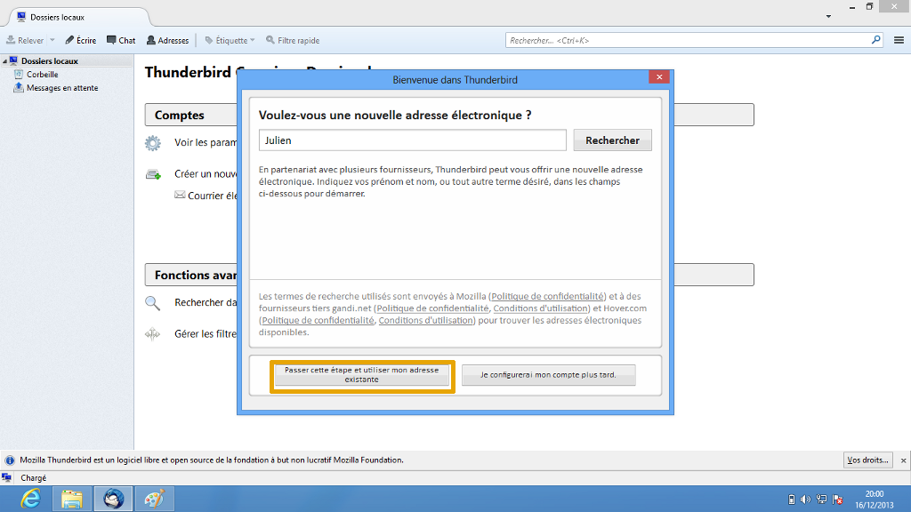
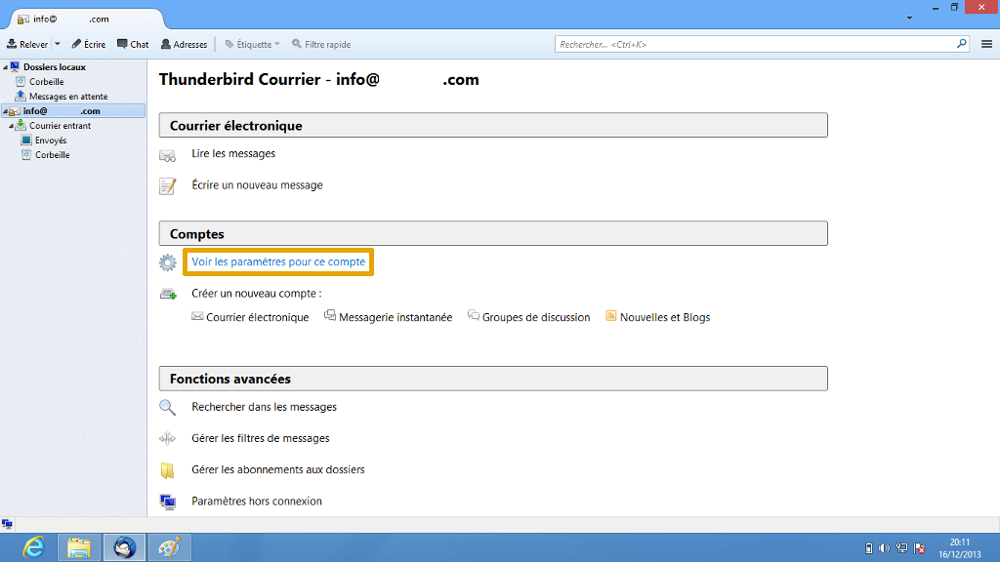
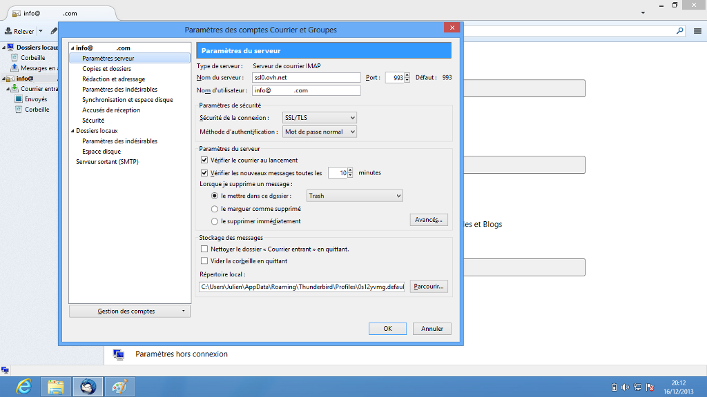
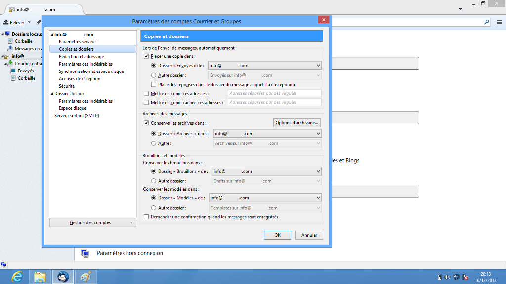
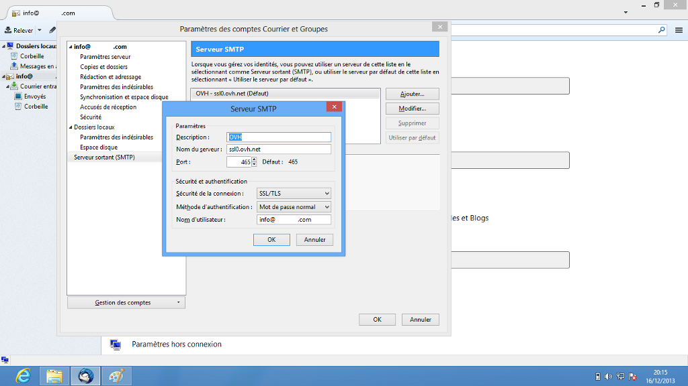

**Dernière mise à jour le 05/05/2020**

Cliquez [ici](http://www.ovh.com/ca/fr/hebergement-web/guides){.external} pour retrouver nos différents guides de configuration e-mail.

La configuration est réalisée sur la version 24.2.0 de Thunderbird.

> [!warning]
>
> OVHcloud met à votre disposition des services dont la configuration, la gestion et la responsabilité vous incombent. Il vous revient de ce fait d'en assurer le bon fonctionnement.
> 
> Nous mettons à votre disposition ce guide afin de vous accompagner au mieux sur des tâches courantes. Néanmoins, nous vous recommandons de faire appel à un prestataire spécialisé et/ou de contacter l'éditeur du service si vous éprouvez des difficultés. En effet, nous ne serons pas en mesure de vous fournir une assistance. Plus d'informations dans la section « Aller plus loin » de ce guide.
> 

## Configuration de Thunderbird

### Demarrage
Dans un premier temps, rendez-vous dans l'application "Thunderbird" installée sur votre poste.

Voici l'interface qui apparaîtra par défaut si vous n'avez pas d'adresse e-mail configurée. Sinon allez dans le menu pour lancer l'ajout d'un nouveau compte.

Sélectionnez "Courrier électronique" pour continuer.

{.thumbnail}

### Demarrage (suite)
Afin de poursuivre l'installation du compte e-mail, sélectionnez "Passer cette étape et utiliser mon adresse existante" pour continuer.

{.thumbnail}

### Création compte
Renseignez les champs affichés :

"Vos nom et prénom" : renseignez ici le nom d'affichage désiré.

"Adresse électronique" : votre adresse e-mail entière.

"Mot de passe" : le mot de passe défini dans votre [espace client](https://www.ovh.com/auth/?action=gotomanager){.external} pour le compte e-mail mutualisé.

"Retenir le mot de passe" : vous devez cocher cette option.

Thunderbird récupère les paramètres de l'adresse e-mail, et vous propose deux configurations possibles :  **IMAP**  ou  **POP3** .

*Dans notre exemple on configure le compte en IMAP. Il vous est tout à fait possible de le configurer en POP, vous retrouverez à la fin de ce guide les informations de configuration pour un compte mail de type POP3.*

*À noté que Thunderbird propose une configuration manuelle, vous retrouverez cet onglet dans la section "Configuration Manuelle" de notre guide.*

Cliquez sur "Terminé" pour finaliser les étapes d'installation.

{.thumbnail}

### Finalisation
À ce niveau votre adresse e-mail est automatiquement ajoutée et fonctionnelle.

Nous allons voir ensemble dans la suite de ce guide, les différents paramètres du compte. Pour cela sélectionnez  **"Voir les paramètres pour ce compte"**  après avoir cliqué sur l'adresse e-mail.

{.thumbnail}

## Parametres des comptes

### Parametres du compte
Vous trouvez ici les informations générales de votre compte e-mail.

Ici, vous pouvez ajouter une signature à vos e-mails, ou définir une autre adresse mail à laquelle vos destinataires répondront.

Vous pouvez également consulter et modifier le serveur SMTP utilisé par le compte e-mail.

{.thumbnail}

### Parametres du serveur entrant
Dans cette fenêtre vous trouverez toutes les informations concernant le serveur de courrier entrant.

Vous pouvez paramétrer le temps entre deux collectes de nouveaux e-mails, ou la politique de gestion de suppression des mails.

{.thumbnail}

### Copies et dossiers
À ce niveau vous trouverez les différents réglages concernant vos dossiers, l'envoi de messages, les archives.

{.thumbnail}

### Synchronisation et espace disque
Vous avez ici la possibilité de choisir la manière dont vos mails vont se synchroniser, définir vos choix sur la suppression ou non des messages.

{.thumbnail}

### Parametres du serveur sortant SMTP
Il vous est possible ici d'ajouter ou de modifier les serveurs SMTP configurés sur votre logiciel.

{.thumbnail}

### Parametres du serveur sortant SMTP &#58; (suite)
Vous retrouverez ici les différents paramètres modifiables, qui apparaîtront après avoir sélectionné votre serveur SMTP, et cliqué sur  **"Modifier"** .

- Vous devez obligatoirement activer l'authentification du serveur sortant SMTP.

Sélectionnez pour méthode d'authentification : Mot de passe normal

{.thumbnail}

> [!success]
>
> - 
> L'Authentification par Mot de passe est un paramétrage indispensable
> afin que l'émission d'email puisse fonctionner sur nos serveurs SMTP.
> - 
> Si l'authentification n'est pas effectuée par mot de passe, un ticket
> incident Open SMTP peut être ouvert vous informant que
> l'authentification "POP before SMTP" n'est pas supportée. Vous devrez
> impérativement activer l'authentification par Mot de passe afin de
> pouvoir émettre des emails.
> 
> 

## Configuration Manuelle

### Ajouter un compte manuellement
Voici ce qui apparaît après un clic sur  **"Configuration manuelle"**  (Cf. partie 3).

Vous pouvez définir vos paramètres de configuration du compte e-mail.

{.thumbnail}

## Rappel des parametres POP - IMAP

### Configuration POP
Voici les informations à retenir pour la configuration d'un compte e-mail **POP** .

Configuration  **POP**  avec sécurisation SSL activée ou désactivée :

Adresse Email : Votre adresse e-mail mutualisée entière.

Mot de passe : Le mot de passe que vous avez défini dans [l'espace client](https://www.ovh.com/auth/?action=gotomanager){.external}.

Nom d'utilisateur : Votre adresse e-mail mutualisée entière.

Serveur entrant : Le serveur de réception des e-mails :  **SSL0.OVH.NET**

Port serveur entrant : Le port du serveur entrant :  **995**  ou  **110**

Serveur sortant : Le serveur d'envoi des e-mails :  **SSL0.OVH.NET**

Port serveur sortant : Le port du serveur sortant :  **465**  ou  **587**

Les ports  **110**  et  **587**  correspondent à la sécurisation SSL désactivée.

Les ports  **995**  et  **465**  correspondent à la sécurisation SSL activée.

- Vous devez obligatoirement activer [l'authentification](#parametres_des_comptes_parametres_du_serveur_sortant_smtp){.external} du serveur sortant SMTP.

|Ports|SSL activé|SSL désactivé|
|---|---|---|
|Entrant|995|110|
|Sortant|465|587|

995465

### Configuration IMAP
Voici les informations à retenir pour la configuration d'un compte e-mail **IMAP** .

Configuration  **IMAP**  avec sécurisation SSL activée ou désactivée :

Adresse Email : Votre adresse e-mail mutualisée entière.

Mot de passe : Le mot de passe que vous avez défini dans [l'espace client](https://www.ovh.com/auth/?action=gotomanager){.external}.

Nom d'utilisateur : Votre adresse e-mail mutualisée entière.

Serveur entrant : Le serveur de réception des e-mails :  **SSL0.OVH.NET**

Port serveur entrant : Le port du serveur entrant :  **993**  ou  **143**

Serveur sortant : Le serveur d'envoi des e-mails :  **SSL0.OVH.NET**

Port serveur sortant : Le port du serveur sortant :  **465**  ou  **587**

Les ports  **143**  et  **587**  correspondent à la sécurisation SSL désactivée.

Les ports  **993**  et  **465**  correspondent à la sécurisation SSL activée.

- Vous devez obligatoirement activer [l'authentification](#parametres_des_comptes_parametres_du_serveur_sortant_smtp){.external} du serveur sortant SMTP.

|Ports|SSL activé|SSL désactivé|
|---|---|---|
|Entrant|993|143|
|Sortant|465|587|

## Aller plus loin

Échangez avec notre communauté d'utilisateurs sur <https://community.ovh.com>.
