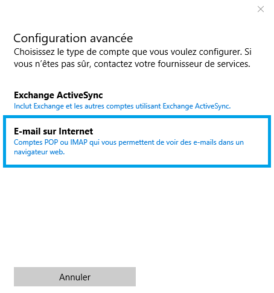
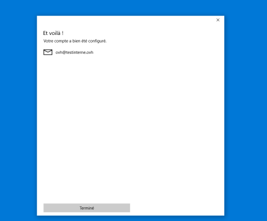
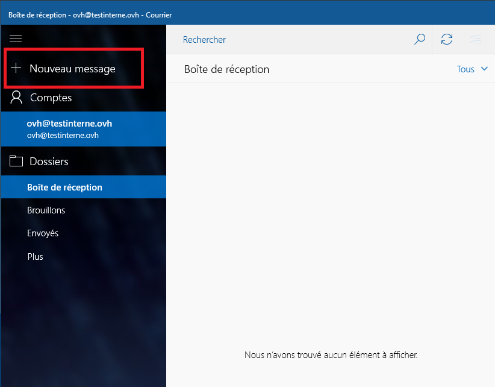
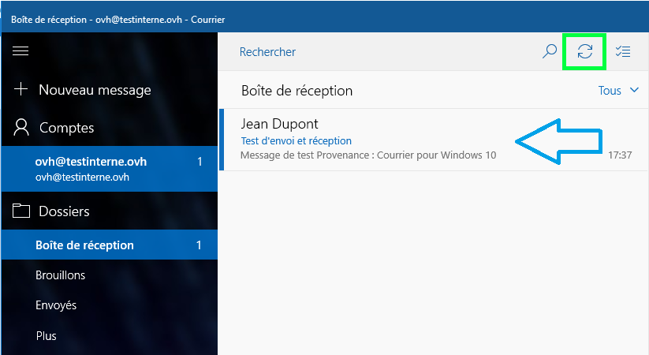

## Di cosa hai bisogno?

- Un account email OVH attivo
- Il client Posta, disponibile al momento dell'installazione di Windows 10

## Parte 1: avvio e configurazione
In questa guida configuriamo un account IMAP con protocollo SSL attivo.

{.thumbnail}
Apri l'app Posta e clicca su + Aggiungi un account.

{.thumbnail}
Clicca su Configurazione avanzata.

{.thumbnail}
Clicca su Email Internet.

{.thumbnail}
Inserisci le informazioni richieste:

- Nome account: il tuo indirizzo email OVH
- Il tuo nome: il tuo nome e cognome
- Server email in arrivo: ssl0.ovh.net
- Tipo di account: IMAP4
- Indirizzo email: il tuo indirizzo email OVH
- Nome utente: il tuo indirizzo email OVH
- Password: la password del tuo account email OVH
- Server email (SMTP) in uscita: ssl0.ovh.net
- Lascia selezionate le ultime 4 opzioni
- Clicca su "Accesso"

{.thumbnail}
Se hai inserito correttamente tutti i parametri, compare una finestra di conferma.
Clicca su "Fine".

{.thumbnail}

## Parte 2: esegui un test di invio e ricezione
Clicca su "+ Nuovo".

{.thumbnail}
Per inviarti il test, inserisci nel campo "A" lo stesso indirizzo presente nel campo "Da".
Scrivi il testo del messaggio e clicca su Invia.

{.thumbnail}
Aspetta qualche secondo e, se necessario, clicca sul pulsante per aggiornare la pagina.

Se ricevi il tuo messaggio, significa che il tuo account email OVH è configurato correttamente sulla tua app Posta di Windows 10.

{.thumbnail}

## Parte 3: POP o IMAP?
Durante la configurazione, puoi scegliere se utilizzare il protocollo POP o IMAP.

Prima di scegliere, ti consigliamo di informarti sull'utilizzo dei due protocolli. In caso di dubbio, scegli la configurazione IMAP.

