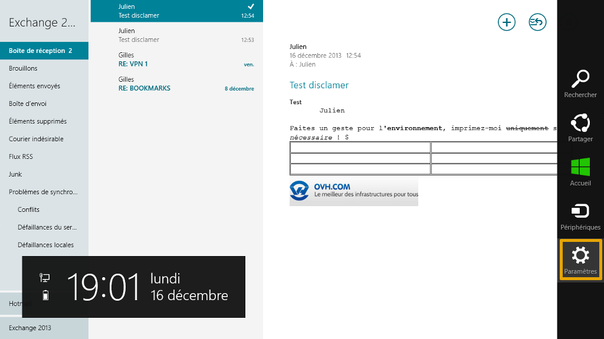
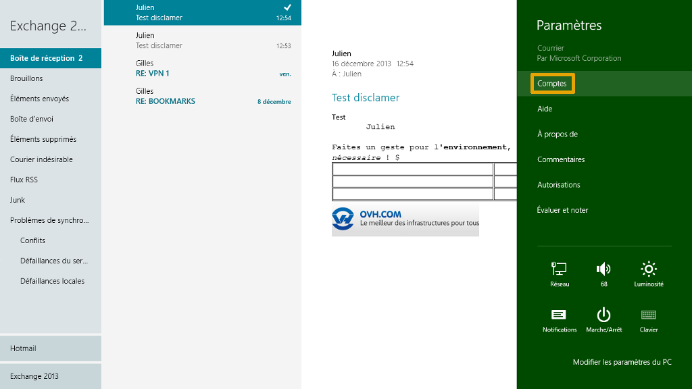
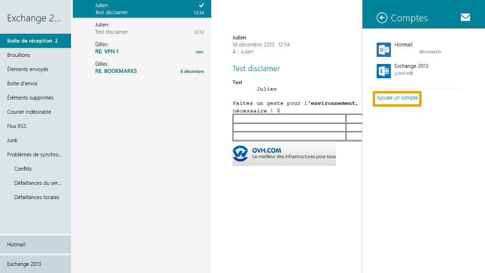
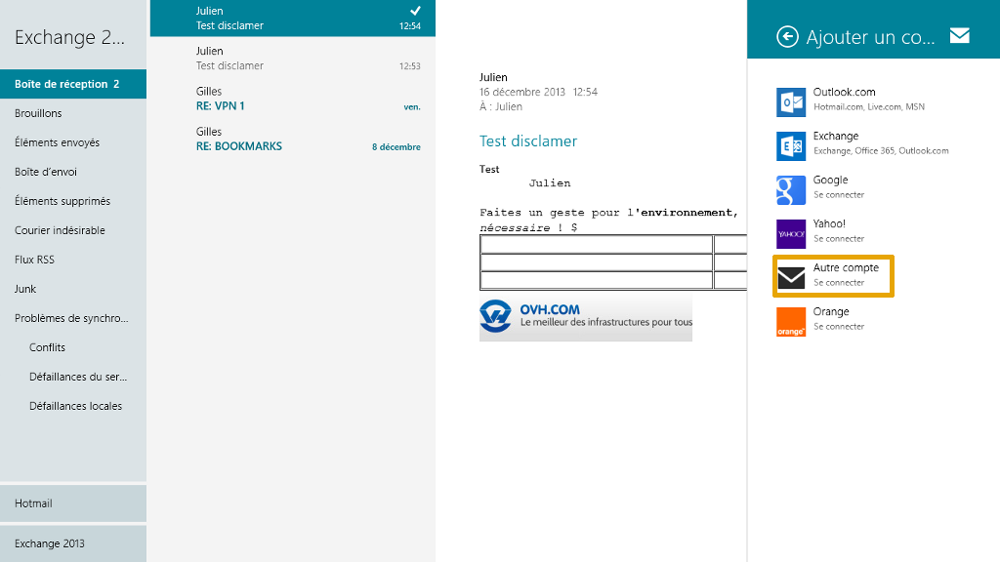
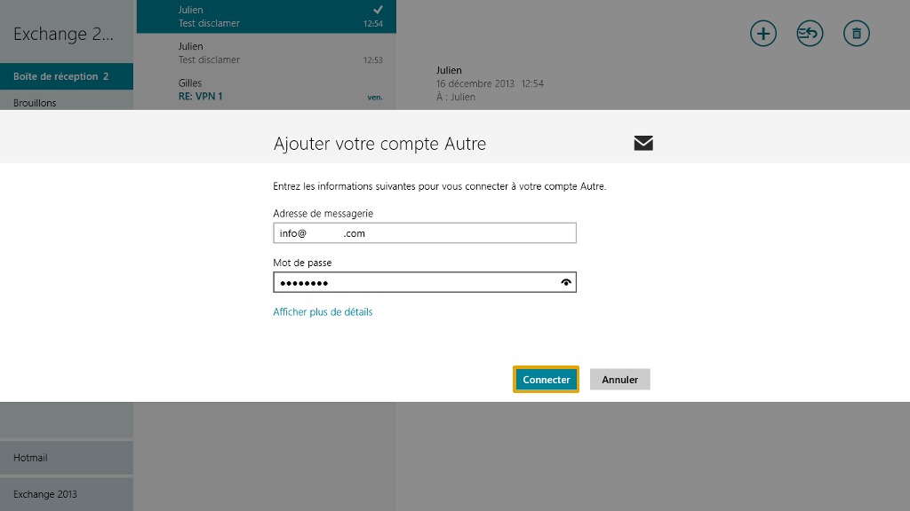
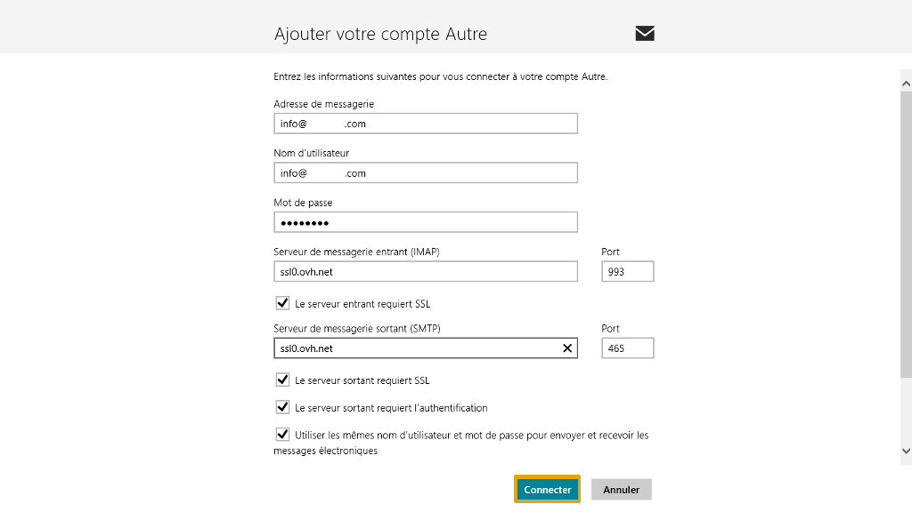
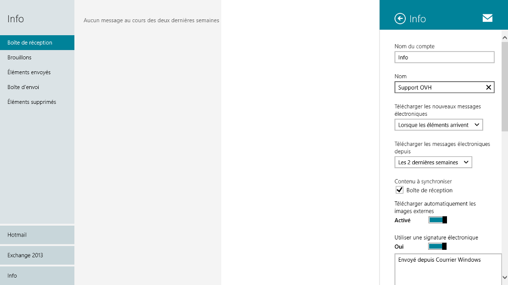

## Etapa 1: Inicio
Para comenzar, acceda a la aplicación «Correo» de Windows 8 en la pantalla de inicio del ordenador.

La primera vez que acceda, el sistema le pedirá que introduzca una dirección de correo y la contraseña.

Si ya tiene una cuenta, o una vez haya agregado la suya, se mostrará la pantalla de la imagen. Coloque el cursor en el lado derecho de la pantalla y seleccione «Configuración».

{.thumbnail}

## Etapa 2: Cuentas
A continuación haga clic en «Cuentas» para añadir su nueva cuenta de correo en alojamiento compartido OVH.

{.thumbnail}

## Etapa 3: Añadir una cuenta
En esta pantalla podemos ver que ya hay varias direcciones de correo electrónico.

Cuando haya añadido la cuenta de correo, podrá acceder a las preferencias de la cuenta haciendo clic en ella.

Haga clic en «Agregar una cuenta» para continuar.

{.thumbnail}

## Etapa 4: Tipo de cuenta
Ahora hay que seleccionar el tipo de cuenta de correo electrónico que se va a añadir.

Haga clic en «Otra cuenta» para continuar.

{.thumbnail}

## Etapa 5: Parámetros
En la nueva pantalla, cumplimente los campos:

- Dirección de correo electrónico: Dirección de correo electrónico OVH completa.
- Contraseña: La contraseña introducida en el [manager](https://www.ovh.es/managerv3/) para la cuenta de correo.

Haga clic en «Conectar» para continuar.

{.thumbnail}

## Etapa 6: Parámetros avanzados
En esta nueva pantalla, cumplimente los campos:

- Dirección de correo electrónico: Dirección de correo electrónico completa.
- Nombre de usuario: Dirección de correo electrónico completa.
- Contraseña: La contraseña introducida en el [manager](https://www.ovh.es/managerv3/) para la cuenta de correo.
- Servidor de correo electrónico entrante (IMAP): SSL0.OVH.NET
- Puerto: 993
- El servidor entrante requiere SSL: Debe estar marcado.
- Servidor de correo electrónico saliente (SMTP): SSL0.OVH.NET
Puerto: 465
- El servidor saliente requiere SSL: Debe estar marcado.
- El servidor saliente requiere autenticación: Debe estar marcado.
- Usar el mismo nombre de usuario y contraseña para enviar y recibir correo electrónico: Debe estar marcado.

Haga clic en «Conectar» para continuar.

{.thumbnail}

- La autenticación para el servidor saliente es imprescindible para que el envío de correo funcione en nuestros servidores SMTP.

- Si no se activa la autenticación, puede abrirse un tíquet de incidencia Open SMTP para informarle de que la autenticación «POP before SMTP» no es compatible. Es necesario activar la autenticación del servidor saliente para poder enviar correo.

## Etapa 7: Finalizar
La cuenta de correo estará correctamente configurada en IMAP.

En la imagen puede ver la interfaz de uso del correo. A la derecha se indican los valores de configuración de la cuenta de correo electrónico (ver la [url=#configuración_con_protocolo_imap_etapa_3_añadir_una_cuenta][blue]etapa 3[/blue][/url] de esta guía).

{.thumbnail}

## Configuración POP
Para configurar una cuenta de correo POP, necesitará la información que se indica a continuación.

Configuración POP con la protección SSL activada o desactivada:

Dirección de correo electrónico: Dirección de correo electrónico completa.
Contraseña: La contraseña introducida en el [manager](https://www.ovh.es/managerv3/) para la cuenta de correo.
Nombre de usuario: Dirección de correo electrónico completa.
Servidor de correo electrónico entrante: El servidor de recepción del correo SSL0.OVH.NET.
Puerto del servidor entrante: 995 o 110.
Servidor de correo electrónico saliente: El servidor de envío del correo SSL0.OVH.NET.
Puerto del servidor saliente: 465 o 587.

Los puertos 110 y 587 corresponden a la protección SSL desactivada.
Los puertos 995 y 465 corresponden a la protección SSL activada.

Es imprescindible activar la [autenticación del servidor saliente SMTP](#configuracion_con_protocolo_imap_etapa_6_parametros_avanzados).

|Puerto|SSL activado|SSL desactivado|
|Entrante|995|110|
|Saliente|465|587|

## Configuración IMAP
Para configurar una cuenta de correo IMAP, necesitará la información que se indica a continuación.

Configuración IMAP con la protección SSL activada o desactivada:

Dirección de correo electrónico: Dirección de correo electrónico completa.
Contraseña: La contraseña introducida en el [manager](https://www.ovh.es/managerv3/) para la cuenta de correo.
Nombre de usuario: Dirección de correo electrónico completa.
Servidor de correo electrónico entrante: El servidor de recepción del correo SSL0.OVH.NET.
Puerto del servidor entrante: 993 o 143.
Servidor de correo electrónico saliente: El servidor de envío del correo SSL0.OVH.NET.
Puerto del servidor saliente: 465 o 587.

Los puertos 143 y 587 corresponden a la protección SSL desactivada.
Los puertos 993 y 465 corresponden a la protección SSL activada.

Es imprescindible activar la [autenticación del servidor saliente SMTP](#configuracion_con_protocolo_imap_etapa_6_parametros_avanzados).

|Puerto|SSL activado|SSL desactivado|
|Entrante|993|143|
|Saliente|465|587|

## Las intervenciones de pago
En determinadas condiciones, podemos encargarnos de configurar su cuenta en su cliente de correo electrónico a través de una intervención de pago. 

OVH también puede realizar otras intervenciones relacionadas con su dirección de correo electrónico, que puede consultar en esta guía:

- 

Para solicitar una intervención de pago, consulte la guía anterior para conocer el procedimiento a seguir.

{.thumbnail}

