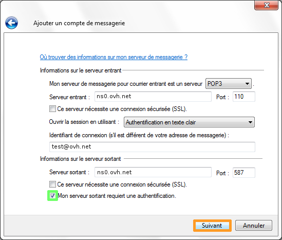

## Etapa 1: Añadir la cuenta de correo
Abra Windows Mail y cree una nueva cuenta.

Cumplimente los campos y haga clic en «Siguiente».

{.thumbnail}

## Etapa 2: Configuración de la cuenta de correo
En la nueva ventana, introduzca los siguientes datos:

Tipo de servidor de correo electrónico entrante: POP3
Servidor de correo entrante: ns0.ovh.net
Puerto: 110
Nombre de usuario de correo electrónico: Dirección de correo electrónico completa.

Servidor de correo saliente: ns0.ovh.net
Puerto: 587
Marcar la casilla «El servidor de salida requiere autenticación».

Es imprescindible marcar la casilla de autenticación para conectarse al servidor de salida y utilizar el puerto 587 en SMTP. Ese es el puerto autentificado para todos los proveedores de acceso a internet.

Haga clic en «Siguiente» para finalizar.

La cuenta de correo estará correctamente configurada.

{.thumbnail}

