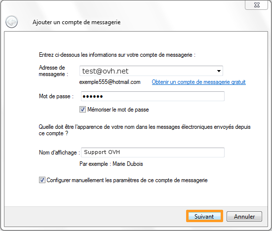
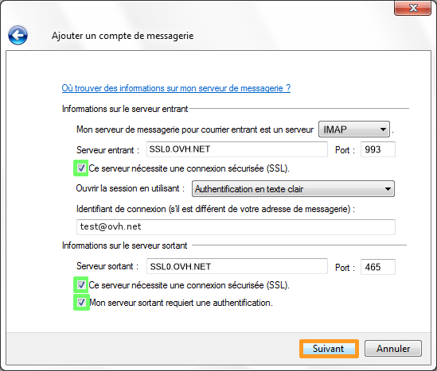

Cliquez [ici](http://www.ovh.com/fr/hebergement-web/faq){.external} pour retrouver nos différents guides de configuration e-mail.

Windows Mail est un logiciel de messagerie gratuit pour le système d'exploitation Windows, présenté comme le successeur d'Outlook Express Vous pouvez le retrouver via la page suivante : [Windows Mail (site officiel)](http://windows.microsoft.com/fr-fr/hotmail/home){.external}

> [!warning]
>
> OVH met à votre disposition des services dont la configuration, la gestion et la responsabilité vous incombent. Il vous revient de ce fait d'en assurer le bon fonctionnement.
> 
> Nous mettons à votre disposition ce guide afin de vous accompagner au mieux sur des tâches courantes. Néanmoins, nous vous recommandons de faire appel à un prestataire spécialisé et/ou de contacter l'éditeur du service si vous éprouvez des difficultés. En effet, nous ne serons pas en mesure de vous fournir une assistance. Plus d'informations dans la section « Aller plus loin » de ce guide.
> 

## Configuration de Windows Mail

### Ajouter le compte e-mail
Ouvrez votre logiciel Windows Mail, puis créer un nouveau compte.

Renseignez les informations demandées puis cliquez sur `Suivant`{.action}.

{.thumbnail}

### Parametre du compte e-mail en IMAP
Dans la fenêtre qui apparaît, il vous faut entrer les informations suivantes :

- Information sur le Serveur entrant :
    - Mon serveur de messagerie pour courrier entrant est un serveur :  **POP3**
    - Serveur entrant : **SSL0.OVH.NET**
    - Port : **993**
    - Cochez la case : **"Ce serveur nécessite une connexion sécurisée (SSL)""**
    - Identifiant de connexion : **votre adresse e-mail entière**
- Informations sur le serveur sortant :
    - Serveur sortant : **SSL0.OVH.NET**
    - Port : **465**
    - Cochez la case : **"Ce serveur nécessite une connexion sécurisée (SSL)""**
    - Cochez la case : **"Mon serveur sortant requiert une authentification"**

*Il vous faut impérativement utiliser le port 587 en SMTP et cocher l'authentification pour se connecter pour le serveur sortant.* *Il s'agit du port sortant authentifié pour tous les FAI.*

{.thumbnail}

Vous pouvez cliquer sur `Suivant`{.action} pour terminer.

Votre compte e-mail est désormais correctement configuré.

> [!success]
>
> - 
> L'Authentification pour le serveur sortant est un paramétrage
> indispensable afin que l'émission d'email puisse fonctionner sur nos
> serveurs SMTP.
> - 
> Si l'authentification n'est pas activée, un ticket incident Open SMTP
> peut être ouvert vous informant que l'authentification "POP before
> SMTP" n'est pas supportée. Vous devrez impérativement activer l'
> authentification du serveur sortant afin de pouvoir émettre des
> emails.
> 
> 

## Rappel des parametres POP - IMAP

### Configuration POP
Voici les informations à retenir pour la configuration d'un compte e-mail **POP** .

Configuration  **POP**  avec sécurisation SSL activée ou désactivée :

- Adresse Email : Votre adresse e-mail mutualisée entière.
- Mot de passe : Le mot de passe que vous avez défini dans [l'espace client](https://www.ovh.com/manager/web/login/){.external}.
- Nom d'utilisateur : Votre adresse e-mail mutualisée entière.
- Serveur entrant : Le serveur de réception des e-mails :  **SSL0.OVH.NET**
- Port serveur entrant : Le port du serveur entrant :  **995**  ou  **110**
- Serveur sortant : Le serveur d'envoi des e-mails :  **SSL0.OVH.NET**
- Port serveur sortant : Le port du serveur sortant :  **465**  ou  **587**
- Vous devez obligatoirement activer [l'authentification](#configuration_de_windows_mail_partie_2_parametre_du_compte_e-mail){.external} du serveur sortant SMTP.

|Ports|SSL activé|SSL désactivé|
|---|---|---|
|Entrant|995|110|
|Sortant|465|587|

### Configuration IMAP
Voici les informations à retenir pour la configuration d'un compte e-mail **IMAP** .

Configuration  **IMAP**  avec sécurisation SSL activée ou désactivée :

- Adresse Email : Votre adresse e-mail mutualisée entière.
- Mot de passe : Le mot de passe que vous avez défini dans [l'espace client](https://www.ovh.com/manager/web/login/){.external}.
- Nom d'utilisateur : Votre adresse e-mail mutualisé entière.
- Serveur entrant : Le serveur de réception des e-mails :  **SSL0.OVH.NET**
- Port serveur entrant : Le port du serveur entrant :  **993**  ou  **143**
- Serveur sortant : Le serveur d'envoi des e-mails :  **SSL0.OVH.NET**
- Port serveur sortant : Le port du serveur sortant :  **465**  ou  **587**
- Vous devez obligatoirement activer [l'authentification](#configuration_de_windows_mail_partie_2_parametre_du_compte_e-mail){.external} du serveur sortant SMTP.

|Ports|SSL activé|SSL désactivé|
|---|---|---|
|Entrant|993|143|
|Sortant|465|587|

## Aller plus loin

Échangez avec notre communauté d'utilisateurs sur <https://community.ovh.com>.