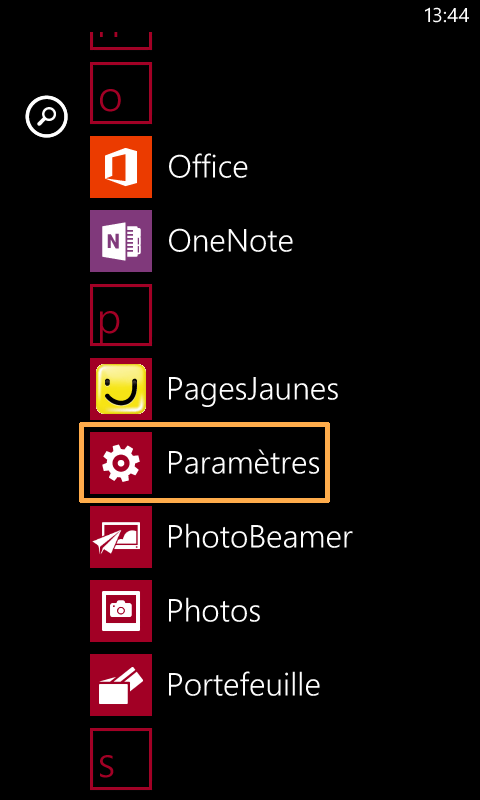
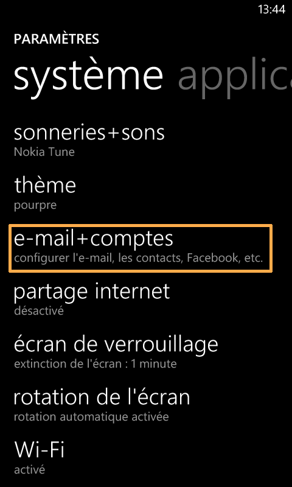
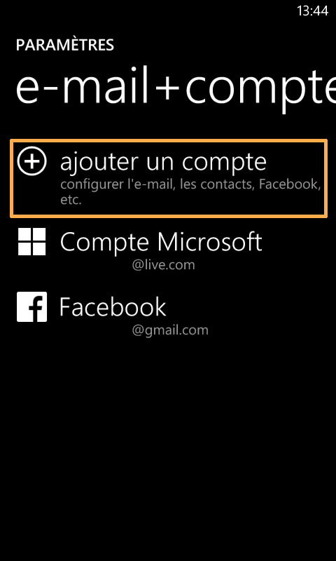
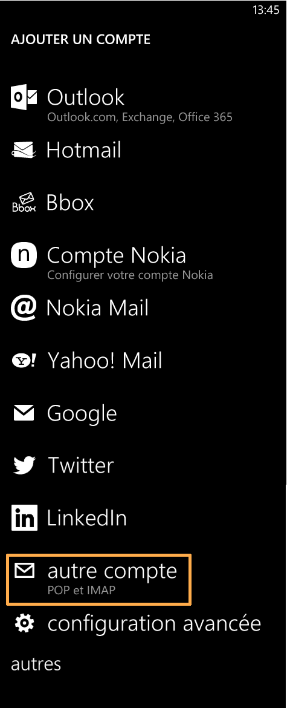
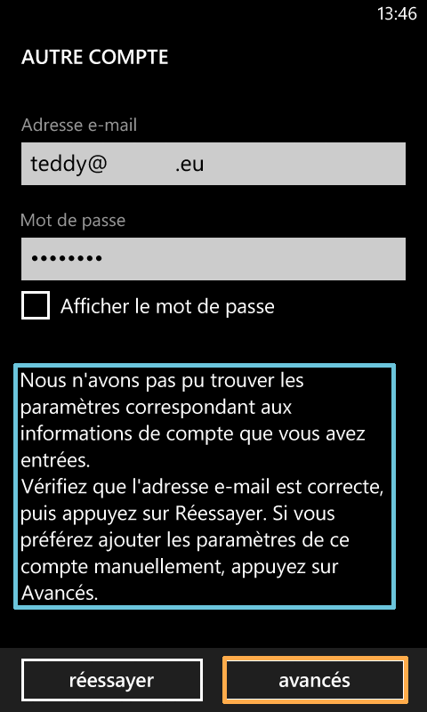
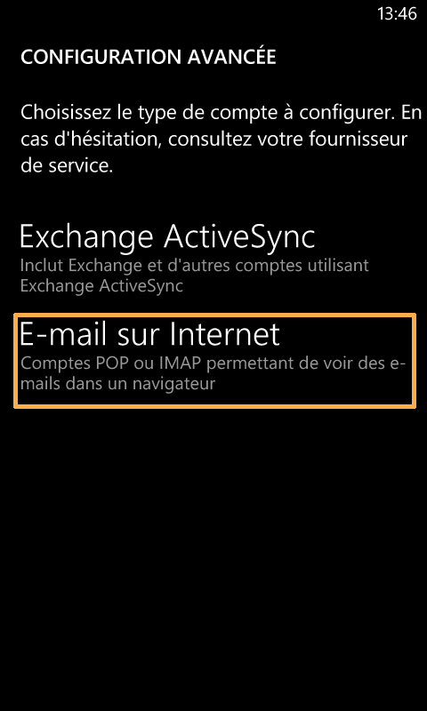
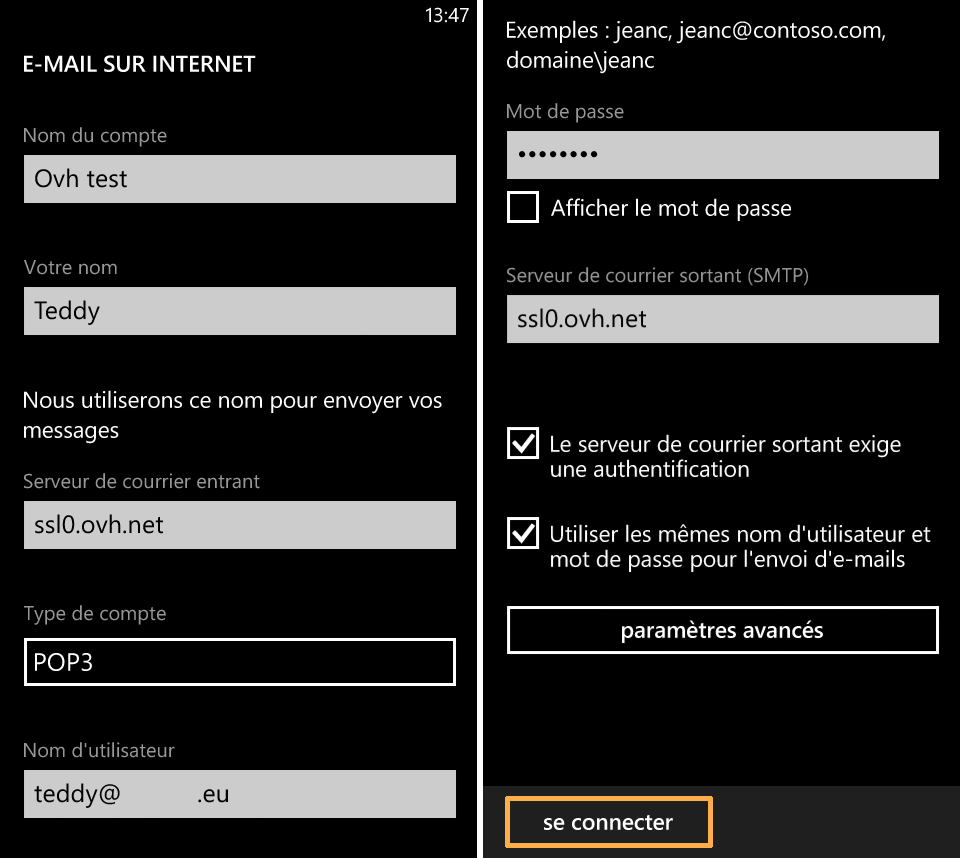
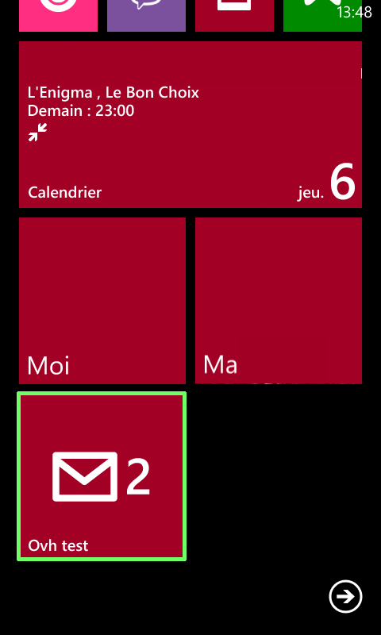

> [!warning]
>
> OVH met à votre disposition des services dont la configuration, la gestion et la responsabilité vous incombent. Il vous revient de ce fait d'en assurer le bon fonctionnement.
> 
> Nous mettons à votre disposition ce guide afin de vous accompagner au mieux sur des tâches courantes. Néanmoins, nous vous recommandons de faire appel à un prestataire spécialisé et/ou de contacter l'éditeur du service si vous éprouvez des difficultés. En effet, nous ne serons pas en mesure de vous fournir une assistance. Plus d'informations dans la section « Aller plus loin » de ce guide.
> 

## Configuration du compte e-mail mutualise sous Windows Phone 8

### Parametres
Dans un premier temps, cliquez sur l'icône "Paramètres".

Dans notre exemple, un compte e-mail mutualisé est configuré en  **POP**  sur un Nokia Lumia 625 avec Windows Phone 8.0.

Lors de l'ajout du compte, vérifiez que votre connexion 3G ou Wi-Fi est active.

{.thumbnail}

### Systeme
Afin de continuer l'ajout du compte e-mail mutualisé, sélectionnez "e-mail + comptes".

{.thumbnail}

### Ajout d'un compte
Sélectionnez maintenant "ajouter un compte" afin d'ajouter un compte e-mail OVH mutualisé.

Remarquez que l'on trouve à ce niveau d'autres types de comptes préconfigurés.

{.thumbnail}

### Type de compte
Il vous est proposé de choisir le type de compte désiré.

Sélectionnez "autre compte" afin d'ajouter un compte de type  **POP**  ou **IMAP** .

{.thumbnail}

### Configuration du compte
Dans le premier champ, renseignez votre adresse e-mail entière.

Renseignez ensuite le mot de passe défini via votre [Manager](https://www.ovh.com/auth/?action=gotomanager){.external} pour le compte mutualisé OVH.

*Après avoir sélectionné "se connecter" un message d'avertissement va apparaître.*

Pour continuer la configuration du compte, sélectionnez "avancés".

{.thumbnail}

### Configuration avancee
Afin d'accéder aux paramètres avancés du compte e-mail et de continuer la configuration du compte en POP ou en IMAP, sélectionnez "E-mail sur Internet".

{.thumbnail}

### Parametres du compte e-mail
Renseignez les informations demandées :

Nom du compte : *correspond au nom d'affichage du compte dans le téléphone.*

Votre nom : *le nom d'affichage utilisé pour envoyer les messages.*

Serveur de courrier entrant : **SSL0.OVH.NET**

Type de compte :  **POP3** *(vous pouvez aussi le configurer en IMAP, dans ce cas utilisez les informations renseignées en fin de ce guide).*

Nom d'utilisateur : *votre adresse e-mail entière.*

Mot de passe : *le mot de passe défini via votre* [Manager](https://www.ovh.com/auth/?action=gotomanager){.external} *pour le compte mutualisé OVH.*

Serveur de courrier sortant (SMTP) :  **SSL0.OVH.NET**

*Vous devez cocher les deux options "Le serveur de courrier sortant exige une authentification" et "Utiliser les mêmes nom d'utilisateur et mot de passe pour l'envoi d'e-mails"*

Pour continuer cliquez sur "se connecter".

{.thumbnail}

> [!success]
>
> - 
> L'Authentification pour le serveur sortant est un paramétrage
> indispensable afin que l'émission d'email puisse fonctionner sur nos
> serveurs SMTP.
> - 
> Si l'authentification n'est pas activée, un ticket incident Open SMTP
> peut être ouvert vous informant que l'authentification "POP before
> SMTP" n'est pas supportée. Vous devrez impérativement activer l'
> authentification du serveur sortant afin de pouvoir émettre des
> emails.
> 
> 

### Finalisation
Votre compte e-mail est maintenant correctement configuré et apparaît dans l'interface de votre téléphone.

{.thumbnail}

### Acces aux mails
Vos e-mails sont maintenant accessibles depuis la page d'accueil de votre téléphone mobile.

{.thumbnail}

## Rappel des parametres POP - IMAP

### Configuration POP
Voici les informations à retenir pour la configuration d'un compte e-mail **POP** .

Configuration  **POP**  avec sécurisation SSL activée ou désactivée :

Adresse Email : Votre adresse e-mail mutualisée entière. Mot de passe : Le mot de passe que vous avez défini dans [l'espace client](https://www.ovh.com/auth/?action=gotomanager){.external}. Nom d'utilisateur : Votre adresse e-mail mutualisée entière. Serveur entrant : Le serveur de réception des e-mails :  **SSL0.OVH.NET** Port serveur entrant : Le port du serveur entrant :  **995**  ou  **110** Serveur sortant : Le serveur d'envoi des e-mails :  **SSL0.OVH.NET** Port serveur sortant : Le port du serveur sortant :  **465**  ou  **587**

Les ports  **110**  et  **587**  correspondent à la sécurisation SSL désactivée. Les ports  **995**  et  **465**  correspondent à la sécurisation SSL activée.

- Vous devez obligatoirement activer [l'authentification](#configuration_du_compte_e-mail_mutualise_sous_windows_phone_8_partie_7_parametres_du_compte_e-mail){.external} du serveur sortant SMTP.

|Ports|SSL activé|SSL désactivé|
|---|---|---|
|Entrant|995|110|
|Sortant|465|587|

### Configuration IMAP
Voici les informations à retenir pour la configuration d'un compte e-mail **IMAP** .

Configuration  **IMAP**  avec sécurisation SSL activée ou désactivée :

Adresse Email : Votre adresse e-mail mutualisée entière. Mot de passe : Le mot de passe que vous avez défini dans [l'espace client](https://www.ovh.com/auth/?action=gotomanager){.external}. Nom d'utilisateur : Votre adresse e-mail mutualisée entière. Serveur entrant : Le serveur de réception des e-mails :  **SSL0.OVH.NET** Port serveur entrant : Le port du serveur entrant :  **993**  ou  **143** Serveur sortant : Le serveur d'envoi des e-mails :  **SSL0.OVH.NET** Port serveur sortant : Le port du serveur sortant :  **465**  ou  **587**

Les ports  **143**  et  **587**  correspondent à la sécurisation SSL désactivée. Les ports  **993**  et  **465**  correspondent à la sécurisation SSL activée.

- Vous devez obligatoirement activer [l'authentification](#configuration_du_compte_e-mail_mutualise_sous_windows_phone_8_partie_7_parametres_du_compte_e-mail){.external} du serveur sortant SMTP.

|Ports|SSL activé|SSL désactivé|
|---|---|---|
|Entrant|993|143|
|Sortant|465|587|

## Aller plus loin

Échangez avec notre communauté d'utilisateurs sur <https://community.ovh.com>.