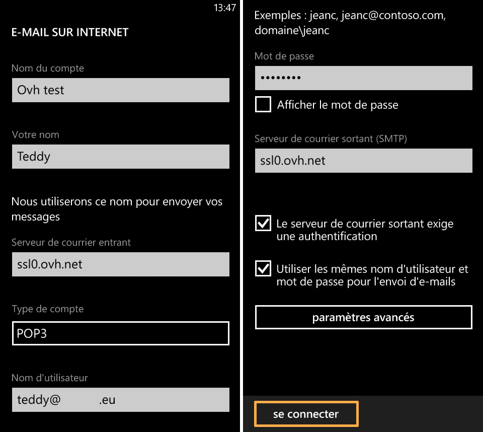
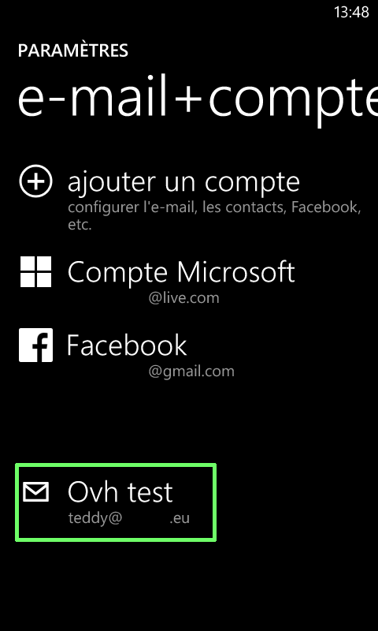

## Część 1: Parametry
Kliknij na ikonkę "Parametry".

W naszym przykładzie konto e-mail jest konfigurowane jako POP na telefonie Nokia Lumia 625 z systemem Windows Phone 8.0.

Przed dodaniem konta sprawdź, czy połączenie 3G lub Wi-Fi jest aktywne.

{.thumbnail}

## Część 2: System
Aby kontynuować dodawanie konta wybierz "e-mail + konta".

{.thumbnail}

## Część 3: Dodawanie konta
Wybierz opcję "dodaj konto".

{.thumbnail}

## Część 4: Typ konta
Możesz wybrać typ konta.

Wybierz "inne konto", aby dodać konto POP lub IMAP.

{.thumbnail}

## Część 5: Konfiguracja konta
W pierwszym polu wpisz cały adres e-mail. 

Następnie podaj hasło zdefiniowane w panelu [manager](https://www.ovh.pl/managerv3/).

Po wybraniu opcji logowania pojawi się wiadomość z ostrzeżeniem.

Aby kontynuować konfigurowanie konta, wybierz "zaawansowane".

{.thumbnail}

## Część 6: Konfiguracja zaawansowana
Aby uzyskać dostęp do zaawansowanych parametrów konta e-mail i kontynuować konfigurację konta POP lub IMAP, wybierz "E-mail w Internecie".

{.thumbnail}

## Część 7: Parametry konta e-mail
Wpisz wymagane informacje:

Nazwa konta: nazwa konta wyświetlana w telefonie

Nazwa: Nazwa używana podczas wysyłania wiadomości

Serwer poczty przychodzącej: SSL0.OVH.NET

Typ konta: POP3 (możesz również skonfigurować konto w trybie IMAP, w tym przypadku skorzystaj z danych podanych na końcu przewodnika).

Nazwa użytkownika: cały adres e-mail

Hasło: hasło zdefiniowane w panelu klienta OVH

Serwer poczty wychodzącej (SMTP): SSL0.OVH.NET

Zaznacz dwie opcje "Serwer poczty wychodzącej wymaga uwierzytelniania" i "Używaj tej samej nazwy użytkownika i tego samego hasła do wysyłki e-maili".

Kliknij na "logowanie".

{.thumbnail}

- Uwierzytelnianie dla serwera poczty wychodzącej jest parametrem niezbędnym, aby wysyłka e-maili mogła działać na naszych serwerach SMTP. 

- Jeśli uwierzytelnianie nie jest włączone, może zostać otwarte zgłoszenie Open SMTP informujące, że uwierzytelnianie "POP before SMTP" nie jest obsługiwane. Należy obowiązkowo włączyć uwierzytelnienie serwera poczty wychodzącej, aby móc wysyłać e-maile.

## Część 8: Zakończenie
Konto e-mail zostało poprawnie skonfigurowane i pojawiło się w interfejsie telefonu.

{.thumbnail}

## Dostęp do maili
E-maile są dostępne z poziomu strony głównej telefonu.

{.thumbnail}

## Konfiguracja POP
Oto informacje niezbędne do skonfigurowania konta e-mail POP.

Konfiguracja POP z włączonym lub wyłączonym szyfrowaniem SSL:

Adres e-mail: Cały adres e-mail
Hasło: Hasło zdefiniowane w panelu [Manager](https://www.ovh.com/managerv3/).
Nazwa użytkownika: Cały adres e-mail
Serwer poczty przychodzącej:SSL0.OVH.NET
Port serwera poczty przychodzącej:995 lub 110
Serwer poczty wychodzącej:SSL0.OVH.NET
Port serwera poczty wychodzącej:465 lub 587

Porty 110 i 587 dotyczą wyłączonego protokołu SSL.
Porty 995 i 465 dotyczą włączonego protokołu SSL.

- Należy obowiązkowo włączyć [uwierzytelnianie](#configuration_du_compte_e-mail_mutualise_sous_windows_phone_8_partie_7_parametres_du_compte_e-mail) serwera SMTP.

|Porty|SSLwłączony|SSLwyłączony|
|Wchodzący|995|110|
|Wychodzący|465|587|

## Konfiguracja IMAP
Oto informacje niezbędne do skonfigurowania konta e-mail IMAP

Konfiguracja IMAP z włączonym lub wyłączonym szyfrowaniem SSL:

Adres e-mail: Cały adres e-mail
Hasło: Hasło zdefiniowane w panelu [Manager](https://www.ovh.com/managerv3/).
Nazwa użytkownika: Cały adres e-mail
Serwer poczty przychodzącej:SSL0.OVH.NET
Port serwera poczty przychodzącej:993 lub 143
Serwer poczty wychodzącej:SSL0.OVH.NET
Port serwera poczty wychodzącej:465 lub 587

Porty 143 i 587 dotyczą wyłączonego protokołu SSL.
Porty 993 i 465 dotyczą włączonego protokołu SSL.

- Należy obowiązkowo włączyć [uwierzytelnianie](#configuration_du_compte_e-mail_mutualise_sous_windows_phone_8_partie_7_parametres_du_compte_e-mail) serwera SMTP.

|Porty|SSLwłączony|SSLwyłączony|
|Wchodzący|993|143|
|Wychodzący|465|587|

