## Kas tai yra?
IMAPCopy įrankis labai naudingas, kai norima nukopijuoti laiškus iš A (šaltinio) dėžutės į B (naują) dėžutę.

Su šiuo įrankiu galėsite:
1. Įvesti el. pašto dėžutės, iš kurios norite perkelti el. laiškus, informaciją;
2. Įvesti naujos el. pašto dėžutės informaciją;
3. Kai patvirtinsite sinchronizavimą, galėsite uždaryti puslapį, o el. laiškai bus nukopijuoti. Tai gali trukti kelias valandas.

Prie šio įrankio galite prisijungti adresu:[http://webmail.ovh.net/lt/imapcopy/](http://webmail.ovh.net/lt/imapcopy/)

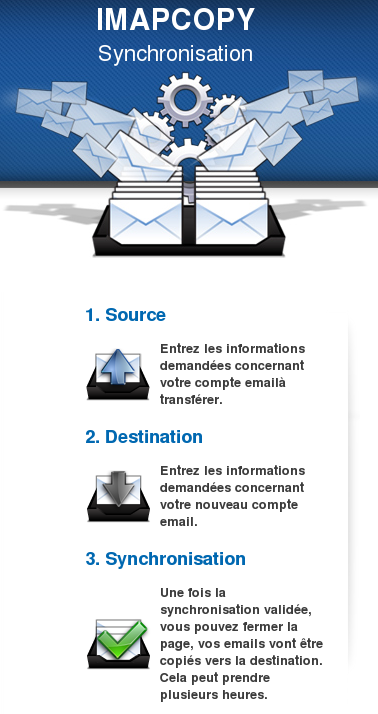{.thumbnail}

## Kaip rasti įrankį svetainėje
Atvėrę [OVH.lt](http://www.ovh.lt) puslapį spragtelėkite Žiniatinklio paštas (viršutiniame dešiniajame meniu). Po to būsite nukreipti į [žiniatinklio sąsajos puslapį](https://ssl0.ovh.net/).

{.thumbnail}
Kontekstiniame meniu (Žiniatinklio paštas) viršuje dešinėje rasite nuorodą Prieiga prie el. pašto įrankių.

Spragtelėję šią nuorodą galėsite prisijungti prie IMAPCopy. Po to iš karto spauskite IMAPCopy.

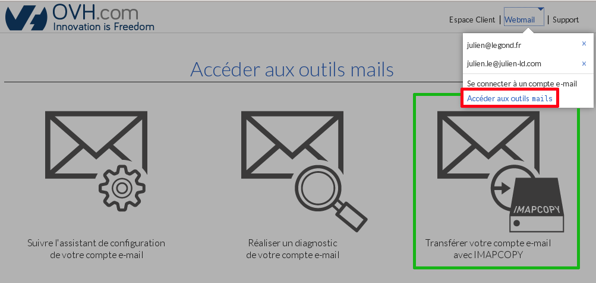{.thumbnail}

## Paslaugų pasirinkimas
Su IMAPCopy galėsite ne OVH esančias el. pašto dėžutes perkelti į OVH el. pašto paslaugas.

Pagrindiniai teikėjai, kurių paslaugoms esame sukūrę perkėlimą:

|AOL|Yahoo|Free|Hosted exchange2013|
|Gmail|SFR|La Poste|Private exchange 2013|
|OVH svetainių talpinimas|Orange|Kita|

Jeigu jūsų paslaugų teikėjo nėra sąraše, rinkitės Kita.
Pavyzdyje atliksime el. laiškų kopijavimą iš OVH svetainių talpinimo el. pašto į Exchange 2013 el. pašto dėžutę.

Dėl to šiame žingsnyje pasirinksime OVH svetainių talpinimą kaip šaltinio adresą.

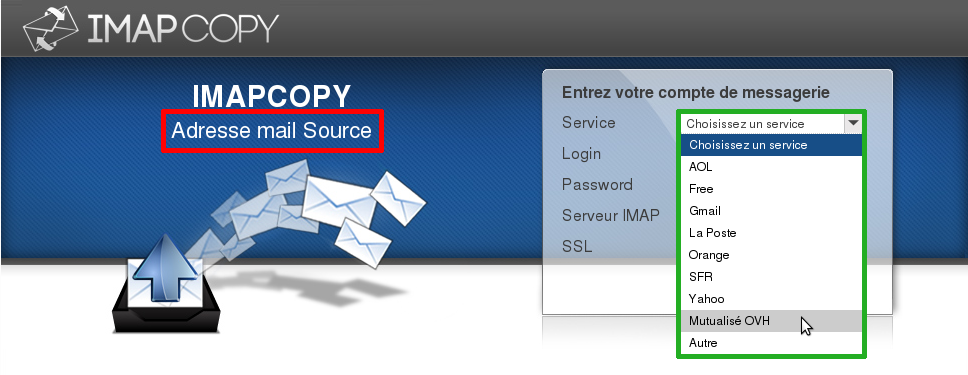{.thumbnail}

## Nustatymai
Išsamūs Šaltinio adreso nustatymai atliekami užpildant formos elementus:
1. Paslauga: žr. aukščiau (mūsų atveju OVH svetainių talpinimas) 
2. Prisijungimo vardas: visas el. pašto adresas (pavyzdyje, svetainių talpinimo atveju, tai support@ovh.net) arba prisijungimo vardas (visas pavadinimas iki @);
3. Slaptažodis: jūsų el. pašto dėžutės slaptažodis (tik jūs jį žinote);
4. IMAP serveris: pranešimų siuntimo serveris, prie kurio jungiantis pasiekiama senoji dėžutė (mūsų atveju tai ssl0.ovh.net, t.y. serveris su SSL jungtimi);
5. SSL: pažymėkite, jeigu naudosite SSL (Secured Socket Layer) tipo jungtį (mūsų atveju reikia pažymėti).

Kai įvesite visus duomenis, spragtelėkite Patvirtinti.

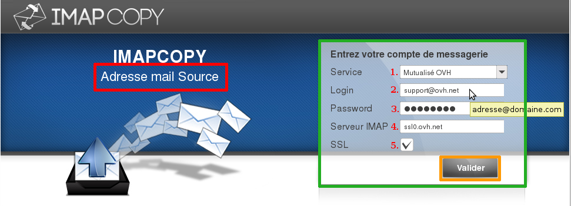{.thumbnail}

## Prisijungimas prie šaltinio paskyros
Kai patvirtinsite prisijungimo prie šaltinio adreso informaciją, liks 2 žingsniai:

1. Prisijungimo prie paskyros testas.
2. Prisijungimas prie paskyros atliktas teisingai.

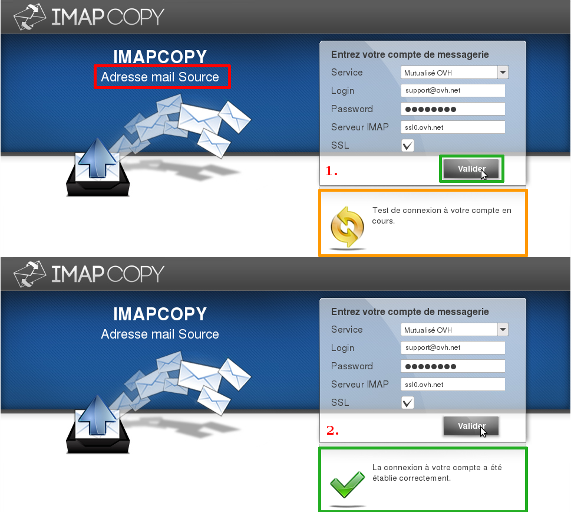{.thumbnail}

## Paslaugų pasirinkimas
IMAPCopy skirtas OVH ir išorinių el. pašto dėžučių perkėlimui į naujas OVH el. pašto dėžutes (Exchange ar svetainių talpinimo).
Pradėjus teikti Exchange 2013 paslaugas, tapo galima kopijuoti el. laiškus į išorinį ar OVH el. paštą.

Pagrindinių paslaugų, į kurias galima kopijuoti, sąrašas:

- Exchange 25 GB
- Exchange Corporate
- Exchange Resellers
- OVH svetainių talpinimas
- Kita

Jeigu jūsų pašto paslaugos teikėjo nėra sąraše, rinkitės Kita.

Šio gido pavyzdyje kopijuosime iš OVH svetainių talpinimo į Exchange 2013 paslaugą.

Čia naujos el. pašto dėžutės adreso laukelyje pasirinksime Kita.

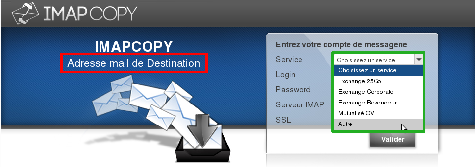{.thumbnail}

## Nustatymai
Išsamūs naujos el. pašto dėžutės nustatymai atliekami užpildant formos elementus:
1. Paslauga: žr. aukščiau (mūsų atveju Kita);
2. Prisijungimo vardas: visas el. pašto adresas (mūsų atveju, tai Exchange 2013 adresas exchange@ovh.net) arba jūsų prisijungimo vardas (visas pavadinimas iki @);
3. Slaptažodis: naujos el. pašto dėžutės slaptažodis (tik jūs jį žinote);
4. IMAP serveris: pranešimų siuntimo serveris, prie kurio jungiantis pasiekiama ankstesnė dėžutė (mūsų atveju tai ssl0.ovh.net, t.y. serveris su SSL jungtimi);
5. SSL: pažymėkite, jeigu naudosite SSL (Secured Socket Layer) tipo jungtį (mūsų atveju reikia pažymėti)

Kai įvesite visus duomenis, spragtelėkite Patvirtinti.

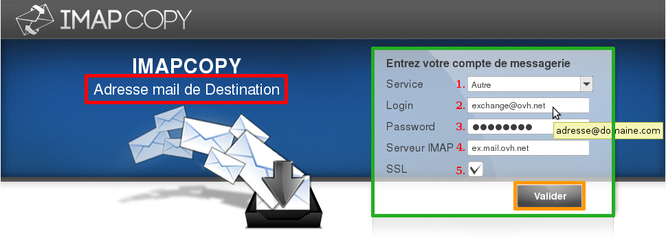{.thumbnail}

## Prisijungimas prie naujos el. pašto dėžutės
Kaip ir jungimosi prie ankstesnės el. pašto dėžutės atveju, patvirtinus prisijungimo prie šaltinio adreso duomenis, liks 2 žingsniai:

1. Prisijungimo testas.
2. Prisijungimas prie paskyros atliktas teisingai.

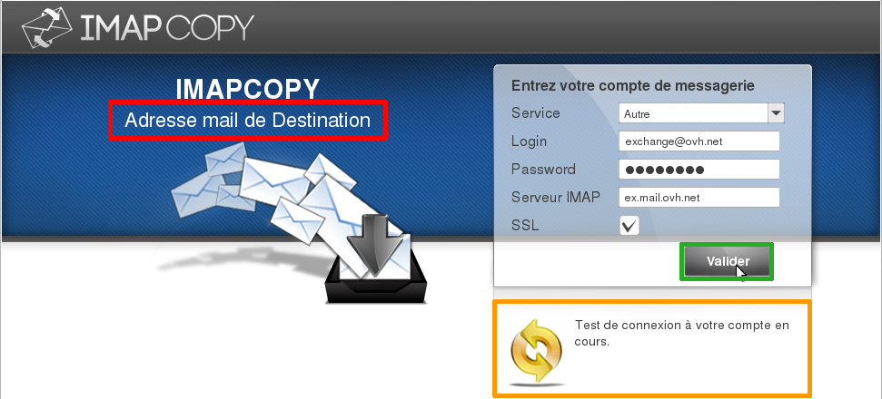{.thumbnail}

## Sinchronizavimas
Kai pavyks prisijungti prie naujos dėžutės, atsiras mygtukas Sinchronizuoti.

Spragtelėkite jį, kad pradėtumėte kopijavimą iš dėžutės A (senos) į dėžutę B (naują).

Mūsų atveju, el. laiškai bus kopijuojami iš dėžutės support@ovh.net į Exchange 2013 dėžutę exchange@ovh.net.

Matysite tokį pranešimą:
Atliekamas paskyrų sinchronizavimas. Sinchronizavimo būklę galite tikrinti užpildę formą žemiau.

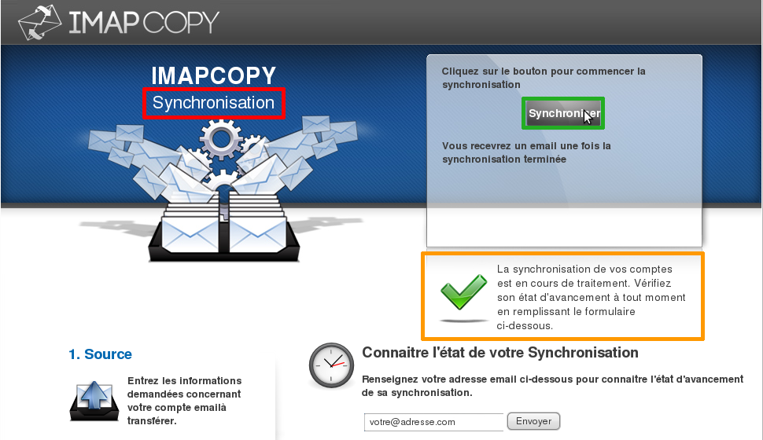{.thumbnail}
IMAP sinchronizavimo metu, ankstesnėje el. pašto dėžutėje esantys katalogai, kurių nėra naujoje dėžutėje, bus automatiškai sukurti, net jeigu jie tušti.

## Sinchronizavimas - klaidos
Pradėjus sinchronizavimą, jeigu matysite klaidos pranešimą, jis bus tokio formato (žr. ekrano atvaizdą):

An error occurred during synchronisation. This account already exists.

Kitaip sakant, bus bendras klaidos aprašymas ir patikslinimas. 

Pavyzdyje pateikta klaida gauta antrą kartą spragtelėjus mygtuką Sinchronizuoti. Klaida mums praneša: Une tâche de synchronisation pour ce compte existe déjà, t.y. jau yra sukurta sinchronizavimo užduotis ir nebus kuriama antra.

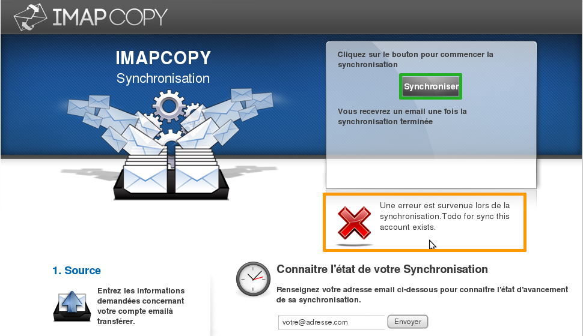{.thumbnail}

## Sinchronizavimas - pabaiga
Kai sinchronizavimas bus baigtas, Paskirties (naujos) el. pašto dėžutės adresu bus išsiųstas el. laiškas, detaliai aprašantis operaciją:

Gauto laiško pavyzdys pateikiamas iliustracijoje.

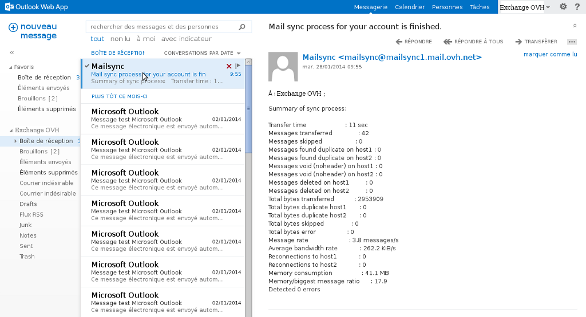{.thumbnail}

## Sinchronizavimo būsenos peržiūra
Norėdami patikrinti el. pašto dėžučių sinchronizavimą, galite bet kuriuo metu į tam skirtą lauką įvesti ankstesnės el. dėžutės adresą, po to spragtelėkite  Siųsti.

Mūsų atveju, tuo metu, kai tikrinome sinchronizavimo būseną, jis buvo baigtas.

Dėl šios priežasties matėme pranešimą Jūsų paskyros sinchronizavimas baigtas.

Jeigu kopijavimas truktų ilgiau, pirmiausiai matytumėte pranešimą Sinchronizavimas dar neprasidėjo, prašome palaukti.

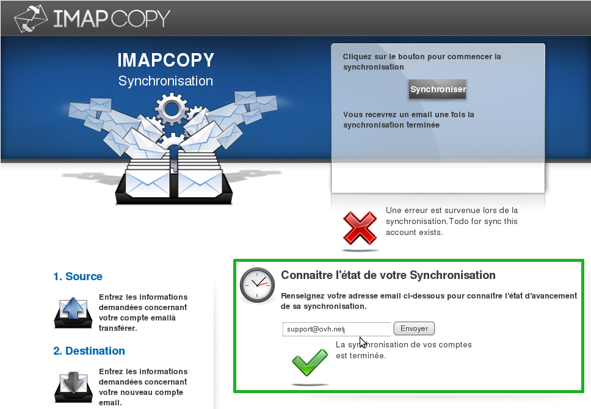{.thumbnail}

