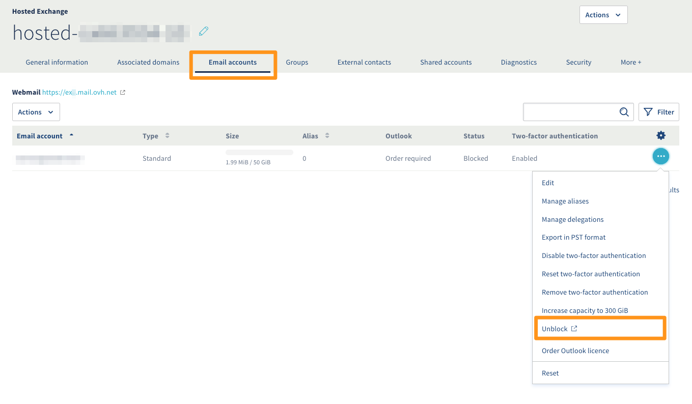
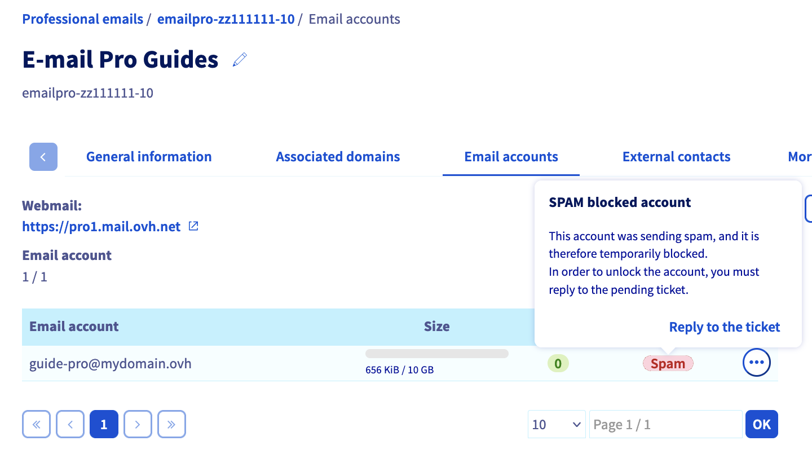
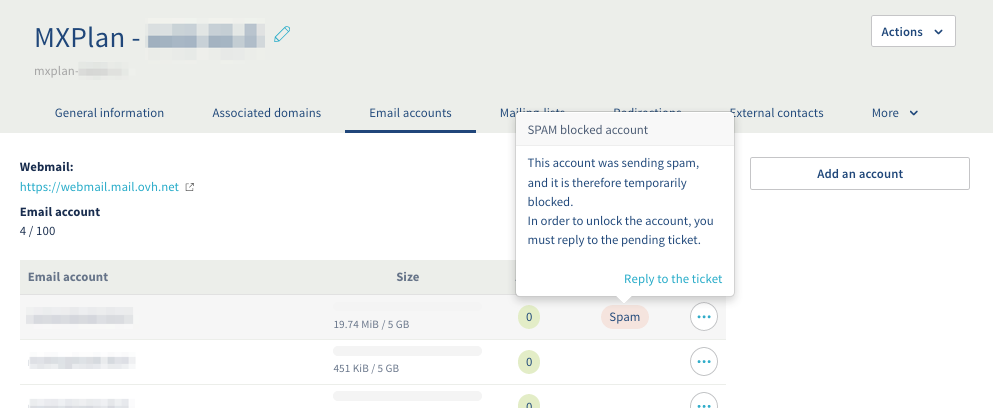
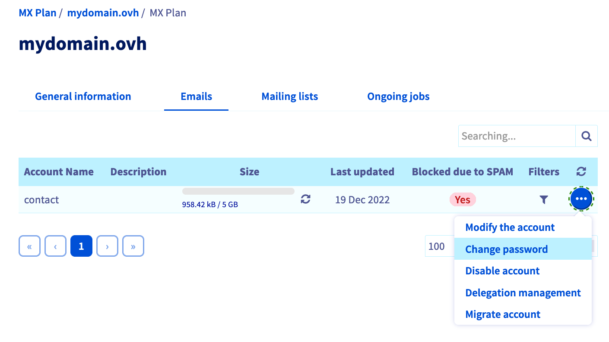
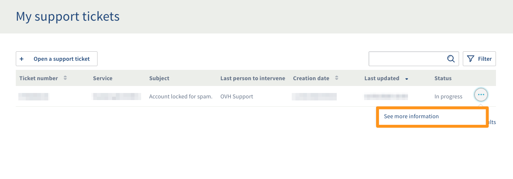

## Ziel

Wenn ein E-Mail-Acoount wegen SPAM gesperrt ist, bedeutet dies, dass verdächtige Aktivitäten beim Versand von E-Mails von einer zugehörigen Adresse aus festgestellt wurden. In diesem Fall können Sie über diesen Account keine E-Mails mehr versenden. Es ist wichtig zu verstehen, warum verdächtige Aktivitäten erkannt wurden, und welche Maßnahmen zu ergreifen sind, um eine Wiederholung dieser Situation zu vermeiden.

**Diese Anleitung erläutert die Vorgehensweise, um einen wegen Spamverdacht gesperrten E-Mail-Account wieder freizuschalten.**

## Voraussetzungen

- Sie verwenden eine [OVHcloud E-Mail-Lösung](https://www.ovhcloud.com/de/emails/).
- Sie haben Zugriff auf Ihr [OVHcloud Kundencenter](https://www.ovh.com/auth/?action=gotomanager&from=https://www.ovh.de/&ovhSubsidiary=de) im Bereich `Web Cloud`{.action}.

## In der praktischen Anwendung 

Falls die Sperrung einen E-Mail-Account vom Typ MX Plan betrifft, identifizieren Sie zunächst die Version Ihres Dienstes, um den richtigen Vorgang zum Aufheben der Sperrung durchzuführen. Überprüfen Sie anhand der folgenden Tabelle, wie die beiden Versionen voneinander unterschieden werden.

|Legacy MX Plan Version|Neue MX Plan Version|
|---|---|
|{.thumbnail}  Die Dienstbezeichnung steht im Rahmen **Abo** rechts.|{.thumbnail} Das neue Angebot hat eine **Server-Referenz** im Rahmen **Zusammenfassung** links.|

### Schritt 1: Die Ursache für den SPAM-Verdacht ermitteln 

Wenn beim Versand von E-Mails verdächtige Aktivitäten festgestellt werden, wird der betreffende Account automatisch gesperrt. In diesem Fall können Sie über den E-Mail-Account keine E-Mails mehr versenden.

Überprüfen Sie zunächst gegenüber allen Benutzern des gesperrten E-Mail-Accounts, ob sie die Sperrung direkt verursacht haben, etwa mit einem ungewöhnlichen Nutzungsverhalten (z.B. aufgrund eines Massenversands). Ist das der Fall, müssen Sie dies vor der Freigabe der betroffenen Accounts korrigieren.

Wenn die vom Antispam-System erkannte verdächtige Aktivität nicht von einem legitimen Benutzer des E-Mail-Accounts verursacht wurde, führen Sie die folgenden Maßnahmen durch:

- Führen Sie einen Virenscan für alle Mails durch, die vom gesperrten E-Mail-Account stammen und sorgen Sie für Patches, falls Infektionen bemerkt werden.

- Überprüfen Sie jegliche Software, die über Zugangsdaten für den gesperrten E-Mail-Account verfügt (Fax, Unternehmenssoftware, E-Mail-Clients etc.).

### Schritt 2: Status des E-Mail-Accounts überprüfen und auf das zugehörige Support-Ticket zugreifen 

Wählen Sie den Tab für Ihren E-Mail-Dienst aus:

> [!tabs]
> **Exchange**
>>
>> Loggen Sie sich in Ihrem [OVHcloud Kundencenter](https://www.ovh.com/auth/?action=gotomanager&from=https://www.ovh.de/&ovhSubsidiary=de) ein und gehen Sie in den Bereich `Web Cloud`{.action}. Klicken Sie auf `Microsoft`{.action} und dann auf `Exchange`{.action}, und wählen Sie die entsprechende Plattform aus.
>>
>> Gehen Sie auf den Tab `E-Mail-Accounts`{.action} Ihrer Plattform. Wenn in der Spalte „Status“ des betroffenen E-Mail-Accounts „Spam“ angegeben ist, klicken Sie auf `...`{.action} rechts und danach auf `Entsperren`{.action}. Das Entsperren des E-Mail-Accounts erfolgt nicht automatisch. Der Support muss über das Support-Ticket kontaktiert werden. Hierbei müssen die drei gestellten Fragen beantwortet werden. 
>> Fahren Sie mit [Schritt 3](#step3) der Anleitung fort.
>> 
>> {.thumbnail}
>>
> **E-Mail Pro**
>>
>> Loggen Sie sich in Ihrem [OVHcloud Kundencenter](https://www.ovh.com/auth/?action=gotomanager&from=https://www.ovh.de/&ovhSubsidiary=de) ein und gehen Sie in den Bereich `Web Cloud`{.action}. Klicken Sie auf `E-Mail Pro`{.action} und wählen Sie die entsprechende Plattform aus.
>>
>> Gehen Sie auf den Tab `E-Mail-Accounts`{.action} Ihrer Plattform. Wenn in der Spalte „Status“ des betroffenen E-Mail-Accounts „Spam“ angegeben ist, klicken Sie auf dieses Feld und dann auf `Ticket beantworten`{.action}. Das Entsperren des E-Mail-Accounts erfolgt nicht automatisch. Der Support muss über das Support-Ticket kontaktiert werden. Hierbei müssen die drei gestellten Fragen beantwortet werden.  
>> Fahren Sie mit [Schritt 3](#step3) der Anleitung fort.
>> 
>> {.thumbnail}
>>
> **MX Plan - Neue Version**
>>
>> Loggen Sie sich in Ihrem [OVHcloud Kundencenter](https://www.ovh.com/auth/?action=gotomanager&from=https://www.ovh.de/&ovhSubsidiary=de) ein und gehen Sie in den Bereich `Web Cloud`{.action}. Klicken Sie auf `E-Mails`{.action} und wählen Sie den Domainnamen aus.
>>
>> Gehen Sie auf den Tab `E-Mail-Accounts`{.action} Ihrer Plattform. Wenn in der Spalte „Status“ des betroffenen E-Mail-Accounts „Spam“ angegeben ist, klicken Sie auf dieses Feld und dann auf Das `Ticket beantworten`{.action}. Das Entsperren des E-Mail-Accounts erfolgt nicht automatisch. Der Support muss über das Support-Ticket kontaktiert werden. Hierbei müssen die drei gestellten Fragen beantwortet werden. 
>> Fahren Sie mit [Schritt 3](#step3) der Anleitung fort.
>>
>> {.thumbnail}
>>
> **MX Plan - Legacy**
>>
>> Wenn die Sperrung einen Account des Legacy [MX Plan](#instructions) betrifft, gibt es kein Support-Ticket. Bitte lesen Sie [Schritt 1](#step1) dieser Anleitung, bevor Sie den Anweisungen folgen.
>>
>> Loggen Sie sich in Ihrem [OVHcloud Kundencenter](https://www.ovh.com/auth/?action=gotomanager&from=https://www.ovh.de/&ovhSubsidiary=de) ein und gehen Sie in den Bereich `Web Cloud`{.action}. Klicken Sie auf `E-Mails`{.action} und wählen Sie den Domainnamen aus.
>>
>> Gehen Sie auf den Tab `E-Mails`{.action}. Wenn „Ja“ in der Spalte „Blockiert wegen SPAM“ angezeigt wird, klicken Sie auf diesen Hinweis und dann auf `Passwort ändern`{.action}. Ihr E-Mail-Account ist jetzt freigegeben. Sie müssen [Schritt 3](#step3) nicht ausführen.
>>
>> {.thumbnail}
>>
>> > [!warning]
>> >
>> > In seltenen Fällen kann „Nein“ in der Spalte „Blockiert wegen SPAM“ angezeigt werden, obwohl der Account blockiert ist. Wenn Sie den Account abgesichert haben, bleibt die Lösung wie oben beschrieben.

### Schritt 3: Das Support-Ticket beantworten 

Nach Schritt 2 werden Sie zum Fenster „Meine Support-Anfragen“ weitergeleitet. Klicken Sie auf den Button `...`{.action} rechts neben dem Ticket mit dem Betreff „Account locked for spam.“ und dann auf `Details anzeigen`{.action}.

{.thumbnail}

Sie finden hier die an Sie versendete E-Mail, die gleichzeitig ein Support-Ticket beim Support generiert.

Das erstellte Support-Ticket sieht wie folgt aus:

> 
> Sehr geehrter Kunde,
>
> Unser System hat festgestellt, dass die Adresse **Ihre.Adresse@example.com**, die auf unseren Systemen unter **Dienstreferenz** gehostet wird, eine Quelle für den Versand von Spam (Junk-E-Mails) darstellt.
> Das Senden von E-Mails wurde daher vorübergehend deaktiviert.
>
> Wir haben derzeit **X** verdächtige Nachrichten erkannt.
>
> Damit wir den Versand von E-Mails für folgende Adresse wieder aktivieren können: **Ihre.Adresse@example.com**,
> beantworten Sie diese E-Mail mit den folgenden Fragen:
>
> - Sind Sie der Absender der betreffenden E-Mail (siehe nachstehender Header)?
>
> - Haben Sie eine Weiterleitungsregel zu einer anderen E-Mail-Adresse?
>
> - Haben Sie auf eine Spam-Nachricht geantwortet?
> 
> Diese Antworten helfen uns, Ihr Konto schnell wieder zu aktivieren.
>  
>  
> 

Am Anschluss an diese Nachricht wird Ihnen ein Beispiel der Header der gesendeten E-Mails gesendet.

Diese Header werden verwendet, um die Route und den Ursprung der gesendeten E-Mails zu bestimmen.

## Weiterführende Informationen 
 
Kontaktieren Sie für spezialisierte Dienstleistungen (SEO, Web-Entwicklung etc.) die [OVHcloud Partner](https://partner.ovhcloud.com/de/directory/).
 
Wenn Sie Hilfe bei der Nutzung und Konfiguration Ihrer OVHcloud Lösungen benötigen, beachten Sie unsere [Support-Angebote](https://www.ovhcloud.com/de/support-levels/).
 
Für den Austausch mit unserer User Community gehen Sie auf <https://community.ovh.com/en/>.

