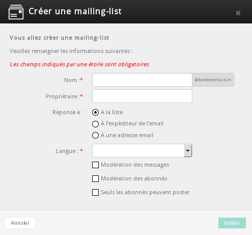
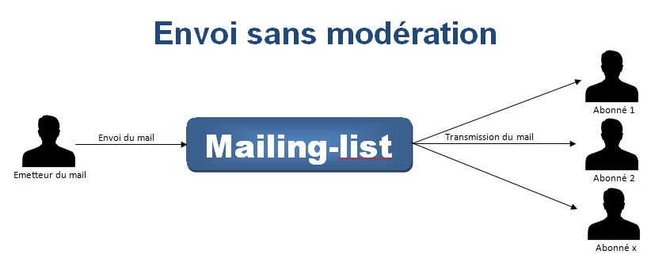
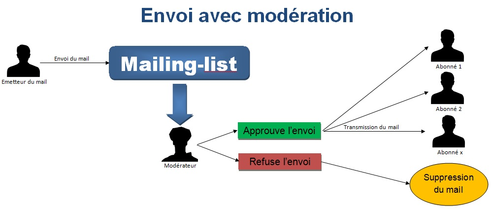
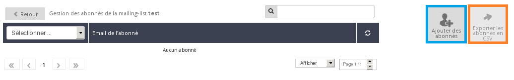
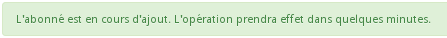

## Informazioni generali
Una mailing list ti consente di trasmettere informazioni a una lista di più destinatari, tramite l'invio di messaggi di posta collettivi agli iscritti al servizio.
Questa soluzione può essere utile, ad esempio, per informare i tuoi clienti dell'uscita di un nuovo prodotto (sito e-commerce) o di un incontro (ad esempio, nel caso del sito di una Community).

Ezmlm è uno dei software di gestione delle mailing list più diffuso.

Questa guida ti mostra come creare, gestire e configurare una mailing list.
Importante:

- una mailing list non è una soluzione per l'invio in massa di messaggi di Spam (massaggi pubblicitari)

- un utente può decidere di cancellare il proprio contatto dalla mailing list in qualsiasi momento e può segnalare un abuso ogni volta che lo ritiene opportuno


## Crea la tua mailing list
Nel nostro esempio, il servizio di mailing list è associato a un'offerta condivisa Pro.
Per creare la tua mailing list, accedi al tuo [Spazio Cliente OVH](http://www.ovh.com/manager/web), seleziona il tuo hosting nella sezione Email del menu a sinistra e clicca sul tab Mailing list.

{.thumbnail}
Le mailing list create vengono visualizzate nella tabella riepilogativa (nel nostro esempio, non sono ancora state create mailing list).

Per creare una nuova mailing list, clicca su Aggiungi una mailing list.

{.thumbnail}
Si apre una finestra in cui devi inserire queste informazioni:


- Nome: nome della tua mailing list
- Proprietario: indirizzo email del proprietario della mailing list (sarà anche il moderatore)
- Rispondi a: definisci l'indirizzo di risposta
- Lingua: lingua della tua mailing list (traduzione delle email automatiche di iscrizione o cancellazione)
- Moderazione dei messaggi : il proprietario (moderatore) deve approvare le risposte
- Moderazione degli iscritti : il proprietario (moderatore) deve approvare le iscrizioni
- Solo gli iscritti possono postare: chi non è iscritto non può inviare email alla mailing list


{.thumbnail}
Una volta validate le informazioni, compare un messaggio di conferma:

{.thumbnail}

## Ogni mailing list ti consente di aggiungere un massimo di:
­

- 250 iscritti per le mailing list di tipo Newsletter, Ristretta, Aperta, Privata e Chiusa
- 5000 iscritti solo per le mailing list di tipo Moderata


## Principio della moderazione
Una mailing list può essere moderata per evitare che chiunque possa inviare email alla tua lista di contatti. Le mailing list moderate vengono utilizzate principalmente per inviare newsletters, mentre quelle non moderate possono servire, ad esempio, per creare una conversazione via email fra più iscritti.

{.thumbnail}
.

{.thumbnail}


## Modifica le opzioni o elimina la tua mailing list
Per modificare le opzioni impostate durante la creazione della mailing list o eliminarla, clicca sulla ruota dentata a destra della tua mailing list.

{.thumbnail}


## Importa i contatti
Nell'esempio, non sono ancora presenti iscritti alla mailing list. Per aggiungere contatti, clicca sull'icona nella sezione Iscritti

{.thumbnail}

- Clicca su Aggiungi contatti.


{.thumbnail}
Per aggiungere iscritti alla mailing list, puoi:


- inserire manualmente l'indirizzo
- importare i contatti da un file di testo che contiene un indirizzo email per riga


{.thumbnail}
Una volta validata l'operazione, visualizzi un messaggio di conferma:

{.thumbnail}
L'operazione può richiedere più o meno tempo, in base al numero di contatti da aggiungere.


## Esporta la tua lista di contatti verso un file CSV

- Per generare un file CSV con tutti i tuoi contatti, clicca su Esporta i contatti in CSV. Nell'esempio questa opzione non è disponibile perché non sono stati aggiunti contatti.


## Iscriversi alla tua mailing list
Per iscriversi alla tua mailing list, è sufficiente inviare un email all'indirizzo:

```
nome_tua_ML-subscribe@tuodominio.com
```


## Disiscriversi dalla tua mailing list
Per disiscriversi dalla tua mailing list, è sufficiente inviare un email all'indirizzo:

```
nome_tua_ML-unsubscribe@tuodominio.com
```


## Elimina automaticamente gli indirizzi non validi
Il sistema di mailing list non cancella un contatto dopo un solo messaggio di errore (messaggio non consegnato, indirizzo inesistente, ecc...). Dopo il primo errore, attende circa 12 giorni e poi invia una notifica all'abbonato, con i dettagli del messaggio non ricevuto.

Se anche questo invio fallisce, il nostro sistema di mailing list attende altri 12 giorni e poi invia un messaggio di test. Se anche questo invio restituisce un messaggio di errore, il contatto viene cancellato dalla lista degli iscritti.


## Invio di un messaggio senza Oggetto
Un messaggio inviato a una mailing list deve contenere necessariamente un oggetto. In caso contrario, viene generato automaticamente un errore e il mittente riceverà questo messaggio:


```
Hi. This is the qmail-send program at mx1.mail.ovh.net.
I'm afraid I wasn't able to deliver your message to the following addresses.
This is a permanent error; I've given up. Sorry it didn't work out.

<newsletter@testinterne.ovh>:

ezmlm-reject: fatal: Sorry, I don't accept message with empty Subject (#5.7.0)
```


## Invio di un messaggio con l’indirizzo della mailing list in copia nascosta
Per inviare un messaggio a una mailing list, l’indirizzo deve necessariamente essere inserito nel campo A o Cc.

Se l'utente inserisce l'indirizzo in Ccn, riceverà questo messaggio di errore:


```
Hi. This is the qmail-send program at mx1.mail.ovh.net.
I'm afraid I wasn't able to deliver your message to the following addresses.
This is a permanent error; I've given up. Sorry it didn't work out.

<newsletter@testinterne.ovh>:

ezmlm-reject: fatal: List address must be in To: or Cc: (#5.7.0)
```


## Come personalizzare il contenuto della tua mailing list?
In quanto moderatore, puoi personalizzare la maggior parte dei testi della tua mailing list inviando un messaggio vuoto a nome_tua_ML-edit@tuodominio.com.


- Esempio: se la tua mailing list è newsletter@testinterne.ovh, invia un messaggio a newsletter-edit@config-support.com dal tuo indirizzo email moderatore. Riceverai un email con le informazioni necessarie ad effettuare le tue modifiche.


Qui sotto, una lista dei file che contengono i testi delle risposte e una breve descrizione dell'utilizzo del loro contenuto. Per modificare un file, invia semplicememente un messaggio a invio-edit.file (inserisci il nome del file al posto di 'file'). Riceverai un file di testo con le informazioni relative alla modifica.

|File|Utilizzo|
|bottom|firma di tutte le risposte: informazioni generali|
|digest|sezione "amministrativa" delle newsletter|
|faq|risposte alle domande frequenti sull'argomento della lista|
|get_bad|in caso di messaggi non presenti negli archivi|
|help|aiuto generale (tra 'top' e 'bottom')|
|info|informazioni relative alla lista|
|mod_help|aiuto specifico ai moderatori della lista|
|mod_reject|risposta inviata al mittente dei messaggi rifiutati|
|mod_request|messaggio inviato ai moderatori|
|mod_sub|messaggio inviato al contatto dopo la conferma di iscrizione da parte del moderatore|
|mod_sub_confirm|messaggio inviato ai moderatori per confermare una richiesta di iscrizione|
|mod_timeout|risposta inviata al mittente di un messaggio non valido dopo un tempo di attesa troppo lungo|
|mod_unsub_confirm|messaggio inviato a un amministratore per richiedere la disiscrizione|
|sub_bad|messaggio inviato all'iscritto in caso di richiesta non accettata|
|sub_confirm|messaggio inviato all'abbonato per confermare la sua richiesta|
|sub_nop|messaggio inviato all'abbonato dopo una nuova iscrizione|
|sub_ok|messaggio inviato all'abbonato dopo la conferma della sua iscrizione|
|top|intestazione di tutte le risposte|
|trailer|aggiunto alla fine di ogni contributo alla lista|
|unsub_bad|messaggio inviato all'abbonato se la conferma di disiscrizione non è valida|
|unsub_confirm|messaggio inviato all'abbonato per richiedere la conferma di disiscrizione|
|unsub_nop|messaggio inviato a un contatto non abbonato dopo una richiesta di disiscrizione|
|unsub_ok|messaggio inviato a un ex-abbonato dopo una disiscrizione riuscita|


Esempio: per modificare la firma predefinita delle email inviate alla tua mailing list, invia un messaggio all’indirizzo "newsletter-edit.bottom@config-support.com".

Riceverai una nuova email con le informazioni necessarie alla personalizzazione della tua firma.

