**Letzte Aktualisierung am 05.01.2021**

> [!primary]
> Diese Übersetzung wurde durch unseren Partner SYSTRAN automatisch erstellt. In manchen Fällen können ungenaue Formulierungen verwendet worden sein, z.B. bei der Beschriftung von Schaltflächen oder technischen Details. Bitte ziehen Sie beim geringsten Zweifel die englische oder französische Fassung der Anleitung zu Rate. Möchten Sie mithelfen, diese Übersetzung zu verbessern? Dann nutzen Sie dazu bitte den Button «Mitmachen» auf dieser Seite.
>

## Ziel

Die automatische [Migration](../../microsoft-collaborative-solutions/exchange_migration_von_e-mail-accounts_-_ovh_mail_migrator/){.external} einer E-Mail-Adresse ist über unseren [OVH Mail Migrator](https://omm.ovh.net/){.external} möglich. Sie können Ihre E-Mail-Adresse auch manuell über einen E-Mail-Client migrieren.

**Diese Anleitung erläutert, wie Sie Ihre E-Mail-Adresse manuell migrieren.**

> [!warning]
>In dieser Anleitung erläutern wir die Verwendung einer oder mehrerer OVHcloud Lösungen mit externen Tools. Die durchgeführten Aktionen werden in einem bestimmten Kontext beschrieben. Denken Sie daran, diese an Ihre Situation anzupassen.
>
Bei Schwierigkeiten kontaktieren Sie bitte einen [spezialisierten Dienstleister](https://partner.ovhcloud.com/de/directory/) und/oder stellen Ihre Fragen in der OVHcloud Community unter https://community.ovh.com/. Leider können wir Ihnen für externe Dienstleistungen keine weitergehende Unterstützung anbieten. 
>

## Voraussetzungen

- Sie verfügen über einen E-Mail-Dienst bei OVHcloud, wie zum Beispiel [Exchange](https://www.ovhcloud.com/de/emails/){.external}, [E-Mail Pro](https://www.ovhcloud.com/de/emails/email-pro/){.external} oder MX Plan (über das MX Plan Angebot oder in einem [OVHcloud Webhosting](https://www.ovhcloud.com/de/web-hosting/) Angebot).
- Sie verfügen über die Login-Daten für die E-Mail-Accounts, die Sie migrieren möchten (Quell-Accounts).
- Sie verfügen über die Login-Daten der OVHcloud E-Mail-Accounts, auf die Sie die Inhalte übertragen möchten (Ziel-Accounts).

## In der praktischen Anwendung

> [!primary]
> Überprüfen Sie zunächst, ob die automatische Migration mit unserem [OVH Mail Migrator](https://omm.ovh.net/){.external} möglich ist. Lesen Sie hierzu die Anleitung [E-Mail-Accounts über den OVH Mail Migrator migrieren](../../microsoft-collaborative-solutions/exchange_migration_von_e-mail-accounts_-_ovh_mail_migrator/).

In dieser Anleitung haben wir die Operationen mit den 3 meistverwendeten E-Mail-Programmen **Outlook**, **Mail** auf Mac OS und **Thunderbird** durchgeführt.

Die folgenden Anweisungen sind in zwei Teile gegliedert:

- **Export**: So können Sie ein vollständiges Backup Ihrer E-Mail-Adresse abrufen, um diese auf einen anderen Account, ein E-Mail-Programm oder einen anderen Account umzuziehen. Wenn Sie Elemente von einer E-Mail-Adresse auf eine andere Adresse verschieben müssen, die im gleichen E-Mail-Programm konfiguriert ist, können Sie diese kopieren/einfügen oder verschieben/ablegen. Es wird jedoch empfohlen, das von Ihnen verwendete Software-Exportsystem zu verwenden.

- **Import**: So können Sie ein Backup, das Sie für Ihre neue Station oder Software erstellt haben, verwenden. Überprüfen Sie, ob die zu importierende Backup-Datei mit dem von Ihnen verwendeten E-Mail-Programm kompatibel ist.

### Outlook

Wenn Sie einen OVHcloud [Exchange E-Mail-Account](https://www.ovhcloud.com/de/emails/hosted-exchange/) haben, können Sie diesen direkt im PST-Format über das Kundencenter exportieren.

Loggen Sie sich in Ihr [OVHcloud Kundencenter](https://www.ovh.com/auth/?action=gotomanager&from=https://www.ovh.de/&ovhSubsidiary=de) ein und klicken Sie im Bereich `Web Cloud`{.action} auf `Microsoft`{.action} und dann auf `Exchange`{.action}. Wählen Sie den betreffenden Exchange Dienst aus und gehen Sie dann auf den Tab `E-Mail-Accounts`{.action}.

Klicken Sie rechts neben dem zu exportierenden E-Mail-Account auf `...`{.action} und dann auf `In PST-Format exportieren`{.action}.

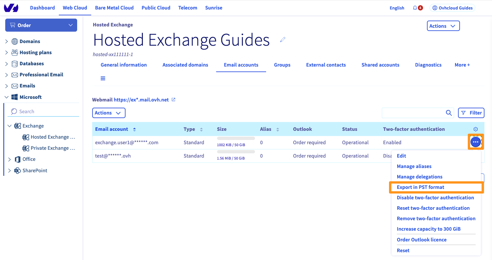{.thumbnail}

Danach muss die Dauer des Exports abgewartet werden, die je nach Größe des Exports einige Minuten bis mehrere Stunden in Anspruch nehmen kann. Am Ende dieses Vorgangs gehen Sie einfach zurück zum Button `In PST-Format exportieren`{.action}, um einen Download-Link abzurufen.

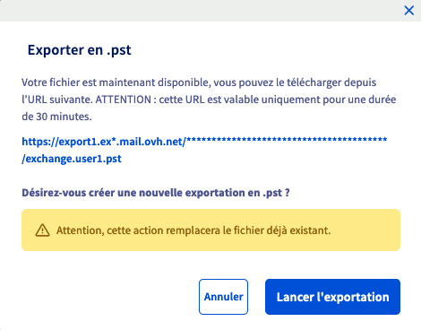{.thumbnail}

#### Über Windows exportieren

- Klicken Sie oben links auf `Datei`, dann auf `Öffnen und Exportieren` und dann auf `importieren/exportieren`.

{.thumbnail}

- Wählen Sie `Daten in eine Datei exportieren` und klicken Sie dann auf `Weiter`.

{.thumbnail}

- Wählen Sie `Outlook Datendatei (.pst)` und klicken Sie auf `Weiter`.

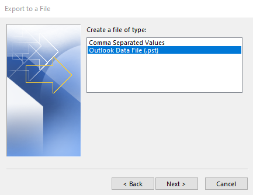{.thumbnail}

- Wählen Sie den Namen des zu exportierenden E-Mail-Accounts aus.

> [!primary]
> Sie können nur einen Account gleichzeitig exportieren.

Setzen Sie ein Häkchen bei `Unterordner einbeziehen` und klicken Sie dann auf `Weiter`.

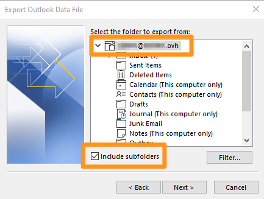{.thumbnail}

- Wählen Sie den Zielordner Ihres Backups aus und geben Sie einen Namen für dieses ein, indem Sie auf `Durchsuchen` klicken. Wählen Sie die für Sie passende Option aus und klicken Sie dann auf `Beenden`.

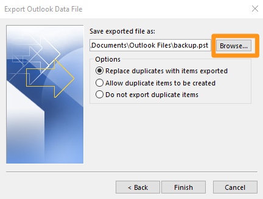{.thumbnail}

Der Export Ihrer Datei beginnt. Bei der Erstellung einer Datei werden Sie aufgefordert, ein Passwort festzulegen (optional).

{.thumbnail}

#### Von Windows importieren

- Klicken Sie oben links auf `Datei`, dann auf `Öffnen und Exportieren` und dann auf `importieren/exportieren`.

{.thumbnail}

- Wählen Sie `Aus einem anderen Programm oder einer anderen Datei importieren` und klicken Sie dann auf `Weiter`.

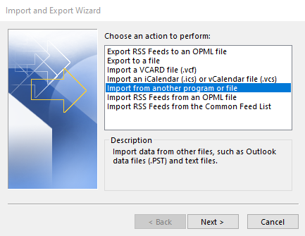{.thumbnail}

- Wählen Sie `Outlook Datendatei (.pst)` und klicken Sie auf `Weiter`.

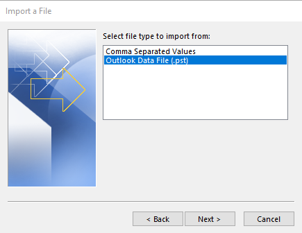{.thumbnail}

- Wählen Sie Ihre Backup-Datei aus, indem Sie auf `Durchsuchen` klicken. Wählen Sie die für Sie passende Option aus und klicken Sie dann auf `Beenden`.

{.thumbnail}

- Wenn Sie ein Passwort in Ihrer Backup-Datei festgelegt haben, geben Sie dieses ein und klicken Sie dann auf `OK`.

- Wählen Sie `Elemente in den aktiven Ordner importieren` und klicken Sie dann auf `Beenden`.

Der Import Ihres Backups beginnt.

#### Über Mac OS exportieren

Klicken Sie im Tab `Werkzeuge` in Ihrem Outlook-Fenster auf `Exportieren`.

{.thumbnail}

Wählen Sie im Fenster "In eine Archivdatei (.olm) exportieren" die Elemente aus, die Sie zu Ihrer Backup-Datei hinzufügen möchten, und klicken Sie dann auf `Weiter`.

{.thumbnail}

Wählen Sie anschließend den Zielordner für Ihr Backup aus und klicken Sie auf `Speichern`.

{.thumbnail}

Es wird ein Fortschrittsfenster angezeigt, klicken Sie auf `Am` Ende der Operation fortfahren. Sie finden Ihre Backup-Datei im zuvor gewählten Ordner.

#### Von Mac OS importieren

Klicken Sie im Tab `Werkzeuge` in Ihrem Outlook-Fenster auf `Importieren`.

{.thumbnail}

Wählen Sie das Backup-Format aus, das Sie importieren möchten, und klicken Sie dann auf `Weiter`.

{.thumbnail}

Wählen Sie Ihre Backup-Datei aus und klicken Sie dann auf `importieren`.

{.thumbnail}

Es wird ein Fortschrittsfenster angezeigt. Klicken Sie auf am Ende der Operation auf `Weiter`.

### Mail auf Mac OS

#### Exportieren

Wählen Sie in der linken Spalte einen oder mehrere E-Mail-Accounts aus. Klicken Sie im horizontalen Menü auf `Mailbox` und dann auf `Mailbox exportieren`.

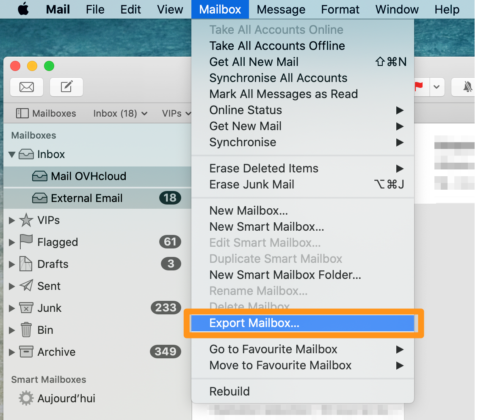{.thumbnail}

Wählen Sie den Ordner Ihrer Wahl aus oder erstellen Sie einen neuen Ordner und klicken Sie dann auf `Auswählen`.

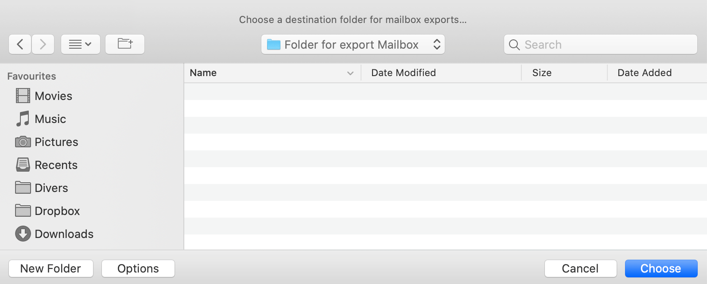{.thumbnail}

Ihre Ausfuhr erfolgt in Form einer ".mbox" Datei.

#### Importieren

Klicken Sie `im` horizontalen Menü auf Datei und dann auf `Briefkästen importieren`.

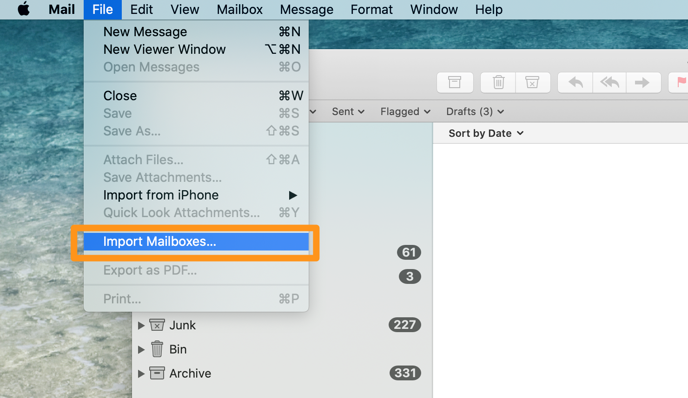{.thumbnail}

Wählen Sie Ihre Backup-Datei im Format ".mbox" aus und klicken Sie dann auf `Weiter`.

{.thumbnail}

In der linken Spalte befinden sich die importierten E-Mails in einem neuen E-Mail-Account namens "Import". Sie können die Ordner und Nachrichten vom Import-Account auf Ihre bereits konfigurierten E-Mail-Accounts verschieben. Sobald Ihre Transfers abgeschlossen sind, können Sie den Account "Import" löschen.

### Thunderbird

Es gibt derzeit keine native Funktion zum Export oder Import eines E-Mail-Accounts aus Thunderbird. Es ist jedoch möglich, ein Thunderbird-Profil zu sichern. Es enthält alle Accounts und E-Mails auf Ihrem lokalen Computer. Der folgende Abschnitt erklärt, wie ein Thunderbird-Profil gesichert und es in eine neue Thunderbird-Instanz integriert wird.

#### Exportieren

Klicken Sie im Hauptfenster oben rechts auf das Menü, dann auf `Hilfe` und schließlich auf `Troubleshooting Information`.

{.thumbnail}

Es erscheint eine Tabelle. Wählen Sie die Zeile `Profilverzeichnis` aus und klicken Sie auf den Button `Den zugehörigen Ordner öffnen`.

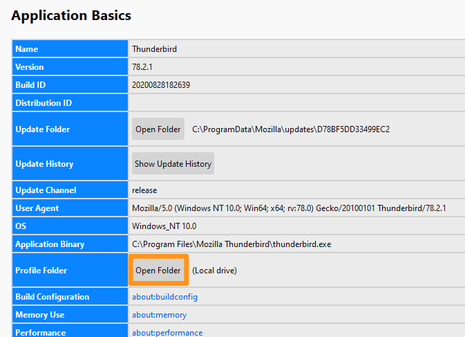{.thumbnail}

Sie werden dann zum Profilordner geleitet. Gehen Sie von einem Ordner in die Baumstruktur.

{.thumbnail}

Kopieren Sie den Profilordner mit einem Rechtsklick auf diesen und fügen Sie diesen Ordner in den Ordner oder Support Ihrer Wahl ein.

{.thumbnail}

#### Importieren

Statt einzelne Elemente zu importieren, wird hier ein komplettes Profil eingespielt. 
Wenn E-Mail-Accounts auf der Ziel-Thunderbird-Instanz eingerichtet sind, gehören diese zum bereits aktiven Profil (Profil A).
Wenn Thunderbird ein neues Profil (Profil B) öffnen soll, können **nur** die Elemente dieses Profils B geladen werden.
Daher empfehlen wir Ihnen, zuerst das neue Profil (Profil B) zu laden und die E-Mail-Accounts aus Profil A darauf zu konfigurieren.

Starten Sie zuerst Thunderbird über die Profilverwaltung.

- Gehen Sie in Windows ins Startmenü und dann auf `Ausführen`. Geben Sie dort `thunderbird.exe -ProfileManager` ein und klicken Sie auf `OK`.

{.thumbnail}

- Starten Sie auf Mac OS die Terminal-Anwendung und legen Sie dann Ihre Thunderbird-Anwendung im Fenster des Terminals ab, indem Sie `/Contents/MacOS/thunderbird-bin -ProfileManager` einfügen. Klicken Sie auf `Enter` (⏎), um zu bestätigen.

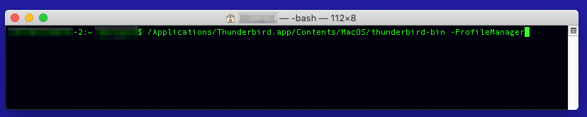{.thumbnail}

Im folgenden Fenster werden die vorhandenen Profile angezeigt. Klicken Sie auf `Profil erstellen` und dann auf `Weiter`, wenn die Informationsnachricht angezeigt wird.

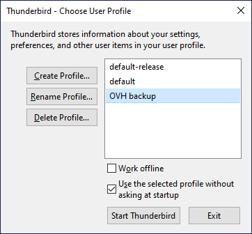{.thumbnail}

Im nächsten Schritt benennen Sie Ihr Profil und identifizieren Sie den Ordner, in dem das Profil erstellt wird unterhalb von "Ihre Benutzereinstellungen, Einstellungen und weitere persönlichen Daten werden gespeichert in:".

{.thumbnail}

> [!primary]
> Wir empfehlen Ihnen, die Sicherung Ihres Thunderbird-Profils in den Thunderbird-Profilordner zu kopieren.

Klicken Sie auf `Ordner auswählen...` um den Ordner auszuwählen, der Ihr Backup enthält. Klicken Sie auf `Beenden`, um das Profil mit Ihrem Backup zu erstellen.

Sie finden das Fenster zur Auswahl Ihres Profils mit Ihrem neuen ausgewählten Profil. Klicken Sie auf `Thunderbird starten`, Thunderbird wird mit allen Elementen, die Sie in Ihrem Backup hatten, gestartet.

### Import auf der neuen E-Mail-Adresse überprüfen

Wenn Sie die Import-Schritte befolgt haben, überprüfen Sie, ob Ihre Elemente auf dem Server vorhanden sind.

Loggen Sie sich im [Webmail](https://www.ovh.de/mail/) ein.

In Ihrem Posteingang und in der linken Spalte finden Sie die Ordner und E-Mails Ihrer gesicherten E-Mail-Adresse.

> [!primary]
> Dabei ist die Zeit zu berücksichtigen, in der die auf Ihrem Computer befindlichen Elemente auf den E-Mail-Server geladen werden. Abhängig von Ihrer Internetverbindung kann dies mehrere Minuten oder Stunden in Anspruch nehmen.

## Weiterführende Informationen

[E-Mail-Accounts mit dem OVH Mail Migrator migrieren](../../microsoft-collaborative-solutions/exchange_migration_von_e-mail-accounts_-_ovh_mail_migrator/){.external}

Für den Austausch mit unserer User Community gehen Sie auf <https://community.ovh.com/en/>.
