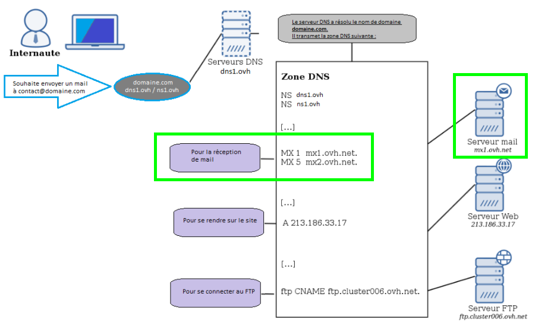

## O que é um servidor MX?
O(s) servidor(es) MX é/são o(s) servidor(es) de email que define na zona DNS do seu nome de domínio.
São esses servidores que recebem os e-mails de um nome de domínio.

Por exemplo:

- Deseja receber os e-mails em meuendereco@meudominio.pt que é uma conta de e-mail que criou na OVH.

É então necessário que os campos MX da zona DNS utilizada pelo seu domínio sejam os da OVH.

Esta alteração permite efetuar a ligação entre o nome de domínio e os servidores de e-mail.

Várias combinações e configurações são possíveis, e veremos neste guia os modelos base, bem como alguns exemplos de utilização avançadas.

Poderemos esquematizar o nome de domínio, os servidores DNS e a zona DNS assim:

{.thumbnail}


## Pré-requisitos

- Dispor de acesso ao seu [Espaço Cliente](https://www.ovh.com/auth/?action=gotomanager&from=https://www.ovh.pt/&ovhSubsidiary=pt).

Se não possui acesso ao seu Espaço Cliente consulte o [seguinte guia](https://www.ovh.pt/g1909.partilhado_gerir_e_aceder_as_minhas_passwords#as_diferentes_passwords_associadas_a_um_servico_partilhado_da_ovh).


- Utilizar os serviços e-mail da OVH


## Onde se configuram os servidores MX de um nome de domínio?
Num primeiro tempo é necessário saber onde está o seu nome de domínio registado e quais os servidores DNS que ele utiliza.


- A escolha dos servidores DNS do seu domínio faz-se unicamente no registrar onde está o seu nome de domínio registado.
- É nesses servidores DNS utilizados pelo seu domínio que está presente a zona DNS do seu domínio.
- É nessa zona DNS que poderá modificar os campos MX, que determinam os servidores de e-mail de um nbome de domínio.


Deixamos um exemplo de uma zona DNS na OVH. Consulte no centro os diferentes tipos de campos ( NS / MX /A / CNAME / TXT ).
E à direita o seu alvo.

||NS|ns109.ovh.net.|
||NS|dns109.ovh.net.|
||MX 1|mx1.mail.ovh.net.|
||MX 5|mx2.mail.ovh.net.|
||MX 10|mx3.mail.ovh.net.|
||A|213.186.33.18|
||TXT|"v=spf1 include:mx.ovh.com ~all"|
|_autodiscover._tcp|SRV|0 0 443 mailconfig.ovh.net.|
|_imaps._tcp|SRV|0 0 993 ssl0.ovh.net.|
|_submission._tcp|SRV|0 0 465 ssl0.ovh.net.|
|autoconfig|CNAME|mailconfig.ovh.net.|
|ftp|CNAME|ftp.cluster017.ovh.net.|
|imap|CNAME|ssl0.ovh.net.|
|mail|CNAME|ssl0.ovh.net.|
|pop3|CNAME|ssl0.ovh.net.|
|smtp|CNAME|ssl0.ovh.net.|
|www|A|213.186.33.18|


Nesta zona DNS os servidores de e-mail (MX) do domínio são então:

```
MX 1 mx1.mail.ovh.net.
MX 5 mx2.mail.ovh.net.
MX 10 mx3.mail.ovh.net.
```


O número à direita de "MX" indica a sua prioridade.

## Informação:
Para já, os antigos servidores MX permanecerão funcionais para os serviços de e-mails criados antes de 23/05/2016, mas convidamo-lo a utilizar estes servidores MX para atualizar a informação MX.
São então esses campos que deverá alterar caso deseje modificar os servidores de e-mail.
Atenção: Qualquer modificação efetuada numa zona DNS pode levar 24h a ficar funcional.


## Utiliza uma zona DNS OVH
Nessa situação convidamo-lo a consultar o seguinte guia: []({legacy}2012).


## Não utiliza uma zona DNS OVH
Nessa situação convidamo-lo a consultar o seguinte guia: []({legacy}2011).

