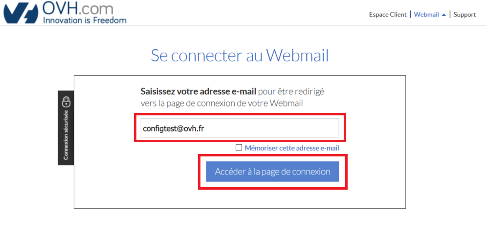
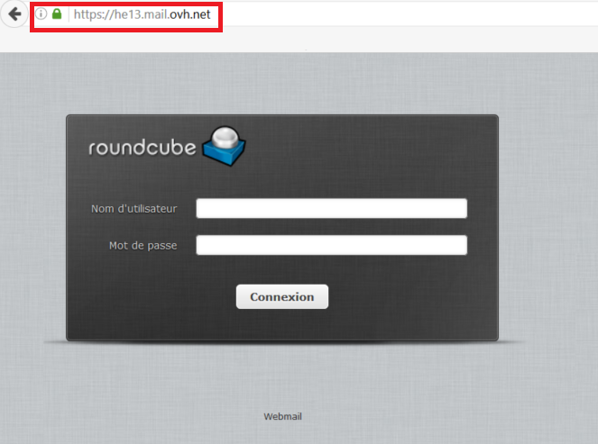

## Généralités

### Prérequis

- Disposer d'une connexion xDSL OVH
- Avoir créé son adresse en @ovh.fr. 

## Configuration de votre adresse e-mail en &#64;ovh.fr

### Demarrage et configuration

Rendez vous sur [le webmail OVH](https://mail.ovh.net/fr/){.external}.

Indiquez votre adresse e-mail et cliquez sur `Accéder à la page de connexion`{.action}.

{.thumbnail}

L'URL du webmail va alors changer pour une autre de la forme "https://he**XX**.mail.ovh.net" (avec un nombre à la place de "XX").

{.thumbnail}

Il ne vous reste plus qu'à suivre le guide [qui correspond à votre client de messagerie](https://docs.ovh.com/fr/emails/){.external}.

En suivant le guide, remplacez les valeurs "**ssl0.ovh.net**" par "**heXX.mail.ovh.net"** pour les serveurs entrants et sortants.

Remplacez "XX" par votre serveur, comme ci-dessus.

### Test d'envoi et reception
Une fois la configuration terminée, envoyez-vous un e-mail depuis votre adresse en @ovh.fr vers cette même adresse.

Attendez quelque secondes, vous recevrez alors votre e-mail.

C'est que votre adresse e-mail en @ovh.fr est bien configurée sur votre logiciel.

### POP ou IMAP ?
Lors de la configuration, vous pouvez choisir le protocole "**POP**" ou "**IMAP**".

Nous vous invitons à vous renseigner sur l'utilisation de ces deux protocoles avant de faire votre choix. Dans le doute, choisissez la configuration "**IMAP**".