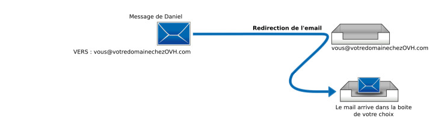
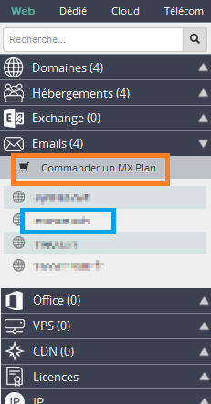
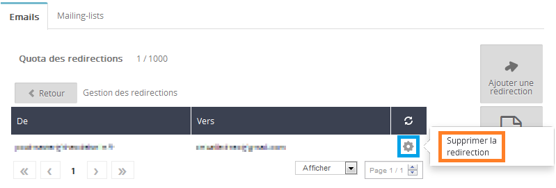
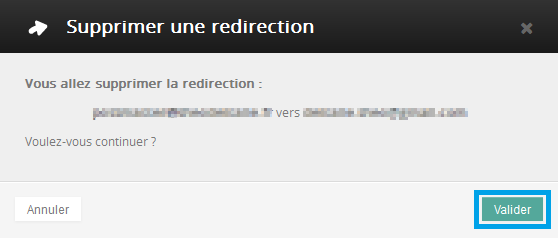

Vous trouverez dans ce guide différentes informations et aides concernant la configuration de vos redirections e-mail, par exemple pour rediriger des e-mails reçus sur une adresse A vers une adresse B.

## Généralités

### Qu'est-ce qu'une redirection e-mail ?
Une redirection permet de rediriger un mail reçu sur une première adresse, vers une ou plusieurs autres adresses.

Par exemple vous souhaitez que :

- lorsqu'on vous envoi un mail sur [monadresse@mypersonaldomain.ovh](mailto:monadresse@mypersonaldomain.ovh){.external}
- alors, renvoyer le mail vers [monautreadresse@autredomaine.com](mailto:monautreadresse@autredomaine.com){.external} .

Cela permet de communiquer la première adresse publique ( **monadresse@mypersonaldomain.ovh** ), sans que ces personnes connaissent votre vraie adresse ( **monautreadresse@autredomaine.com** ).

Vous pouvez aussi rediriger vers plusieurs adresses, et également rediriger un mail tout en conservant sa copie sur la première boite e-mail.

Tout mail arrivant sur une redirection sera redirigé vers une autre de vos boîtes mail sans que les expéditeurs ne s'en rendent compte.

{.thumbnail}

### Pre-requis
- Avoir l'accès à votre [espace
client](https://www.ovh.com/manager/web/login/){.external} .

Si vous n'avez plus l'accès à l'espace client, vous pouvez vous aider du guide ci-contre : [Gérer et accéder à ses mots de passe](https://docs.ovh.com/fr/hosting/gerer-et-acceder-a-ses-mots-de-passe/){.external}.

- Si vous utilisez déjà des comptes mails OVH, passez directement à la suite.
- Sinon, si vous n'avez pas d'offre mail, lisez le guide ci-contre : [Configuration MX sur votre zone DNS OVH](https://docs.ovh.com/fr/emails/mail-mutualise-guide-de-configuration-mx-avec-zone-dns-ovh/){.external} .

### Ou se configurent les redirections e-mail ?
Dans un premier temps, connectez-vous à votre [espace client](https://www.ovh.com/manager/web/login/){.external}.

Une fois connecté, cliquez sur la section  **Emails**  comme ci-contre.

{.thumbnail}

Dans la liste des noms de domaine, cliquez sur le nom de domaine sur lequel vous voulez  **ajouter une redirection mail** .

Si votre domaine ne se trouve pas dans la liste c'est qu'il ne possède pas d'offre mail. Dans ce cas,cliquez sur " **Commander un MX Plan**" avant de poursuivre.

{.thumbnail}

Après avoir cliqué sur votre nom de domaine, vous arriverez dans la section Emails..

Restez dans le premier onglet  **Emails** , et cliquez à droite sur le bouton "**Gestion des redirections** ".

C'est ici que vous verrez la liste de vos redirections actives, et pourrez en créer des nouvelles.

{.thumbnail}

## Comprendre la configuration des redirections mails

### Ajouter une redirection
Vous vous retrouverez sur cette page.

Au centre,  **le tableau de vos redirections actives** . A droite, vous pouvez cliquer sur le bouton " **Ajouter une redirection**" afin d'en ajouter une nouvelle.

{.thumbnail}

Vous aurez ici 3 paramètres en prendre en compte :

- De l'adresse : Rentrez ici votre adresse mail que vous souhaitez rediriger.

Ce sera donc une de vos boites mails se terminant par  **@VotreNomDeDomaine** .

- Vers l'adresse : Rentrez ici l'adresse de destination de votre redirection. Ça peut être l'une de vos adresses e-mail OVH, ou une adresse e-mail externe.
- Garder une copie locale : Cochez cette option si vous souhaitez qu'en plus d'être redirigés, les mails soient également conservés sur votre adresse e-mail. En cochant cela, les mails seront distribués sur les deux adresses.

Cliquez ensuite sur " **Valider**" pour confirmer l'ajout de cette redirection.

{.thumbnail}

### Supprimer une redirection
Lorsque vous ne souhaitez plus rediriger vos mails, ou supprimer une redirection active, rendez-vous sur le tableau de vos redirections actives.

- Cliquez sur le rouage à droite de la redirection concernée
- Cliquez sur " Supprimer la redirection "

{.thumbnail}

Il ne vous reste plus qu'à cliquer sur " **Valider**" pour supprimer définitivement la redirection.

{.thumbnail}

## Exemples

### Copier les mails recus sur une adresse e-mail A vers une adresse e-mail B
Si vous souhaitez que tous les mails qu'on vous envoi soient également reçus par votre secrétaire, vous pouvez configurer comme suit :

{.thumbnail}

### Rediriger les mails recus sur une adresse e-mail A vers deux adresse e-mails B et C
Situation :

> [!success]
>
> Vous avez changé d'adresse mail, mais vous ne souhaitez pas communiquer votre nouvelle adresse e-mail à des centaines de contacts.
> Vous ne souhaitez donc plus recevoir les mails qu'on vous envoi sur votre adresse A, mais souhaitez tous les rediriger vers vos deux adresses e-mails  B et C .
> 

Il faudra configurer deux redirection séparées, comme suit :

{.thumbnail}