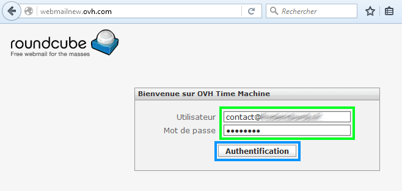
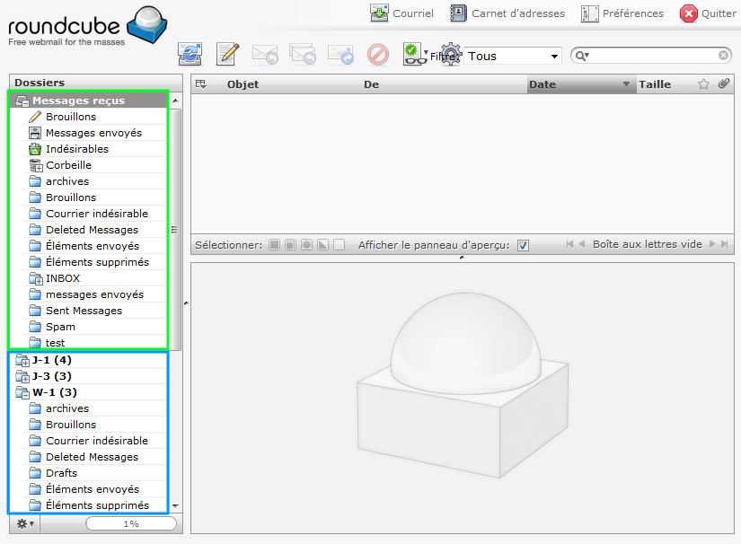
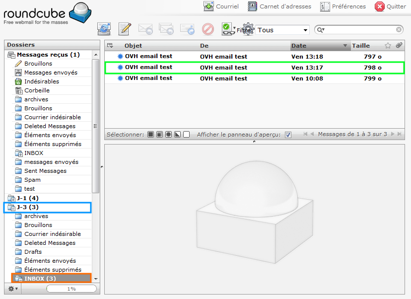
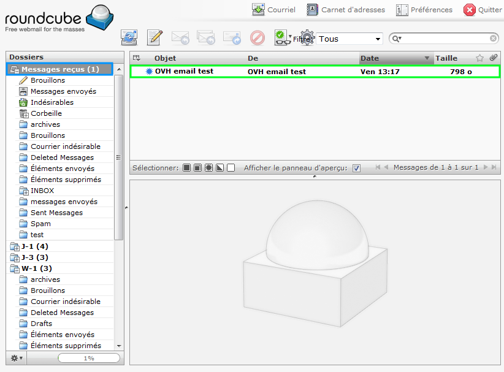

## Voraussetzungen

- Ein aktives E-Mail-Konto.
- Zugriff auf die [OVH Time Machine](http://webmailnew.ovh.com/).

## Beschreibung
Mithilfe der [OVH Time Machine](http://webmailnew.ovh.com/) können Sie auf auf drei verschiedene Backup-Zustände Ihres Postfaches zugreifen:

- J-1 (Zustand einen Tag zuvor)
- J-3 (Zustand drei Tage zuvor)
- W-1 (Zustand eine Woche zuvor)

## Verbindung zu Time Machine

- Gehen Sie zur OVH Time Machine unter [http://webmailnew.ovh.com](http://webmailnew.ovh.com/).
- Geben Sie Ihren Benutzernamen und Ihr Passwort an und klicken Sie auf "Anmelden".

{.thumbnail}

## Zugriff auf die Sicherungen
Wenn die Seite geladen ist, sehen Sie im Menü auf der linken Seite Ihr aktuelles Postfach (Inbox) sowie außerdem die Sicherungen (J-1, J-3, W-1).

{.thumbnail}

## Wiederherstellung einer gelöschten Mail

- Wählen Sie denjenigen Backup-Zustand aus, den Sie für den Zugriff auf die gewünschte Mail benötigen. In unserem Beispielfall wollen wir die OVH Testmail von Freitag, 13:17 Uhr aus dem Ordner "Posteingang (Inbox)" der Sicherung J-3 wiederherstellen.

- Sie können die gewünschte Mail einfach per Drag & Drop in den entsprechenden Ordner Ihres aktuellen Postfachs verschieben.

{.thumbnail}

## Bestätigung

- Wenn Sie die Nachricht verschieben, wird eine Kopie der E-Mail im gewünschten Ordner erstellt.

{.thumbnail}
Sie können auch mehrere E-Mails gleichzeitig verschieben.

